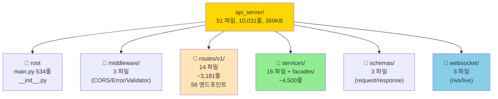
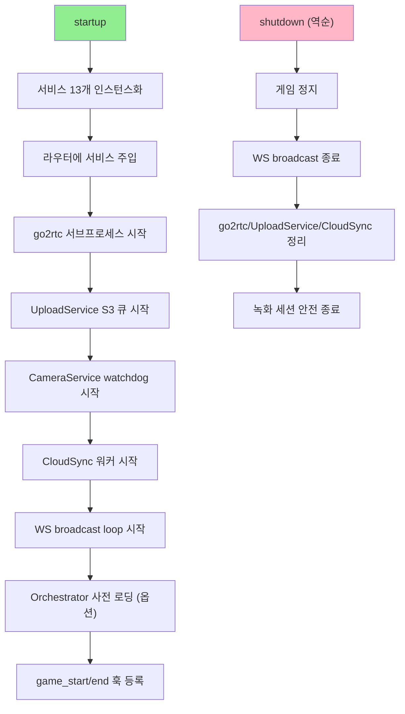
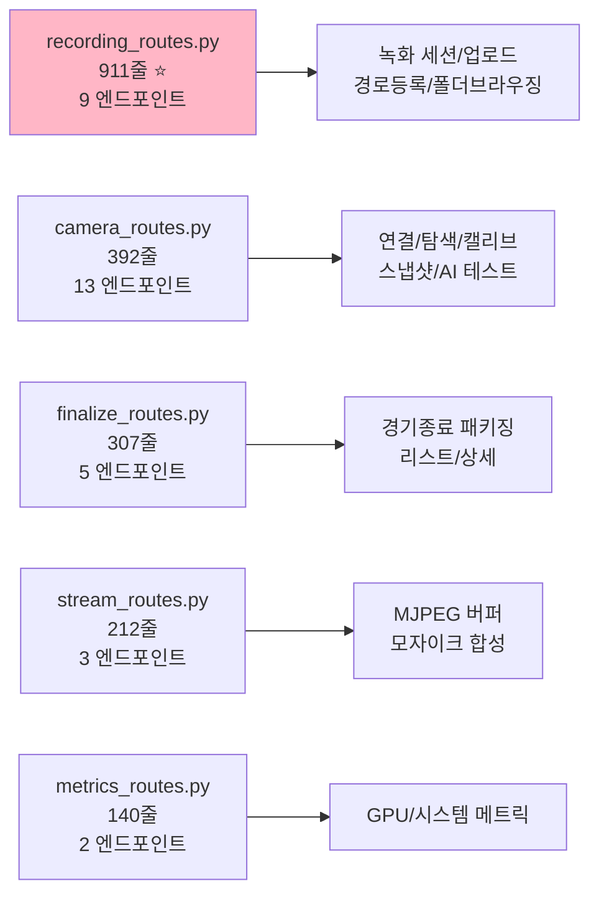
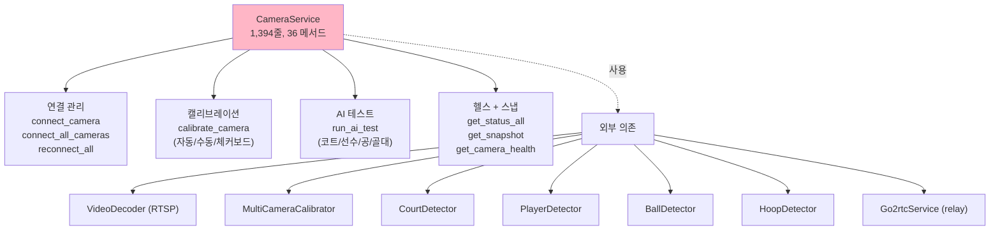
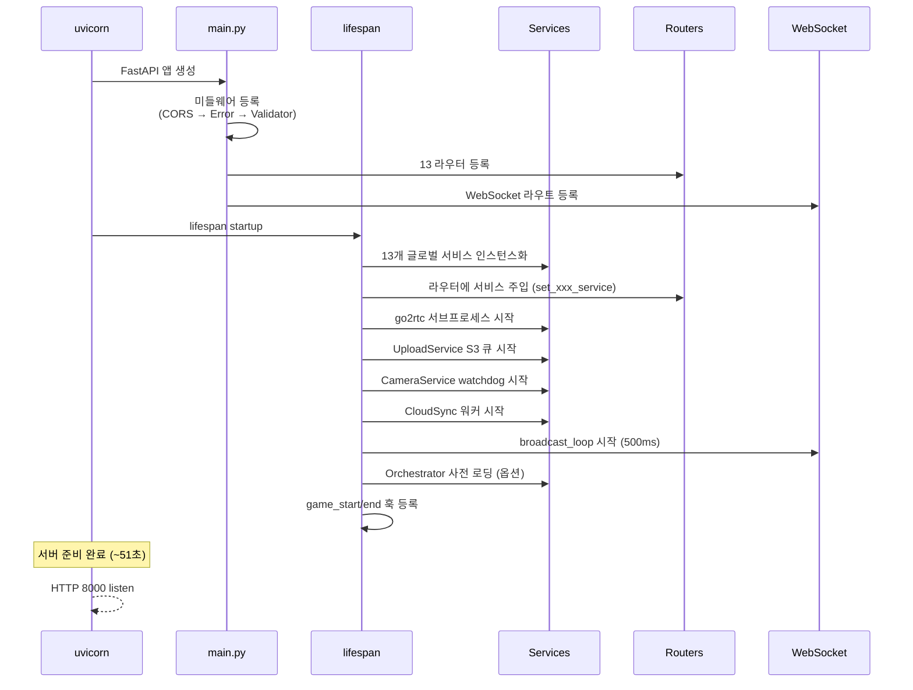
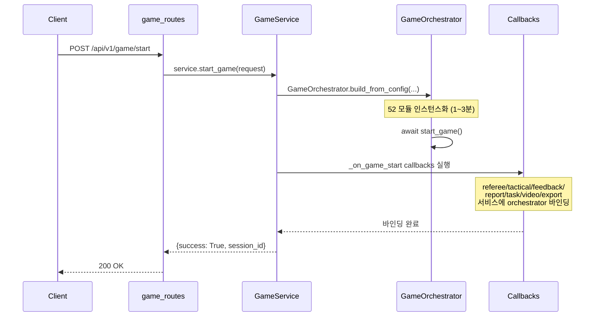
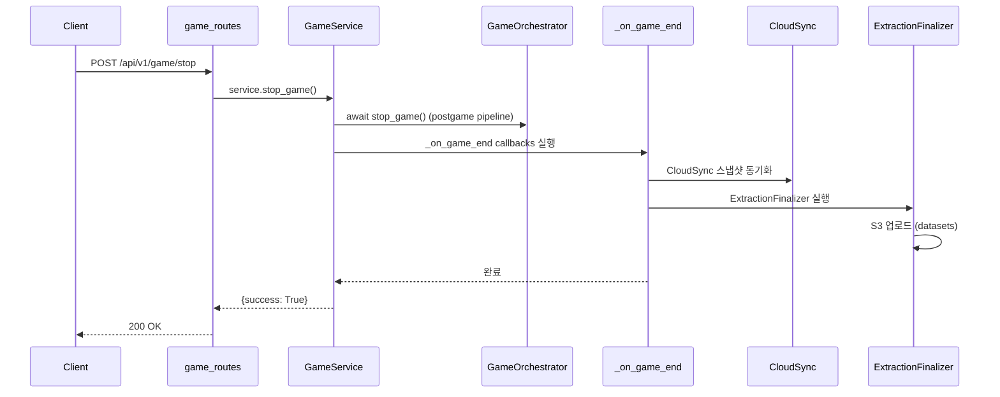
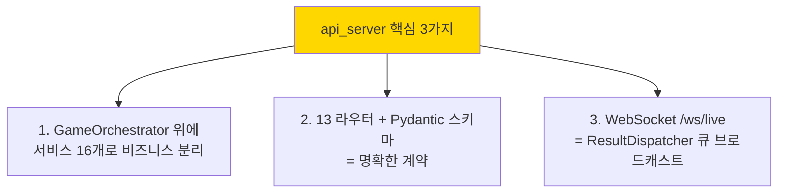

# 🔧 api_server 코드 인벤토리

> **`api_server/` 51개 파일, 10,031줄, 369KB 종합 정리.**
> 작성일: 2026-05-24 / 기준: [api_server/](../api_server/)
> 관련: [UI_TO_ENGINE_FLOW.md](UI_TO_ENGINE_FLOW.md), [DATA_FLOW_CONTRACT.md](project/architecture/DATA_FLOW_CONTRACT.md) §11

---

## 🎯 한 줄 요약

> **FastAPI 기반 엔진 API 서버 — 56개 REST 엔드포인트 + 1개 WebSocket + 16개 비즈니스 서비스.**

---

## 📚 목차

1. [전체 구조 한눈에](#1-전체-구조)
2. [main.py + 미들웨어](#2-main-middleware)
3. [routes/ — 56개 REST 엔드포인트](#3-routes)
4. [services/ — 16개 비즈니스 서비스](#4-services)
5. [schemas/ — Pydantic 모델](#5-schemas)
6. [websocket/ — 실시간 통신](#6-websocket)
7. [부팅 흐름 + 의존성 주입](#7-boot-flow)
8. [전체 파일 인덱스](#8-file-index)

---

## 1. 전체 구조 한눈에 {#1-전체-구조}



### 파일 분포

| 폴더 | 파일 수 | 줄 수 | 용도 |
|---|---|---|---|
| `api_server/` (root) | 2 | ~558 | main + __init__ |
| `middleware/` | 3 | 215 | CORS/Error/Validator |
| `routes/v1/` | 14 | 3,181 | REST 엔드포인트 |
| `schemas/` | 3 | ~? | Pydantic 모델 |
| `services/` | 16 | ~4,500 | 비즈니스 로직 |
| `services/facades/` | 7 | ~? | engine 데이터 변환 |
| `websocket/` | 3 | ~? | 실시간 통신 |
| **합계** | **51** | **10,031** | |

---

## 2. main.py + 미들웨어 {#2-main-middleware}

### 2.1 `main.py` (534줄)

[api_server/main.py](../api_server/main.py) — 전체 부팅 + 조립

#### 핵심 정보

| 항목 | 값 |
|---|---|
| 앱 제목 | COURTVIEW Desktop API |
| 버전 | 1.0.0 |
| 포트 | 8000 (uvicorn 인자) |
| 등록 라우터 | 13개 |
| 미들웨어 | 3개 |
| 헬스 체크 | `GET /health` |
| 데모 페이지 | `GET /demo` |
| 부팅 시간 | ~51초 (모델 + TRT 로딩) |

#### 13개 라우터 등록 ([:454-470](../api_server/main.py#L454))

```python
app.include_router(camera_router)
app.include_router(export_router)
app.include_router(game_router)
app.include_router(stream_router)
app.include_router(referee_router)
app.include_router(tactical_router)
app.include_router(video_router)
app.include_router(feedback_router)
app.include_router(report_router)
app.include_router(task_router)
app.include_router(metrics_router)
app.include_router(recording_router)
app.include_router(clips_router)
app.include_router(finalize_router)
# + websocket (별도)
```

#### Lifespan 핸들러 ([:159-431](../api_server/main.py#L159))



#### 환경 변수

| 변수 | 기본 | 용도 |
|---|---|---|
| `%APPDATA%\COURTVIEW` | (자동) | 영속 데이터 경로 |
| `COURTVIEW_S3_REGION` | (없음) | S3 자동 업로드 |
| `COURTVIEW_S3_VIDEO_BUCKET` | (없음) | 영상 S3 |
| `COURTVIEW_S3_DATASETS_BUCKET` | (없음) | 데이터셋 S3 |
| `COURTVIEW_HWACCEL` | `d3d11va` | ffmpeg 하드웨어 디코딩 |

#### 주요 이벤트 훅

```python
# _on_game_end (게임 종료 시)
#   → CloudSync 스냅샷 동기화
#   → 추출기 finalize
#   → S3 업로드

# _bind_orchestrator (게임 시작 시)
#   → referee/tactical/feedback/report/task/video/export
#     서비스에 orchestrator 바인딩

# _on_recording_session_end (쿼터 종료 시)
#   → 쿼터별 MP4 → S3 자동 업로드 큐 적재
```

### 2.2 미들웨어 3개 (215줄)

[api_server/middleware/](../api_server/middleware/)

| 파일 | 줄수 | 역할 | 등록 순서 |
|---|---|---|---|
| `cors_middleware.py` | 31 | 모든 origin 허용 (로컬 전용) | 1 |
| `error_handler.py` | 82 | CourtViewException → HTTP, ValueError/Exception 글로벌 핸들러 | 2 |
| `request_validator.py` | 102 | 100MB 제한 + 100 req/sec rate limit + 로깅 | 3 |

#### `request_validator.py` 상세

| 항목 | 값 | 응답 코드 |
|---|---|---|
| 최대 요청 크기 | 100MB | 413 (초과 시) |
| Rate Limit | 100 req/sec (IP 기반) | 429 (초과 시) |
| 윈도우 | 1초 |  |
| 로깅 | method/path/status/elapsed |  |

---

## 3. routes/ — 56개 REST 엔드포인트 {#3-routes}

### 3.1 전체 라우터 매트릭스

[api_server/routes/v1/](../api_server/routes/v1/) — 14 파일, 3,181줄

| 라우터 | 파일 | 줄수 | Prefix | 엔드포인트 수 |
|---|---|---|---|---|
| **camera** | camera_routes.py | 392 | `/api/v1/camera` | **13** |
| **game** | game_routes.py | 127 | `/api/v1/game` | 6 |
| **referee** | referee_routes.py | 56 | `/api/v1/referee` | 2 |
| **recording** ⭐ | recording_routes.py | **911** | `/api/v1/recording` | 9 |
| **tactical** | tactical_routes.py | 71 | `/api/v1/tactical` | 2 |
| **report** | report_routes.py | 108 | `/api/v1/report` | 4 |
| **task** | task_routes.py | 76 | `/api/v1/tasks` | 2 |
| **metrics** | metrics_routes.py | 140 | `/api/v1/metrics` | 2 |
| **finalize** | finalize_routes.py | 307 | `/api/v1/finalize` | 5 |
| **stream** | stream_routes.py | 212 | `/api/v1/stream` | 3 |
| **video** | video_routes.py | 75 | `/api/v1/video` | 2 |
| **feedback** | feedback_routes.py | 82 | `/api/v1/feedback` | 2 |
| **export** | export_routes.py | 81 | `/api/v1/export` | 2 |
| **clips** | clips_routes.py | 143 | `/clips` (특수) | 2 |
| **합계** | | **3,181** | | **56** |

### 3.2 가장 큰 라우트 Top 5



### 3.3 카테고리별 엔드포인트

#### 🎮 게임 라이프사이클 (6)

| 메서드 | 경로 | 용도 |
|---|---|---|
| POST | `/game/start` | 게임 시작 (orchestrator 빌드 + 분석) |
| POST | `/game/stop` | 게임 중지 + postgame |
| POST | `/game/pause` | 일시정지 |
| POST | `/game/resume` | 재개 |
| GET | `/game/status` | 엔진 상태 |
| GET | `/game/debug/dispatcher` | 디버그 |

#### 📷 카메라 관리 (13)

| 메서드 | 경로 | 용도 |
|---|---|---|
| GET | `/camera/discover` | RTSP 자동 탐색 |
| GET | `/camera/health` | 8 카메라 헬스 |
| GET | `/camera/go2rtc/health` | WebRTC 게이트웨이 |
| POST | `/camera/probe` | 사전 검증 |
| POST | `/camera/connect` | 단일 연결 |
| POST | `/camera/connect-all` | 8대 일괄 |
| POST | `/camera/reconnect-all` | 재연결 |
| POST | `/camera/{cam_id}/reconnect` | 단일 재연결 |
| POST | `/camera/disconnect-all` | 종료 |
| GET | `/camera/status-all` | 전체 상태 |
| GET | `/camera/{cam_id}/snapshot` | JPEG 스냅 |
| POST | `/camera/{cam_id}/calibrate` | 자동 캘리브 |
| POST | `/camera/{cam_id}/calibrate/manual` | 수동 캘리브 |
| POST | `/camera/{cam_id}/ai-test` | AI 감지 테스트 |

#### 📹 녹화 (9)

| 메서드 | 경로 | 용도 |
|---|---|---|
| POST | `/recording/start` | ffmpeg 녹화 시작 |
| POST | `/recording/stop` | 종료 + 머지 |
| POST | `/recording/register-path` | 외부 경로 등록 |
| POST | `/recording/upload` | 영상 업로드 |
| GET | `/recording/status` | 진행 상태 |
| GET | `/recording/health` | 디스크 헬스 |
| GET | `/recording/list` | 세션 목록 |
| GET | `/recording/sessions/{session_id}` | 메타 |
| GET | `/recording/sessions/{session_id}/video` | MP4 (Range) |
| GET | `/recording/browse` | 폴더 브라우저 |

#### 🏆 결과 / 분석 (15)

| 메서드 | 경로 | 카테고리 |
|---|---|---|
| GET | `/tactical/summary` | 전술 |
| GET | `/tactical/boxscore` | 박스스코어 |
| GET | `/referee/decisions` | 심판 판정 |
| POST | `/referee/challenge` | 챌린지 |
| GET | `/tasks/progress` | 분석 진행률 |
| GET | `/tasks/status` | 상태 |
| GET | `/metrics/gpu` | GPU 메트릭 |
| GET | `/metrics/system` | 시스템 메트릭 |
| POST | `/finalize/game` | 경기 종료 패키징 |
| GET | `/finalize/status` | 상태 |
| GET | `/finalize/list` | 목록 |
| GET | `/finalize/detail/{id}` | 상세 |
| POST | `/finalize/delegate-token` | 위임 토큰 |
| GET | `/feedback/coaching` | 코칭 피드백 |
| GET | `/feedback/list` | 목록 |

#### 📽️ 비디오 / 스트림 / 클립 (7)

| 메서드 | 경로 | 용도 |
|---|---|---|
| POST | `/video/upload` | BATCH 모드 영상 |
| GET | `/video/highlights` | 하이라이트 |
| GET | `/stream/{cam_id}` | MJPEG 라이브 |
| GET | `/stream/mosaic` | 8 카메라 모자이크 |
| POST | `/stream/config` | 설정 |
| GET | `/clips/{session_id}/{filename}` | 클립 서빙 (Range) |
| GET | `/clips/latest/{filename}` | 최신 세션 클립 |

#### 📤 리포트 / 내보내기 (6)

| 메서드 | 경로 | 용도 |
|---|---|---|
| POST | `/report/generate` | 리포트 생성 |
| GET | `/report/list` | 목록 |
| GET | `/report/demo-pdf` | 데모 PDF |
| POST | `/export` | JSON/CSV 내보내기 |
| GET | `/export/list` | 이력 |

---

## 4. services/ — 16개 비즈니스 서비스 {#4-services}

### 4.1 서비스 매트릭스

[api_server/services/](../api_server/services/) — 16 파일 + 7 facades

| 서비스 | 줄수 | 책임 | 의존 |
|---|---|---|---|
| **CameraService** ⭐ | **1,394** | 카메라 연결/캘리브/AI 테스트 | VideoDecoder, MultiCameraCalibrator, 4 detectors |
| **GameService** ⭐ | **514** | 경기 라이프사이클 | GameOrchestrator (lazy) |
| **FinalizeService** | 397 | 경기 종료 패키징 | ExportService, RecordingService |
| **Go2rtcService** | 325 | WebRTC 서버 (subprocess) | go2rtc.exe |
| **CloudSyncService** | 249 | bkdunk 동기화 + 재시도 큐 | (network) |
| **HighlightClipService** | 209 | 하이라이트 클립 (observer) | ThreadPoolExecutor (ffmpeg) |
| **VideoService** | 156 | BATCH 모드 분석 | GameOrchestrator |
| **ReportService** | 149 | 리포트 생성 | ReportFacade |
| **ExportService** | 146 | 결과 내보내기 (JSON/CSV) | 6 Facades |
| **RefereeService** | 111 | 심판 판정 | RefereeFacade |
| **TaskService** | 102 | 진행률 + 엔진 상태 | ProgressReporter |
| **FeedbackService** | 97 | 코칭 피드백 | FeedbackFacade |
| **BatchSyncService** | 68 | 일괄 동기화 | (network) |
| **TacticalService** | 64 | 전술 요약 | TacticalFacade |
| **RealtimeStreamService** | 55 | WS 메시지 디스패치 | ResultDispatcher |

### 4.2 가장 큰 서비스 — CameraService (1,394줄)



### 4.3 GameService (514줄) — 핵심 진입점

```python
# 주요 메서드
start_game(request)        # 경기 시작 (orchestrator 빌드)
stop_game()                # 종료
pause_game() / resume_game()
get_status()
preload_orchestrator_async()   # 51초 → 0초 최적화
                               # (LIVE/FIBA 사전 빌드)

# 콜백 패턴
on_game_start: list[callable]   # orchestrator 바인딩 콜백
on_game_end: list[callable]     # finalize 콜백
```

### 4.4 Facades (7개)

[api_server/services/facades/](../api_server/services/facades/) — engine 결과 → API 응답 변환

| Facade | 역할 |
|---|---|
| `GameStatsFacade` | 박스스코어 변환 |
| `RefereeFacade` | 심판 결정 변환 |
| `TacticalFacade` | 전술 요약 변환 |
| `ReportFacade` | 리포트 변환 |
| `HighlightFacade` | 클립 메타 변환 |
| `FeedbackFacade` | 코칭 피드백 변환 |
| (기타 1개) | |

### 4.5 의존성 주입 패턴

```python
# main.py lifespan
_game_service = GameService()
_camera_service = CameraService()
# ... 13개 글로벌 인스턴스

# 라우터에 주입
game_routes.set_game_service(_game_service)
camera_routes.set_camera_service(_camera_service)

# 또는 FastAPI Depends()
@router.post("/start")
async def start_game(
    request: StartGameRequest,
    service: GameService = Depends(get_game_service)
):
    return service.start_game(request)
```

### 4.6 비동기 패턴

```
서비스 메서드: 동기 (def, RLock)
라우트:        async (FastAPI)
백그라운드:    daemon Thread / ThreadPoolExecutor
```

| 컴포넌트 | 비동기 사용 |
|---|---|
| 라우트 | `async def` |
| 서비스 | `def` + RLock |
| 워커 | `Thread(daemon=True)` |
| ffmpeg 호출 | `ThreadPoolExecutor(max_workers=2)` |

---

## 5. schemas/ — Pydantic 모델 {#5-schemas}

[api_server/schemas/](../api_server/schemas/) — 3 파일

### 5.1 Request Models (15개)

| 모델 | 핵심 필드 |
|---|---|
| `StartGameRequest` | mode, rule_set, source_urls, teams, colors, age_group, gender |
| `StopGameRequest` | generate_report: bool |
| `PauseGameRequest` | reason: str |
| `ResumeGameRequest` | (빈) |
| `UploadVideoRequest` | file_path, analysis_type, rule_set |
| `CreateClipRequest` | start_sec, end_sec, title, tags |
| `ChallengeRequest` | decision_id, team_id, reason |
| `GenerateReportRequest` | report_type, target_team_id, format |
| `ExportRequest` | export_type, output_path |
| `UpdateConfigRequest` | section, values |
| `CameraConnectRequest` | camera_id, url, label |
| `CameraConnectAllRequest` | cameras[] |
| `CameraCalibrationRequest` | camera_id, mode |
| `ManualCalibrationRequest` | camera_id, pixel_points[], court_points[] |
| `CameraAITestRequest` | camera_id, test_targets |

### 5.2 Response Models (20개)

#### 공통 래퍼

| 모델 | 필드 |
|---|---|
| `APIResponse` | success, message, data, error_code |
| `PaginatedResponse` | success, data[], total, page, page_size |

#### 도메인 응답

| 모델 | 핵심 필드 |
|---|---|
| `GameStatusResponse` | engine_state, game_state, mode, quarter, game_clock_sec, shot_clock_sec, scores, teams, frame_number, fps |
| `GameStartResponse` | success, game_id, message |
| `ProgressResponse` | frame_current, frame_total, progress_pct, phase, fps, eta_sec |
| `RefereeDecisionResponse` | decision_id, call_type, violation_type, foul_type, confidence, requires_review, explanation, frame_index |
| `RefereeListResponse` | decisions[], total_violations, total_fouls |
| `PlayerStatsResponse` | player_id, jersey_number, points, rebounds, assists, fg%/3%/ft%, plus_minus, minutes |
| `TeamStatsResponse` | team_id, points, fg%, rebounds, assists, fast_break_points, paint_points |
| `BoxScoreResponse` | home_team, away_team, home_players[], away_players[] |
| `TacticalSummaryResponse` | offensive_rating, defensive_rating, pace, top_play_type, spacing_score |
| `HighlightResponse` | clip_id, event_type, quarter, start_sec, end_sec, excitement_score, video_url |
| `GPUMetricsResponse` | vram_total/used_mb, utilization%, temperature, models_loaded |
| `SystemMetricsResponse` | gpu (nested), engine_state, fps, uptime |
| `CameraStatusResponse` | camera_id, connected, width, height, fps, calibrated, **transport_mode** |
| `CameraStatusAllResponse` | cameras[], total/connected/calibrated counts |
| `Go2rtcHealthResponse` | go2rtc{}, cameras[], summary{total, relay, direct, unknown} |
| `CameraCalibrationResponse` | camera_id, success, court_detected, quality |
| `ManualCalibrationResponse` | camera_id, success, quality_score, mean_reproj_error, inlier_count |
| `CameraAITestResponse` | camera_id, court_detected, players_detected, ball_detected, hoops_detected, overall_status |

---

## 6. websocket/ — 실시간 통신 {#6-websocket}

[api_server/websocket/](../api_server/websocket/) — 3 파일

### 6.1 엔드포인트

| 경로 | 용도 |
|---|---|
| **`/ws/live`** | 엔진 → UI 실시간 데이터 (frame/event/status) |

(`/ws/ops` 는 `courtview_ui/app.py` 가 자체 처리)

### 6.2 메시지 envelope

```json
{
  "type": "frame | event | status",
  "event_type": "SHOT_MADE | ...",     // type=="event" 일 때
  "data": { ... }
}
```

### 6.3 메시지 타입

| `type` | 빈도 | 비고 |
|---|---|---|
| `frame` | 매 프레임 (100건마다 로그) | 가벼운 메타만 |
| `event` | 이벤트 감지 시 | `event_type` 필수 |
| `status` | 30초 idle / 상태 변경 | engine_state, game_state |

### 6.4 ConnectionManager

```python
class ConnectionManager:
    async def connect(ws)            # 연결 수락 + 리스트 추가
    def disconnect(ws)               # 연결 제거
    async def broadcast(data: dict)  # 모든 클라이언트 전송
    async def send_to(ws, data)      # 특정 클라이언트
    connection_count                  # property
```

### 6.5 Background Loop

```
broadcast_loop:
  주기: 500ms
  소스: GameService → orchestrator → ResultDispatcher.pop_ws_messages()
  동작: 20개/배치 소비 + ConnectionManager.broadcast()
  로깅: 10 틱마다 (5초) 큐 상태 진단
```

### 6.6 연결 관리

```python
# /ws/live 핸들러
- 클라이언트 accept → ConnectionManager 등록
- 30초 타임아웃 → 게임 상태 자동 전송 (keepalive)
- WebSocketDisconnect/예외 → 정리
```

### 6.7 메시지 카테고리 매핑

```python
# feedback_facade.py
_EVENT_TYPE_TO_CATEGORY = {
    "SHOT_MADE/MISSED/THREE/FREE_THROW": "shooting",
    "ASSIST": "passing",
    "TURNOVER": "dribbling",
    "STEAL/BLOCK/FOUL": "defense",
    "OFFENSIVE/DEFENSIVE_REBOUND": "rebounding",
}
```

---

## 7. 부팅 흐름 + 의존성 주입 {#7-boot-flow}

### 7.1 전체 부팅 순서



### 7.2 게임 시작 흐름 (POST /game/start)



### 7.3 게임 종료 흐름



---

## 8. 전체 파일 인덱스 {#8-file-index}

### 8.1 51개 파일 전체 목록

```
api_server/
├── __init__.py                              (24줄)
├── main.py                                  (534줄)
│
├── middleware/                              (3 파일, 215줄)
│   ├── __init__.py
│   ├── cors_middleware.py                   (31)
│   ├── error_handler.py                     (82)
│   └── request_validator.py                 (102)
│
├── routes/                                  (15 파일)
│   ├── __init__.py
│   └── v1/                                  (14 파일, 3,181줄)
│       ├── __init__.py
│       ├── camera_routes.py                 (392) ⭐
│       ├── game_routes.py                   (127)
│       ├── referee_routes.py                (56)
│       ├── recording_routes.py              (911) ⭐⭐⭐
│       ├── tactical_routes.py               (71)
│       ├── report_routes.py                 (108)
│       ├── task_routes.py                   (76)
│       ├── metrics_routes.py                (140)
│       ├── finalize_routes.py               (307) ⭐
│       ├── stream_routes.py                 (212)
│       ├── video_routes.py                  (75)
│       ├── clips_routes.py                  (143)
│       ├── feedback_routes.py               (82)
│       └── export_routes.py                 (81)
│
├── schemas/                                 (3 파일)
│   ├── __init__.py
│   ├── request_schemas.py
│   └── response_schemas.py
│
├── services/                                (16 파일)
│   ├── __init__.py
│   ├── camera_service.py                    (1,394) ⭐⭐⭐
│   ├── game_service.py                      (514) ⭐
│   ├── finalize_service.py                  (397)
│   ├── go2rtc_service.py                    (325)
│   ├── cloud_sync_service.py                (249)
│   ├── highlight_clip_service.py            (209)
│   ├── video_service.py                     (156)
│   ├── report_service.py                    (149)
│   ├── export_service.py                    (146)
│   ├── referee_service.py                   (111)
│   ├── task_service.py                      (102)
│   ├── feedback_service.py                  (97)
│   ├── batch_sync_service.py                (68)
│   ├── tactical_service.py                  (64)
│   ├── realtime_stream_service.py           (55)
│   ├── (extraction_finalizer_service.py)    (?)
│   └── facades/                             (7 파일)
│       ├── __init__.py
│       ├── game_stats_facade.py
│       ├── referee_facade.py
│       ├── tactical_facade.py
│       ├── report_facade.py
│       ├── highlight_facade.py
│       └── feedback_facade.py
│
└── websocket/                               (3 파일)
    ├── __init__.py
    ├── connection_manager.py
    └── progress_handler.py
```

### 8.2 가장 큰 파일 Top 10

| 순위 | 파일 | 줄수 | 카테고리 |
|---|---|---|---|
| 🥇 1 | services/camera_service.py | **1,394** | service |
| 🥈 2 | routes/v1/recording_routes.py | **911** | route |
| 🥉 3 | main.py | **534** | core |
| 4 | services/game_service.py | 514 | service |
| 5 | services/finalize_service.py | 397 | service |
| 6 | routes/v1/camera_routes.py | 392 | route |
| 7 | services/go2rtc_service.py | 325 | service |
| 8 | routes/v1/finalize_routes.py | 307 | route |
| 9 | services/cloud_sync_service.py | 249 | service |
| 10 | routes/v1/stream_routes.py | 212 | route |

---

## 9. 한눈에 보는 요약

### 📝 핵심 한 줄

```
api_server = FastAPI 기반 분석 엔진 API
           = 51 파일 / 10,031줄 / 369KB
           = 13 라우터 + 56 엔드포인트 + 16 서비스
           = WebSocket /ws/live (500ms 브로드캐스트)
```

### 🎯 핵심 3가지



### ⚡ 가장 무거운 영역

| # | 영역 | 줄수 | 이유 |
|---|---|---|---|
| 1 | CameraService | 1,394 | 36 메서드 (연결/캘리브/AI/헬스/스냅) |
| 2 | recording_routes | 911 | 9 엔드포인트 + Range/MJPEG 처리 |
| 3 | main.py | 534 | 13 서비스 인스턴스화 + lifespan |

→ 리팩토링 후보. [REFACTOR_INDEX.md](project/architecture/REFACTOR_INDEX.md) 참조 권장.

### 🔌 다른 시스템과의 연결

```mermaid
flowchart LR
  API["api_server :8000"] -->|호출| ENG["engine/orchestrator/<br/>GameOrchestrator"]
  API -->|호출| INFRA["infrastructure/<br/>VideoDecoder, Calibrator"]
  API -->|호출| DET["detection/<br/>4 detectors"]

  UI["courtview_ui :3000"] -->|"/api/* 프록시"| API
  GO2RTC["go2rtc.exe"] -.relay.-> API
  S3["AWS S3"] <-.업로드.- API
  BKDUNK["bkdunk cloud"] <-.동기화.- API

  style API fill:#FFD700
```

---

## 10. 자주 묻는 질문

### Q1. game/start 가 왜 1~3분 걸리나?

**A**: `GameService.start_game()` 가 `GameOrchestrator.build_from_config()` 호출 → **52개 모듈 인스턴스화** + TensorRT 엔진 빌드. 첫 실행 시 캐시 없음.

해결: `preload_orchestrator_async()` 호출하면 사전 빌드 (51초 → 0초).

### Q2. WebSocket 메시지가 안 오면?

**A**: 다음 순서 확인.
1. `ConnectionManager.connection_count > 0` (브라우저 연결됨)
2. `GameService._orchestrator is not None` (게임 시작됨)
3. `ResultDispatcher` 큐에 메시지 쌓이는지
4. `broadcast_loop` 가 500ms 마다 도는지 (10 틱마다 로그)

### Q3. CameraService 가 왜 1,394줄?

**A**: 36 메서드가 한 클래스에. 카메라 관련 모든 책임 — 연결/캘리브/AI/헬스/스냅/transport. **리팩토링 권장 1순위** (Detector 분리 후순위).

### Q4. 서비스 간 호출 패턴?

**A**: 직접 호출 거의 없음. 대신:
- `on_game_start` / `on_game_end` 콜백 패턴
- 라우트가 두 서비스 다 호출

### Q5. 비동기 vs 동기?

**A**:
- 라우트: `async def` (FastAPI 권장)
- 서비스: `def` + RLock (동기, 스레드 안전)
- 백그라운드: daemon Thread / ThreadPoolExecutor

→ 서비스가 동기라 GPU 작업 중 블로킹 가능. 단, ThreadPool 워커가 별도라 라우트 응답성 OK.

### Q6. 401 인증 실패 처리?

**A**: 미들웨어 `error_handler.py` 가 CourtViewException 매핑. 401 은 클라이언트가 받으면 `auth-client.js` 가 자동 refresh 후 재시도.

### Q7. Rate limit 100 req/sec 충분?

**A**: 일반적으로 충분. 단, WebSocket 은 무관 (HTTP 미들웨어만). 폴링 많은 페이지 (5초 1개 = 0.2/sec) 라 여유.

### Q8. main.py 의 lifespan 이 51초?

**A**: 부팅 시 Orchestrator 사전 로딩 (옵션). 비활성화하면 빠르지만 첫 `game/start` 가 51초. trade-off.

---

## 📖 관련 문서

- [UI_TO_ENGINE_FLOW.md](UI_TO_ENGINE_FLOW.md) — UI → api_server 호출 흐름
- [UI_INVENTORY.md](UI_INVENTORY.md) — UI 78 파일
- [DATA_FLOW_CONTRACT.md](project/architecture/DATA_FLOW_CONTRACT.md) §11 — REST + WS 라우트 전체
- [MainTODO.md](MainTODO.md) — 성능 최적화
- [MaintenanceTODO.md](MaintenanceTODO.md) — api_server 0% 테스트 → 60% (M6)
- [REFACTOR_INDEX.md](project/architecture/REFACTOR_INDEX.md) — camera_service 리팩토링 후보

---

## 🗺️ 빠른 참조 (다른 컴퓨터에서)

### 라우트 추가 시
```
1. routes/v1/xxx_routes.py 에 @router.xxx 추가
2. schemas/request_schemas.py + response_schemas.py 에 모델
3. services/xxx_service.py 에 비즈니스 로직
4. main.py 의 lifespan 에 set_xxx_service() (필요 시)
5. tests/api_server/routes/ 에 테스트 (MaintenanceTODO M6)
```

### 서비스 추가 시
```
1. services/xxx_service.py 새 클래스
2. main.py lifespan 에서 인스턴스화 (_xxx_service = ...)
3. 라우터에 주입 (set_xxx_service)
4. on_game_start 콜백 등록 (orchestrator 필요 시)
```

### WebSocket 메시지 추가 시
```
1. ResultDispatcher 가 메시지 push
2. broadcast_loop 가 자동 소비 (500ms)
3. type 필드 명시 ("frame|event|status")
4. UI 의 websocket.js cvWS.on(type) 핸들러 추가
```

---

**작성일**: 2026-05-24
**용도**: api_server 작업 시 첫 참조 문서
