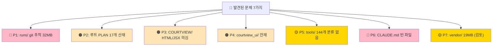
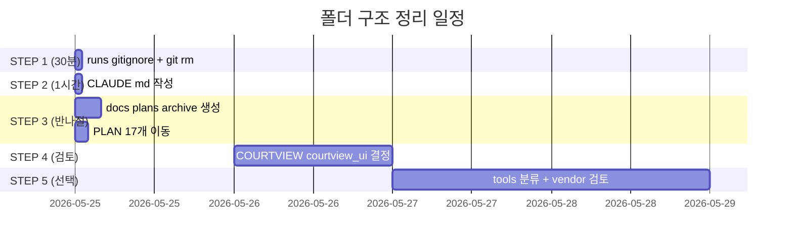
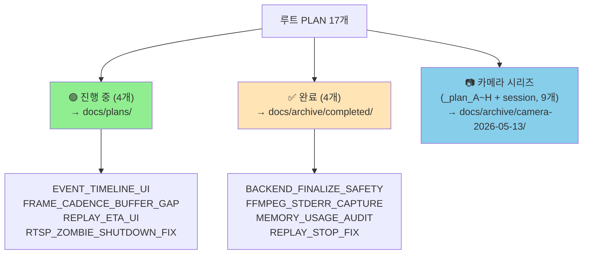
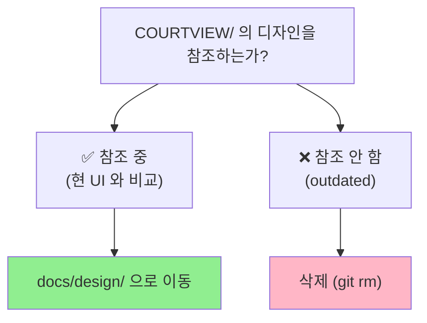
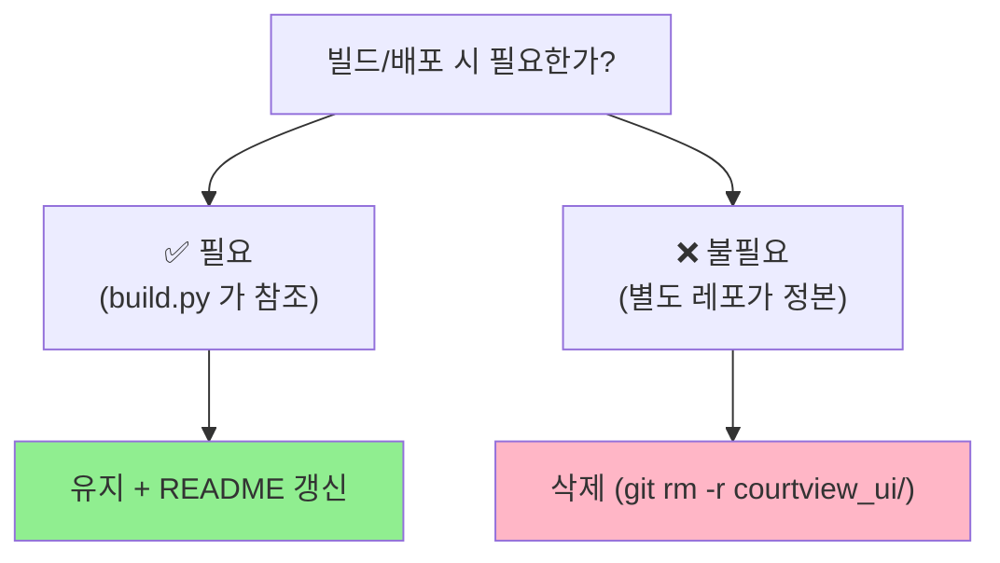

# 📁 폴더 구조 정리 계획서

> **루트 어수선 + runs/ 격리 + COURTVIEW/ 의심 폴더 + tools/ 144개 분류** 정리.
> 작성일: 2026-05-23 / 기준: 전체 폴더 구조 분석

---

## 🎯 한 줄 요약

> **코드 폴더는 깔끔하지만 외곽(루트/외부자원/산출물)이 어수선** — 7가지 문제 발견.

---

## 📊 발견된 문제 7가지



| # | 문제 | 영향 | 시급도 |
|---|---|---|---|
| P1 | `runs/` (32MB) git 추적 | 푸시 무거움 + clone 느림 | 🔴 즉시 |
| P2 | 루트 PLAN 17개 산재 | 신규 합류자 혼란 | 🟠 1일 |
| P3 | `COURTVIEW/` (HTML/JSX) | 정체 불명, 분류 필요 | 🟠 검토 |
| P4 | `courtview_ui/` 잔재 | README와 모순 | 🟠 검토 |
| P5 | `tools/` 144개 분류 없음 | 학습 스크립트 어수선 | 🟡 중장기 |
| P6 | `CLAUDE.md` 0 byte | AI 협업 가이드 부재 | 🔴 1시간 |
| P7 | `vendor/` 19MB | go2rtc.exe — LFS 검토 | 🟡 검토 |

---

## 🗓️ 정리 일정 — 5단계



**전체 소요**: **2~3일** (STEP 5 제외 시 1일)

---

## 📚 목차

1. [STEP 1 — runs/ 격리 (30분, 즉시)](#1-runs-격리)
2. [STEP 2 — CLAUDE.md 작성 (1시간)](#2-claude)
3. [STEP 3 — 루트 PLAN 정리 (반나절)](#3-plan-정리)
4. [STEP 4 — COURTVIEW / courtview_ui 결정](#4-design-folders)
5. [STEP 5 — tools/ 분류 + vendor/ 검토 (선택)](#5-tools-vendor)
6. [목표 폴더 구조 (After)](#6-after)
7. [검증 방법](#7-검증)

---

## 1. STEP 1 — `runs/` 격리 (30분, 즉시) {#1-runs-격리}

### 1.1 현재 상태

```
runs/ 폴더 크기: 32MB
git 추적 파일: 94개
.gitignore: runs/ 패턴 없음
내용: YOLO 학습 결과물
  ├─ detect/
  │  ├─ bbox_v8_phase1_resume*/
  │  │  ├─ args.yaml
  │  │  ├─ train_batch0.jpg     (~750KB)
  │  │  ├─ train_batch1.jpg
  │  │  └─ train_batch2.jpg
  └─ possession/
     └─ v1*/
```

→ **학습 산출물이라 git 추적 불필요** (재현 시 다시 생성됨).

### 1.2 작업 명령

```powershell
# 1. .gitignore 에 추가
Add-Content .gitignore "`n# ==================== YOLO 학습 결과 ====================`nruns/`n"

# 2. 기존 추적 제거 (파일은 로컬 유지)
git rm --cached -r runs/

# 3. 확인
git status
# → modified: .gitignore
# → deleted: runs/... (94개)

# 4. 커밋
git commit -m "chore: untrack runs/ folder (32MB YOLO training artifacts)

- Added runs/ to .gitignore
- Removed 94 files from git tracking (local files preserved)
- Reduces repo size by 32MB"

# 5. 푸시
git push origin main
git push spoin main
```

### 1.3 검증

```powershell
# runs/ 가 추적 안 되는지
git ls-files runs/ 2>&1 | Measure-Object | Select Count
# → Count: 0

# 로컬 파일은 살아있는지
ls runs\ 2>&1
# → detect, possession 폴더 보여야

# 레포 크기 감소 확인
git count-objects -vH
```

### 1.4 후속 조치

- [ ] **1.4.1** 학습 산출물 보관 위치 결정:
  - 옵션 A: 외부 클라우드 (Google Drive, S3) 백업
  - 옵션 B: 로컬만 유지 (각자 학습)
- [ ] **1.4.2** README 에 명시:
  ```markdown
  ## 학습 결과물
  `runs/` 는 YOLO 학습 산출물로 git 추적 안 함.
  재현 시 `tools/train_*.py` 실행으로 생성됨.
  ```

**예상 소요**: **30분**
**효과**: 레포 32MB 감소 + clone/push 가속

---

## 2. STEP 2 — `CLAUDE.md` 작성 (1시간) {#2-claude}

### 2.1 현재 상태

```
CLAUDE.md: 0 byte (빈 파일)
```

### 2.2 작성 내용

[MaintenanceTODO.md M2](MaintenanceTODO.md) 참조. 작성할 항목:

```markdown
# CLAUDE.md — Claude AI 협업 가이드

## 1. 프로젝트 개요
COURTVIEW = SPOIN 농구 분석 데스크톱 앱.
- Windows + GPU (RTX 4070 권장)
- 8 카메라 멀티뷰 분석
- LIVE + REPLAY 모드

## 2. 아키텍처
Layer 0: core_foundation, shared
Layer 1: infrastructure
Layer 2: detection, pose_estimation, biomechanics, motion_analysis
Layer 3: ai_referee, feedback_system, game_analysis
Layer 4: engine
Layer 5: api_server

## 3. 코드 컨벤션
- Python 3.10+
- 타입 힌트 필수: `X | None` (Optional 보다)
- snake_case 변수, PascalCase 클래스
- 한국어 docstring + 영어 코드
- 상수는 shared/constants/ 에 명시

## 4. 핵심 진입점
- 메인: engine/orchestrator/game_orchestrator.py
- API: api_server/main.py
- 런처: launcher.py
- REPLAY: replay.py

## 5. 자주 참조할 문서
- docs/INDEX.md (전체)
- docs/MainTODO.md (성능)
- docs/MaintenanceTODO.md (유지보수)
- docs/FOLDER_STRUCTURE_CLEANUP_PLAN.md (이 문서)
- docs/project/architecture/REFACTOR_INDEX.md (리팩토링)

## 6. 작업 시 주의사항
- weights/ 는 NAS 에서 복사 (git 추적 X)
- runs/ 는 학습 결과물 (git 추적 X)
- 외부 인터페이스 변경 X (api_server, GameOrchestrator)
- 성능 작업 → 리팩토링 순서 권장

## 7. 빌드 / 배포
- 빌드: `python build.py X.Y.Z --clean --zip`
- 배포: `python release.py X.Y.Z --channel beta`
- UI: 별도 레포 `SPOIN-Inc/courtview_ui`

## 8. 테스트
- 단위: `pytest tests/`
- 통합: `pytest -m integration`
- 벤치: `python tools/bench_pipeline_realistic.py`

## 9. 디버깅
- 로그: `%APPDATA%\COURTVIEW\logs\courtview.log`
- 진단: flow_logger (infrastructure/diagnostics/)
- GPU: `nvidia-smi dmon -s u`

## 10. AI 협업 시
- 코드 변경 전 외부 호출자 grep 필수
- 큰 변경은 docs/ 에 PLAN 작성 후 진행
- 외부 인터페이스 (api_server, GameOrchestrator) 절대 변경 X
- baseline diff = 0 검증 필수
```

**예상 소요**: **1시간**
**효과**: AI / 신규 합류자 학습 가속

---

## 3. STEP 3 — 루트 PLAN 정리 (반나절) {#3-plan-정리}

### 3.1 현재 상태 — 루트의 PLAN 파일 17개

```
프로젝트 루트/
├── PLAN_BACKEND_FINALIZE_SAFETY.md      (3,972 bytes)
├── PLAN_EVENT_TIMELINE_UI.md             (6,842 bytes)
├── PLAN_FFMPEG_STDERR_CAPTURE.md         (4,186 bytes)
├── PLAN_FRAME_CADENCE_BUFFER_GAP.md      (2,982 bytes)
├── PLAN_MEMORY_USAGE_AUDIT.md            (31,572 bytes)
├── PLAN_REPLAY_ETA_UI.md                 (5,131 bytes)
├── PLAN_REPLAY_STOP_FIX.md               (3,718 bytes)
├── PLAN_RTSP_ZOMBIE_SHUTDOWN_FIX.md      (7,301 bytes)
├── _plan_A_go2rtc_healthcheck_2026-05-13.md
├── _plan_B_hwaccel_2026-05-13.md
├── _plan_C_reconnect_cooldown_2026-05-13.md
├── _plan_D_ffmpeg_prescale_2026-05-13.md
├── _plan_E_flow_logs_2026-05-13.md
├── _plan_F_onvif_discovery_2026-05-13.md
├── _plan_G_mdns_discovery_2026-05-13.md
├── _plan_H_upnp_discovery_2026-05-13.md
└── _session_changes_2026-05-13.md
```

### 3.2 분류 기준



### 3.3 분류 근거

| PLAN | 분류 | 근거 |
|---|---|---|
| PLAN_BACKEND_FINALIZE_SAFETY | ✅ 완료 | 이전 조사: "STEP 1~4 완료" |
| PLAN_EVENT_TIMELINE_UI | 🟢 진행 | 이전 조사: "계획만 존재 (구현 X)" |
| PLAN_FFMPEG_STDERR_CAPTURE | ✅ 완료 | "STEP 1~5 완료, 진짜 원인 발견됨" |
| PLAN_FRAME_CADENCE_BUFFER_GAP | 🟢 진행 | "근본원인 규명, 구현 미정" |
| PLAN_MEMORY_USAGE_AUDIT | ✅ 완료 | "분석 완료, 상위 5대 항목 파악" |
| PLAN_REPLAY_ETA_UI | 🟢 진행 | "거의 모든 piece 준비, UI 연결만 남음" |
| PLAN_REPLAY_STOP_FIX | ✅ 완료 | "STEP 1~5 완료" |
| PLAN_RTSP_ZOMBIE_SHUTDOWN_FIX | 🟢 진행 | "근본원인 확정, 해결 방안 제시됨" |
| `_plan_A~H` (8개) | 📷 카메라 | 2026-05-13 카메라 발견 시리즈 |
| `_session_changes_2026-05-13.md` | 📷 카메라 | 같은 날짜 변경 로그 |

### 3.4 작업 명령

```powershell
# 1. 폴더 생성
mkdir docs\plans
mkdir docs\archive
mkdir docs\archive\completed
mkdir docs\archive\camera-2026-05-13

# 2. 진행 중 PLAN 이동
Move-Item PLAN_EVENT_TIMELINE_UI.md docs\plans\
Move-Item PLAN_FRAME_CADENCE_BUFFER_GAP.md docs\plans\
Move-Item PLAN_REPLAY_ETA_UI.md docs\plans\
Move-Item PLAN_RTSP_ZOMBIE_SHUTDOWN_FIX.md docs\plans\

# 3. 완료 PLAN 이동
Move-Item PLAN_BACKEND_FINALIZE_SAFETY.md docs\archive\completed\
Move-Item PLAN_FFMPEG_STDERR_CAPTURE.md docs\archive\completed\
Move-Item PLAN_MEMORY_USAGE_AUDIT.md docs\archive\completed\
Move-Item PLAN_REPLAY_STOP_FIX.md docs\archive\completed\

# 4. 카메라 시리즈 이동
Move-Item _plan_A_go2rtc_healthcheck_2026-05-13.md docs\archive\camera-2026-05-13\
Move-Item _plan_B_hwaccel_2026-05-13.md docs\archive\camera-2026-05-13\
Move-Item _plan_C_reconnect_cooldown_2026-05-13.md docs\archive\camera-2026-05-13\
Move-Item _plan_D_ffmpeg_prescale_2026-05-13.md docs\archive\camera-2026-05-13\
Move-Item _plan_E_flow_logs_2026-05-13.md docs\archive\camera-2026-05-13\
Move-Item _plan_F_onvif_discovery_2026-05-13.md docs\archive\camera-2026-05-13\
Move-Item _plan_G_mdns_discovery_2026-05-13.md docs\archive\camera-2026-05-13\
Move-Item _plan_H_upnp_discovery_2026-05-13.md docs\archive\camera-2026-05-13\
Move-Item _session_changes_2026-05-13.md docs\archive\camera-2026-05-13\

# 5. archive README 작성
@"
# Archive — 완료/보관된 계획서

## completed/
완료된 PLAN_*.md 파일들. 작업 이력 참조용.

## camera-2026-05-13/
2026-05-13 카메라 발견 시스템 시리즈 (A~H).
완료된 작업: HW 가속, ONVIF/mDNS/UPnP 발견 등.
"@ | Out-File docs\archive\README.md -Encoding utf8

# 6. plans README
@"
# Plans — 진행 중 작업 계획서

진행 중인 PLAN_*.md 파일들.
완료되면 docs/archive/completed/ 로 이동.
"@ | Out-File docs\plans\README.md -Encoding utf8

# 7. 커밋
git add docs/plans docs/archive
git rm PLAN_*.md _plan_*.md _session_changes_*.md   # 루트에서 제거 (이미 이동했지만 추적 갱신)
git status
```

⚠️ **주의**: `Move-Item` 은 git 입장에서 "삭제 + 추가" 로 보일 수 있음. `git mv` 가 더 안전:

```powershell
git mv PLAN_EVENT_TIMELINE_UI.md docs/plans/
git mv PLAN_FRAME_CADENCE_BUFFER_GAP.md docs/plans/
# ... 모든 파일
```

### 3.5 검증

```powershell
# 루트 정리 확인
ls *.md   # 남아야 할 것: README, CLAUDE, ARCHITECTURE_*, BKDUNK_*

# 이동 확인
ls docs\plans\
ls docs\archive\completed\
ls docs\archive\camera-2026-05-13\
```

### 3.6 INDEX 갱신

[INDEX.md](INDEX.md) 와 [MainTODO.md](MainTODO.md) 에서 PLAN 링크 갱신:

```markdown
# 변경 예시
- [PLAN_REPLAY_ETA_UI.md](../PLAN_REPLAY_ETA_UI.md)
+ [PLAN_REPLAY_ETA_UI.md](plans/PLAN_REPLAY_ETA_UI.md)
```

**예상 소요**: **반나절** (3시간)
**효과**: 루트 정리 + 신규 합류자 혼란 감소

---

## 4. STEP 4 — `COURTVIEW/` / `courtview_ui/` 결정 {#4-design-folders}

### 4.1 COURTVIEW/ 현재 상태

```
COURTVIEW/
├── COURTVIEW Redesign.html
├── cv-analysis-setup.jsx
├── cv-analysis.jsx
├── cv-comparison.jsx
└── cv-data.jsx
```

→ **HTML / JSX 디자인 파일**. UI 레포는 별도(`courtview_ui` 또는 `SPOIN-Inc/courtview_ui`).

### 4.2 옵션

| 옵션 | 조치 | 적합한 상황 |
|---|---|---|
| **A. docs/design/ 으로 이동** | 디자인 시안 보관 | 참조 가치 있을 때 |
| **B. 별도 레포 분리** | 디자인 시안만 모음 | 디자이너 협업 |
| **C. 삭제** | 더 이상 안 씀 | 시안이 outdated |

### 4.3 결정 가이드



### 4.4 작업 명령 (옵션 A — 권장)

```powershell
# docs/design/ 생성 + 이동
mkdir docs\design
git mv "COURTVIEW/COURTVIEW Redesign.html" docs/design/
git mv "COURTVIEW/cv-analysis-setup.jsx" docs/design/
git mv "COURTVIEW/cv-analysis.jsx" docs/design/
git mv "COURTVIEW/cv-comparison.jsx" docs/design/
git mv "COURTVIEW/cv-data.jsx" docs/design/

# 빈 COURTVIEW/ 폴더 삭제
Remove-Item -Recurse COURTVIEW

# README 작성
@"
# Design 시안

UI 레포 (SPOIN-Inc/courtview_ui) 와는 별개의 디자인 시안.
참조용으로 보관.
"@ | Out-File docs\design\README.md -Encoding utf8
```

### 4.5 courtview_ui/ 현재 상태

```
courtview_ui/
├── app.py        (1개 파일, 670줄)
├── static/
└── templates/
```

→ README 에는 **"UI 는 별도 레포: SPOIN-Inc/courtview_ui"** 라고 적혀 있는데, 여기 또 있음.

### 4.6 결정 가이드



### 4.7 확인 명령

```powershell
# build.py 가 courtview_ui/ 참조하는지
Select-String -Path build.py, courtview.spec, release.py -Pattern "courtview_ui"

# launcher_workers 가 참조하는지
Select-String -Path launcher_*.py -Pattern "courtview_ui|COURTVIEW-UI"
```

→ 참조 안 하면 삭제, 참조하면 유지.

**예상 소요**: **검토 1시간 + 작업 30분**
**효과**: 루트 명확화

---

## 5. STEP 5 — `tools/` 분류 + `vendor/` 검토 (선택) {#5-tools-vendor}

### 5.1 tools/ 현재 상태 — 144개 파일 산재

```
tools/ 파일 카테고리 (이름 패턴):
  27 extract_*    데이터 추출
  17 test_*       테스트 (학습 검증용, pytest 아님!)
  16 train_*      학습 스크립트
   9 build_*      데이터셋 빌드
   6 review_*     리뷰
   5 split_*      데이터 분할
   4 autolabel_*  자동 라벨링
   3 upload_*     S3 업로드
   3 remove_*     데이터 정리
   3 merge_*      데이터 합치기
  ... (나머지 51개)
```

### 5.2 분류 후 구조 (제안)

```
tools/
├── README.md                       # NEW (분류 설명)
│
├── learning/                       # 학습 (45개)
│   ├── train/                      # 16개 train_*.py
│   │   ├── train_bbox_v5.py
│   │   ├── train_bbox_v8.py
│   │   ├── train_bbox_v9.py
│   │   └── ...
│   ├── data/                       # 데이터 준비 (27 + 9 + 5 = 41개)
│   │   ├── extract_*.py
│   │   ├── build_*.py
│   │   ├── split_*.py
│   │   └── ...
│   └── autolabel/                  # 4개
│       └── autolabel_*.py
│
├── testing/                        # 학습 검증 (17개)
│   └── test_*.py                   # ⚠️ pytest 아닌 학습 검증
│
├── review/                         # 리뷰 (6개)
│   └── review_*.py
│
├── deploy/                         # 배포/업로드 (3개)
│   └── upload_*.py
│
├── bench/                          # 벤치마크 (1개)
│   └── bench_pipeline_realistic.py
│
└── misc/                           # 기타 (~51개)
```

### 5.3 작업 명령 (간단한 분류)

```powershell
mkdir tools\learning\train, tools\learning\data, tools\learning\autolabel
mkdir tools\testing, tools\review, tools\deploy, tools\bench, tools\misc

# train_*.py 이동
Get-ChildItem tools\train_*.py | ForEach-Object {
    git mv $_.FullName "tools/learning/train/$($_.Name)"
}

# extract_*.py 이동
Get-ChildItem tools\extract_*.py | ForEach-Object {
    git mv $_.FullName "tools/learning/data/$($_.Name)"
}

# build_*.py 이동
Get-ChildItem tools\build_*.py | ForEach-Object {
    git mv $_.FullName "tools/learning/data/$($_.Name)"
}

# autolabel_*.py 이동
Get-ChildItem tools\autolabel_*.py | ForEach-Object {
    git mv $_.FullName "tools/learning/autolabel/$($_.Name)"
}

# test_*.py 이동
Get-ChildItem tools\test_*.py | ForEach-Object {
    git mv $_.FullName "tools/testing/$($_.Name)"
}

# bench 이동
git mv tools\bench_pipeline_realistic.py tools/bench/

# review_*.py 이동
Get-ChildItem tools\review_*.py | ForEach-Object {
    git mv $_.FullName "tools/review/$($_.Name)"
}

# upload_*.py 이동
Get-ChildItem tools\upload_*.py | ForEach-Object {
    git mv $_.FullName "tools/deploy/$($_.Name)"
}

# 나머지는 misc/
Get-ChildItem tools\*.py | Where-Object { $_.Name -notmatch "^(train|extract|build|autolabel|test|review|upload|bench)_" } | ForEach-Object {
    git mv $_.FullName "tools/misc/$($_.Name)"
}
```

### 5.4 ⚠️ 주의사항

- **테스트 깨질 수 있음** — `tools/` 내 스크립트가 서로 import 할 가능성
- **CI/CD 영향** — 빌드 스크립트가 특정 경로 가정할 수 있음

→ **확인 후 진행**:
```powershell
# tools/ 안의 import 패턴
Select-String -Path tools\**\*.py -Pattern "from tools\."
```

### 5.5 vendor/ 검토

```
vendor/
└── go2rtc/
    └── go2rtc.exe   (19MB)
```

**옵션**:
- **A. 유지** — 빌드 재현성 (현재 권장)
- **B. Git LFS** — 큰 바이너리 LFS 로 (대안)
- **C. 외부 다운로드** — install 스크립트로 받기 (가장 깔끔)

**예상 소요**: **2일 (tools 분류) + 검토**
**효과**: tools/ 명확화, 신규 합류자 학습 곡선 ↓

---

## 6. 목표 폴더 구조 (After) {#6-after}

```
COURTVIEW-AI-BKDUNK/
│
├── 📄 루트 (정리됨, 7개 파일만)
│   ├── README.md                  ← 유지
│   ├── CLAUDE.md                  ← 작성됨 (STEP 2)
│   ├── ARCHITECTURE_DESKTOP.md    ← 유지
│   ├── ARCHITECTURE_REFERENCE.md  ← 유지
│   ├── BKDUNK_INTEGRATION_GUIDE.md ← 유지
│   ├── .gitignore                 ← runs/ 추가됨
│   └── (PLAN 17개 → docs/ 로 이동)
│
├── 📂 코어 모듈 (변경 없음, 12개)
│   ├── core_foundation/, shared/, infrastructure/
│   ├── detection/, pose_estimation/, biomechanics/, motion_analysis/
│   ├── ai_referee/, feedback_system/, game_analysis/
│   ├── engine/, api_server/
│
├── 📂 보조 도구 (정리됨)
│   ├── utils/                     ← 변경 없음
│   ├── tools/                     ← NEW: learning/, testing/, ...
│   │   ├── README.md              ← NEW
│   │   ├── learning/
│   │   │   ├── train/             (16개)
│   │   │   ├── data/              (41개)
│   │   │   └── autolabel/         (4개)
│   │   ├── testing/               (17개)
│   │   ├── review/                (6개)
│   │   ├── deploy/                (3개)
│   │   ├── bench/                 (1개)
│   │   └── misc/                  (51개)
│   └── scripts/                   ← 변경 없음
│
├── 📂 외부 자원
│   ├── configs/                   ← 변경 없음
│   ├── vendor/                    ← 검토 후 결정
│   └── (COURTVIEW/ → docs/design/ 이동)
│   └── (courtview_ui/ → 검토 후 결정)
│
├── 📂 산출물 (.gitignore 됨)
│   └── runs/                      ← git 추적 제거됨
│
├── 📂 문서 (확장됨)
│   └── docs/                      ← 75개 → ~95개
│       ├── INDEX.md
│       ├── MainTODO.md
│       ├── MaintenanceTODO.md     ← NEW
│       ├── FOLDER_STRUCTURE_CLEANUP_PLAN.md  ← NEW (이 문서)
│       ├── plans/                 ← NEW (진행 중)
│       │   ├── README.md
│       │   ├── PLAN_EVENT_TIMELINE_UI.md
│       │   ├── PLAN_FRAME_CADENCE_BUFFER_GAP.md
│       │   ├── PLAN_REPLAY_ETA_UI.md
│       │   └── PLAN_RTSP_ZOMBIE_SHUTDOWN_FIX.md
│       ├── archive/               ← NEW (완료)
│       │   ├── README.md
│       │   ├── completed/
│       │   │   ├── PLAN_BACKEND_FINALIZE_SAFETY.md
│       │   │   ├── PLAN_FFMPEG_STDERR_CAPTURE.md
│       │   │   ├── PLAN_MEMORY_USAGE_AUDIT.md
│       │   │   └── PLAN_REPLAY_STOP_FIX.md
│       │   └── camera-2026-05-13/
│       │       ├── _plan_A~H.md (8개)
│       │       └── _session_changes_2026-05-13.md
│       ├── design/                ← NEW (선택)
│       │   ├── README.md
│       │   └── COURTVIEW Redesign.html
│       ├── audit/                 ← 기존
│       ├── concepts/              ← 기존
│       ├── ml/                    ← 기존
│       └── project/
│           ├── architecture/      ← 7개 분리 계획서
│           └── performance/
│
└── 📂 테스트 (변경 없음)
    └── tests/
```

---

## 7. 검증 방법 {#7-검증}

### 7.1 STEP 1 (runs/ 격리) 검증

```powershell
git ls-files runs/ | Measure-Object | Select Count
# → Count: 0

ls runs\ 2>&1 | Measure-Object | Select Count
# → 로컬 파일 살아있어야 (>0)

git count-objects -vH
# → size 32MB 감소
```

### 7.2 STEP 2 (CLAUDE.md) 검증

```powershell
(Get-Content CLAUDE.md | Measure-Object -Line).Lines
# → >50 (충분히 작성됨)
```

### 7.3 STEP 3 (PLAN 정리) 검증

```powershell
# 루트에 PLAN_*.md 없어야
ls PLAN_*.md 2>&1 | Measure-Object | Select Count
# → Count: 0

# docs/plans/ 에 4개
(ls docs\plans\PLAN_*.md).Count
# → 4

# docs/archive/completed/ 에 4개
(ls docs\archive\completed\PLAN_*.md).Count
# → 4

# docs/archive/camera-2026-05-13/ 에 9개
(ls docs\archive\camera-2026-05-13\*).Count
# → 9 (_plan_A~H + _session_changes)
```

### 7.4 STEP 4 검증 (선택)

```powershell
# COURTVIEW/ 사라졌는지
Test-Path COURTVIEW   # → False

# docs/design/ 에 있는지
ls docs\design\
```

### 7.5 STEP 5 검증 (선택)

```powershell
# tools/ 루트가 깔끔한지
ls tools\*.py 2>&1 | Measure-Object | Select Count
# → 0 (모두 하위 폴더로 이동)

# 하위 폴더 확인
ls -d tools\*/
# → learning, testing, review, deploy, bench, misc
```

---

## 8. 위험 / 주의사항

### 8.1 ⚠️ git mv 사용

`Move-Item` 이 아니라 `git mv` 권장:
```powershell
# ❌ git history 끊김
Move-Item file.md docs/plans/

# ✅ git history 보존
git mv file.md docs/plans/
```

### 8.2 ⚠️ STEP 3 후 링크 갱신

루트 PLAN 이동 후 [MainTODO.md](MainTODO.md) 와 [INDEX.md](INDEX.md) 의 링크 모두 갱신.

### 8.3 ⚠️ STEP 5 (tools/) 의 import 주의

```python
# tools/ 안 스크립트가 서로 import 가능
from tools.train_bbox_v9 import ...   # ← 폴더 이동 시 깨짐
```

→ STEP 5 진행 전 import 패턴 grep 필수.

### 8.4 ⚠️ courtview_ui/ 결정 보류 권장

build.py / launcher / spec 파일이 참조하는지 확인 후 결정.

---

## 9. 일정 — 우선순위별

| 우선순위 | STEP | 소요 | 효과 |
|---|---|---|---|
| 🔴 즉시 | STEP 1 (runs/) | 30분 | 32MB 감소 |
| 🔴 즉시 | STEP 2 (CLAUDE.md) | 1시간 | AI 협업 가속 |
| 🟠 1일 | STEP 3 (PLAN 정리) | 반나절 | 루트 정리 |
| 🟡 검토 | STEP 4 (design 폴더) | 1일 | 명확화 |
| 🟢 선택 | STEP 5 (tools, vendor) | 2일 | tools 분류 |

**최소 진행 (STEP 1-3)**: **1일** 안에 완료, 큰 효과.

---

## 10. 작업 체크리스트

### Phase 1 — 즉시 (1일)
- [ ] STEP 1: runs/ git 추적 제거
  - [ ] .gitignore 추가
  - [ ] git rm --cached -r runs/
  - [ ] 커밋 + 푸시
- [ ] STEP 2: CLAUDE.md 작성
- [ ] STEP 3: PLAN 17개 이동
  - [ ] docs/plans/ 4개
  - [ ] docs/archive/completed/ 4개
  - [ ] docs/archive/camera-2026-05-13/ 9개
  - [ ] INDEX.md / MainTODO.md 링크 갱신

### Phase 2 — 검토 (1일)
- [ ] STEP 4: COURTVIEW/ + courtview_ui/ 결정
  - [ ] build.py / launcher / spec 참조 확인
  - [ ] 결정 (이동 / 삭제 / 유지)

### Phase 3 — 선택 (2일)
- [ ] STEP 5: tools/ 분류
  - [ ] import 패턴 grep
  - [ ] 폴더 분류 (learning/, testing/, ...)
  - [ ] tools/README.md 작성
- [ ] vendor/ 검토 (LFS 또는 외부 다운로드)

---

## 📖 관련 문서

- [MainTODO.md](MainTODO.md) — 성능 최적화
- [MaintenanceTODO.md](MaintenanceTODO.md) — 유지보수 (M2 CLAUDE.md 와 통합)
- [REFACTOR_INDEX.md](project/architecture/REFACTOR_INDEX.md) — 리팩토링
- [INDEX.md](INDEX.md) — 전체 인덱스

---

**마지막 업데이트**: 2026-05-23
**최소 진행 (필수)**: 1일 (STEP 1-3)
**전체**: 4~5일 (STEP 1-5)
