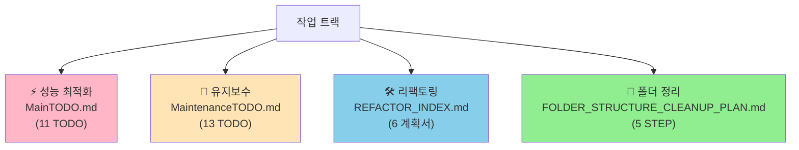
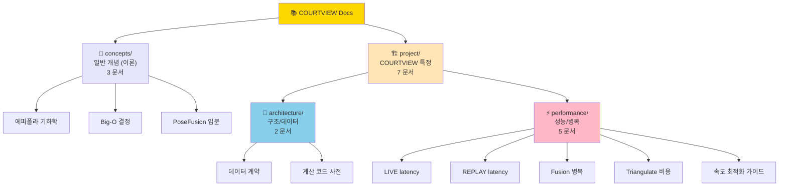
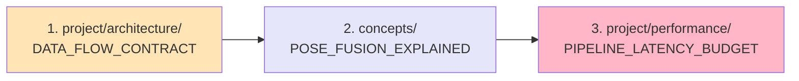
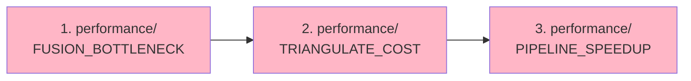
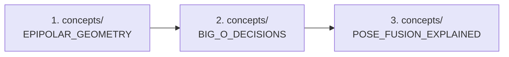
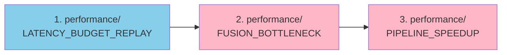
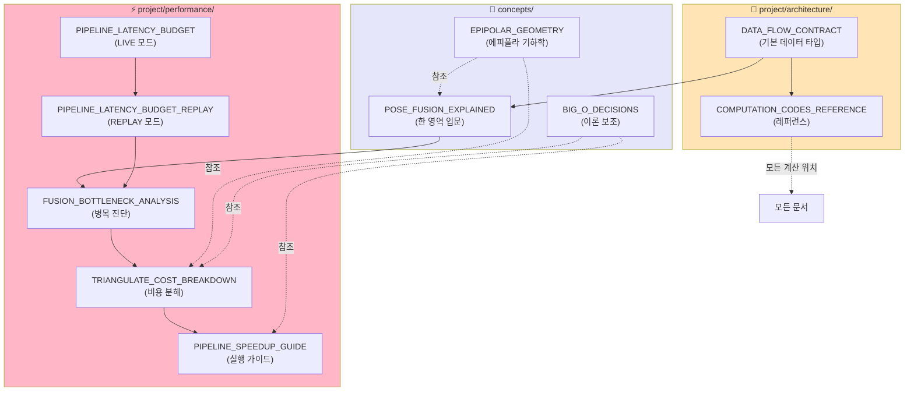

# 📚 COURTVIEW Docs 인덱스

> COURTVIEW 프로젝트의 모든 분석/계획 문서 인덱스.
> 폴더 구조: **concepts/** (일반 개념) + **project/** (프로젝트 특정) + **루트 TODO/PLAN 파일**.

---

## 🎯 작업 트랙 4가지



| 트랙 | 시작 문서 | 용도 | 예상 일정 |
|---|---|---|---|
| ⚡ 성능 | [MainTODO.md](MainTODO.md) | REPLAY 1.15 → 30+ fps | 1~2주 |
| 🔧 유지보수 | [MaintenanceTODO.md](MaintenanceTODO.md) | 테스트 / 에러 / 문서 / 타입 | 10주 |
| 🛠️ 리팩토링 | [project/architecture/REFACTOR_INDEX.md](project/architecture/REFACTOR_INDEX.md) | 거대 파일 6개 분리 | 6~7주 |
| 📁 폴더 정리 | [FOLDER_STRUCTURE_CLEANUP_PLAN.md](FOLDER_STRUCTURE_CLEANUP_PLAN.md) | runs/, PLAN, COURTVIEW/ | 1~5일 |

> **권장 순서**: 폴더 정리 (1일) → 성능 (1~2주) → 유지보수 (10주) + 리팩토링 (6주) 병행.

---

## 🗂️ docs/ 폴더 구조 한눈에

```
docs/
├── INDEX.md                                  ← 이 파일
│
├── 📋 루트 TODO/PLAN
│   ├── MainTODO.md                           ⚡ 성능 최적화 (11 TODO)
│   ├── MaintenanceTODO.md                    🔧 유지보수 (13 TODO)
│   └── FOLDER_STRUCTURE_CLEANUP_PLAN.md     📁 폴더 정리 (5 STEP)
│
├── concepts/                                 🧠 일반 개념 (3 문서)
│   ├── EPIPOLAR_GEOMETRY_EXPLAINED.md
│   ├── BIG_O_DECISIONS.md
│   └── POSE_FUSION_EXPLAINED.md
│
├── project/                                  🏗️ COURTVIEW 특정 (14 문서)
│   ├── architecture/
│   │   ├── DATA_FLOW_CONTRACT.md
│   │   ├── COMPUTATION_CODES_REFERENCE.md
│   │   ├── REFACTOR_INDEX.md                 🛠️ 리팩토링 인덱스
│   │   ├── REFACTOR_PLAN_GAME_ORCHESTRATOR.md
│   │   ├── REFACTOR_PLAN_EXCEPTIONS.md
│   │   ├── REFACTOR_PLAN_DETECTORS.md
│   │   ├── REFACTOR_PLAN_BIOMECHANICS_FEEDBACK.md
│   │   ├── REFACTOR_PLAN_POSE_PROCESSING.md
│   │   └── REFACTOR_PLAN_SEQUENCE_UTILS.md
│   └── performance/
│       ├── PIPELINE_LATENCY_BUDGET.md
│       ├── PIPELINE_LATENCY_BUDGET_REPLAY.md
│       ├── FUSION_BOTTLENECK_ANALYSIS.md
│       ├── TRIANGULATE_COST_BREAKDOWN.md
│       └── PIPELINE_SPEEDUP_GUIDE.md
│
├── plans/                                    📋 진행 중 PLAN (4개)
│   ├── README.md
│   ├── PLAN_EVENT_TIMELINE_UI.md
│   ├── PLAN_FRAME_CADENCE_BUFFER_GAP.md
│   ├── PLAN_REPLAY_ETA_UI.md
│   └── PLAN_RTSP_ZOMBIE_SHUTDOWN_FIX.md
│
├── archive/                                  📦 완료/보관 (13개)
│   ├── README.md
│   ├── completed/                            완료된 PLAN (4개)
│   │   ├── PLAN_BACKEND_FINALIZE_SAFETY.md
│   │   ├── PLAN_FFMPEG_STDERR_CAPTURE.md
│   │   ├── PLAN_MEMORY_USAGE_AUDIT.md
│   │   └── PLAN_REPLAY_STOP_FIX.md
│   └── camera-2026-05-13/                    카메라 발견 시리즈 (9개)
│       ├── _plan_A~H_*.md (8개)
│       └── _session_changes_2026-05-13.md
│
├── audit/                                    🔍 모듈 감사 로그 (54개)
├── ml/                                       🤖 ML 가중치 매니페스트 (3개)
├── CALIBRATION_KEYPOINTS.md                  📐 캘리브레이션 키포인트
├── INTEGRATION_BKDUNK.md                     🔗 BKDUNK 통합
└── MODULE_AUDIT_STANDARD.md                  📋 감사 표준
```

### 시각화



---

## 🧠 concepts/ — 일반 개념 (3 문서)

> 다른 컴퓨터 비전/AI 프로젝트에서도 통하는 일반적인 이론과 개념.

| # | 문서 | 용량 | 한 줄 요약 |
|---|---|---|---|
| 1 | [EPIPOLAR_GEOMETRY_EXPLAINED.md](concepts/EPIPOLAR_GEOMETRY_EXPLAINED.md) | 19KB | 에피폴라 기하학 — 손전등 비유부터 F-matrix 까지 |
| 2 | [BIG_O_DECISIONS.md](concepts/BIG_O_DECISIONS.md) | 12KB | O(n) vs O(log n) 의 함정 — Big-O 만이 답이 아닌 이유 |
| 3 | [POSE_FUSION_EXPLAINED.md](concepts/POSE_FUSION_EXPLAINED.md) | 21KB | PoseFusion 완전 정복 — 2D → 3D 의 마법 |

### 📌 언제 읽나
- 알고리즘 이론 학습
- 멀티뷰 기하학 개념 이해
- 최적화 결정 시 — Big-O 줄이기 vs 상수 줄이기

> 💡 **POSE_FUSION 도 concepts/** 에 둔 이유: 구현은 COURTVIEW 특정이지만, 다루는 개념(멀티뷰 삼각측량, 키포인트 융합)은 일반적임.

---

## 🏗️ project/ — COURTVIEW 프로젝트 특정 (7 문서)

### 📐 project/architecture/ — 시스템 구조 / 데이터 흐름 (2 문서)

| # | 문서 | 용량 | 한 줄 요약 |
|---|---|---|---|
| 4 | [DATA_FLOW_CONTRACT.md](project/architecture/DATA_FLOW_CONTRACT.md) | 23KB | 카메라 → AI → UI 까지 **11개 레이어의 데이터 타입** 전부 |
| 5 | [COMPUTATION_CODES_REFERENCE.md](project/architecture/COMPUTATION_CODES_REFERENCE.md) | 37KB | **40+ 계산 함수 백과사전** (좌표/Detection/Bio/Motion/Referee) |

#### 📌 언제 읽나
- 신규 합류자 온보딩
- 새 분석 기능 추가 전 — 비슷한 계산이 있는지 확인
- 데이터 타입/단위 일관성 검증
- 코드 위치 빠른 검색

### ⚡ project/performance/ — 성능 / 병목 / 최적화 (5 문서)

| # | 문서 | 용량 | 한 줄 요약 |
|---|---|---|---|
| 6 | [PIPELINE_LATENCY_BUDGET.md](project/performance/PIPELINE_LATENCY_BUDGET.md) | 13KB | **LIVE 모드 33ms 예산** 분해 — 5단계 cadence pipeline |
| 7 | [PIPELINE_LATENCY_BUDGET_REPLAY.md](project/performance/PIPELINE_LATENCY_BUDGET_REPLAY.md) | 21KB | **REPLAY 모드 1.15 fps** — LIVE 와의 차이점 + 동기화 보정 |
| 8 | [FUSION_BOTTLENECK_ANALYSIS.md](project/performance/FUSION_BOTTLENECK_ANALYSIS.md) | 18KB | **3개 fusion 의 173배 시간 차이** — 진짜 병목 5가지 원인 |
| 9 | [TRIANGULATE_COST_BREAKDOWN.md](project/performance/TRIANGULATE_COST_BREAKDOWN.md) | 22KB | **triangulate() 한 호출 2.8ms** — cv2/메모리/SVD 비용 분해 |
| 10 | [PIPELINE_SPEEDUP_GUIDE.md](project/performance/PIPELINE_SPEEDUP_GUIDE.md) | 24KB | **1.15 → 30+ fps** 만드는 7단계 실행 가이드 (P0/P1/P2) |

#### 📌 언제 읽나
- 성능 이슈 진단
- LIVE/REPLAY 모드 차이 이해
- 최적화 PR 작성 전 — 어떤 함수부터 손댈지 결정
- "1쿼터 분석에 5시간 걸려요" 같은 이슈

#### ⭐ 핵심 발견
> **F-matrix 캐싱** 이 최우선 최적화 (12배 가속 가능)
> [TRIANGULATE_COST_BREAKDOWN.md §10](project/performance/TRIANGULATE_COST_BREAKDOWN.md)

---

## 📊 한눈에 비교

| 폴더 | 문서 수 | 총 용량 | 성격 | 재사용성 |
|---|---|---|---|---|
| 🧠 concepts/ | 3 | 52KB | 일반 이론 | **다른 프로젝트에도 적용 가능** |
| 📐 project/architecture/ | 2 | 60KB | 시스템 구조 | COURTVIEW 특정 |
| ⚡ project/performance/ | 5 | 98KB | 성능 진단/개선 | COURTVIEW 특정 |
| **합계** | **10** | **210KB** | — | — |

---

## 🎯 추천 읽기 순서

### 👶 신규 합류자 (처음 보는 사람)



### 🛠️ 최적화 작업자



### 🎓 이론 학습자



### 🚨 트러블슈팅 (성능 이슈 발생)



---

## 🔗 문서 간 의존 관계



---

## 📝 각 문서의 핵심 발견

| 폴더 | 문서 | 핵심 발견 |
|---|---|---|
| concepts | EPIPOLAR_GEOMETRY | F-matrix 는 두 카메라의 기하학적 관계 카드 |
| concepts | BIG_O_DECISIONS | **O(log n) 이 항상 좋은 게 아님** — 작은 n 에서는 상수가 중요 |
| concepts | POSE_FUSION_EXPLAINED | PoseFusion = "광선의 교점 찾기" |
| architecture | DATA_FLOW_CONTRACT | 데이터가 11개 레이어를 거치며 BGR uint8 → 3D float → JSON 으로 변환 |
| architecture | COMPUTATION_CODES_REFERENCE | 40+ 함수, 단위 일관성 매우 중요 (cm vs m, deg vs rad) |
| performance | LATENCY_BUDGET | LIVE 33ms 예산이 frame_budget_ms 에 단일 정의 |
| performance | LATENCY_BUDGET_REPLAY | **REPLAY 도 동기화 코드 실행** (단, no-op 에 가까움) |
| performance | FUSION_BOTTLENECK | **3개 fusion 차이 173배** — 작업 종류의 차이 |
| performance | TRIANGULATE_COST | **에피폴라 필터가 호출당 50%** — F-matrix 캐싱이 최우선 |
| performance | PIPELINE_SPEEDUP | 1.15 fps → 30 fps 가능 — 7단계 로드맵 |

---

## 🔄 세션 중 발견된 정정 사항

이번 세션에서 **추정이 틀린 것**으로 밝혀진 사항들 (문서에 반영됨):

| 정정 | 이전 추정 | 코드 기반 사실 | 반영 문서 |
|---|---|---|---|
| REPLAY 동기화 | "5초 tolerance 로 느슨함" | **사실상 no-op** | LATENCY_BUDGET_REPLAY |
| 에피폴라 비교 | "n choose 2 쌍별" | **n-1 회** (기준 카메라 vs 나머지) | EPIPOLAR_GEOMETRY |
| SVD 비용 | "380ms 매우 무거움" | **~6ms** (행렬이 작아 빠름) | TRIANGULATE_COST |
| 메모리 할당 | "50ms" | **~10ms** (5배 과대 추정) | TRIANGULATE_COST |
| 함수 호출 오버헤드 | "큼" | **~10ms (2%)** — 작음 | TRIANGULATE_COST |
| 진짜 병목 | "SVD 자체" | **cv2 호출 누적 + F-matrix 매번 계산** | TRIANGULATE_COST |

---

## 🎓 학습 트랙별 요약

### 트랙 A: "코드 베이스 이해" (시간 2시간)
```
project/architecture/DATA_FLOW_CONTRACT             (30분)
→ concepts/POSE_FUSION_EXPLAINED                    (30분)
→ project/architecture/COMPUTATION_CODES_REFERENCE  (1시간, 부분 참조)
```

### 트랙 B: "성능 개선 작업" (시간 3시간)
```
project/performance/LATENCY_BUDGET_REPLAY        (20분)
→ project/performance/FUSION_BOTTLENECK          (30분)
→ project/performance/TRIANGULATE_COST           (40분)
→ project/performance/PIPELINE_SPEEDUP_GUIDE     (90분, 실제 작업 포함)
```

### 트랙 C: "이론 학습" (시간 1.5시간)
```
concepts/EPIPOLAR_GEOMETRY_EXPLAINED  (45분)
→ concepts/BIG_O_DECISIONS            (30분)
→ concepts/POSE_FUSION_EXPLAINED §5  (15분, 삼각측량 부분)
```

### 트랙 D: "REPLAY 모드 마스터" (시간 1시간)
```
project/performance/LATENCY_BUDGET          (15분, LIVE 와 비교용)
→ project/performance/LATENCY_BUDGET_REPLAY (30분)
→ project/performance/PIPELINE_SPEEDUP      (15분, REPLAY 관련만)
```

---

## 💡 폴더 분류 기준

### 🧠 concepts/ 에 두는 기준
> **"다른 프로젝트에서도 이 내용을 그대로 가져다 쓸 수 있는가?"**

- ✅ 에피폴라 기하학 → 모든 멀티카메라 비전에 적용
- ✅ Big-O 결정 → 모든 알고리즘 작업에 적용
- ✅ PoseFusion 개념 → 멀티뷰 3D 복원 일반 (구현은 COURTVIEW지만 개념은 일반)

### 🏗️ project/ 에 두는 기준
> **"COURTVIEW 의 코드/설정/병목/구조에 종속적인가?"**

- ✅ 데이터 흐름 → COURTVIEW 의 11 레이어 특정
- ✅ Latency 예산 → engine/config.py 의 값에 종속
- ✅ 병목 분석 → COURTVIEW 의 실제 구현체에 종속

### 📐 architecture/ vs ⚡ performance/
> **architecture**: "무엇이 어떻게 연결되어 있는가" (구조)
> **performance**: "얼마나 빠른가, 왜 느린가" (시간/병목)

---

## 🔍 자주 묻는 질문 (FAQ)

### Q1. 어떤 문서부터 읽어야 하나?
**A**: 목적에 따라 다름.
- 신규 합류자 → 트랙 A
- 성능 이슈 → 트랙 B
- 알고리즘 학습 → 트랙 C
- REPLAY 작업 → 트랙 D

### Q2. POSE_FUSION 은 왜 concepts/ 인가? COURTVIEW 코드인데?
**A**: 다루는 내용은 멀티뷰 삼각측량이라는 **일반 개념**. 구체적인 코드 위치는 다른 문서 (architecture/COMPUTATION_CODES_REFERENCE) 에 있음. 개념 학습은 concepts/, 코드 찾기는 architecture/.

### Q3. 폴더가 더 늘어날 수 있나?
**A**: 가능. 향후 추가 카테고리 후보:
- `concepts/` 안에 `coordinate-systems/`, `kalman-filtering/` 등
- `project/` 안에 `deployment/`, `testing/`, `troubleshooting/` 등

### Q4. 기존 docs/ 의 다른 폴더는?
**A**: 건드리지 않음 — 이번 세션과 무관:
- `audit/` — 모듈별 감사 로그 (기존)
- `ml/` — ML 관련 (기존)
- `CALIBRATION_KEYPOINTS.md` — 기존
- `INTEGRATION_BKDUNK.md` — 기존
- `MODULE_AUDIT_STANDARD.md` — 기존

---

## 📂 docs/ 폴더 전체 현황

### 이번 세션 작성 (10개, 폴더 정리됨)
```
docs/
├── INDEX.md
├── concepts/
│   ├── EPIPOLAR_GEOMETRY_EXPLAINED.md
│   ├── BIG_O_DECISIONS.md
│   └── POSE_FUSION_EXPLAINED.md
└── project/
    ├── architecture/
    │   ├── DATA_FLOW_CONTRACT.md
    │   └── COMPUTATION_CODES_REFERENCE.md
    └── performance/
        ├── PIPELINE_LATENCY_BUDGET.md
        ├── PIPELINE_LATENCY_BUDGET_REPLAY.md
        ├── FUSION_BOTTLENECK_ANALYSIS.md
        ├── TRIANGULATE_COST_BREAKDOWN.md
        └── PIPELINE_SPEEDUP_GUIDE.md
```

### 기존 문서 (이번 세션 외)
```
docs/
├── CALIBRATION_KEYPOINTS.md          ← 기존
├── INTEGRATION_BKDUNK.md             ← 기존 (bkdunk 통합)
├── MODULE_AUDIT_STANDARD.md          ← 기존 (모듈 감사 표준)
├── audit/                            ← 기존 (모듈별 감사 로그)
└── ml/                               ← 기존 (ML 관련)
```

---

## 🚀 다음 단계 추천 (작성 후보)

### 작성하면 좋을 문서

| 우선순위 | 제목 | 폴더 | 내용 |
|---|---|---|---|
| 🔴 높음 | `OPTIMIZATION_PR_TEMPLATE.md` | project/performance/ | F-matrix 캐싱 PR 의 step-by-step 가이드 |
| 🟠 중간 | `COORDINATE_TRANSFORM_MATH.md` | concepts/ | R.T, projection matrix 등 좌표 변환 수학 입문 |
| 🟠 중간 | `BENCHMARK_BASELINE.md` | project/performance/ | tools/bench_pipeline_realistic.py 실측 결과 |
| 🟡 낮음 | `OVERHEAD_EXPLAINED.md` | concepts/ | 함수 호출/메모리/락 오버헤드 종합 |
| 🟡 낮음 | `PYTHON_WITH_EXPLAINED.md` | concepts/ | `with` 문 + context manager 가이드 |

---

## 💡 사용 팁

### VS Code 에서 보기
1. `Ctrl+P` → 파일 이름 검색 (예: `POSE_FUSION`)
2. `Ctrl+Shift+V` → 마크다운 미리보기
3. **Mermaid 확장 설치 필요** — "Markdown Preview Mermaid Support"

### 빠른 검색 (PowerShell)
```powershell
# 모든 문서에서 키워드 검색
Get-ChildItem docs/**/*.md -Recurse | Select-String "F-matrix"

# concepts 안에서만
Get-ChildItem docs/concepts/*.md | Select-String "epipolar"
```

### 빠른 검색 (Bash)
```bash
# 모든 문서에서 키워드 검색
grep -r "F-matrix" docs/

# 카테고리 안에서만
grep -r "epipolar" docs/concepts/
```

---

## 📝 메타 정보

| 항목 | 값 |
|---|---|
| 작성 세션 | 2026-05-22 |
| 폴더 정리 | 2026-05-22 (concepts/ + project/architecture/ + project/performance/) |
| 총 문서 수 | 10 (이번 세션) + 3 (기존) |
| 총 용량 | ~210KB (이번 세션 분) |
| 다이어그램 수 | 80+ Mermaid |
| 코드 위치 링크 | 200+ |
| 기준 커밋 | `daf30d6` |

---

## 🤝 기여 가이드

새 문서를 추가할 때:
1. **폴더 결정**:
   - 일반 개념인가? → `concepts/`
   - COURTVIEW 구조/데이터인가? → `project/architecture/`
   - COURTVIEW 성능/병목인가? → `project/performance/`
   - 새 카테고리가 필요한가? → 새 폴더 + INDEX 업데이트
2. **이 INDEX.md** 의 해당 카테고리에 추가
3. **의존 관계 그래프** 업데이트 (§문서 간 의존 관계)
4. **추천 읽기 순서** 에 반영 여부 검토
