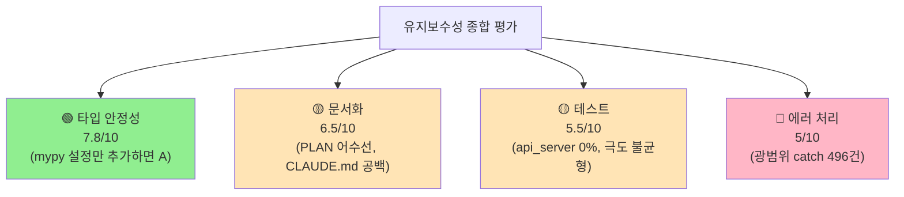
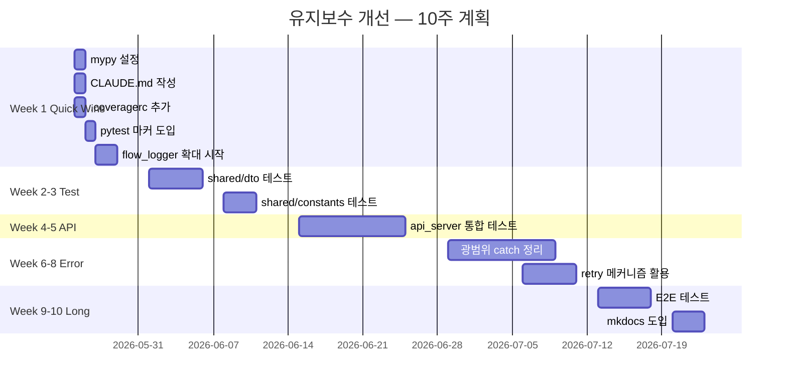
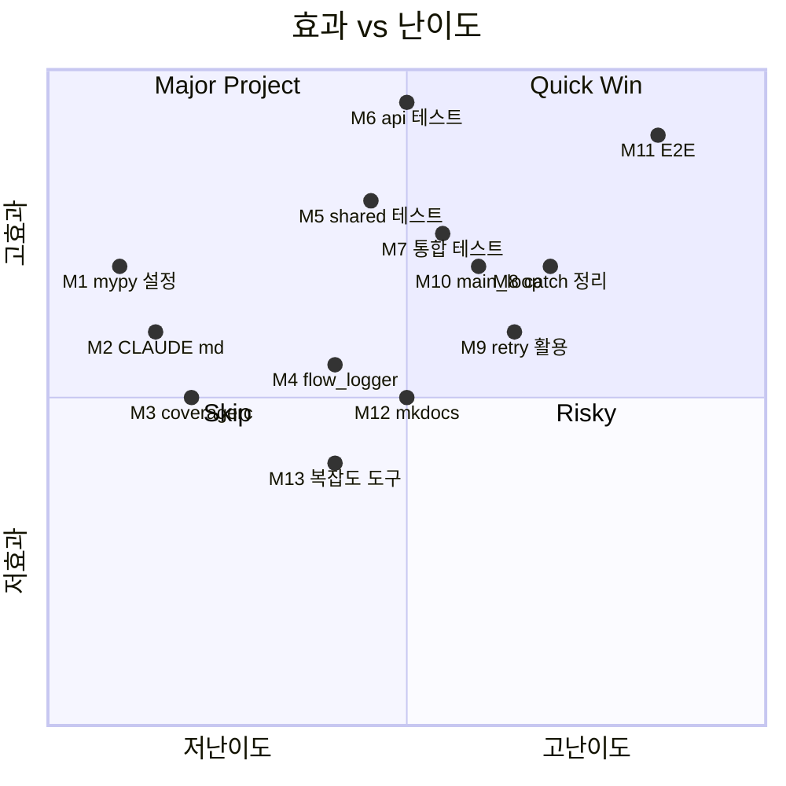
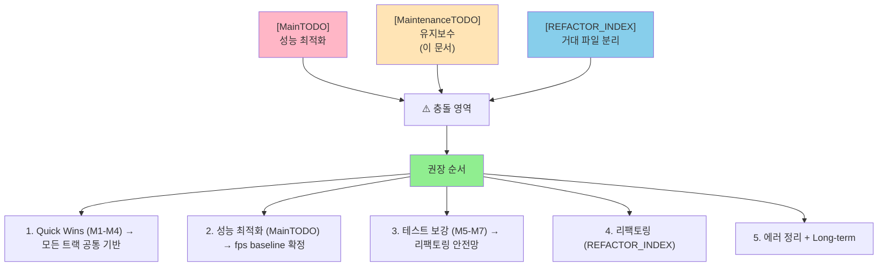

# 🔧 Maintenance TODO — 코드 유지보수성 개선 계획

> **테스트 / 문서 / 에러 처리 / 타입 안정성** 4가지 영역의 개선 작업.
> 작성일: 2026-05-23 / 기준: 전체 코드베이스 분석 결과
> 관련: [MainTODO.md](MainTODO.md) (성능 최적화 트랙)

---

## 🎯 한 줄 요약

> **"좋은 설계 위에 적당한 실행"** — 인프라(예외 클래스, 타입 시스템, 로깅)는 우수하지만 실제 활용이 따라가지 못함.

---

## 📊 현재 상태 점수



---

## 🗓️ 전체 로드맵 (10주)



---

## 📚 목차

1. [Phase 1 — Quick Wins (1주)](#1-quick-wins)
2. [Phase 2 — Test Coverage 보강 (2주)](#2-test-coverage)
3. [Phase 3 — Error Handling 정리 (3주)](#3-error-handling)
4. [Phase 4 — Long-term (2주)](#4-long-term)
5. [작업 우선순위 매트릭스](#5-matrix)
6. [성능 최적화 / 리팩토링과의 관계](#6-relation)
7. [작업 체크리스트](#7-checklist)

---

## 1. Phase 1 — Quick Wins (1주) {#1-quick-wins}

> 30분 ~ 1일이면 끝나는 큰 효과 작업들.

### TODO-M1: mypy 설정 추가 ⭐ ROI 최고

**문제**: `mypy==1.8.0` 설치돼 있지만 설정 파일 없음. 정적 검사 자동화 안 됨.

**작업**:
- [ ] **M1.1** `pyproject.toml` 에 mypy 섹션 추가:
  ```toml
  [tool.mypy]
  python_version = "3.10"
  strict = false                      # 처음엔 false, 점진적 strict
  warn_unused_ignores = true
  warn_redundant_casts = true
  check_untyped_defs = true

  # 외부 라이브러리 무시
  [[tool.mypy.overrides]]
  module = [
      "cv2.*",
      "ultralytics.*",
      "tensorrt.*",
      "torch.*",
      "onnx.*",
  ]
  ignore_missing_imports = true
  ```

- [ ] **M1.2** CI 에 mypy 단계 추가 (있다면):
  ```yaml
  # .github/workflows/test.yml (예시)
  - name: mypy
    run: mypy shared/ core_foundation/
  ```

- [ ] **M1.3** 처음엔 `shared/` 와 `core_foundation/` 만 검사 (점진 확대)

**예상 소요**: **30분**
**효과**: 타입 오류 자동 검출, IDE 지원 향상

---

### TODO-M2: CLAUDE.md 작성

**문제**: 루트의 `CLAUDE.md` 가 0 byte. AI 협업 + 신규 합류자 가이드 부재.

**작업**:
- [ ] **M2.1** 다음 항목 포함:
  ```markdown
  # CLAUDE.md — Claude AI 협업 가이드

  ## 프로젝트 개요
  COURTVIEW = 농구 분석 데스크톱 앱
  Layer: core_foundation → infrastructure → 도메인 모듈 → engine → api_server

  ## 코드 컨벤션
  - Python 3.10+, 타입 힌트 필수
  - X | None (Optional 보다)
  - snake_case 변수, PascalCase 클래스
  - 한국어 docstring + 영어 코드

  ## 핵심 모듈 진입점
  - 메인: engine/orchestrator/game_orchestrator.py
  - API: api_server/main.py
  - 런처: launcher.py

  ## 자주 참조할 문서
  - docs/INDEX.md (전체 인덱스)
  - docs/MainTODO.md (성능 최적화)
  - docs/MaintenanceTODO.md (유지보수)
  - docs/project/architecture/REFACTOR_INDEX.md

  ## 작업 시 주의사항
  - weights/ 는 git 추적 안 함 (NAS 에서 복사)
  - runs/ 는 학습 결과물 (격리 예정)
  - 외부 인터페이스 변경 X (api_server, GameOrchestrator public)
  ```

**예상 소요**: **1시간**
**효과**: AI/신규 합류자 학습 가속

---

### TODO-M3: .coveragerc 추가 + pytest 마커

**문제**: 커버리지 추적 없음, pytest 마커 정의 안 됨.

**작업**:
- [ ] **M3.1** `.coveragerc` 생성:
  ```ini
  [run]
  source = .
  omit =
      */tests/*
      */tools/*
      */__pycache__/*
      runs/*
      vendor/*

  [report]
  precision = 2
  show_missing = true
  exclude_lines =
      pragma: no cover
      def __repr__
      raise NotImplementedError
      if TYPE_CHECKING:
  ```

- [ ] **M3.2** `pytest.ini` 에 마커 정의:
  ```ini
  [pytest]
  pythonpath = .
  testpaths = tests
  markers =
      slow: 느린 테스트 (>5초)
      integration: 통합 테스트 (실제 모듈 결합)
      gpu: GPU 필요
      e2e: 전체 파이프라인 검증
      unit: 단위 테스트 (기본)
  ```

- [ ] **M3.3** 기존 테스트에 마커 추가 (점진적):
  ```python
  @pytest.mark.integration
  def test_pipeline_end_to_end():
      ...
  ```

**예상 소요**: **반나절**
**효과**: `pytest -m "not slow"` 같은 선별 실행 가능

---

### TODO-M4: flow_logger 활용 확대

**문제**: `log_flow()` 가 25곳에만 사용 (6 파일). 데이터 흐름 진단 어려움.

**작업**:
- [ ] **M4.1** 진단 가시화 필요한 영역 식별:
  - `engine/orchestrator/game_orchestrator.py` (이미 일부)
  - `engine/io/frame_ingestion.py` (이미 일부)
  - `engine/pipeline/frame_pipeline.py` (추가 필요)
  - `engine/pipeline/event_pipeline.py` (추가 필요)
  - `engine/pipeline/possession_pipeline.py` (추가 필요)

- [ ] **M4.2** 표준 패턴 정립:
  ```python
  from infrastructure.diagnostics.flow_logger import log_flow

  log_flow(
      "EVENT-DETECTED",
      "frame=%d type=%s confidence=%.2f",
      frame_idx, event_type, confidence,
      first_n=5,      # 처음 5번만
      every=100,      # 이후 100번마다
  )
  ```

- [ ] **M4.3** 목표: 25개 → 100개 호출

**예상 소요**: **1~2일**
**효과**: 디버깅 + 운영 진단 가시성 ↑

---

## 2. Phase 2 — Test Coverage 보강 (2주) {#2-test-coverage}

### TODO-M5: shared/ 테스트 보강 (7% → 80%)

**문제**: 모든 모듈이 의존하는 shared/ 가 7% 커버리지. 변경 시 전체 영향.

**작업**:
- [ ] **M5.1** 대상 파일 (우선순위 순):
  - `shared/dto/game_dto.py` — Pydantic 검증 테스트
  - `shared/dto/camera_dto.py`
  - `shared/dto/calibration_dto.py`
  - `shared/dto/video_dto.py`
  - `shared/constants/*.py` — 값 검증 + 일관성
  - `shared/exceptions/*.py` — 분리 후 (REFACTOR_PLAN_EXCEPTIONS)

- [ ] **M5.2** 테스트 패턴:
  ```python
  # tests/shared/dto/test_game_dto.py
  def test_game_event_validation():
      """Pydantic 검증 동작 확인."""
      event = GameEvent(
          event_id=uuid4(),
          event_type="shot_made",
          confidence=0.85,
      )
      assert 0.0 <= event.confidence <= 1.0

  def test_invalid_confidence_raises():
      """0~1 범위 벗어나면 에러."""
      with pytest.raises(ValidationError):
          GameEvent(..., confidence=1.5)

  def test_court_coords_normalized():
      """court_x, court_y 가 0~1 정규화."""
      event = GameEvent(..., court_x=0.5, court_y=0.7)
      assert 0.0 <= event.court_x <= 1.0
  ```

- [ ] **M5.3** 목표 커버리지: shared/ 7% → **80%+**

**예상 소요**: **1주**
**효과**: 다른 모듈 변경 시 shared 회귀 방지

---

### TODO-M6: api_server 통합 테스트 ⭐ 최고 우선순위

**문제**: **51개 파일, 0% 테스트**. 라우트/서비스/미들웨어/WebSocket 모두 미검증.

**작업**:
- [ ] **M6.1** FastAPI TestClient 셋업:
  ```python
  # tests/api_server/conftest.py
  from fastapi.testclient import TestClient

  @pytest.fixture
  def client():
      from api_server.main import app
      return TestClient(app)
  ```

- [ ] **M6.2** REST 라우트별 테스트 (15 라우트):
  ```python
  # tests/api_server/routes/test_game_routes.py
  def test_game_start_replay_mode(client):
      response = client.post("/api/v1/game/start", json={
          "mode": "replay",
          "source_urls": {"cam_0": "/path/to/cam0.mp4"},
          "rule_set": "fiba",
      })
      assert response.status_code == 200
      assert response.json()["success"] is True

  def test_game_status_returns_engine_state(client):
      response = client.get("/api/v1/game/status")
      assert response.status_code == 200
      assert "engine_state" in response.json()
  ```

- [ ] **M6.3** WebSocket 테스트:
  ```python
  def test_ws_live_receives_frame_message(client):
      with client.websocket_connect("/ws/live") as ws:
          data = ws.receive_json()
          assert data["type"] in ["frame", "event", "status"]
  ```

- [ ] **M6.4** 미들웨어 (error_handler) 테스트
- [ ] **M6.5** 스키마 검증 (request/response DTO)
- [ ] **M6.6** 목표: api_server 0% → **60%+**

**예상 소요**: **2주**
**효과**: API 회귀 위험 대폭 감소

📄 참조: [DATA_FLOW_CONTRACT](project/architecture/DATA_FLOW_CONTRACT.md) §11 (REST 라우트 22개 목록)

---

### TODO-M7: 통합 테스트 보강

**문제**: 단위 테스트 96%, 통합 4%. E2E 거의 없음.

**작업**:
- [ ] **M7.1** 기존 `tests/integration/` 확장 (10개 → 30개)
- [ ] **M7.2** 핵심 통합 시나리오:
  - REPLAY 모드 짧은 영상 (5초) 분석
  - LIVE 모드 mock RTSP 입력
  - finalize 흐름 (game/stop → finalize/game)
  - WebSocket 실시간 이벤트 발행

- [ ] **M7.3** 마커 사용:
  ```python
  @pytest.mark.integration
  @pytest.mark.slow
  def test_replay_short_video_produces_events():
      ...
  ```

**예상 소요**: **1주**
**효과**: 회귀 detection 신뢰도 ↑

---

## 3. Phase 3 — Error Handling 정리 (3주) {#3-error-handling}

### TODO-M8: 광범위 Exception catch 정리 (496건)

**문제**: `except Exception:` 496건. silent failure 산재.

**작업**:
- [ ] **M8.1** 우선순위 디렉토리:
  - `engine/orchestrator/game_orchestrator.py` (47건)
  - `api_server/` (47건)
  - `launcher*.py` (12건)

- [ ] **M8.2** 패턴별 정리:
  ```python
  # ❌ Before (광범위)
  try:
      result = risky_call()
  except Exception:
      pass

  # ✅ After 1 (특정 예외 + 로깅)
  try:
      result = risky_call()
  except (TimeoutError, ConnectionError) as e:
      logger.warning("일시적 오류: %s", e)
      result = None
  except Exception as e:
      logger.exception("예상치 못한 오류")
      raise   # 또는 RetryableException 으로 변환

  # ✅ After 2 (정당한 광범위 catch + noqa)
  try:
      optional_feature()
  except Exception:    # noqa: BLE001 — optional feature
      logger.debug("optional 기능 실패, 무시")
  ```

- [ ] **M8.3** 목표:
  - 광범위 catch 496 → **150건 이하**
  - 나머지는 `# noqa: BLE001 — <이유>` 명시

**예상 소요**: **2주**
**효과**: 디버깅 가능성 ↑, silent failure 감소

---

### TODO-M9: RetryableException 실제 활용

**문제**: `@retry`, `RetryableException` 설계는 완벽한데 실제 `raise` 0건.

**작업**:
- [ ] **M9.1** 후보 영역:
  - `api_server/services/` 외부 API 호출
  - `infrastructure/preprocessing/video_decoder.py` RTSP 재연결
  - `engine/io/frame_ingestion.py` 카메라 재연결
  - launcher 의 S3 업데이트 다운로드

- [ ] **M9.2** 패턴:
  ```python
  from core_foundation.resilience import retry
  from shared.exceptions import RetryableException

  @retry(max_attempts=3, backoff_factor=2.0)
  def fetch_from_s3(url):
      try:
          return requests.get(url, timeout=10)
      except (requests.Timeout, requests.ConnectionError) as e:
          raise RetryableException(f"S3 일시 오류: {e}")
  ```

- [ ] **M9.3** 목표: 최소 10개 `raise RetryableException` 추가

**예상 소요**: **1주**
**효과**: 일시 오류 자동 복구

---

### TODO-M10: main_loop 에러 처리 강화

**문제**: `_main_loop` (engine) 에서 연속 에러 10회 시 ERROR 상태 — 그 전 단계 격리 부족.

**작업**:
- [ ] **M10.1** [game_orchestrator.py:_main_loop](../engine/orchestrator/game_orchestrator.py) 에서:
  - 각 stage (capture / detect / event / dispatch) 별 try/except
  - 1 stage 실패 시 다음 stage 건너뛰고 다음 frame 으로

- [ ] **M10.2** CriticalException 도입:
  ```python
  try:
      self.cadence_scheduler.tick(frame_index)
  except CriticalException:
      logger.critical("복구 불가 — 게임 중단")
      self.stop_game()
      break
  except RetryableException as e:
      logger.warning("일시 오류 — 다음 frame: %s", e)
      continue
  ```

**예상 소요**: **반나절**
**효과**: 게임 중 크래시 방지

---

## 4. Phase 4 — Long-term (2주) {#4-long-term}

### TODO-M11: E2E 테스트 작성

**작업**:
- [ ] 실제 5초 영상 입력 → events.json 생성 → 검증
- [ ] baseline events.json 저장 후 회귀 검증
- [ ] CI 에서 자동 실행

**예상 소요**: **1주**

---

### TODO-M12: mkdocs / sphinx 도입 (선택)

**작업**:
- [ ] `mkdocs.yml` 작성
- [ ] docs/ 의 75개 .md 자동 사이트 생성
- [ ] GitHub Pages 또는 내부 호스팅

**예상 소요**: **2~3일**
**효과**: 외부 공유 + 검색 가능

---

### TODO-M13: 자동 라인 카운트 / 복잡도 추적

**작업**:
- [ ] `radon` 또는 `xenon` 도입
- [ ] CI 에서 cyclomatic complexity 추적
- [ ] 1000줄 넘는 파일 자동 경고

**예상 소요**: **반나절**

---

## 5. 작업 우선순위 매트릭스 {#5-matrix}



### 점수 정리

| TODO | 효과 | 난이도 | ROI |
|---|---|---|---|
| M1 mypy 설정 | ⭐⭐⭐ | ⭐ | **🥇 최고** |
| M2 CLAUDE.md | ⭐⭐⭐ | ⭐ | 🥇 최고 |
| M6 api 테스트 | ⭐⭐⭐⭐⭐ | ⭐⭐⭐ | 🥈 매우 큼 |
| M5 shared 테스트 | ⭐⭐⭐⭐ | ⭐⭐⭐ | 🥈 매우 큼 |
| M8 catch 정리 | ⭐⭐⭐ | ⭐⭐⭐⭐ | 🥉 중간 |
| M11 E2E | ⭐⭐⭐⭐ | ⭐⭐⭐⭐ | 🥉 중간 |
| M3 coveragerc | ⭐⭐ | ⭐ | Quick Win |
| M4 flow_logger | ⭐⭐ | ⭐⭐ | Quick Win |
| M9 retry | ⭐⭐ | ⭐⭐⭐ | 보통 |
| M10 main_loop | ⭐⭐⭐ | ⭐⭐ | Quick Win |
| M12 mkdocs | ⭐⭐ | ⭐⭐ | 선택 |
| M13 복잡도 도구 | ⭐⭐ | ⭐⭐ | 선택 |

---

## 6. 성능 최적화 / 리팩토링과의 관계 {#6-relation}



### 권장 통합 순서

| 시기 | 작업 | 출처 |
|---|---|---|
| **Week 1** | Quick Wins (M1-M4) | MaintenanceTODO |
| **Week 2-3** | 성능 baseline + 핵심 최적화 | [MainTODO](MainTODO.md) TODO-1, 3a |
| **Week 4-6** | 테스트 보강 (M5, M6) | MaintenanceTODO |
| **Week 7-9** | 작은 리팩토링 (sequence_utils, exceptions) | [REFACTOR_INDEX](project/architecture/REFACTOR_INDEX.md) |
| **Week 10-12** | 에러 정리 (M8, M9, M10) | MaintenanceTODO |
| **Week 13-15** | 큰 리팩토링 (detectors, game_orchestrator) | REFACTOR_INDEX |
| **Week 16+** | E2E + Long-term | MaintenanceTODO |

→ **순서 핵심**: 테스트 안전망(M5, M6) 확보 후 → 리팩토링 시작.

---

## 7. 작업 체크리스트 {#7-checklist}

### Phase 1 (Week 1) — Quick Wins
- [ ] M1: mypy 설정 (30분)
- [ ] M2: CLAUDE.md 작성 (1시간)
- [ ] M3: .coveragerc + pytest 마커 (반나절)
- [ ] M4: flow_logger 확대 (1~2일)

### Phase 2 (Week 2-4) — Test Coverage
- [ ] M5: shared/ 테스트 7% → 80% (1주)
- [ ] M6: api_server 통합 테스트 0% → 60% (2주) ⭐
- [ ] M7: 통합 테스트 보강 (1주)

### Phase 3 (Week 5-7) — Error Handling
- [ ] M8: 광범위 catch 496 → 150 (2주)
- [ ] M9: RetryableException 활용 (1주)
- [ ] M10: main_loop 에러 처리 (반나절)

### Phase 4 (Week 8-10) — Long-term
- [ ] M11: E2E 테스트 (1주)
- [ ] M12: mkdocs (선택, 2~3일)
- [ ] M13: 복잡도 도구 (선택, 반나절)

### 최종 검증
- [ ] mypy strict 모드 통과
- [ ] coverage 70%+ 달성
- [ ] 광범위 catch < 150
- [ ] CLAUDE.md / mkdocs 활용 가능
- [ ] CI 자동 검사 동작

---

## 8. 측정 가능 목표

### Before (현재)
```
타입 안정성: 7.8/10
문서화: 6.5/10
테스트: 5.5/10
에러 처리: 5/10
종합: 6.2/10
```

### After (목표)
```
타입 안정성: 9/10  (mypy strict)
문서화: 8/10     (CLAUDE.md + mkdocs)
테스트: 8/10     (api_server 60%+, shared 80%+)
에러 처리: 7/10  (catch 150 이하, retry 활용)
종합: 8/10
```

---

## 📖 관련 문서

- [MainTODO.md](MainTODO.md) — 성능 최적화 트랙
- [REFACTOR_INDEX.md](project/architecture/REFACTOR_INDEX.md) — 리팩토링 트랙
- [FOLDER_STRUCTURE_CLEANUP_PLAN.md](FOLDER_STRUCTURE_CLEANUP_PLAN.md) — 폴더 정리 트랙 (이번 함께)
- [INDEX.md](INDEX.md) — docs 인덱스
- [DATA_FLOW_CONTRACT.md](project/architecture/DATA_FLOW_CONTRACT.md) — API 라우트 목록

---

**마지막 업데이트**: 2026-05-23
**전체 예상 완료**: 10주 (성능/리팩토링과 병행 시 16주)
