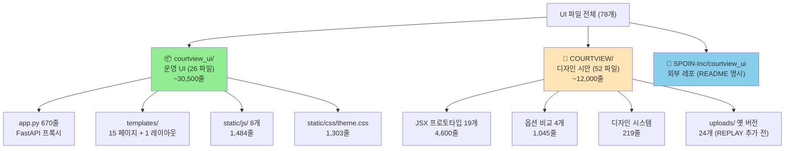
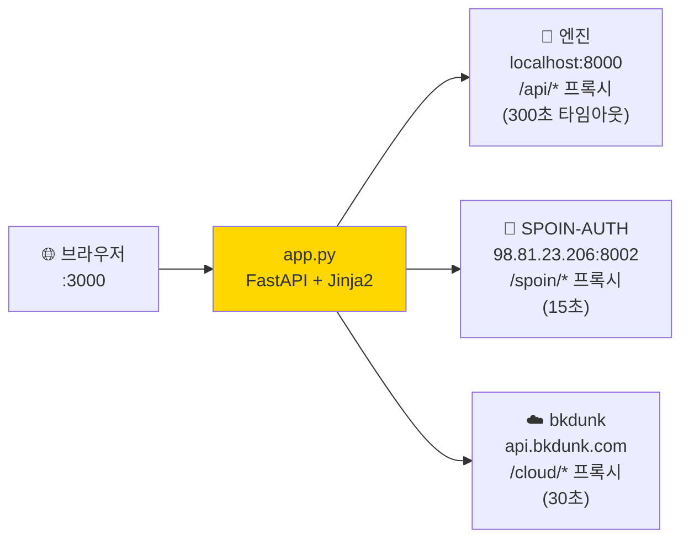
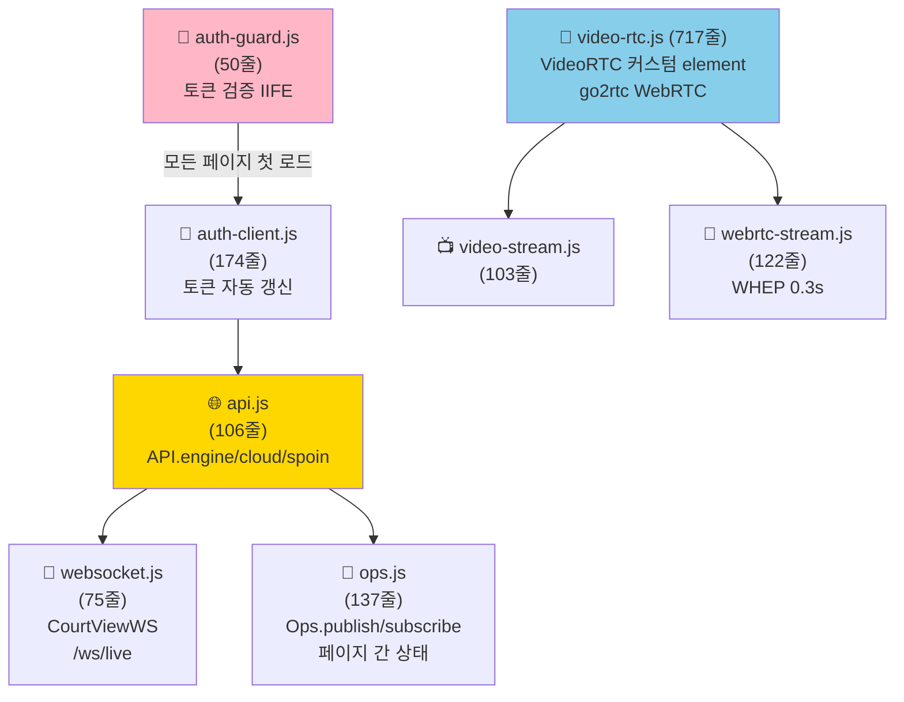
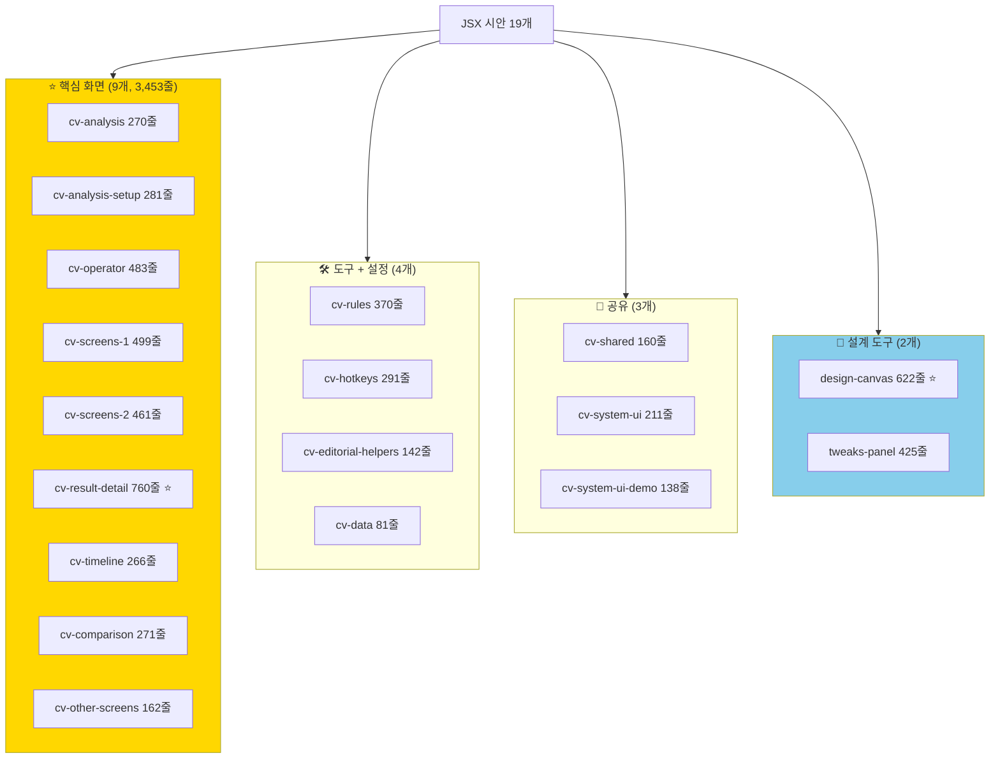
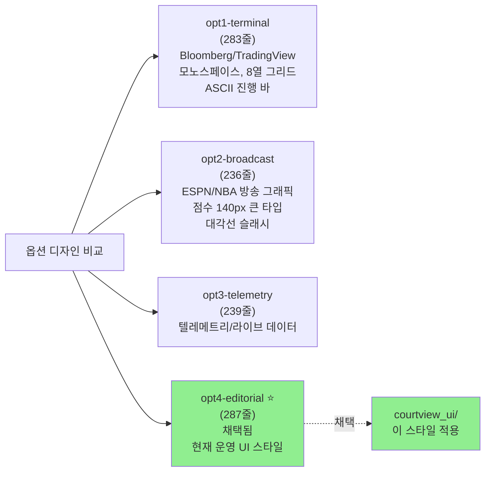
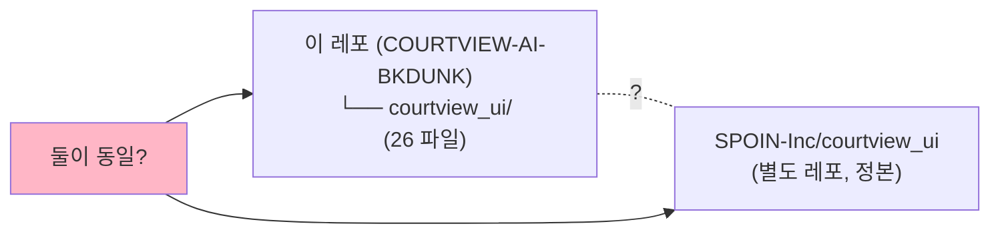
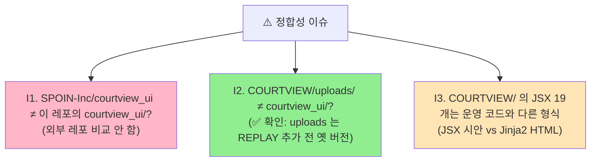

# 🎨 UI 코드파일 전체 인벤토리

> **이 레포의 UI 관련 78개 파일, 42,500줄을 카테고리별로 정리.**
> 작성일: 2026-05-23 / 기준: `courtview_ui/` + `COURTVIEW/`
> 관련: [FOLDER_STRUCTURE_CLEANUP_PLAN.md](FOLDER_STRUCTURE_CLEANUP_PLAN.md) STEP 4

---

## 📚 목차

1. [전체 구조 한눈에](#1-전체-구조)
2. [courtview_ui/ 운영 UI (26 파일)](#2-courtview_ui)
3. [COURTVIEW/ 디자인 시안 (52 파일)](#3-courtview-design)
4. [SPOIN-Inc/courtview_ui 외부 레포](#4-external)
5. [흐름 다이어그램 - 실제 운영](#5-flow)
6. [핵심 통계](#6-stats)
7. [정합성 확인 + 권장 조치](#7-cleanup)

---

## 1. 전체 구조 한눈에 {#1-전체-구조}



### 📋 한 줄 요약

> **운영 = `courtview_ui/`, 디자인 시안 = `COURTVIEW/`, README 가 가리키는 정본 = `SPOIN-Inc/courtview_ui` (외부)**

---

## 2. 📦 `courtview_ui/` — 운영 UI {#2-courtview_ui}

### 2.1 `app.py` (670줄) — FastAPI 3계층 프록시 서버

#### 아키텍처



#### 라우트 11개

| URL | 페이지 | 용도 |
|---|---|---|
| `/` | login.html | 로그인 |
| `/home` | home.html | 홈 대시보드 |
| `/game/analysis` | game_analysis.html | 경기 분석 (LIVE) |
| `/game/result` | game_result.html | 경기 결과 |
| `/operator` | operator.html | M3 운영자 콘솔 |
| `/replay` | replay.html | REPLAY 시작 |
| `/replay/view/{session_id}` | replay_view.html | REPLAY 진행 |
| `/scoreboard` | scoreboard.html | M2 전광판 (관객용) |
| `/equipment` | equipment.html | 카메라/장비 |
| `/court` | court.html | 코트 설정 |
| `/calibrate` | calibrate.html | 캘리브레이션 |
| `/database` | database.html | DB 관리 |
| `/referee` | referee.html | AI 심판 |
| `/license` | license.html | 라이선스 |
| `/settings` | settings.html | 설정 |

#### WebSocket 2개

| URL | 용도 |
|---|---|
| `/ws/ops` | UI 페이지 간 상태 동기화 (operator ↔ scoreboard ↔ analysis) |
| `/ws/live` | 엔진 실시간 데이터 프록시 (frame/event/status) |

#### 가장 큰 함수 3개

| 메서드 | 라인 | 기능 |
|---|---|---|
| `proxy_recording_video()` | 205-253 | MP4 Range 헤더 스트리밍 (비디오) |
| `websocket_proxy()` | 543-626 | 양방향 WS 릴레이 + 통계 |
| `proxy_engine_api()` | 317-364 | API 프록시 + 타임아웃 분기 |

---

### 2.2 `static/js/` 8개 (1,484줄)

#### 의존 관계 그래프



#### 파일별 상세

| 파일 | 줄수 | 핵심 클래스/함수 | 역할 | 의존 |
|---|---|---|---|---|
| `auth-guard.js` | 50 | IIFE 토큰 검증 | 페이지 로드 시 미인증 리다이렉트 | (없음) |
| `auth-client.js` | 174 | `authFetch`, `refreshAccessToken`, `logout`, `Auth.*` | 토큰 자동 갱신 + 401 재시도 | auth-guard |
| `api.js` | 106 | `API.engine`, `API.cloud`, `API.spoin`, `API.game.*`, `API.camera.*` | API 호출 래퍼 | auth-client |
| `ops.js` | 137 | `Ops.publish`, `Ops.subscribe`, `Ops.openMonitors` | 페이지 간 브로드캐스트 + 멀티모니터 | api |
| `websocket.js` | 75 | `CourtViewWS` 클래스 | 엔진 `/ws/live` 연결 + 자동 재연결 | api |
| **`video-rtc.js`** | **717** | `VideoRTC` 커스텀 HTML element | **go2rtc WebRTC 플레이어 (H.264, 자동 재연결)** | (없음) |
| `video-stream.js` | 103 | `VideoStream extends VideoRTC` | 상태 표시 GUI 추가 (mode/status) | video-rtc |
| `webrtc-stream.js` | 122 | `startWebRtcStream()` | go2rtc WHEP 클라이언트 (0.3s 저지연) | (없음) |

---

### 2.3 `static/css/theme.css` (1,303줄)

**Tailwind/Bootstrap 미사용 — 순수 CSS + CSS 변수**

#### 색상 체계 (editorial v0.6.0)

```css
/* 배경 (어두운) */
--bg-0: #0A0B0D    /* 가장 어두운 */
--bg-4: #232830    /* 호버 */

/* 텍스트 */
--fg-0: #F4F5F7    /* 가장 밝은 */
--fg-3: #444A54    /* 어두운 회색 */

/* 강조 색상 */
--hot:  #FF5A1F    /* 주황 (라이브, 강조) */
--good: #2BD4A4    /* 초록 (성공) */
--bad:  #FF3B5C    /* 빨강 (오류) */
```

#### 레이아웃

- **타이틀바 48px** + **사이드바 220px** + **메인 flex**
- **반응형**: 1200px 이하 → 사이드바 60px (아이콘만)

#### 컴포넌트

- 카드, 버튼 (primary/secondary/ghost), 폼 필드, 테이블, 배지
- 카메라 그리드 (1/4/8 컬럼)
- 스코어보드 (팀 점수 48px)
- 이벤트 피드, 스탯 카드, 프로그래스 바, 로그인 폼

#### 애니메이션

- `pulse-orange` — LIVE 상태 깜빡임
- `cvPulse` — 상태 도트 확산

---

### 2.4 `templates/` 16개

#### 페이지 흐름 다이어그램

```mermaid
flowchart TB
  LOGIN["🔐 login.html"] -->|로그인| HOME

  HOME["🏠 home.html<br/>대시보드"] --> SETUP
  HOME --> LIVE
  HOME --> REPLAY

  subgraph SETUP["⚙️ 초기 설정 (1회)"]
    direction LR
    EQ["equipment.html<br/>📷 8 카메라"] --> CT["court.html<br/>🏀 코트"]
    CT --> CAL["calibrate.html<br/>📐 캘리브"]
  end

  subgraph LIVE["🎯 LIVE 운영"]
    direction LR
    OP["operator.html<br/>🎮 콘솔"] <-.|/ws/ops| GA["game_analysis.html<br/>📈 분석"]
    GA <-.|/ws/ops| SB["scoreboard.html<br/>📊 관객용"]
  end

  subgraph REPLAY["⏪ REPLAY"]
    direction LR
    R["replay.html<br/>시작"] --> RV["replay_view.html<br/>진행"]
  end

  LIVE -->|STOP| GR["🏆 game_result.html"]
  REPLAY -->|STOP| GR

  HOME -.관리.-> ADMIN
  subgraph ADMIN["🛠️ 관리"]
    direction LR
    DB["database.html"]
    REF["referee.html"]
    LIC["license.html"]
    SET["settings.html"]
  end

  style HOME fill:#FFD700
  style OP fill:#FFB6C6
  style GA fill:#FFB6C6
  style RV fill:#87CEEB
```

#### 🏗️ Layout (1개)

| 파일 | 줄 | 역할 |
|---|---|---|
| `components/layout.html` | 136 | 모든 페이지 상속, auth-guard 로딩, /health 폴링, 상단 네비 |

#### ⭐ 운영 핵심 (10개)

| 페이지 | 줄수 | 핵심 기능 |
|---|---|---|
| **`game_analysis.html`** | **2,633** | LIVE 분석 (Setup + Live 2단계), 8 카메라 그리드 + HUD |
| **`operator.html`** | **2,086** | M3 운영 콘솔 — 점수/파울/타임아웃/단축키 (M/N, K/L, T/Y, B, R/V) |
| `game_result.html` | 1,635 | 결과 (리스트 + 상세, 6 섹션: 쿼터/팀/MVP/리더/박스/샷차트) |
| `equipment.html` | 1,169 | 8 카메라 그리드 + RTSP 발견 + AI 테스트 |
| `replay.html` | 1,183 | REPLAY 시작 (경로 등록 + 업로드) |
| `calibrate.html` | 1,091 | Canvas 코트 키포인트 25점 (최소 4점) |
| `home.html` | 1,031 | 대시보드 (히어로 + 5컬럼 stat + 토너먼트) |
| `scoreboard.html` | 867 | 풀스크린 전광판 (관객용, layout 미상속) |
| `replay_view.html` | 718 | REPLAY 뷰어 + 진행률 + 이벤트 피드 |
| `court.html` | 533 | 경기장 인덱스 + 캘리브 상태 (0/8) |

#### 🛠️ 관리 페이지 (5개)

| 페이지 | 줄수 | 용도 |
|---|---|---|
| `database.html` | 1,477 | 토너먼트/팀/선수 CRUD, `/bkdunk-public/api/tournaments` |
| `settings.html` | 714 | 6 탭 (Account/Engine/Display/Data/Rules/System) |
| `license.html` | 543 | 라이선스 + 하드웨어 정보 (GPU/VRAM/temp) |
| `referee.html` | 439 | AI 심판 (4 룰셋, 12 위반 + 11 파울 토글) |
| `login.html` | ? | 로그인 (layout 미상속) |

#### 핵심 localStorage 키 8개

| Key | 용도 |
|---|---|
| `cv_db` | 토너먼트 마스터 (팀/매치/그룹) |
| `cv_match` | 활성 게임 (홈/어웨이/점수) |
| `cv_cameras` | 카메라 8대 (IP/모델/캘리브 상태) |
| `cv_settings` | 사용자 설정 (엔진URL/규칙/밀도) |
| `cv_live_state` | 운영자 상태 (타이머/파울/타임아웃) |
| `cv_venues` | 경기장 |
| `cv_replay_payload` | REPLAY 시작 데이터 (sessionStorage) |
| `cv_discovered` | RTSP 발견 결과 |

---

## 3. 🎨 `COURTVIEW/` — 디자인 시안 (52 파일) {#3-courtview-design}

### 3.1 JSX 프로토타입 19개 (4,600줄)



#### 핵심 화면 (9개)

| 파일 | 줄수 | 용도 |
|---|---|---|
| **`cv-result-detail.jsx`** | **760** | 가장 긴 시안 — 통계/태그라인/분석 |
| `cv-screens-1.jsx` | 499 | 홈 대시보드 + 스케줄 |
| `cv-operator.jsx` | 483 | 운영자 콘솔 (단축키) |
| `cv-screens-2.jsx` | 461 | 그룹 스탠딩, 브래킷 |
| `cv-analysis-setup.jsx` | 281 | 분석 설정 |
| `cv-analysis.jsx` | 270 | 분석 화면 (카메라 그리드) |
| `cv-comparison.jsx` | 271 | 팀/경기 비교 |
| `cv-timeline.jsx` | 266 | 타임라인/play-by-play |
| `cv-other-screens.jsx` | 162 | 설정, 라이선스, 기타 |

#### 도구 + 설정 (4개)

| 파일 | 줄수 | 용도 |
|---|---|---|
| `cv-rules.jsx` | 370 | FIBA/NBA 규칙 엔진, 팀파울/보너스 |
| `cv-hotkeys.jsx` | 291 | 단축키 (Q/W/E 홈, O/P 어웨이) |
| `cv-editorial-helpers.jsx` | 142 | 편집 헬퍼 |
| `cv-data.jsx` | 81 | `window.cvData` mock 데이터 |

#### 공유 (3개)

| 파일 | 줄수 | 용도 |
|---|---|---|
| `cv-system-ui.jsx` | 211 | 버튼, 인풋, 태그 등 기본 UI |
| `cv-shared.jsx` | 160 | 피크토그램, TopNav, Ticker |
| `cv-system-ui-demo.jsx` | 138 | 컴포넌트 쇼케이스 |

#### 설계 도구 (2개)

| 파일 | 줄수 | 용도 |
|---|---|---|
| **`design-canvas.jsx`** | **622** | Figma 스타일 디자인 캔버스 (drag-reorder, 전체화면, 라벨 수정) |
| `tweaks-panel.jsx` | 425 | 우측 하단 조정 패널 (색상/폰트/밀도 라이브 편집) |

**특징**:
- 순수 React 함수형 컴포넌트
- 인라인 스타일
- **TypeScript 아님, JavaScript JSX**
- **실제 작동 코드** (mock 데이터 기반)

---

### 3.2 옵션 비교 4개 (1,045줄)



→ `.design-canvas.state.json` 에 `"opt4": "OPTION 4 — Editorial"` 명시 → **opt4 가 현재 운영 채택**.

---

### 3.3 디자인 시스템

#### `design-system.css` (219줄)

```css
/* 색상 팔레트 */
--bg-0~4: #0A0B0D ~ #232830 (어두운 톤)
--fg-0~3: 밝음 ~ 매우 어두움
--hot:    #FF5A1F (주황)
--cool:   #4DA3FF (파랑)
--good, --bad, --warn

/* 폰트 */
--f-sans:    IBM Plex Sans / Pretendard
--f-mono:    IBM Plex Mono / JetBrains Mono (콘솔용)
--f-display: Space Grotesk (큰 제목)

/* 스페이싱 */
--u: 4px (기본 단위)
radii: 2px~6px

/* 컴포넌트 */
.topbar, .tag, .button
```

#### `.design-canvas.state.json`

```json
{
  "sections": {
    "opt4": "OPTION 4 — Editorial",
    "game": {
      "operator": "Operator console",
      "scoreboard": "Broadcast scoreboard"
    },
    "rig": { "calibrate": "Calibration · CAM 03" },
    "system": "SYSTEM UI",
    "data": "DATA & ROSTER"
  }
}
```

→ 디자인 캔버스 활성 섹션 저장소.

---

### 3.4 `uploads/` 폴더 (24 파일) — 옛 운영 코드 백업

```
COURTVIEW/uploads/
├── HTML 14개   (calibrate, court, database, equipment, game_analysis,
│                game_result, home, layout, license, login, operator,
│                referee, scoreboard, settings)
├── JS 8개      (api, auth-*, ops, video-*, webrtc-*, websocket)
├── theme.css   (옛 버전)
└── pasted-1777810675854-0.png
```

#### `courtview_ui/` 와 비교

| 항목 | uploads | courtview_ui |
|---|---|---|
| HTML 개수 | 14 | 15 (+1) |
| **차이** | **없음** | **+replay.html, +replay_view.html** |
| layout.html 위치 | 루트 | `components/` |
| 결론 | **REPLAY 추가 전 옛 버전** | 현재 운영 |

→ uploads 는 **REPLAY 기능 추가 전의 백업**. 폐기 대상.

---

### 3.5 기타

| 파일 | 용도 |
|---|---|
| `COURTVIEW Redesign.html` | 단독 HTML 한 페이지 (리디자인 시안) |
| `scraps/sketch-2026-05-03T11-04-16-fydy63.napkin` | Napkin 스케치 도구 파일 |

---

## 4. 🔗 `SPOIN-Inc/courtview_ui` — 외부 GitHub 레포 {#4-external}

### README 명시

```
**UI 는 별도 레포**: SPOIN-Inc/courtview_ui
```

### build.py / courtview.spec 가리키는 경로

```
C:\COURTVIEW_DESK\     ← 이 레포
C:\COURTVIEW-UI\       ← courtview_ui 레포 (spec 이 ../COURTVIEW-UI 참조)
```

### ⚠️ 이 레포의 `courtview_ui/` 와 외부 레포 관계



**미확인** — 두 곳이 동기화되어 있는지, 어느 게 최신인지 검증 필요.

---

## 5. 흐름 다이어그램 — 실제 운영 {#5-flow}

### 5.1 데이터 흐름 (백엔드 ↔ UI)

```mermaid
flowchart TB
  USER["👤 사용자<br/>브라우저"] --> UI

  UI["courtview_ui<br/>:3000 FastAPI"] -->|/api/*| ENG
  UI -->|/spoin/*| AUTH
  UI -->|/cloud/*| CLOUD

  ENG["🔧 엔진<br/>:8000<br/>(game/camera/recording)"]
  AUTH["🔐 SPOIN-AUTH<br/>98.81.23.206:8002"]
  CLOUD["☁️ bkdunk<br/>api.bkdunk.com"]

  ENG -.|/ws/live| UI
  UI -.|/ws/ops| UI2["다른 UI 페이지"]

  style UI fill:#FFD700
  style ENG fill:#FFB6C6
  style AUTH fill:#87CEEB
  style CLOUD fill:#90EE90
```

### 5.2 페이지 인증 흐름

```mermaid
flowchart LR
  L["🔐 login.html<br/>(/)"] -->|POST /spoin/api/v1/auth/login| AUTH
  AUTH["SPOIN-AUTH<br/>토큰 발급"] -->|JWT| L
  L -->|localStorage 저장| HOME
  HOME["🏠 home.html"] --> ANY["모든 보호 페이지"]
  ANY -.|페이지 로드 시| GUARD["auth-guard.js<br/>토큰 검증"]
  GUARD -->|만료| L
  GUARD -->|유효| ANY
```

### 5.3 LIVE 모드 — 3 페이지 협력

```mermaid
flowchart LR
  OP["operator.html<br/>🎮 점수/타임아웃<br/>(M3 콘솔)"] -.|/ws/ops| GA
  GA["game_analysis.html<br/>📈 분석/HUD<br/>(M1 메인)"] -.|/ws/ops| SB
  SB["scoreboard.html<br/>📊 관객 전광판<br/>(M2 디스플레이)"]

  GA -.|/ws/live| ENG["🔧 엔진"]

  style OP fill:#FFB6C6
  style GA fill:#FFD700
  style SB fill:#87CEEB
```

→ 세 페이지가 **각자 다른 모니터** 에 띄워져 동시 동작.

### 5.4 REPLAY 모드

```mermaid
flowchart LR
  R["replay.html<br/>경로 등록 / 업로드"] -->|POST /api/v1/game/start<br/>mode=replay| ENG

  R --> RV["replay_view.html<br/>진행률 + HUD"]
  RV -.|/ws/live| ENG
  RV -.|GET /api/v1/tasks/progress 5초마다| ENG

  RV -->|STOP| STOP
  STOP["STOP 핸들러<br/>(PLAN_REPLAY_STOP_FIX 수정됨)"] --> S1
  S1["POST /api/v1/recording/stop"] --> S2
  S2["POST /api/v1/game/stop"] --> S3
  S3["POST /api/v1/finalize/game<br/>120s timeout"] --> GR
  GR["game_result.html?session_id=X"]

  style RV fill:#FFD700
  style STOP fill:#FFB6C6
```

---

## 6. 핵심 통계 {#6-stats}

### 파일 수 / 줄 수

| 카테고리 | 파일 | 줄 수 |
|---|---|---|
| 📦 **courtview_ui/** (운영) | **26** | **~30,500줄** |
| 　└ app.py | 1 | 670 |
| 　└ JS 8개 | 8 | 1,484 |
| 　└ CSS 1개 | 1 | 1,303 |
| 　└ HTML 16개 | 16 | ~27,000 |
| 🎨 **COURTVIEW/** (시안) | **52** | **~12,000줄** |
| 　└ JSX 19개 | 19 | 4,600 |
| 　└ 옵션 4개 | 4 | 1,045 |
| 　└ design-system | 2 | 220 |
| 　└ uploads/ | 24 | ~5,000 |
| 　└ 기타 | 3 | — |
| **합계** | **78** | **~42,500줄** |

### 가장 큰 파일 Top 10

| 순위 | 파일 | 줄수 | 위치 |
|---|---|---|---|
| 🥇 1 | `game_analysis.html` | 2,633 | courtview_ui |
| 🥈 2 | `operator.html` | 2,086 | courtview_ui |
| 🥉 3 | `game_result.html` | 1,635 | courtview_ui |
| 4 | `database.html` | 1,477 | courtview_ui |
| 5 | `theme.css` | 1,303 | courtview_ui |
| 6 | `replay.html` | 1,183 | courtview_ui |
| 7 | `equipment.html` | 1,169 | courtview_ui |
| 8 | `calibrate.html` | 1,091 | courtview_ui |
| 9 | `home.html` | 1,031 | courtview_ui |
| 10 | `scoreboard.html` | 867 | courtview_ui |

→ **운영 HTML 파일들이 1,000~2,600줄로 거대**. UI 로직이 HTML 인라인 JavaScript 에 많이 들어있음.

### JS 가장 큰 파일

| 순위 | 파일 | 줄수 |
|---|---|---|
| 🥇 | `video-rtc.js` | **717** (go2rtc WebRTC) |
| 🥈 | `auth-client.js` | 174 |
| 🥉 | `ops.js` | 137 |

### JSX 가장 큰 파일

| 순위 | 파일 | 줄수 |
|---|---|---|
| 🥇 | `cv-result-detail.jsx` | **760** |
| 🥈 | `design-canvas.jsx` | 622 |
| 🥉 | `cv-screens-1.jsx` | 499 |

---

## 7. 정합성 확인 + 권장 조치 {#7-cleanup}

### 7.1 발견한 정합성 이슈



### 7.2 권장 조치

#### 🔴 즉시 (1일)

| 항목 | 조치 | 효과 |
|---|---|---|
| **`COURTVIEW/uploads/`** | **삭제** (24 파일) | REPLAY 추가 전 옛 버전, 폐기 안전 |
| **`COURTVIEW/cv-*.jsx`** (19개) | `docs/design/jsx-prototypes/` 이동 | 디자인 시안 보관 |
| **`COURTVIEW/opt*.jsx`** (4개) | `docs/design/concept-options/` | 옵션 비교 보관 |
| **`COURTVIEW/design-system.css`** | `docs/design/design-system/` | |
| **`COURTVIEW Redesign.html`** | `docs/design/` | 단독 HTML |
| **`COURTVIEW/scraps/`** | `docs/design/scraps/` 또는 삭제 | Napkin 파일 |
| **빈 `COURTVIEW/` 폴더** | 삭제 | 루트 정리 |

#### 🟠 검토 후 (1주)

| 항목 | 조치 |
|---|---|
| `courtview_ui/` ↔ `SPOIN-Inc/courtview_ui` 비교 | 동일하면 이 레포의 폴더 삭제, 다르면 정본 결정 |

### 7.3 정리 후 목표 구조

```
COURTVIEW-AI-BKDUNK/
│
├── courtview_ui/                        ← 운영 (SPOIN-Inc 정본과 비교 후 결정)
│   ├── app.py
│   ├── static/
│   └── templates/
│
└── docs/
    └── design/                          NEW
        ├── README.md
        ├── jsx-prototypes/             (cv-*.jsx 19개)
        │   ├── cv-analysis.jsx
        │   ├── cv-operator.jsx
        │   └── ...
        ├── concept-options/            (opt1~4.jsx)
        │   ├── opt1-terminal.jsx
        │   ├── opt2-broadcast.jsx
        │   ├── opt3-telemetry.jsx
        │   └── opt4-editorial.jsx (채택)
        ├── design-system/              (CSS + JSON)
        │   ├── design-system.css
        │   └── design-canvas.state.json
        ├── scraps/
        │   └── sketch-*.napkin
        └── COURTVIEW Redesign.html

(COURTVIEW/ 폴더 삭제됨)
```

### 7.4 실행 명령 (다른 컴퓨터에서)

```powershell
# 1. design 폴더 생성
mkdir docs\design
mkdir docs\design\jsx-prototypes
mkdir docs\design\concept-options
mkdir docs\design\design-system
mkdir docs\design\scraps

# 2. JSX 시안 이동
Get-ChildItem COURTVIEW\cv-*.jsx | ForEach-Object {
    git mv $_.FullName "docs/design/jsx-prototypes/$($_.Name)"
}

# 3. 옵션 비교 이동
Get-ChildItem COURTVIEW\opt*.jsx | ForEach-Object {
    git mv $_.FullName "docs/design/concept-options/$($_.Name)"
}

# 4. 디자인 시스템 + 기타
git mv COURTVIEW\design-canvas.jsx docs\design\jsx-prototypes\
git mv COURTVIEW\tweaks-panel.jsx docs\design\jsx-prototypes\
git mv COURTVIEW\design-system.css docs\design\design-system\
git mv COURTVIEW\.design-canvas.state.json docs\design\design-system\
git mv "COURTVIEW\COURTVIEW Redesign.html" docs\design\
git mv COURTVIEW\scraps\*.napkin docs\design\scraps\

# 5. uploads/ 삭제 (REPLAY 추가 전 옛 버전)
git rm -r COURTVIEW\uploads

# 6. 빈 COURTVIEW/ 폴더 제거
Remove-Item -Force COURTVIEW

# 7. README 작성
@"
# Design Resources

이 폴더는 UI 디자인 시안과 디자인 시스템 관련 파일을 보관합니다.

## 폴더 구조

- jsx-prototypes/  — React JSX 시안 (19개)
- concept-options/ — 디자인 옵션 비교 (opt1~4, opt4 채택)
- design-system/   — CSS 변수 + 디자인 캔버스 상태
- scraps/          — Napkin 등 스케치 도구 파일

## 운영 UI 와의 관계

- 시안 → courtview_ui/ (Jinja2 HTML 로 재구현)
- 시안은 React JSX, 운영은 Python FastAPI + Jinja2

## 참고

UI 정본 레포: SPOIN-Inc/courtview_ui (외부)
"@ | Out-File docs\design\README.md -Encoding utf8
```

### 7.5 예상 효과

| 항목 | Before | After |
|---|---|---|
| 루트 폴더 수 | 23 (COURTVIEW + courtview_ui 포함) | 22 (COURTVIEW 삭제) |
| 디자인 시안 위치 | 루트 산재 | `docs/design/` 단일 |
| uploads/ 옛 백업 | 24 파일 (혼란 야기) | 삭제 |

---

## 📖 관련 문서

- [INDEX.md](INDEX.md) — docs 전체 인덱스
- [FOLDER_STRUCTURE_CLEANUP_PLAN.md](FOLDER_STRUCTURE_CLEANUP_PLAN.md) — STEP 4 (이 문서로 보강)
- [README.md](../README.md) — UI 별도 레포 명시
- [DATA_FLOW_CONTRACT.md](project/architecture/DATA_FLOW_CONTRACT.md) §11 — REST API 22개
- [PLAN_REPLAY_STOP_FIX.md](archive/completed/PLAN_REPLAY_STOP_FIX.md) — replay_view.html STOP 핸들러 수정 이력

---

## 💡 작업 시작 시 권장 순서

1. ✅ **이 문서로 UI 전체 구조 파악**
2. ⚠️ **SPOIN-Inc/courtview_ui 와 비교** — `git clone ../SPOIN-Inc/courtview_ui` 후 `diff`
3. 동일하면 → 이 레포의 `courtview_ui/` 제거 (SPOIN-Inc 가 정본)
4. 다르면 → 정본 결정 후 동기화
5. **`COURTVIEW/` 정리** — §7.4 명령 실행 (디자인 시안 보관)
6. **`COURTVIEW/uploads/` 삭제** — 옛 버전 (REPLAY 전)

---

**마지막 업데이트**: 2026-05-23
**다음 작업**: SPOIN-Inc/courtview_ui 와 동기화 검증
