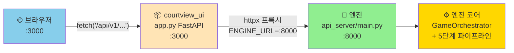
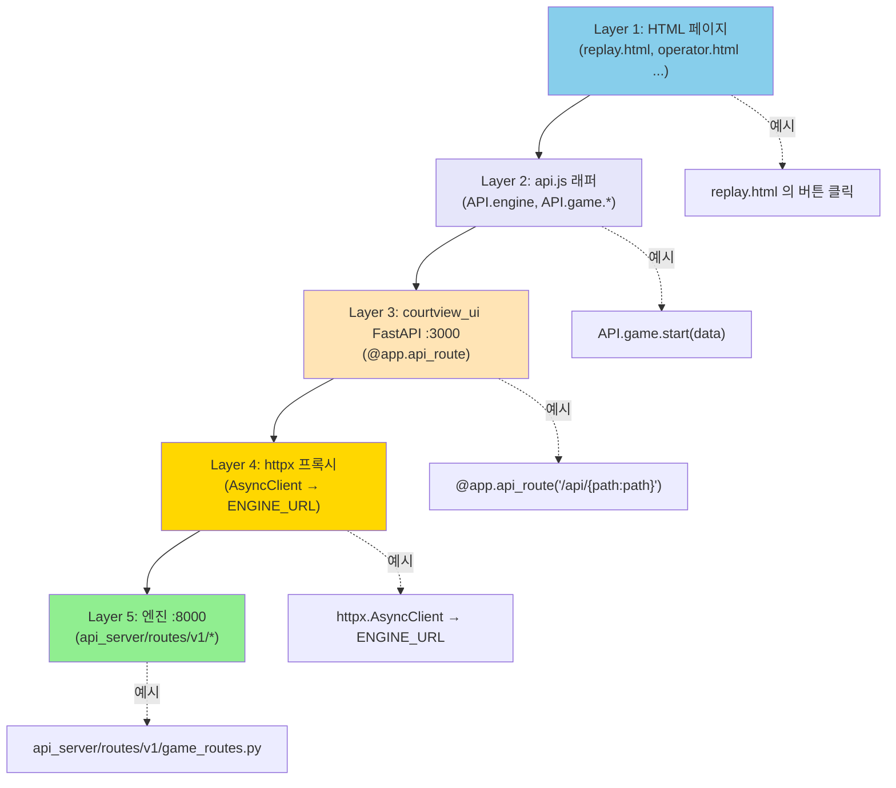
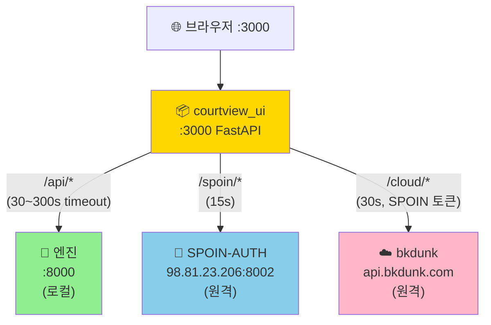
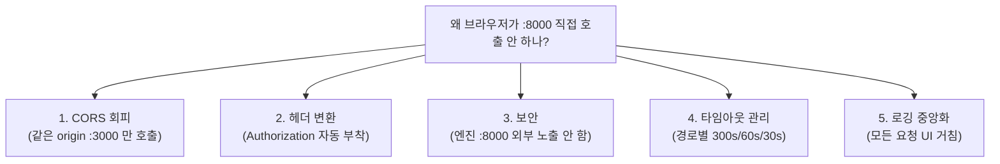
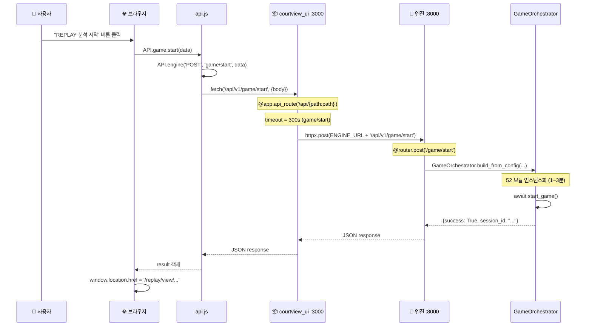
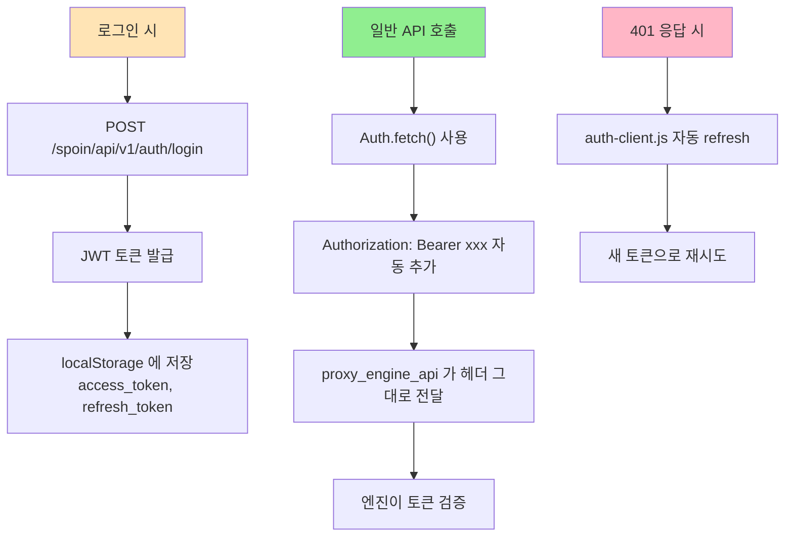
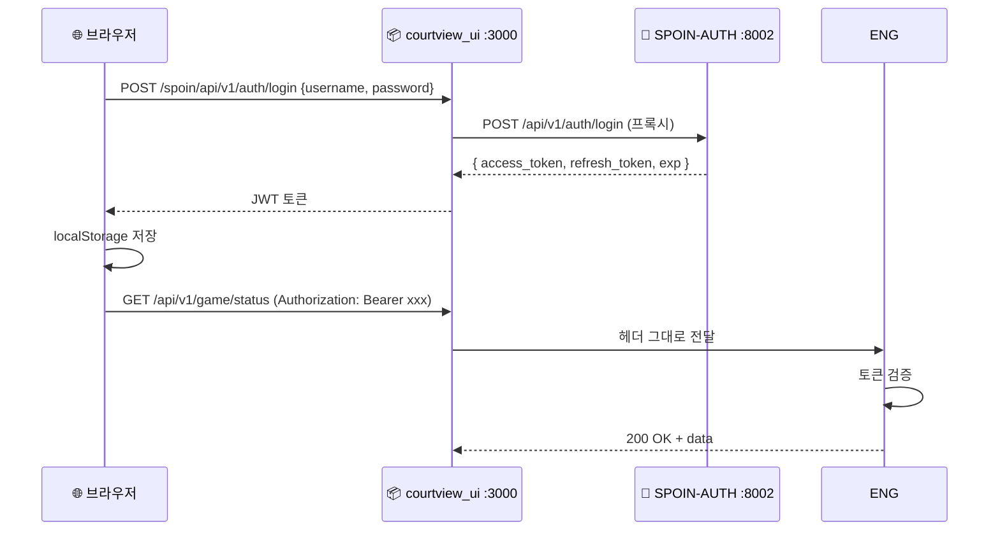

# 🔄 UI → 엔진 호출 흐름 완전 정리

> **브라우저에서 엔진까지의 5계층 호출 구조** + **3 종류 백엔드 프록시** + **WebSocket / 비디오 스트림 특수 경로**.
> 작성일: 2026-05-23 / 기준: [courtview_ui/app.py](../courtview_ui/app.py)
> 관련: [UI_INVENTORY.md](UI_INVENTORY.md), [DATA_FLOW_CONTRACT.md](project/architecture/DATA_FLOW_CONTRACT.md)

---

## 🎯 한 줄 요약

> **UI 페이지(브라우저) → `API.engine()` → courtview_ui FastAPI (`:3000`) → httpx 프록시 → 엔진 FastAPI (`:8000`) → 분석 모듈**



---

## 📚 목차

1. [5계층 호출 구조](#1-5계층-호출-구조)
2. [Layer 별 상세](#2-layer-별-상세)
3. [3종류 백엔드 프록시](#3-3종류-백엔드-프록시)
4. [왜 프록시를 거치나](#4-왜-프록시를-거치나)
5. [특수 경우 — 비디오 스트리밍](#5-비디오-스트리밍)
6. [WebSocket 실시간 통신](#6-websocket)
7. [전체 호출 예시 — 게임 시작](#7-호출-예시)
8. [인증 헤더 흐름](#8-인증)
9. [에러 처리 — 4가지 상태 코드](#9-에러-처리)
10. [한눈에 보는 정리](#10-요약)
11. [자주 묻는 질문](#11-faq)

---

## 1. 5계층 호출 구조 {#1-5계층-호출-구조}



---

## 2. Layer 별 상세 {#2-layer-별-상세}

### Layer 1: HTML 페이지에서 시작

[replay.html](../courtview_ui/templates/pages/replay.html) 같은 페이지가 사용자 액션에 반응:

```html
<!-- replay.html -->
<button onclick="startReplay()">REPLAY 분석 시작</button>

<script>
async function startReplay() {
    const data = {
        mode: 'replay',
        source_urls: { cam_0: '/path/to/video.mp4', ... },
        recording_enabled: false,
        rule_set: 'fiba',
    };
    const result = await API.game.start(data);    // ← Layer 2 호출
    if (result.success) {
        window.location.href = '/replay/view/' + result.session_id;
    }
}
</script>
```

### Layer 2: `api.js` 래퍼 (`API.engine()`)

[courtview_ui/static/js/api.js:6-21](../courtview_ui/static/js/api.js#L6):

```javascript
const API = {
    async engine(method, path, body = null) {
        const opts = {
            method,
            headers: { 'Content-Type': 'application/json' },
        };
        if (body) opts.body = JSON.stringify(body);

        try {
            const resp = await fetch(`/api/v1/${path}`, opts);
            return await resp.json();
        } catch (e) {
            return { success: false, message: e.message };
        }
    },

    // 편의 함수들
    game: {
        start: (data) => API.engine('POST', 'game/start', data),
        stop: () => API.engine('POST', 'game/stop'),
        pause: () => API.engine('POST', 'game/pause'),
        resume: () => API.engine('POST', 'game/resume'),
        status: () => API.engine('GET', 'game/status'),
    },
    camera: {
        discover: () => API.engine('GET', 'camera/discover'),
        health: () => API.engine('GET', 'camera/health'),
        // ...
    },
    recording: { start, stop, status, health },
    metrics: { gpu, system },
    referee: { decisions },
    tactical: { summary, boxscore },
};
```

**호출 시 발생하는 일**:
1. `API.game.start(data)` 호출
2. 내부적으로 `API.engine('POST', 'game/start', data)` 호출
3. 브라우저가 `fetch('/api/v1/game/start')` 발사
4. **같은 origin** 이라 `:3000` (courtview_ui) 으로 전달됨

### Layer 3: courtview_ui FastAPI 가 받음

[courtview_ui/app.py:317-318](../courtview_ui/app.py#L317):

```python
@app.api_route("/api/{path:path}", methods=["GET", "POST", "PUT", "DELETE"])
async def proxy_engine_api(request: Request, path: str):
    """엔진 API 프록시 — UI에서 /api/* 호출 시 엔진으로 전달"""
    # 모든 /api/* 호출을 잡음
```

**path** 에 들어오는 값 예시:
- `API.game.start()` → `path = "v1/game/start"`
- `API.camera.discover()` → `path = "v1/camera/discover"`
- `API.recording.status()` → `path = "v1/recording/status"`

### Layer 4: httpx 프록시 — 엔진으로 전달

[courtview_ui/app.py:322-338](../courtview_ui/app.py#L322):

```python
async def proxy_engine_api(request: Request, path: str):
    timeout = _timeout_for(path)    # 경로별 타임아웃 (30~300초)
    async with httpx.AsyncClient(timeout=timeout) as client:
        url = f"{ENGINE_URL}/api/{path}"    # ENGINE_URL = "http://localhost:8000"
        body = await request.body()

        # 헤더 그대로 전달 (Authorization 포함)
        headers = {
            k: v for k, v in request.headers.items()
            if k.lower() not in ("host", "content-length")
        }

        resp = await client.request(
            method=request.method,
            url=url,                # ← localhost:8000 으로 요청
            content=body,
            headers=headers,
            params=dict(request.query_params),
        )
        return JSONResponse(status_code=resp.status_code, content=resp.json())
```

**타임아웃 매핑** ([:298-314](../courtview_ui/app.py#L298)):

| 경로 | 타임아웃 | 이유 |
|---|---|---|
| `game/start`, `game/stop`, `finalize` | **300초** | GPU 모델 로딩 + postgame |
| `video/upload`, `recording/upload` | **300초** | 큰 파일 전송 |
| `recording/*` | 60초 | ffmpeg spawn |
| `camera/discover`, `ai-test`, `calibrate` | 60초 | 멀티 IP 탐색 |
| 기타 | 30초 | 기본 |

### Layer 5: 엔진 (`api_server`) 가 처리

엔진 측에서 같은 경로 받음:

```python
# api_server/routes/v1/game_routes.py
@router.post("/game/start")
async def start_game(request: StartGameRequest):
    """게임 시작 → GameOrchestrator 빌드 + 분석 시작"""
    orchestrator = GameOrchestrator.build_from_config(...)
    await orchestrator.start_game()
    return {"success": True, "session_id": "..."}
```

→ 엔진의 22개 라우트는 [DATA_FLOW_CONTRACT.md §11](project/architecture/DATA_FLOW_CONTRACT.md) 참조.

---

## 3. 3종류 백엔드 프록시 {#3-3종류-백엔드-프록시}

`courtview_ui/app.py` 는 **3가지 백엔드** 로 프록시:



### 각 프록시의 역할

| 경로 | 대상 | 타임아웃 | 용도 | api.js 함수 |
|---|---|---|---|---|
| `/api/*` | 엔진 :8000 (로컬) | 30~300s | 분석/카메라/녹화 | `API.engine()`, `API.game.*`, `API.camera.*` |
| `/spoin/*` | SPOIN-AUTH :8002 (원격) | 15s | 로그인/토큰 | `API.spoin()` |
| `/cloud/*` | bkdunk (원격) | 30s | 대회/팀 데이터 | `API.cloud()` |

### `/cloud/*` 의 특수 처리

cloud 프록시는 SPOIN 토큰을 자동으로 전달:
- UI 가 cloud API 호출 시 SPOIN-AUTH 에서 받은 JWT 를 Authorization 헤더로 첨부
- bkdunk 가 그 토큰으로 인증

### `/bkdunk-public/*` — 무인증 경로

[INTEGRATION_BKDUNK.md](INTEGRATION_BKDUNK.md) 명시:
- BKDUNK 대회 일정 API 는 **공개** (JWT 불필요)
- `database.html` 의 토너먼트 목록이 여기 사용

---

## 4. 왜 프록시를 거치나 {#4-왜-프록시를-거치나}



### 5가지 이유

1. **CORS 해결** — 브라우저가 :3000 만 호출 → 같은 origin, CORS preflight 없음
2. **보안** — 엔진은 localhost 만 바인딩 (외부 IP 노출 차단)
3. **인증 자동화** — UI 프록시가 Authorization 헤더 자동 부착
4. **타임아웃** — fetch 는 기본 타임아웃 없음. 프록시가 경로별 적용 (300s/60s/30s)
5. **로깅/모니터링** — 모든 요청이 한 곳 거침

---

## 5. 특수 경우 — 비디오 스트리밍 {#5-비디오-스트리밍}

JSON 프록시로 처리 못하는 **바이너리 비디오** 는 별도 라우트:

### 5.1 REPLAY 영상 ([:205-253](../courtview_ui/app.py#L205))

```python
@app.get("/api/v1/recording/sessions/{session_id}/video")
async def proxy_recording_video(session_id: str, request: Request):
    """REPLAY MP4 프록시 — Range 헤더 + 바이너리 스트림"""
    upstream = f"{ENGINE_URL}/api/v1/recording/sessions/{session_id}/video"

    # Range 헤더 전달 (비디오 시크 지원)
    if "range" in request.headers:
        fwd_headers["Range"] = request.headers["range"]

    client = httpx.AsyncClient(timeout=None)   # 영구 스트리밍
    resp = await client.send(req, stream=True)

    # 64KB 청크 단위로 스트리밍
    async def body_gen():
        async for chunk in resp.aiter_bytes(64 * 1024):
            yield chunk

    return StarletteStream(body_gen(), media_type="video/mp4")
```

### 5.2 카메라 라이브 스트림 ([:160-202](../courtview_ui/app.py#L160))

```python
@app.get("/api/v1/stream/{cam_id}")
async def proxy_camera_stream(cam_id: str):
    """MJPEG 스트림 프록시 — multipart/x-mixed-replace"""
    # 카메라 라이브 영상 중계
```

### 5.3 하이라이트 클립 ([:256-294](../courtview_ui/app.py#L256))

```python
@app.get("/clips/{path:path}")
async def proxy_clips(path: str, request: Request):
    """클립 MP4 프록시 — Range + 스트림"""
```

### 3종 비디오 정리

| 경로 | 형식 | 용도 |
|---|---|---|
| `/api/v1/recording/sessions/{id}/video` | MP4 + Range | REPLAY 분석 시 영상 재생 |
| `/api/v1/stream/{cam_id}` | MJPEG (multipart) | 카메라 라이브 |
| `/clips/{path}` | MP4 + Range | 하이라이트 클립 |

→ **JSON 프록시 (`/api/*`) 와 별개로 처리**. 바이너리 스트림 + Range 헤더 필요.

---

## 6. WebSocket 실시간 통신 {#6-websocket}

HTTP 프록시 외에 **WebSocket 도 프록시**:

```mermaid
flowchart LR
  BROWSER["🌐 브라우저"] -->|"new WebSocket('/ws/live')"| UI
  UI["📦 courtview_ui :3000"] -->|"WS 프록시"| ENG
  ENG["🔧 엔진 :8000<br/>/ws/live"] -.|frame/event/status| UI
  UI -.|중계.| BROWSER

  BROWSER2["🌐 다른 브라우저 탭"] -->|"/ws/ops"| UI2
  UI2["📦 courtview_ui<br/>/ws/ops (자체 처리)"]
  UI2 -.|페이지 간 동기화| BROWSER2

  style UI fill:#FFD700
  style UI2 fill:#FFD700
```

### WebSocket 2종

| 경로 | 용도 | 메시지 |
|---|---|---|
| `/ws/live` | UI ↔ 엔진 실시간 데이터 | `frame`, `event`, `status` |
| `/ws/ops` | UI 페이지 간 동기화 | `score_update`, `timeout_applied`, `quarter_end` 등 |

### `/ws/live` — 엔진 데이터 중계

courtview_ui 가 엔진의 `/ws/live` 에 연결 후, 브라우저로 메시지 중계.

JS 측 사용:
```javascript
// websocket.js — CourtViewWS 클래스
const cvWS = new CourtViewWS();
cvWS.on('frame', (data) => updateHUD(data));
cvWS.on('event', (data) => addEventToFeed(data));
cvWS.on('status', (data) => updateStatus(data));
```

### `/ws/ops` — UI 자체 동기화

3개 페이지가 동시에 떠 있을 때:
- `operator.html` (M3 콘솔)
- `game_analysis.html` (M1 분석)
- `scoreboard.html` (M2 전광판)

한 페이지에서 상태 변경 → 다른 페이지가 자동 반영:
```javascript
// ops.js
Ops.publish('score_update', { team: 'home', points: 2 });
// → 다른 페이지의 Ops.subscribe('score_update', ...) 가 받음
```

---

## 7. 전체 호출 예시 — 게임 시작 {#7-호출-예시}



### 단계별 시간

| 단계 | 소요 | 비고 |
|---|---|---|
| 브라우저 → UI (:3000) | <1ms | 같은 머신, localhost |
| UI → 엔진 (:8000) | <1ms | localhost |
| GameOrchestrator 빌드 | **1~3분** | 52 인스턴스 + TRT 빌드 |
| start_game | ~수 초 | 워커 스레드 시작 |
| 응답 회신 | <1ms | |
| **합계** | **1~3분** | 첫 실행 시 |

이후 실행은 TensorRT 캐시 hit → 수 초.

---

## 8. 인증 (Authorization 헤더) 흐름 {#8-인증}



### 헤더 전달 코드

[courtview_ui/app.py:326-329](../courtview_ui/app.py#L326) — 헤더 전달:
```python
headers = {
    k: v for k, v in request.headers.items()
    if k.lower() not in ("host", "content-length")
    # ↑ Authorization, Content-Type 등은 그대로 전달
}
```

### auth-client.js 의 401 처리

```javascript
// auth-client.js
async function authFetch(url, opts = {}) {
    opts.headers = {
        ...opts.headers,
        'Authorization': `Bearer ${getToken()}`,
    };

    let resp = await fetch(url, opts);

    if (resp.status === 401) {
        // 토큰 만료 → 자동 refresh
        await refreshAccessToken();
        // 새 토큰으로 재시도
        opts.headers['Authorization'] = `Bearer ${getToken()}`;
        resp = await fetch(url, opts);
    }

    return resp;
}
```

### 로그인 / 인증 흐름



---

## 9. 에러 처리 — 4가지 상태 코드 {#9-에러-처리}

[courtview_ui/app.py:340-364](../courtview_ui/app.py#L340):

```python
try:
    resp = await client.request(...)
    return JSONResponse(status_code=resp.status_code, content=resp.json())
except httpx.ConnectError:
    # 503 — 엔진이 안 떠 있음
    return JSONResponse(
        status_code=503,
        content={"success": False, "message": "엔진 서버 연결 실패 (localhost:8000)"},
    )
except httpx.ReadTimeout:
    # 504 — 엔진이 응답 안 함 (timeout 초과)
    return JSONResponse(
        status_code=504,
        content={
            "success": False,
            "message": f"엔진 응답 타임아웃 ({timeout:.0f}초). 첫 실행 시 모델 로딩으로 오래 걸릴 수 있습니다.",
        },
    )
except Exception:
    # 500 — 기타
    return JSONResponse(status_code=500, ...)
```

### 상태 코드별 의미

| 상태 | 의미 | 원인 |
|---|---|---|
| **2xx** | 엔진 응답 그대로 전달 | 정상 |
| **4xx** | 엔진의 4xx (예: 409 finalize 충돌) 그대로 보존 | 엔진이 거부 |
| **503** | UI 프록시 → 엔진 연결 실패 | 엔진 안 켜짐 |
| **504** | 엔진이 timeout 안에 응답 안 함 | 모델 로딩 / 멈춤 |
| **500** | 기타 프록시 오류 | 예외 |

### 사용자에게 보이는 메시지

| 상황 | 표시 메시지 |
|---|---|
| 엔진 안 켜짐 | "엔진 서버 연결 실패 (localhost:8000)" |
| 첫 실행 모델 로딩 | "엔진 응답 타임아웃 (300초). 첫 실행 시 모델 로딩으로 오래 걸릴 수 있습니다." |
| 토큰 만료 | (auth-client 자동 처리, 사용자 모름) |

---

## 10. 한눈에 보는 정리 {#10-요약}

### 📝 핵심 한 줄

```
브라우저 → api.js (API.engine) → fetch('/api/v1/...')
       → courtview_ui :3000 (FastAPI 프록시)
       → httpx.AsyncClient → ENGINE_URL :8000
       → 엔진 api_server (api_server/main.py)
       → GameOrchestrator + 분석 파이프라인
```

### 🎯 3가지 백엔드

| 경로 | 대상 | 용도 |
|---|---|---|
| `/api/*` | 엔진 (로컬:8000) | 분석 |
| `/spoin/*` | SPOIN-AUTH (원격:8002) | 인증 |
| `/cloud/*` | bkdunk (원격) | 클라우드 |

### ⚡ 특수 경로 (비-JSON)

| 경로 | 방식 |
|---|---|
| `/api/v1/stream/{cam_id}` | MJPEG (multipart/x-mixed-replace) |
| `/api/v1/recording/sessions/{id}/video` | MP4 + Range 헤더 |
| `/clips/{path}` | MP4 클립 |
| `/ws/live` | WebSocket (frame/event/status) |
| `/ws/ops` | WebSocket (UI 페이지 간) |

### 💡 왜 프록시?

```
1. CORS 해결 (같은 origin :3000 만)
2. 엔진 보안 (localhost 만 노출)
3. 헤더 자동 처리 (Authorization)
4. 경로별 타임아웃 (300s ~ 30s)
5. 로깅 중앙화
```

---

## 11. 자주 묻는 질문 {#11-faq}

### Q1. 왜 브라우저가 직접 :8000 안 호출?

**A**: 세 가지 이유.
1. **CORS** — 다른 origin (:3000 → :8000) 호출 시 CORS preflight 필요. 같은 origin 으로 통일.
2. **보안** — 엔진은 localhost 만 바인딩. 외부 IP 노출 안 함.
3. **타임아웃** — fetch 는 기본 타임아웃 없음. 프록시가 경로별 적용.

### Q2. `game/start` 가 왜 300초 타임아웃?

**A**: 첫 실행 시 **52개 모듈 인스턴스화** + **TensorRT 엔진 빌드** = 2~3분 소요.
[courtview_ui/app.py:302](../courtview_ui/app.py#L302):
```python
if 'game/start' in p or 'game/stop' in p or 'finalize' in p:
    return 300.0  # 5분
```

이후 실행은 TRT 캐시 hit → 수 초.

### Q3. WebSocket 도 프록시 거치나?

**A**: ✅ 예. `/ws/live` 는 UI 가 엔진 WebSocket 을 양방향 중계. `/ws/ops` 는 UI 자체 처리 (페이지 간 동기화용).

### Q4. 엔진이 죽으면?

**A**: 503 응답 반환. UI 가 "엔진 서버 연결 실패 (localhost:8000)" 메시지 표시.

### Q5. WebSocket 끊기면 자동 재연결?

**A**: ✅ `websocket.js` 의 `CourtViewWS` 클래스가 자동 재연결 (exponential backoff). 단, **Phase 4 의 BaseWebSocketManager** 로 통합 권장됨 ([UI_OPT_PHASE4](plans/ui-optimization/UI_OPT_PHASE4_MODULARIZATION.md)).

### Q6. JSON 응답이 아닌 비디오는?

**A**: 별도 라우트 3개:
- `/api/v1/recording/sessions/{id}/video` — REPLAY MP4
- `/api/v1/stream/{cam_id}` — 카메라 MJPEG
- `/clips/{path}` — 하이라이트 MP4

각각 Range 헤더 전달 + 64KB 청크 스트리밍.

### Q7. 멀티탭 시 토큰 충돌?

**A**: ⚠️ 현재 race condition 가능. [UI_OPT_PHASE3](plans/ui-optimization/UI_OPT_PHASE3_API_WEBSOCKET.md) 의 T1 작업 (storage 이벤트 동기화) 으로 해결 예정.

### Q8. `/cloud/*` 와 `/bkdunk-public/*` 차이?

**A**:
- `/cloud/*` — SPOIN 토큰 자동 첨부 (인증 필요한 cloud API)
- `/bkdunk-public/*` — 무인증 (BKDUNK 공개 API, 토너먼트 일정 등)

### Q9. 페이지 간 상태 공유는?

**A**:
- **같은 탭**: localStorage 키 (`cv_match`, `cv_db` 등)
- **다른 탭**: `/ws/ops` WebSocket (Ops.publish / subscribe)
- **storage 이벤트**: 다른 탭의 localStorage 변화 감지

### Q10. 백엔드 (`api_server`) 의 라우트는 어디서 볼 수 있나?

**A**: [DATA_FLOW_CONTRACT.md §11](project/architecture/DATA_FLOW_CONTRACT.md) — REST 22개 + WebSocket 2개 전체 목록.

---

## 12. 코드 위치 인덱스

| 항목 | 위치 |
|---|---|
| `API.engine()` 정의 | [api.js:6-21](../courtview_ui/static/js/api.js#L6) |
| `API.game.*`, `API.camera.*` 등 | [api.js:57-105](../courtview_ui/static/js/api.js#L57) |
| `proxy_engine_api()` | [app.py:317-364](../courtview_ui/app.py#L317) |
| `proxy_recording_video()` | [app.py:205-253](../courtview_ui/app.py#L205) |
| `proxy_camera_stream()` | [app.py:160-202](../courtview_ui/app.py#L160) |
| `proxy_clips()` | [app.py:256-294](../courtview_ui/app.py#L256) |
| `_timeout_for()` (경로별 타임아웃) | [app.py:298-314](../courtview_ui/app.py#L298) |
| ENGINE_URL 설정 | [app.py](../courtview_ui/app.py) (상단) |
| SPOIN-AUTH 프록시 | [app.py:367+](../courtview_ui/app.py#L367) |
| WebSocket 프록시 | [app.py:543-626](../courtview_ui/app.py#L543) |
| `auth-client.js` | [auth-client.js](../courtview_ui/static/js/auth-client.js) |
| `websocket.js` (CourtViewWS) | [websocket.js](../courtview_ui/static/js/websocket.js) |
| `ops.js` (Ops.publish/subscribe) | [ops.js](../courtview_ui/static/js/ops.js) |

---

## 📖 관련 문서

- [UI_INVENTORY.md](UI_INVENTORY.md) — UI 78 파일 인벤토리
- [DATA_FLOW_CONTRACT.md](project/architecture/DATA_FLOW_CONTRACT.md) §11 — REST + WS 라우트 전체
- [UI_OPT_PHASE3_API_WEBSOCKET.md](plans/ui-optimization/UI_OPT_PHASE3_API_WEBSOCKET.md) — API 최적화 (폴링 → WS)
- [INTEGRATION_BKDUNK.md](INTEGRATION_BKDUNK.md) — bkdunk 통합
- [INDEX.md](INDEX.md) — docs 전체 인덱스

---

**작성일**: 2026-05-23
**용도**: 다른 컴퓨터에서 API 작업 시작 시 첫 참조 문서
