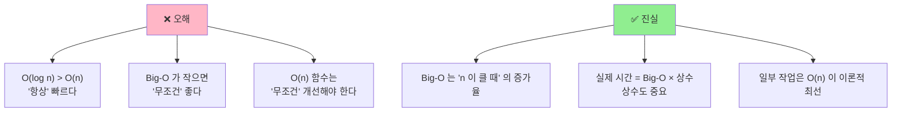
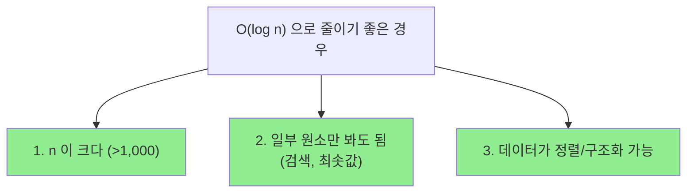
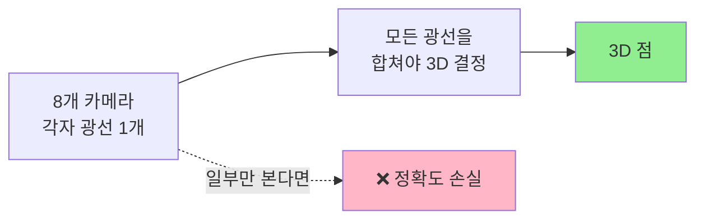
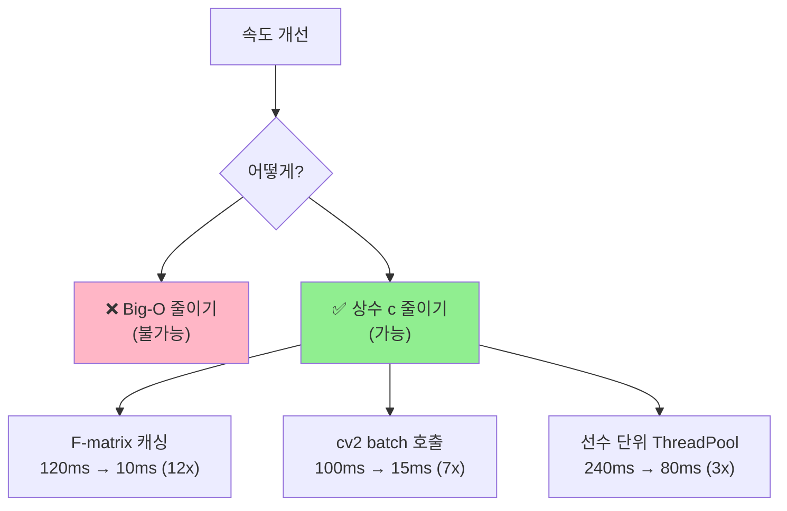
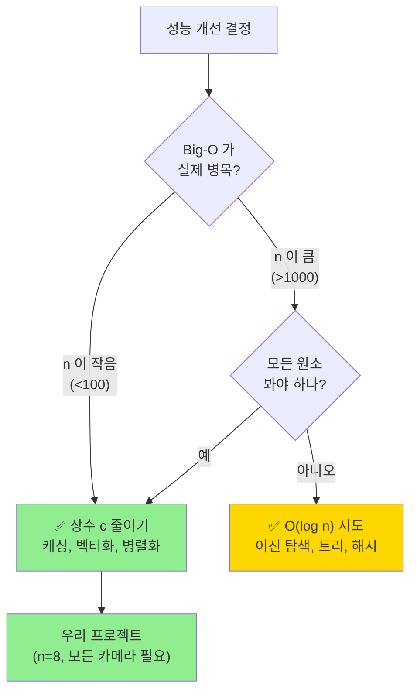

# 🧮 Big-O 와 최적화 결정 — 흔한 오해 정리

> **"O(log n) 이 항상 좋다" 는 일반화의 함정**
> 우리 프로젝트 사례로 보는 Big-O 의 진짜 의미.
> 작성일: 2026-05-22 / 관련: [TRIANGULATE_COST_BREAKDOWN.md](TRIANGULATE_COST_BREAKDOWN.md)

---

## 📚 목차

1. [흔한 오해](#1-흔한-오해)
2. [Big-O 의 진짜 의미](#2-진짜-의미)
3. [언제 O(log n) 변환이 의미 있나](#3-의미-있는-경우)
4. [우리 프로젝트가 O(log n) 못 가는 이유](#4-못-가는-이유)
5. [진짜 최적화 방향 — 상수 줄이기](#5-진짜-최적화)
6. [Big-O 차트 비교](#6-차트-비교)
7. [실제 측정 — 작은 n 에서는 역전](#7-역전-현상)
8. [우리 함수들 Big-O 카탈로그](#8-카탈로그)
9. [결정 트리](#9-결정-트리)
10. [한눈에 요약](#10-요약)

---

## 1. 흔한 오해 {#1-흔한-오해}



---

## 2. Big-O 의 진짜 의미 {#2-진짜-의미}

### 2.1 정의

```
T(n) = c × f(n) + b
       ↑   ↑      ↑
       |   |      └─ 상수 항 (호출 오버헤드, 초기화)
       |   └────── 증가율 함수 (n, log n, n² 등)
       └────────── 상수 계수 (한 단위 작업의 비용)

Big-O = f(n) 만 본다
```

### 2.2 Big-O 가 무시하는 것들

| 무시되는 것 | 예시 |
|---|---|
| 상수 계수 c | `5n` vs `0.1n` → 둘 다 O(n) |
| 작은 항 b | `n + 1000` → O(n) |
| 낮은 차수 | `n² + 100n` → O(n²) |

### 2.3 그래서 헷갈리는 사례

```python
# 함수 A: O(log n) 인데 상수 큼
def A(n):
    setup_complex_thing()        # 5ms 고정
    for _ in range(log_n_times): # log n 회
        cv2_call()                # 0.1ms 각

# 함수 B: O(n) 인데 상수 작음
def B(n):
    for _ in range(n):           # n 회
        x += 1                    # 0.001ms 각

# n = 8 일 때:
# A: 5 + 3 × 0.1 = 5.3ms
# B: 8 × 0.001  = 0.008ms       ← O(n) 인데 압도적!
```

→ **Big-O 만으로 빠르다/느리다 판단 불가능**.

---

## 3. 언제 O(log n) 변환이 의미 있나 {#3-의미-있는-경우}

### 3.1 ✅ 의미 있는 케이스



### 3.2 가능한 변환 패턴

| O(n) | O(log n) | 조건 |
|---|---|---|
| 선형 검색 | 이진 탐색 | **데이터가 정렬됨** |
| list 최솟값 반복 추출 | heapq | **구조 변경** |
| dict 순회 검색 | dict 해시 조회 | **사실 O(1)** |
| 트리 깊이 탐색 | 균형 트리 | **트리 자료구조** |

### 3.3 예시 — 정말 효과가 있는 케이스

```python
# 선수 5만 명에서 ID 조회

# ❌ O(n) — 5만 번 비교
def find_player_slow(players_list, target_id):
    for player in players_list:
        if player.id == target_id:
            return player

# ✅ O(1) — 1번 조회 (O(log n) 보다도 빠름)
def find_player_fast(players_dict, target_id):
    return players_dict.get(target_id)

# n = 50,000:
#   slow: ~5ms
#   fast: ~0.001ms   ← 5,000배!
```

→ **n 이 크고**, **일부만 봐도 되는** 작업에는 압도적.

---

## 4. 우리 프로젝트가 O(log n) 못 가는 이유 {#4-못-가는-이유}

### 4.1 `triangulate()` 의 본질



**삼각측량의 본질**:
- 각 카메라 = 독립적인 정보
- 더 많은 카메라 = 더 정확한 3D
- **일부만 보면 정보 손실**

### 4.2 3가지 이유

| # | 이유 | 설명 |
|---|---|---|
| 1️⃣ | **n 이 너무 작음** | n = 2~8. log₂(8) = 3. 5번 줄어들 뿐 |
| 2️⃣ | **모든 데이터 필요** | 삼각측량은 광선 합치기 |
| 3️⃣ | **알고리즘 부재** | "일부만 보고 3D 정확히 찾기" 알고리즘 없음 |

### 4.3 n=8 에서의 실제 차이

```
O(n)     = 8 연산
O(log n) = log₂(8) = 3 연산
차이     = 5 연산

cv2 호출 1번 = 0.12ms
→ 5 × 0.12ms = 0.6ms 차이

→ 거의 무의미한 차이!
```

---

## 5. 진짜 최적화 방향 — 상수 줄이기 {#5-진짜-최적화}

### 5.1 시간 = Big-O × 상수

```
T = O(n) × c

c 를 10배 줄이면?
→ 같은 O(n) 이지만 10배 빨라짐
```

### 5.2 우리 프로젝트의 상수 줄이는 방법



### 5.3 예상 효과

| 최적화 | Big-O | 상수 | 누적 fps |
|---|---|---|---|
| 현재 | O(P × n) | ~2.8ms/호출 | 1.15 |
| + F-matrix 캐싱 | O(P × n) | ~1.5ms/호출 | ~2.2 |
| + cv2 batch | O(P × n) | ~0.5ms/호출 | ~6 |
| + ThreadPool | O(P × n) | ~0.15ms/호출 | ~20 |

→ **Big-O 는 그대로**, 상수만 줄여서 **17배 가속**.

---

## 6. Big-O 차트 비교 {#6-차트-비교}

### 6.1 n 이 증가할 때

```
n = 10:
  O(1)     ▏        1
  O(log n) ▎        ~3
  O(n)     ▎        10
  O(n²)    ▆        100
  O(n³)    ▇▇       1,000

n = 100:
  O(1)     ▏        1
  O(log n) ▎        ~7
  O(n)     ▆        100
  O(n²)    ▇▇▇▇     10,000
  O(n³)    ▇▇▇▇▇▇▇  1,000,000

n = 10,000:
  O(1)     ▏        1
  O(log n) ▎        ~13
  O(n)     ▇        10,000
  O(n²)    ▇▇▇▇▇▇▇▇  100,000,000
  O(n³)    💥        10¹²
```

→ **n 이 클수록 Big-O 차이가 극명**.

### 6.2 우리 케이스 — n = 8

```
n = 8:
  O(1)     ▏  1
  O(log n) ▎  3
  O(n)     ▎  8       ← 우리
  O(n²)    ▆  64

차이가 미미!
```

---

## 7. 실제 측정 — 작은 n 에서는 역전 {#7-역전-현상}

### 7.1 단순한 알고리즘 vs 똑똑한 알고리즘

```python
# 시나리오: 8개 원소 정렬

# 방법 A: O(n²) — 버블 정렬
def bubble_sort(arr):
    n = len(arr)
    for i in range(n):
        for j in range(n - 1):
            if arr[j] > arr[j+1]:
                arr[j], arr[j+1] = arr[j+1], arr[j]

# 방법 B: O(n log n) — 퀵소트
def quick_sort(arr):
    if len(arr) <= 1:
        return arr
    pivot = arr[0]
    # ... 재귀 호출
```

**측정 결과** (n=8):
- 버블: ~5 μs (단순해서 캐시 친화적)
- 퀵소트: ~15 μs (재귀 호출 오버헤드)

→ **n=8 에서는 O(n²) 가 더 빠를 수도**.

### 7.2 Python `sorted()` 의 진실

Python 의 `sorted()` 는 **Timsort** 사용:
- n < 64 → **삽입 정렬** (O(n²) 인데 빠름)
- n ≥ 64 → **머지 정렬** (O(n log n))

→ Python 개발자도 "작은 n 에서는 더 단순한 O(n²) 가 빠르다" 는 걸 알고 있음.

---

## 8. 우리 함수들 Big-O 카탈로그 {#8-카탈로그}

### 8.1 Fusion 함수들

| 함수 | Big-O | n 의 의미 | 변환 가능? |
|---|---|---|---|
| `triangulate()` | O(n) | 카메라 수 | ❌ 불가능 |
| `_filter_epipolar_outliers()` | O(n) | 카메라 수 | ❌ 불가능 |
| `_dlt_triangulate()` | O(n) | 카메라 수 | ❌ 불가능 |
| `PoseFusion._fuse_person()` | O(K × n) | 17 × n | ❌ K 는 상수 |
| `PoseFusion.fuse()` | O(P × K × n) | 선수 × 키포인트 × 카메라 | ❌ 모두 필요 |
| `DetectionFusion.fuse()` | O(C × B) | 카메라 × bbox | ❌ |
| `TrackingFusion` IoU | O(T × P) | 트랙 × 선수 | ✅ 공간 분할로 가능 (n 작음) |

### 8.2 다른 작업들

| 함수 | Big-O | 변환 가능? |
|---|---|---|
| 카메라 ID 조회 (dict) | O(1) | 이미 최선 |
| 프레임 검색 (정렬 안 됨) | O(n) | ✅ sorted 후 O(log n) |
| 선수 통계 집계 | O(N) | ❌ 모든 이벤트 봐야 함 |

---

## 9. 결정 트리 {#9-결정-트리}



---

## 10. 한눈에 요약 {#10-요약}

### 📝 핵심 한 줄

```
Big-O 는 알고리즘 선택 도구이지, 절대 평가 기준이 아니다.
실제 시간 = Big-O × 상수 + 오버헤드
n 이 작을 때는 상수가 더 중요.
```

### 🎯 우리 프로젝트 결론

| 항목 | 답 |
|---|---|
| `triangulate()` Big-O | **O(n)** (이론적 최선) |
| O(log n) 변환 가능? | **❌ 불가능** |
| 그럼 어떻게 빠르게? | **상수 c 줄이기** (캐싱, 벡터화, 병렬화) |
| 예상 효과 | **17배 가속** (1.15 → 20 fps) |

### 💡 기억할 3가지

1. **Big-O 는 "n 이 클 때" 의 증가율** — 작은 n 에서는 상수가 더 중요
2. **모든 데이터를 봐야 하는 작업은 O(n) 이 최선** — 변환 시도 무의미
3. **진짜 최적화는 "덜 똑똑한 알고리즘 + 작은 상수"** — 캐싱이 가장 강력

### 🧭 비유로 정리

> 8명을 점검해야 하는 일을 "1명만 점검" 으로 바꿀 순 없다 (O(log n) 불가능).
> 대신 "1명 점검 시간을 10배 단축" 할 수는 있다 (상수 줄이기).
> 우리 최적화는 후자.

---

## 11. 자주 묻는 질문

### Q1. 그럼 Big-O 공부할 필요 없나?

**A**: 아니요, **여전히 매우 중요**합니다.
- 알고리즘 선택의 기본 도구
- n 이 클 때 (DB 쿼리, 검색, 정렬) 결정적
- 단, **만능 척도가 아님** 을 이해해야 함

### Q2. n 이 작은데도 굳이 O(log n) 으로 가면?

**A**: 보통 **손해**. 이유:
- 알고리즘 자체가 복잡해 상수가 큼
- 코드 가독성 떨어짐
- 디버깅 어려움

### Q3. 캐싱이 Big-O 를 바꾸나?

**A**: ⚠️ **경우에 따라**:
- 한 호출의 Big-O 는 그대로
- 단, 반복 호출 시 amortized 비용은 낮아짐
- 진짜 효과는 **상수 c 절감**

### Q4. 병렬화는 Big-O 를 바꾸나?

**A**: ❌ **아니요**.
- 8 스레드 = c 가 1/8 되는 것
- Big-O 는 그대로 O(n)
- 단, 실제 시간은 1/8

---

## 📖 관련 문서

| 주제 | 문서 |
|---|---|
| Triangulate 비용 상세 | [TRIANGULATE_COST_BREAKDOWN.md](TRIANGULATE_COST_BREAKDOWN.md) |
| Fusion 병목 분석 | [FUSION_BOTTLENECK_ANALYSIS.md](FUSION_BOTTLENECK_ANALYSIS.md) |
| 최적화 실행 가이드 | [PIPELINE_SPEEDUP_GUIDE.md](PIPELINE_SPEEDUP_GUIDE.md) |
