# 📐 에피폴라 기하학 (Epipolar Geometry) 완전 정복

> **두 카메라가 같은 점을 봤을 때, 그 점이 어떤 선 위에 있어야 하는가?**
> 처음 보는 사람도 이해할 수 있게 그림과 비유로 풀어 쓴 가이드.
> 작성일: 2026-05-22 / 기준: [coordinate_transformer.py](../infrastructure/multi_camera/coordinate_transformer.py)

---

## 📚 목차

1. [한 줄 요약](#1-한-줄-요약)
2. [직관 — 그림자 비유](#2-그림자-비유)
3. [3가지 핵심 개념](#3-핵심-개념)
4. [F-matrix 가 하는 일](#4-f-matrix)
5. [우리 코드에서 어떻게 쓰이나](#5-우리-코드)
6. [`_filter_epipolar_outliers` 분석](#6-필터)
7. [`_fundamental_from_projections` 분석](#7-f-계산)
8. [`_epipolar_distance` 분석](#8-거리)
9. [무엇을 거르나 — 실전 예시](#9-실전-예시)
10. [성능 — 왜 이게 무거운가](#10-성능)
11. [요약](#11-요약)

---

## 1. 한 줄 요약 {#1-한-줄-요약}

> **"카메라 A 에서 본 한 점이, 카메라 B 에서는 반드시 어떤 선 위에 있어야 한다"**
> 이 선을 **에피폴라 선** 이라 부르고, 이 규칙으로 잘못 매칭된 점을 거른다.

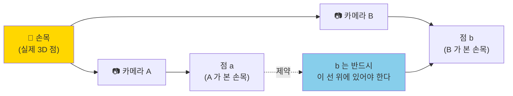

---

## 2. 직관 — 그림자 비유 {#2-그림자-비유}

### 2.1 손가락과 두 개의 손전등

방을 어둡게 하고 **벽에 손가락 그림자**를 만든다고 상상해보세요:

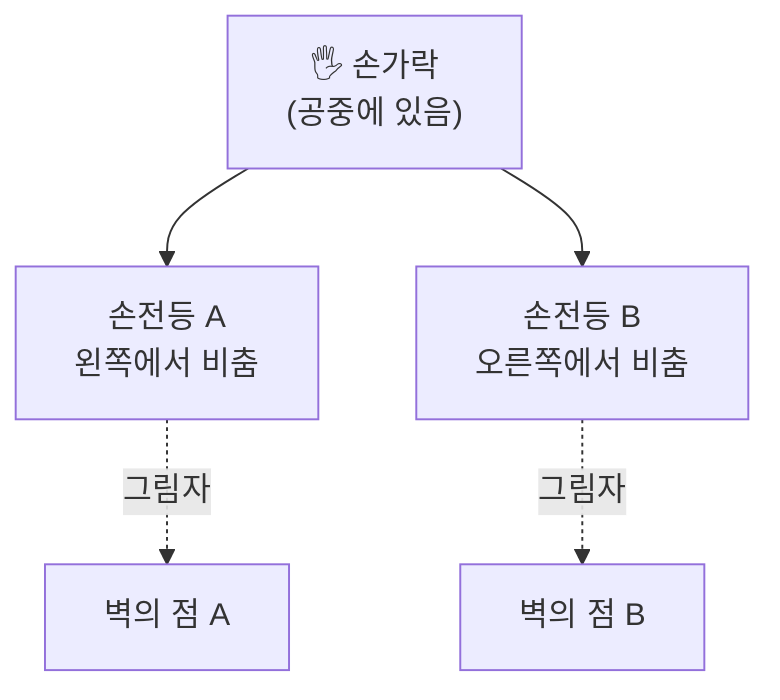

### 2.2 손전등 A 를 끄고, 손가락을 움직이면?

손가락을 **앞뒤로** 움직여보세요. 그림자 B 는 어떻게 움직일까요?

```
손전등 B 에서 본 그림자 B 의 궤적:
  → 어떤 "선" 을 따라 움직임
  → 이게 바로 "에피폴라 선"
```

### 2.3 핵심 통찰

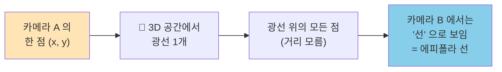

→ **A 가 본 한 점은 B 에서 선 하나로 펼쳐진다**. 이 선이 에피폴라 선.

---

## 3. 3가지 핵심 개념 {#3-핵심-개념}

### 3.1 에피폴라 선 (Epipolar Line)


**수학적으로**: `l' = F · a` (F-matrix 와 점의 곱)

### 3.2 에피폴 (Epipole)

**한 카메라의 중심이 다른 카메라에 어떻게 보이나?**

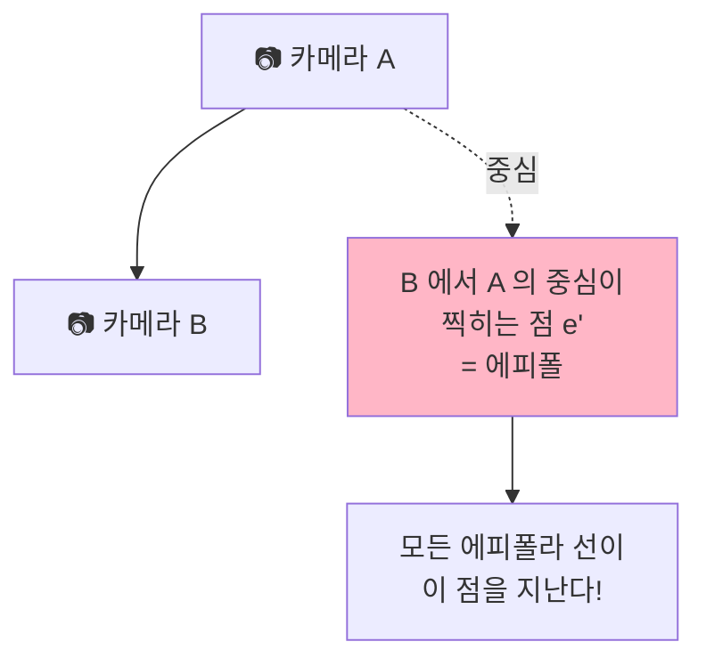

**중요한 성질**:
- 카메라 A 가 보는 모든 3D 점에 대해
- 그 점을 B 가 보면 → **반드시 e' 를 지나는 선** 위에 있음
- → 에피폴은 "모든 에피폴라 선의 교점"

### 3.3 F-matrix (Fundamental Matrix)

**두 카메라 사이의 관계를 담은 3×3 행렬**:

```
F · pt₁ = 에피폴라 선 (pt₂ 가 있을 곳)

규칙: 만약 두 점이 같은 3D 점이라면
     pt₂ᵀ · F · pt₁ = 0  (에피폴라 제약)
```

**시각적 의미**:


---

## 4. F-matrix 가 하는 일 {#4-f-matrix}

### 4.1 두 점이 같은 3D 점인지 검증

```python
# 두 카메라의 점이 같은 3D 점이라면:
# pt2ᵀ · F · pt1 ≈ 0

# 만약 다른 3D 점이라면:
# pt2ᵀ · F · pt1 = 큰 값  ← 이상치!
```

### 4.2 우리 프로젝트에서의 활용

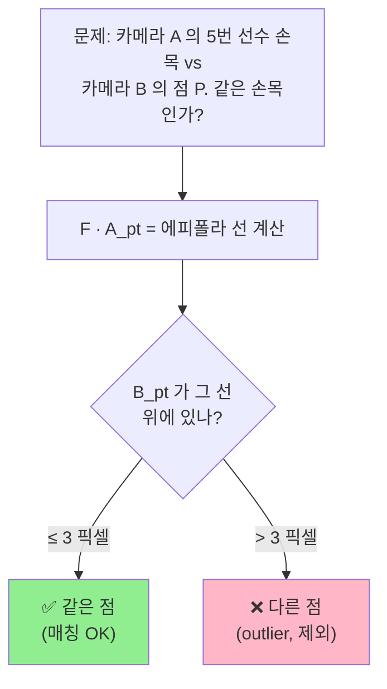

---

## 5. 우리 코드에서 어떻게 쓰이나 {#5-우리-코드}

### 5.1 호출 흐름

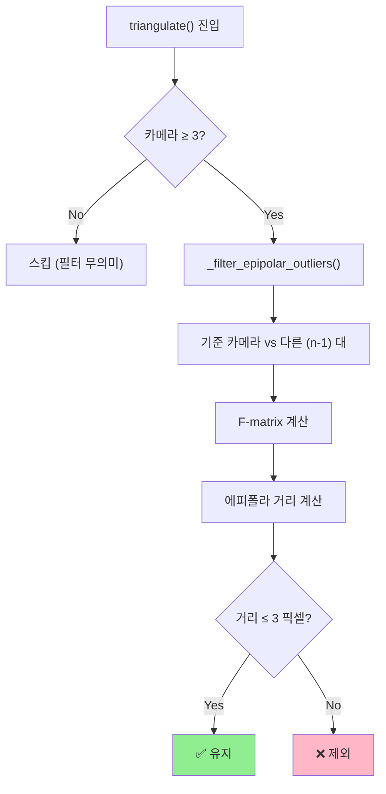

### 5.2 카메라 4대 예시

```
카메라 4대가 같은 선수의 손목을 봤다고 주장:
  - cam0: (1240, 540)
  - cam1: (980, 612)
  - cam2: (1450, 488)
  - cam3: (200, 300)   ← 이상함!

에피폴라 필터 작동:
  1. cam0 을 기준으로 선택
  2. cam0 - cam1: F·a 가 cam1 점 근처 → ✅ (거리 1.2 px)
  3. cam0 - cam2: F·a 가 cam2 점 근처 → ✅ (거리 0.8 px)
  4. cam0 - cam3: F·a 가 cam3 점 멀음 → ❌ (거리 47 px, outlier!)

결과: [cam0, cam1, cam2] 만 삼각측량에 사용
```

→ **cam3 는 다른 선수의 손목을 잘못 매칭했을 가능성**.

---

## 6. `_filter_epipolar_outliers()` 분석 {#6-필터}

### 6.1 전체 코드

[coordinate_transformer.py:537-580](../infrastructure/multi_camera/coordinate_transformer.py#L537):

```python
def _filter_epipolar_outliers(
    self,
    cameras: list[tuple[CoordinateTransformer, NDArray[np.float64]]],
) -> list[tuple[CoordinateTransformer, NDArray[np.float64]]]:
    """에피폴라 제약으로 이상치 관측 필터링."""
    if len(cameras) < 3:
        return cameras                          # ① 3대 미만이면 필터 무의미

    # 기준 뷰: 첫 번째 카메라
    ref_transformer, ref_pixel = cameras[0]    # ② 기준 = 임의로 첫 번째
    ref_P = ref_transformer.projection_matrix

    filtered = [cameras[0]]                     # ③ 기준은 무조건 유지

    for i in range(1, len(cameras)):           # ④ 나머지 카메라 (n-1대)
        other_transformer, other_pixel = cameras[i]
        other_P = other_transformer.projection_matrix

        F = self._fundamental_from_projections(ref_P, other_P)  # ⑤ F 계산
        distance = self._epipolar_distance(F, ref_pixel, other_pixel)  # ⑥ 거리

        if distance <= self._epipolar_threshold:  # ⑦ 3px 이내?
            filtered.append(cameras[i])           #    유지
        # else: 자동 제외

    return filtered
```

### 6.2 단계별 설명

| # | 단계 | 의미 |
|---|---|---|
| ① | `len < 3 → return` | 2대로는 outlier 판정 불가 |
| ② | `cameras[0]` 기준 | **임의 선택** (신뢰도 안 봄) |
| ③ | 기준은 무조건 유지 | 기준이 잘못이면 다른 게 다 outlier 됨 |
| ④ | 나머지 (n-1) 대 순회 | **n-1 회 비교** (n choose 2 아님!) |
| ⑤ | F 계산 | 두 카메라 기하학 관계 |
| ⑥ | 거리 측정 | 에피폴라 선과의 거리 |
| ⑦ | 3px 임계 | [DEFAULT_EPIPOLAR_THRESHOLD = 3.0](../infrastructure/multi_camera/coordinate_transformer.py#L62) |

### 6.3 ⚠️ 잠재 약점

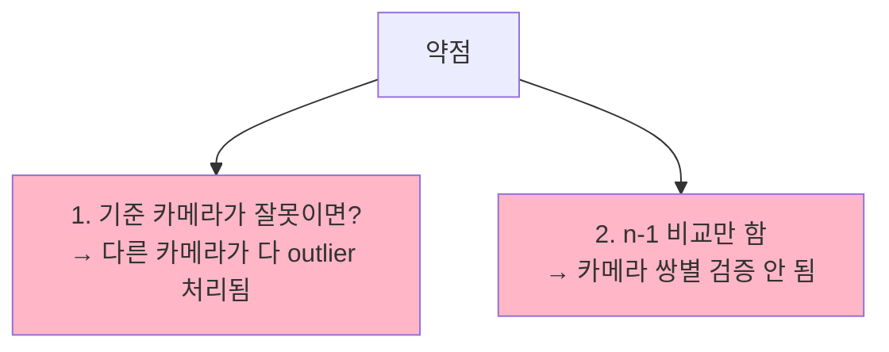

**개선 가능성**:
- 신뢰도 가장 높은 카메라를 기준으로
- 또는 모든 (n choose 2) 쌍 확인 후 voting

---

## 7. `_fundamental_from_projections()` 분석 {#7-f-계산}

### 7.1 전체 코드

[coordinate_transformer.py:582-627](../infrastructure/multi_camera/coordinate_transformer.py#L582):

```python
@staticmethod
def _fundamental_from_projections(
    P1: NDArray[np.float64],
    P2: NDArray[np.float64],
) -> NDArray[np.float64]:
    """두 투영 행렬로부터 기본 행렬 F 계산."""

    # ① P1 의 null space → 카메라 1 중심 C1
    _, _, Vt = np.linalg.svd(P1)
    C1 = Vt[-1]  # (4,) — 동차 좌표

    # ② 에피폴 e' = P2 · C1
    e_prime = P2 @ C1
    e_prime = e_prime / (np.linalg.norm(e_prime) + _EPSILON)

    # ③ [e']× (skew-symmetric)
    ex = np.array([
        [0.0, -e_prime[2], e_prime[1]],
        [e_prime[2], 0.0, -e_prime[0]],
        [-e_prime[1], e_prime[0], 0.0],
    ], dtype=np.float64)

    # ④ P1 의 pseudo-inverse
    P1_pinv = np.linalg.pinv(P1)

    # ⑤ F = [e']× · P2 · P1⁺
    F = ex @ P2 @ P1_pinv

    # ⑥ 정규화
    norm = np.linalg.norm(F)
    if norm > _EPSILON:
        F = F / norm

    return F
```

### 7.2 수학 풀이 (직관)

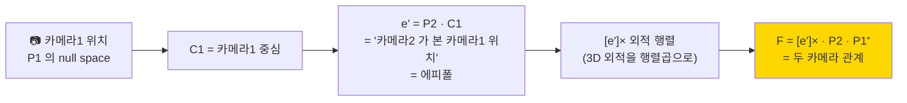

### 7.3 수학 용어 설명

| 용어 | 의미 |
|---|---|
| **null space** | `Ax = 0` 을 만족하는 x 들의 공간. 카메라 중심은 P 의 null space |
| **SVD** | 행렬을 분해하는 도구. null space 추출용 |
| **skew-symmetric `[e']×`** | 외적 `a × b` 를 `[a]× · b` 로 바꾸는 행렬 |
| **pseudo-inverse `P1⁺`** | 정사각형 아닌 행렬의 "역행렬 비슷한 것" |

### 7.4 공식 출처

**Hartley & Zisserman, Multiple View Geometry, Result 9.1**

```
F = [P2 · C1]× · P2 · P1⁺
  = [e']× · P2 · P1⁺
```

→ 두 projection matrix 만 알면 F 가 결정됨. 카메라 캘리브레이션 정보만으로 가능.

---

## 8. `_epipolar_distance()` 분석 {#8-거리}

### 8.1 전체 코드

[coordinate_transformer.py:629-660](../infrastructure/multi_camera/coordinate_transformer.py#L629):

```python
@staticmethod
def _epipolar_distance(
    F: NDArray[np.float64],
    pt1: NDArray[np.float64],
    pt2: NDArray[np.float64],
) -> float:
    """양방향 에피폴라 거리 계산."""

    # 동차 좌표로 변환
    pt1_h = np.array([pt1[0], pt1[1], 1.0])
    pt2_h = np.array([pt2[0], pt2[1], 1.0])

    # ① 순방향: l' = F · pt1 (카메라2 에서의 에피폴라 선)
    line_fwd = F @ pt1_h
    denom_fwd = np.sqrt(line_fwd[0]**2 + line_fwd[1]**2)
    dist_fwd = abs(pt2_h @ line_fwd) / max(denom_fwd, _EPSILON)

    # ② 역방향: l = F^T · pt2 (카메라1 에서의 에피폴라 선)
    line_bwd = F.T @ pt2_h
    denom_bwd = np.sqrt(line_bwd[0]**2 + line_bwd[1]**2)
    dist_bwd = abs(pt1_h @ line_bwd) / max(denom_bwd, _EPSILON)

    # ③ 양방향 평균
    return float((dist_fwd + dist_bwd) / 2.0)
```

### 8.2 점-선 거리 공식

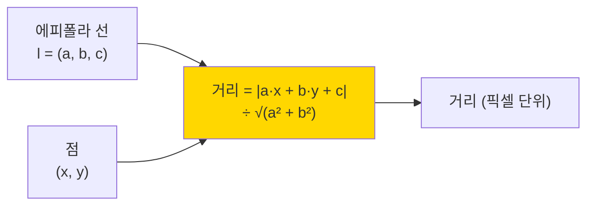

**왜 양방향?**:
- 순방향: A 의 점이 B 에서 만든 선과 B 의 점의 거리
- 역방향: B 의 점이 A 에서 만든 선과 A 의 점의 거리
- 평균 → **더 robust** (한쪽 에러를 다른쪽이 보완)

### 8.3 Sampson distance 와 비교

```
이 코드:  단순 양방향 평균 (점-선 거리)
Sampson: 더 복잡한 1차 근사 (정확하지만 무거움)
```

→ 단순 양방향이 **속도와 정확도 균형**.

---

## 9. 무엇을 거르나 — 실전 예시 {#9-실전-예시}

### 9.1 시나리오 — 농구 경기

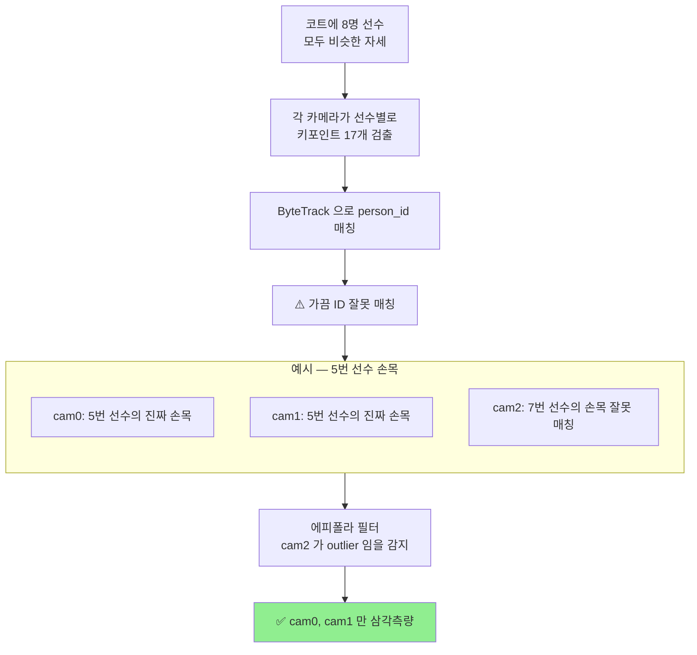

### 9.2 outlier 발생 원인

| 원인 | 설명 | 예시 |
|---|---|---|
| **ID 스위치** | ByteTrack 이 두 선수를 헷갈림 | 비슷한 유니폼, 가까이 있을 때 |
| **가림 (occlusion)** | 한 선수가 다른 선수에 가려짐 | 스크린, 박스 아웃 |
| **검출 오류** | YOLO 가 잘못된 위치를 키포인트로 검출 | 관중석을 손목으로 |
| **캘리브레이션 오차** | 카메라 위치 미세 어긋남 | 진동, 충격 |

### 9.3 임계값 3.0 픽셀의 의미

```
1920 × 1080 영상 기준:
  3 픽셀 = 0.16% 의 위치 오차
  → 매우 엄격한 임계값

만약 임계값을 키우면 (예: 10픽셀):
  ✅ outlier 덜 거름 → 더 많은 카메라 사용
  ❌ 부정확한 매칭도 통과 → 3D 정확도 ↓

너무 작게 하면 (예: 1픽셀):
  ✅ 정밀 매칭만 통과 → 정확도 ↑
  ❌ 너무 많이 거름 → 카메라 부족 → 삼각측량 실패
```

→ **3.0 픽셀은 정확도와 안정성의 균형점**.

---

## 10. 성능 — 왜 이게 무거운가 {#10-성능}

### 10.1 한 호출 비용

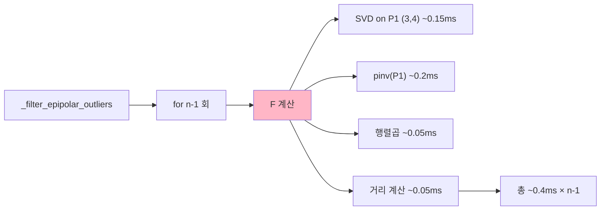

**카메라 4대 (n-1=3 회) 기준**:
- F 계산 × 3 = ~1.2ms
- 거리 × 3 = ~0.15ms
- **합계 ~1.4ms / 호출**

### 10.2 누적 — PoseFusion 85회 × 1.4ms ≈ 120ms

→ 전체 PoseFusion 520ms 중 **23% 가 에피폴라 필터**.

### 10.3 ⚡ 최적화 여지 — F-matrix 캐싱

**핵심 통찰**:
- F-matrix 는 **카메라 쌍 (i, j) 의 기하학적 관계**
- 카메라가 움직이지 않으면 → **매 frame 같은 F**
- 매번 다시 계산할 필요 없음!

```python
# 현재 코드 (매번 계산)
F = self._fundamental_from_projections(ref_P, other_P)

# 개선 (한 번만 계산, 캐싱)
F = self._F_cache.get((ref_id, other_id))
if F is None:
    F = self._fundamental_from_projections(ref_P, other_P)
    self._F_cache[(ref_id, other_id)] = F
```

**효과**:
- 8 카메라 = 28 쌍만 한 번 계산
- 매 frame 재사용 → ~120ms → ~5ms
- **24배 가속**

→ [TRIANGULATE_COST_BREAKDOWN.md](TRIANGULATE_COST_BREAKDOWN.md) §10.2 의 최우선 최적화.

---

## 11. 요약 {#11-요약}

### 📝 핵심 한 줄

```
에피폴라 기하학 = "두 카메라가 본 같은 점은 특정 선 위에 있어야 한다"
              = 잘못 매칭된 점을 거르는 필터
              = F-matrix 라는 3x3 행렬로 표현
```

### 🎯 우리 프로젝트에서

| 항목 | 답 |
|---|---|
| **언제 발동?** | 3 카메라 이상일 때만 |
| **무엇을 거름?** | 다른 선수와 헷갈린 점, ID 스위치 |
| **임계값** | 3.0 픽셀 |
| **호출 비용** | 한 번 ~1.4ms, 누적 ~120ms |
| **최적화 여지** | F-matrix 캐싱 → 24배 가속 가능 |

### 💡 비유로 정리

> **에피폴라 선** = "그림자가 따라가는 선"
> **에피폴** = "다른 손전등이 비추는 점"
> **F-matrix** = "두 손전등 사이의 관계 카드"
> **에피폴라 필터** = "그림자가 선 위에 없으면 같은 손가락 아님"

### 🧭 학습 순서


---

## 12. 자주 묻는 질문

### Q1. 왜 카메라 2대일 때는 에피폴라 필터 안 쓰나?

**A**: 2대로는 outlier 판정이 불가능.
- A vs B 만 있으면 둘 중 누가 틀렸는지 모름
- 3대 이상이어야 다수결로 판단 가능

### Q2. F-matrix 와 Essential matrix 의 차이는?

**A**:
- **F-matrix**: 픽셀 좌표 사용 (캘리브레이션 정보 포함)
- **E-matrix**: 정규화 좌표 사용 (intrinsic 제거됨)
- 관계: `F = K2⁻ᵀ · E · K1⁻¹`

우리 코드는 **F-matrix 사용** (픽셀 그대로).

### Q3. 카메라가 움직이면 F 가 바뀌나?

**A**: ✅ 예. F 는 두 카메라의 **상대적 위치/회전**에 의해 결정.
- 농구 코트 8 카메라는 **고정** → F 가 안 바뀜
- 그래서 **캐싱이 효과적**

### Q4. 임계값 3 픽셀이 너무 엄격하지 않나?

**A**: 1920×1080 영상에서 3px = 0.16%. 농구 분석 정확도에 충분히 엄격하지만:
- 조명/그림자 변화 시 outlier 처리 가능성
- 캘리브레이션 정확도 < 3px 이어야 의미 있음

### Q5. SVD 두 번 (P1 의 null space + pinv) 안 줄일 수 없나?

**A**: ✅ 가능. `pinv` 자체가 SVD 사용 → 한 번의 SVD 로 둘 다 추출 가능.
- 현재 코드는 명확성 우선
- 캐싱하면 어차피 한 번만 계산되니 큰 문제 아님

### Q6. 기준 카메라 (cameras[0]) 가 잘못이면?

**A**: ⚠️ 위험. 다른 모든 카메라가 outlier 처리됨.
- 개선안: 신뢰도 가장 높은 카메라를 기준으로
- 또는 RANSAC 방식으로 voting

---

## 📖 관련 문서

| 주제 | 문서 |
|---|---|
| Triangulate 비용 분석 | [TRIANGULATE_COST_BREAKDOWN.md](TRIANGULATE_COST_BREAKDOWN.md) |
| PoseFusion 입문 | [POSE_FUSION_EXPLAINED.md](POSE_FUSION_EXPLAINED.md) |
| Big-O 결정 | [BIG_O_DECISIONS.md](BIG_O_DECISIONS.md) |
| Fusion 병목 분석 | [FUSION_BOTTLENECK_ANALYSIS.md](FUSION_BOTTLENECK_ANALYSIS.md) |

---

## 🗺️ 코드 위치 인덱스

| 항목 | 파일:라인 |
|---|---|
| `_filter_epipolar_outliers()` | [coordinate_transformer.py:537-580](../infrastructure/multi_camera/coordinate_transformer.py#L537) |
| `_fundamental_from_projections()` | [:582-627](../infrastructure/multi_camera/coordinate_transformer.py#L582) |
| `_epipolar_distance()` | [:629-660](../infrastructure/multi_camera/coordinate_transformer.py#L629) |
| `DEFAULT_EPIPOLAR_THRESHOLD = 3.0` | [:62](../infrastructure/multi_camera/coordinate_transformer.py#L62) |
| threshold 초기화 | [:364-368](../infrastructure/multi_camera/coordinate_transformer.py#L364) |
