# 🎯 PoseFusion 완전 정복

> **8대 카메라가 본 2D 포즈를 → 진짜 3D 좌표로 합치는 마법**
> 처음 보는 사람도 이해할 수 있게, 그림과 비유 위주로 풀어 쓴 가이드.
> 작성일: 2026-05-22 / 기준: [engine/pipeline/fusion/pose_fusion.py](../engine/pipeline/fusion/pose_fusion.py)

---

## 📚 목차

1. [한 줄 요약](#1-한-줄-요약)
2. [왜 필요한가 — 직관적 이해](#2-왜-필요한가)
3. [무엇이 들어와서 무엇이 나가나](#3-입력과-출력)
4. [어떻게 작동하나 — 4단계 과정](#4-처리-흐름)
5. [핵심 알고리즘: 삼각측량](#5-삼각측량)
6. [신뢰도와 안전망](#6-신뢰도)
7. [성능 — 왜 느린가](#7-성능)
8. [한계와 주의사항](#8-한계)
9. [다음 단계와의 연결](#9-다음-단계)
10. [한눈에 보는 요약](#10-요약)

---

## 1. 한 줄 요약 {#1-한-줄-요약}

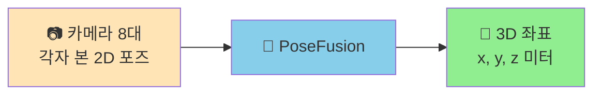

> **"여러 각도에서 같은 점을 보면, 그 점이 공간 어디에 있는지 계산할 수 있다"**
> — 이게 PoseFusion 이 하는 일의 전부.

---

## 2. 왜 필요한가 — 직관적 이해 {#2-왜-필요한가}

### 🤔 카메라 한 대로는 왜 안 되나?

사진 한 장만 보면 **공이 가까이 있는지 멀리 있는지 모릅니다**. 손가락을 눈 앞에 대고 한쪽 눈을 감아보면, 손가락이 어디 있는지 정확히 모르겠죠?

```
      📷 카메라 A
       ↓
       👁️ 화면에서는 손목이 (1240, 540) 픽셀
       ❓ 그런데 손목이 카메라에서 1m 떨어진 건지, 5m 떨어진 건지?
       → 모름! (2D 이미지에는 깊이 정보가 없음)
```

### 💡 두 대 이상이면 풀린다 — 인간의 양안시 원리

```
       👁️👁️ 두 눈으로 보면 깊이가 보인다 = 양안시(stereopsis)
            ↓
       두 눈의 시점 차이로 뇌가 거리를 계산
```

**컴퓨터 비전도 똑같습니다**:

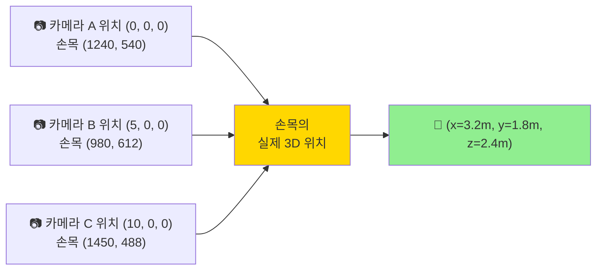

각 카메라에서 손목을 향해 **광선(ray)** 을 쏘면, 그 광선들이 공간에서 **한 점에서 만납니다**. 그 만나는 점이 바로 손목의 3D 위치.

### 🏀 농구 분석에서 왜 3D 가 필수인가

| 분석 항목 | 2D 만으로 가능? | 3D 가 필요한 이유 |
|---|---|---|
| 슈팅 릴리스 높이 | ❌ | **z 좌표** — 점프슛 vs 일반슛 구분 |
| 골대까지 거리 | ❌ | **x, y** 좌표 — 슈팅 어드밴티지 평가 |
| 두 선수의 거리 | ❌ | 3D 거리 — 스크린/핸드오프 분석 |
| 트래블링 판정 | ❌ | 발 위치 3D 추적 — 피벗 발 식별 |
| 슈팅 폼 분석 | ❌ | 팔꿈치 각도 3D — 정확한 폼 평가 |

→ **PoseFusion 없이는 농구 분석이 불가능**.

---

## 3. 무엇이 들어와서 무엇이 나가나 {#3-입력과-출력}

### 📥 입력: `CameraPoseData`

각 카메라가 본 **한 선수의 17개 키포인트** 를 담은 박스.

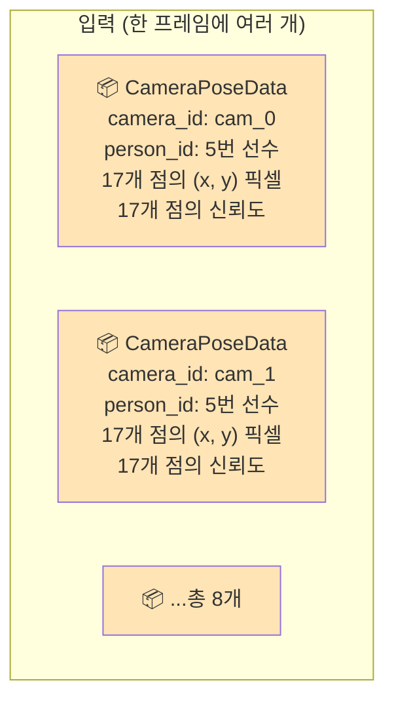

```python
# pose_fusion.py:74-93
@dataclass(slots=True)
class CameraPoseData:
    camera_id: str                  # "cam_0", "cam_1", ...
    person_id: int                  # 트래킹 ID (ByteTrack 결과)
    keypoints_2d: NDArray[float32]  # shape (17, 2) — 17개 점의 픽셀 좌표
    keypoint_scores: NDArray[float32]  # shape (17,) — 각 점의 신뢰도 0~1
```

### 🦴 17개 키포인트가 뭐길래?

**COCO 표준** 의 사람 뼈대 17점:

```
        👤
        0 (코)
      1   2 (눈)
      3   4 (귀)
        ㅇ
    5━━━━━━━6  (어깨)
    │       │
    7       8  (팔꿈치)
    │       │
    9      10  (손목)
    ㅇ━━━━━━ㅇ
   11      12  (엉덩이)
    │       │
   13      14  (무릎)
    │       │
   15      16  (발목)
```

### 📤 출력: `PoseFusionResult`

```python
# pose_fusion.py:128-143
@dataclass(slots=True)
class FusedPose3D:
    person_id: int
    keypoints_3d: NDArray            # shape (17, 3) — 미터 단위 x, y, z
    keypoint_confidences: NDArray    # shape (17,) — 각 점의 신뢰도
    num_views_per_keypoint: NDArray  # shape (17,) — 각 점을 몇 대 카메라가 봤나
    total_views: int                  # 이 선수를 본 카메라 수

@dataclass(slots=True)
class PoseFusionResult:
    frame_index: int
    poses_3d: list[FusedPose3D]     # 모든 선수의 3D 포즈
    num_persons: int
    processing_time_ms: float
```

### 시각화

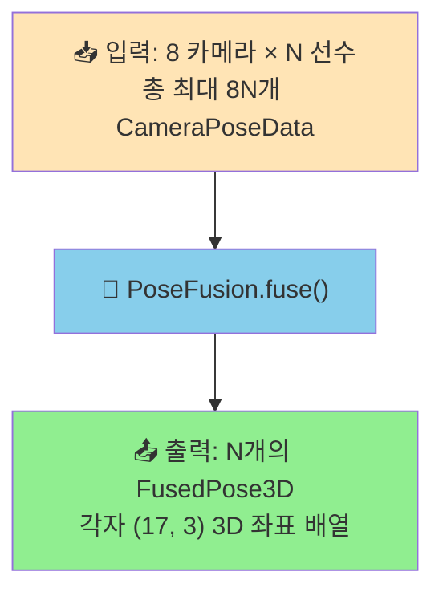

---

## 4. 어떻게 작동하나 — 4단계 과정 {#4-처리-흐름}

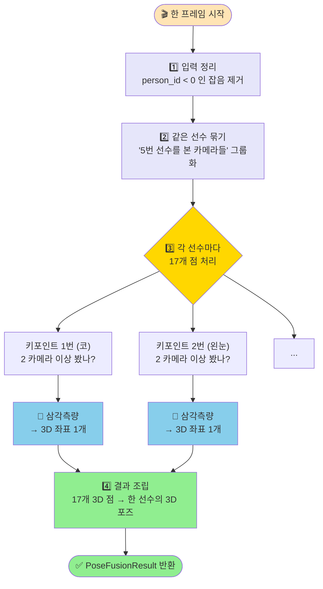

### Step 1 — 입력 정리 ([:193-209](../engine/pipeline/fusion/pose_fusion.py#L193))

```python
def fuse(self, camera_poses: list[CameraPoseData], frame_index: int):
    person_groups: dict[int, list[CameraPoseData]] = {}
    for pose in camera_poses:
        if pose.person_id < 0:    # ← 잘못 검출된 것 버림
            continue
        person_groups.setdefault(pose.person_id, []).append(pose)
```

**왜 필요한가**: ByteTrack 이 추적 못한 일시적 검출은 `person_id = -1` 로 들어옵니다. 어떤 선수인지 모르면 다른 카메라와 매칭 못 하니 버림.

### Step 2 — 같은 선수 묶기

```
입력:
  📦 (cam_0, person_5, ...)
  📦 (cam_1, person_5, ...)
  📦 (cam_0, person_7, ...)
  📦 (cam_2, person_5, ...)
  📦 (cam_1, person_7, ...)

그룹화 후:
  person_5: [cam_0, cam_1, cam_2 의 관측 3개]
  person_7: [cam_0, cam_1 의 관측 2개]
```

> 💡 **중요한 가정**: person_id 매칭은 **이미 끝나 있다**. ByteTrack + Re-ID 가 사전 단계에서 처리 → "카메라 A 의 5번 = 카메라 B 의 5번" 이 보장됨. PoseFusion 은 단순히 묶기만 함.

### Step 3 — 선수 한 명씩 처리 ([:219-222](../engine/pipeline/fusion/pose_fusion.py#L219))

```python
for person_id, group in person_groups.items():
    fused = self._fuse_person(person_id, group)
    if fused is not None:
        poses_3d.append(fused)
```

각 선수 안에서 17개 점을 하나씩 처리. 이게 `_fuse_person` 함수.

### Step 4 — 결과 조립

선수별 (17, 3) 배열을 `PoseFusionResult` 하나에 모아 반환.

---

## 5. 핵심 알고리즘: 삼각측량 {#5-삼각측량}

### 🎓 직관: "광선이 만나는 점"

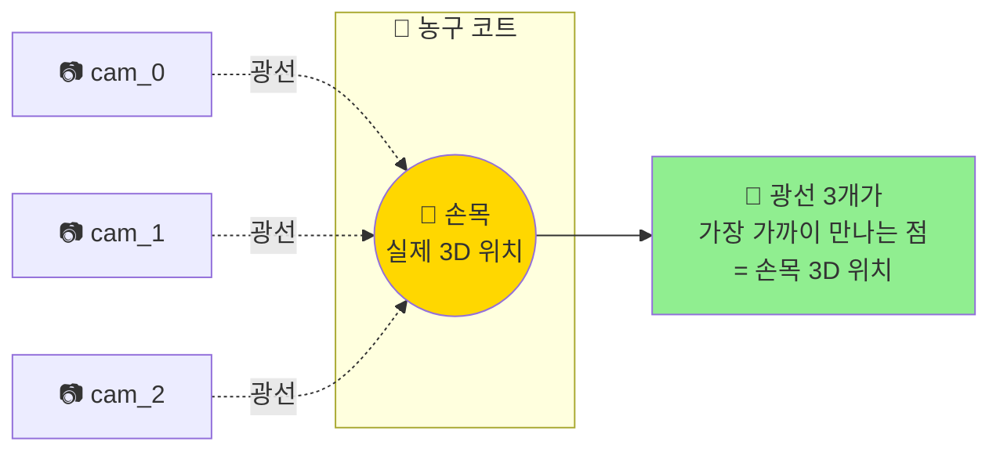

각 카메라에서 손목을 향해 **광선**(ray) 을 쏩니다. 이론적으로 광선들이 정확히 한 점에서 만나야 하지만, 측정 오차 때문에 약간 어긋남 → **가장 가까이 만나는 점** 을 찾는 게 삼각측량.

### 🔬 _fuse_person 의 3중 루프 ([:259-313](../engine/pipeline/fusion/pose_fusion.py#L259))

```python
for kp_idx in range(17):                       # ① 17 키포인트 (코→발목)
    valid_observations = []

    for pose in group:                          # ② M 카메라 (2~8)
        score = pose.keypoint_scores[kp_idx]
        if score >= 0.3:                        # ③ 신뢰도 0.3 이상만
            valid_observations.append(
                (pose.camera_id, pose.keypoints_2d[kp_idx])
            )

    if len(valid_observations) >= 2:           # 최소 2 카메라
        # 🔺 삼각측량!
        point_3d = self._triangulator.triangulate(
            camera_ids=[obs[0] for obs in valid_observations],
            points_2d=np.array([obs[1] for obs in valid_observations]),
        )
        kp_3d[kp_idx] = point_3d
```

### 🧮 Triangulator 내부에서 일어나는 일

[coordinate_transformer.py:406-481](../infrastructure/multi_camera/coordinate_transformer.py#L406):

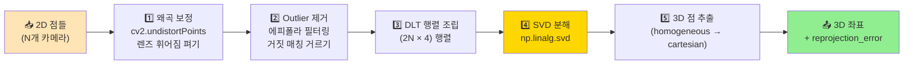

**DLT (Direct Linear Transform)** — 가장 어려운 수학 부분:

```python
# coordinate_transformer.py:506-535
A = np.empty((2 * n, 4), dtype=np.float64)
for i, (transformer, pixel) in enumerate(cameras):
    P = transformer.projection_matrix  # (3, 4) — 카메라 내·외부 파라미터
    x, y = pixel[0], pixel[1]
    A[2 * i]     = x * P[2] - P[0]
    A[2 * i + 1] = y * P[2] - P[1]

# SVD 의 마지막 행이 정답 (Ax = 0 의 null space)
_, _, Vt = np.linalg.svd(A)
X = Vt[-1]
return (X[:3] / X[3])  # 3D 점
```

> 😅 **수학 잘 모르겠으면**: "여러 광선의 교점을 최소제곱법으로 찾는다" 정도로 이해하면 충분.

---

## 6. 신뢰도와 안전망 {#6-신뢰도}

### 🎚️ 다단계 임계값

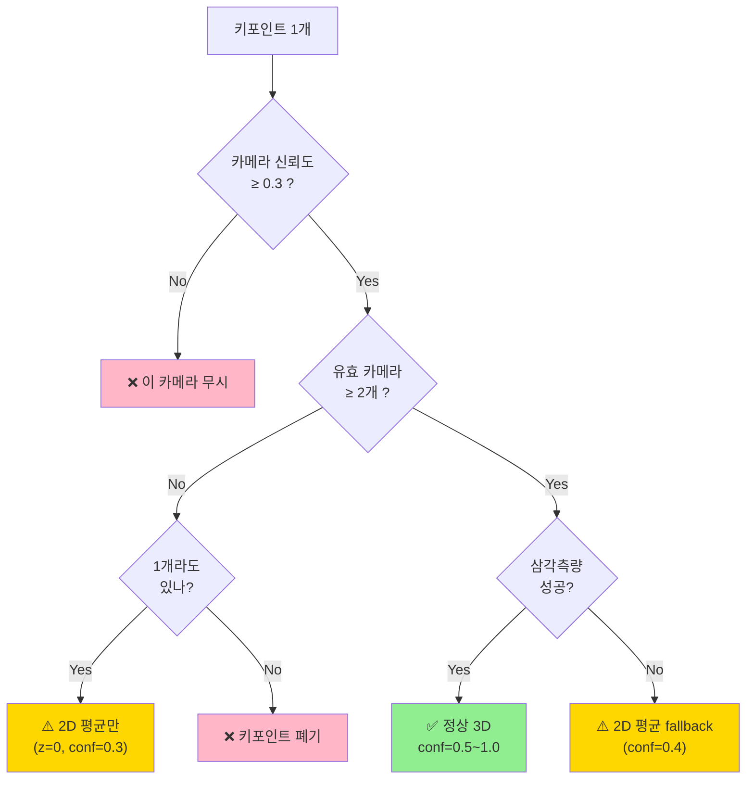

### 📊 confidence 값 해석

| 값 | 의미 | 신뢰 수준 |
|---|---|---|
| **1.0** | 4 카메라 이상이 봄 | 🟢 최고 |
| **0.7** | 2 카메라가 봄 | 🟢 정상 |
| **0.5** | 2 카메라 + 약간 어긋남 | 🟡 보통 |
| **0.4** | 삼각측량 실패 → 2D 평균만 | 🟠 주의 |
| **0.3** | 1 카메라만 봄 (pseudo-3D) | 🔴 낮음 |
| **0.0** | 키포인트 폐기 | ⚫ 없음 |

### 🔧 코드 위치

```python
# pose_fusion.py:65-67
_MIN_KEYPOINT_CONFIDENCE = 0.3   # 키포인트 신뢰도 하한
_MIN_VIEWS_FOR_TRIANGULATION = 2  # 삼각측량 최소 카메라 수
NUM_KEYPOINTS_COCO = 17            # COCO 표준
```

---

## 7. 성능 — 왜 느린가 {#7-성능}

### ⏱️ 한 프레임 연산량

선수 5명, 평균 4 카메라 관측 기준:

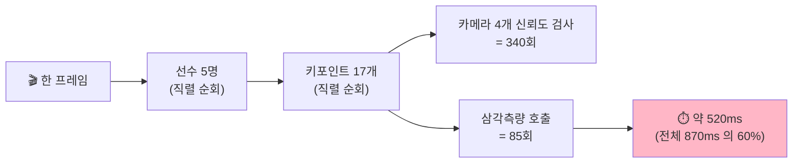

### 🔥 왜 이렇게 오래 걸리나?

| 원인 | 영향 |
|---|---|
| **3중 중첩 직렬 루프** | 선수 × 키포인트 × 카메라 모두 for-loop |
| **GPU 사용 0%** | 순수 CPU + numpy + cv2 |
| **삼각측량마다 SVD** | (2N × 4) 행렬 SVD 분해 85회 |
| **에피폴라 필터링** | 카메라 쌍별 비교 (n choose 2) |

### 🚀 개선 가능성 (이전 P0-2 최적화안)

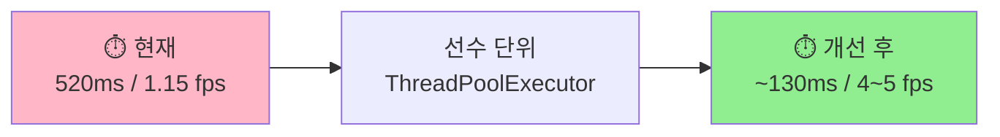

**왜 선수 단위가 최적?**
- ✅ 선수 간 완전 독립 (공유 상태 없음)
- ✅ 각 선수가 17 × 4 = 68회 호출 (충분한 작업 단위)
- ✅ cv2/numpy 가 GIL 해제 → 파이썬 스레드 효과적
- ⚠️ Triangulator 의 thread safety 만 확인하면 됨

---

## 8. 한계와 주의사항 {#8-한계}

### ⚠️ 의존 관계

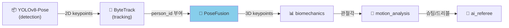

> **PoseFusion 의 정확도가 하류 모든 분석의 상한**.
> 여기서 부정확하면 슈팅 폼 분석, 트래블링 판정 다 망가집니다.

### 🐛 잠재적 문제점

| 항목 | 위치 | 영향 |
|---|---|---|
| 예외 광범위 catch | [:297](../engine/pipeline/fusion/pose_fusion.py#L297) | 실패 원인 로그 안 남음 |
| 17 keypoint 하드코딩 | [:67](../engine/pipeline/fusion/pose_fusion.py#L67) | 다른 모델 도입 시 재작성 필요 |
| person_id 의존 | Step 2 | ByteTrack 오류 시 잘못된 키포인트가 한 선수에 묶임 |
| triangulator 미주입 silent | [:282](../engine/pipeline/fusion/pose_fusion.py#L282) | DI 실패 시 조용히 pseudo-3D 폴백 |
| Stage1 (17점) 전용 | 전체 | Stage2 ViTPose (133점) 는 별도 경로 |

### 🧪 Stage1 vs Stage2

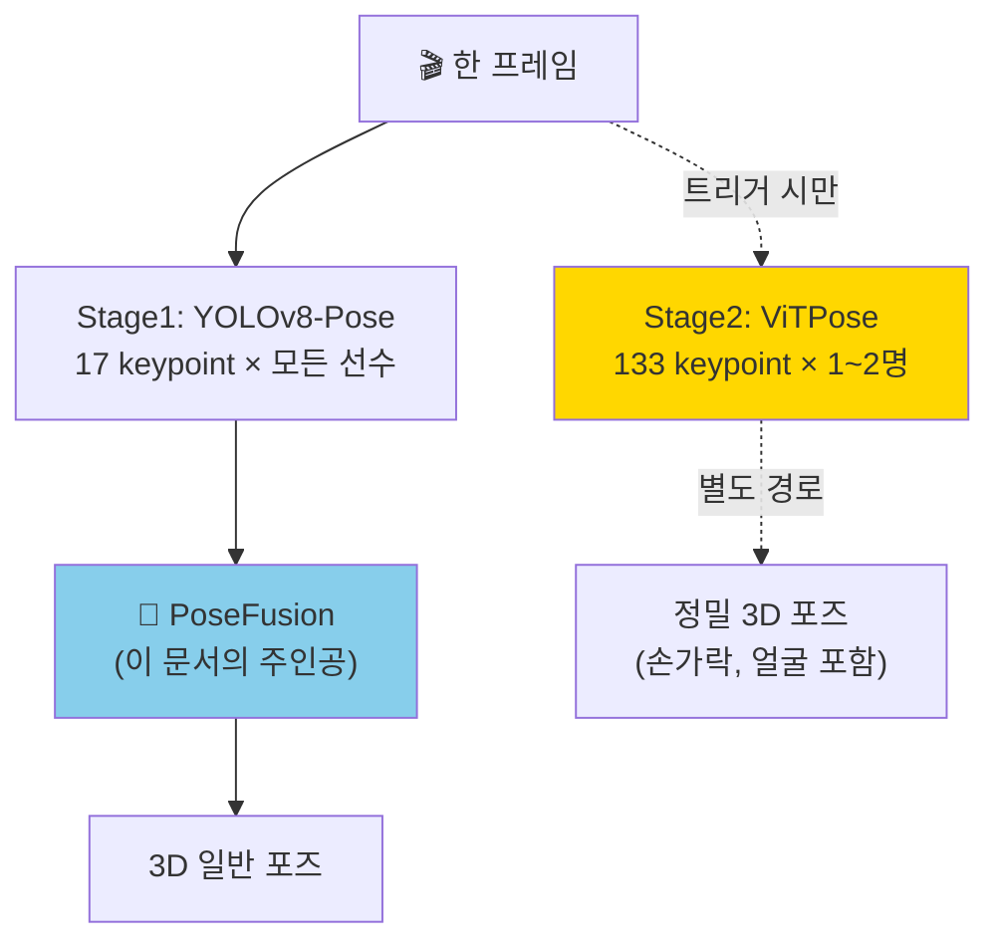

**PoseFusion 은 Stage1 (17점) 만 처리**. Stage2 는 슈팅/파울 트리거 시에만 별도로 [game_orchestrator.py:2366](../engine/orchestrator/game_orchestrator.py#L2366) 의 `_try_stage2_vitpose` 가 처리.

---

## 9. 다음 단계와의 연결 {#9-다음-단계}

### 🔗 PoseFusion 결과를 누가 쓰나

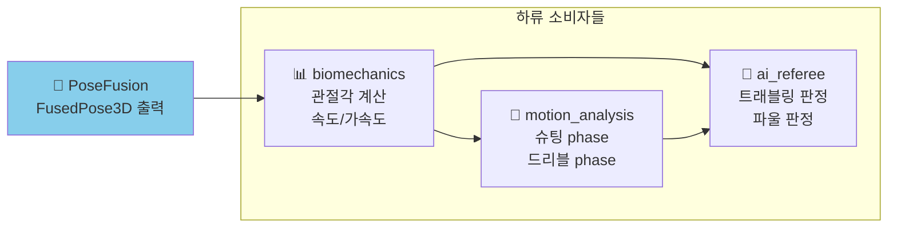

| 소비자 | PoseFusion 결과를 어떻게 쓰나 |
|---|---|
| **biomechanics** | `keypoints_3d` 로 어깨-팔꿈치-손목 각도 계산 |
| **motion_analysis** | 손목 z 좌표 변화 → 슈팅 릴리스 감지 |
| **ai_referee** | 발 위치 3D 추적 → 트래블링 판정 |

### 📦 실제 데이터 흐름 예시

```
프레임 1234:
  PoseFusion.fuse() 호출
  ↓
  입력: [cam_0~7 × 5선수 = 최대 40개 CameraPoseData]
  ↓
  처리: person_groups = {5: [...], 7: [...], 11: [...], 13: [...], 19: [...]}
  ↓
  결과: PoseFusionResult(
    frame_index=1234,
    poses_3d=[
      FusedPose3D(person_id=5,  keypoints_3d=(17, 3) 배열, ...),
      FusedPose3D(person_id=7,  keypoints_3d=(17, 3) 배열, ...),
      ... 총 5명
    ],
    num_persons=5,
    processing_time_ms=520.3,
  )
```

---

## 10. 한눈에 보는 요약 {#10-요약}

### 🎯 핵심 한 줄

```
PoseFusion = "여러 카메라가 본 같은 점을 합쳐서 3D 좌표로 만드는 도구"
```

### 📋 입출력 한 줄

```
입력: 8 카메라 × N 선수의 2D keypoint
출력: N명의 3D pose (선수당 17 keypoint × xyz)
```

### 🔄 4단계 한 줄

```
① 잡음 제거 → ② 같은 선수 묶기 → ③ 점마다 삼각측량 → ④ 결과 조립
```

### ⚡ 성능 한 줄

```
현재: 520ms/프레임 (전체의 60%, 가장 느린 단계)
가능: 선수 단위 병렬화로 130ms 까지 (4배 가속)
```

### 📐 수학 한 줄

```
여러 광선의 교점 = 최소제곱법 (DLT) + SVD 분해 → 3D 점
```

---

## 🗺️ 정확한 코드 위치 인덱스

| 항목 | 파일:라인 |
|---|---|
| `CameraPoseData` 정의 | [pose_fusion.py:74-93](../engine/pipeline/fusion/pose_fusion.py#L74) |
| `FusedPose3D` 정의 | [:99-122](../engine/pipeline/fusion/pose_fusion.py#L99) |
| `PoseFusionResult` 정의 | [:128-143](../engine/pipeline/fusion/pose_fusion.py#L128) |
| `PoseFusion.__init__` | [:173-183](../engine/pipeline/fusion/pose_fusion.py#L173) |
| `fuse()` 메서드 | [:193-239](../engine/pipeline/fusion/pose_fusion.py#L193) |
| `_fuse_person()` | [:245-313](../engine/pipeline/fusion/pose_fusion.py#L245) |
| 3중 루프 (성능 핫스팟) | [:259-313](../engine/pipeline/fusion/pose_fusion.py#L259) |
| 신뢰도 임계값 | [:65-67](../engine/pipeline/fusion/pose_fusion.py#L65) |
| Triangulator 호출 | [:288-291](../engine/pipeline/fusion/pose_fusion.py#L288) |
| Triangulator 본체 | [coordinate_transformer.py:406-481](../infrastructure/multi_camera/coordinate_transformer.py#L406) |
| DLT 알고리즘 | [:506-535](../infrastructure/multi_camera/coordinate_transformer.py#L506) |

---

## 📖 더 깊이 알고 싶다면

| 주제 | 참조 문서 |
|---|---|
| 전체 데이터 흐름 | [DATA_FLOW_CONTRACT.md](DATA_FLOW_CONTRACT.md) |
| 파이프라인 latency | [PIPELINE_LATENCY_BUDGET.md](PIPELINE_LATENCY_BUDGET.md) |
| REPLAY 모드 | [PIPELINE_LATENCY_BUDGET_REPLAY.md](PIPELINE_LATENCY_BUDGET_REPLAY.md) |
| 성능 최적화 가이드 | [PIPELINE_SPEEDUP_GUIDE.md](PIPELINE_SPEEDUP_GUIDE.md) |
| 메모리 감사 | [../PLAN_MEMORY_USAGE_AUDIT.md](../PLAN_MEMORY_USAGE_AUDIT.md) |

---

## 💡 자주 묻는 질문

### Q1. 카메라가 1대뿐이면 어떻게 되나?

**A**: PoseFusion 이 작동하지 않습니다. `_min_views = 2` 이므로 각 선수의 카메라가 2대 미만이면 `None` 반환. 분석 결과에 그 선수가 안 들어감.

### Q2. 카메라가 8대 다 봐도 정확도가 1.0 보다 안 올라가는데?

**A**: confidence 는 `min(1.0, num_views / min_views)` 로 캡 되어 있습니다 ([:294](../engine/pipeline/fusion/pose_fusion.py#L294)). 4대 이상이면 항상 1.0. 더 많아도 의미 없음.

### Q3. 왜 17개만? 손가락이나 얼굴은 안 보나?

**A**: COCO 표준이 17점이라서. 더 정밀한 133점(WholeBody) 은 ViTPose Stage2 가 별도로 처리. 슈팅/파울 순간에만 트리거되어 손가락·얼굴까지 분석함.

### Q4. person_id 가 잘못 부여되면?

**A**: 다른 선수의 키포인트가 한 선수에 묶여 삼각측량 결과가 망가집니다. **에피폴라 필터링** 이 일부 잡아내지만 완벽하지 않음. ByteTrack + Re-ID 의 정확도가 매우 중요.

### Q5. 3D 좌표의 원점은 어디?

**A**: 코트 캘리브레이션 결과로 정해집니다. 보통 **코트 중앙 또는 한쪽 골대** 가 원점 (0, 0, 0). 자세한 건 [calibration_dto.py](../shared/dto/calibration_dto.py).

### Q6. 사람이 가려져서(occlusion) 일부 카메라가 못 보면?

**A**: 신뢰도 < 0.3 이면 그 카메라는 자동 제외. 남은 카메라가 ≥ 2 면 정상 삼각측량. 1대만 남으면 2D 평균 fallback (z=0). 0대면 키포인트 폐기.
