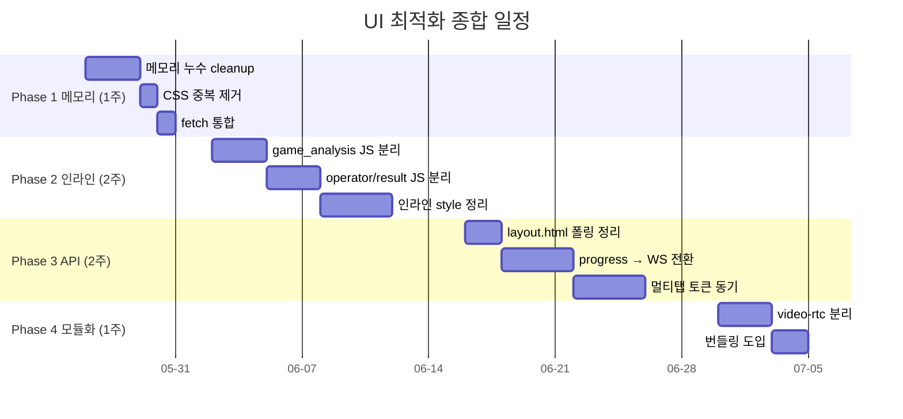
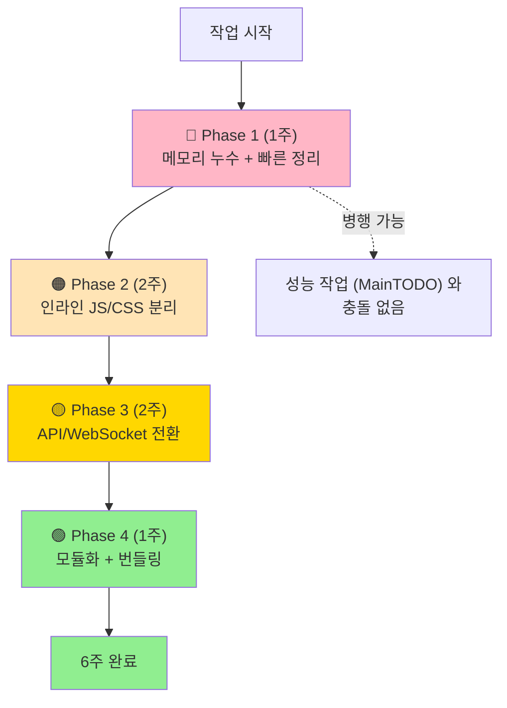

# 🎨 UI 최적화 종합 계획 인덱스

> **`courtview_ui/` (26 파일, 30,500줄) 4 Phase 최적화 종합 계획.**
> 작성일: 2026-05-23 / 기준: [UI_INVENTORY.md](../../UI_INVENTORY.md) 진단 결과

---

## 🎯 한 줄 요약

> **메모리 누수 제거 + 인라인 코드 분리 + WebSocket 전환 + 모듈화 — 6주 작업.**

---

## 📊 전체 효과 예측

| 항목 | Before | After | 개선 |
|---|---|---|---|
| 메모리 누수 | 5개 영역 | 0~1개 | **-80%** |
| HTML 평균 줄수 | 1,600줄 | 1,200줄 | -25% |
| CSS 파일 크기 | 30KB | 18KB | **-40%** |
| 인라인 style | 616건 | <50건 | **-92%** |
| 폴링 대역폭 | 5초 × N 페이지 | WebSocket | **-85%** |
| 백그라운드 CPU | 항상 동작 | 일시정지 | **-50%** |
| 로딩 시간 | 1.5~2s | 1s | **-33%** |

---

## 🗓️ 4 Phase — 6주 일정



---

## 📋 Phase 별 계획서

| Phase | 계획서 | 작업일 | 우선순위 |
|---|---|---|---|
| 🔴 **Phase 1** | [UI_OPT_PHASE1_MEMORY_LEAKS.md](UI_OPT_PHASE1_MEMORY_LEAKS.md) | **5일** | 🔴 즉시 |
| 🟠 **Phase 2** | [UI_OPT_PHASE2_INLINE_JS_CSS.md](UI_OPT_PHASE2_INLINE_JS_CSS.md) | **10일** | 🟠 중요 |
| 🟡 **Phase 3** | [UI_OPT_PHASE3_API_WEBSOCKET.md](UI_OPT_PHASE3_API_WEBSOCKET.md) | **10일** | 🟡 권장 |
| 🟢 **Phase 4** | [UI_OPT_PHASE4_MODULARIZATION.md](UI_OPT_PHASE4_MODULARIZATION.md) | **5일** | 🟢 장기 |

**총 30 작업일 = 6주**

---

## 🔴 Phase 1 요약 — 메모리 누수 (1주)

### 5가지 누수 위험

| # | 파일 | 문제 | 영향 |
|---|---|---|---|
| 1 | `video-rtc.js` | WebSocket `addEventListener` 정리 X | 페이지 이동마다 누적 |
| 2 | `video-rtc.js` | IntersectionObserver `disconnect()` X | DOM 참조 유지 |
| 3 | `layout.html` | `setInterval(5s)` `clearInterval` 없음 | 모든 페이지 영구 폴링 |
| 4 | `operator.html` | 타이머 3개 정리 없음 | 운영 콘솔 메모리 ↑ |
| 5 | `game_analysis.html` | `recInterval` cleanup 불완전 | LIVE 분석 시 누수 |

### 추가 작업 (같은 Phase)
- `design-system.css` 삭제 (theme.css 와 완전 중복)
- 직접 `fetch()` 호출 4건 → `API.engine()` 래퍼 통합

📄 상세: [UI_OPT_PHASE1_MEMORY_LEAKS.md](UI_OPT_PHASE1_MEMORY_LEAKS.md)

---

## 🟠 Phase 2 요약 — 인라인 JS/CSS 분리 (2주)

### 대상 5 HTML 파일

| 파일 | 총 줄 | 인라인 JS | 비율 |
|---|---|---|---|
| `game_analysis.html` | 2,633 | **1,200줄** | **45%** |
| `operator.html` | 2,086 | 830줄 | 40% |
| `game_result.html` | 1,635 | 570줄 | 35% |
| `database.html` | 1,477 | 440줄 | 30% |
| `replay.html` | 1,183 | 295줄 | 25% |

### 분리 예상

```
game_analysis.html (2,633) → 1,400 (-47%)
  ├─ recording-client.js (NEW, 200줄)
  ├─ canvas-render.js (NEW, 250줄)
  └─ timer-controller.js (NEW, 150줄)

game_result.html (1,635) → 1,445 (-12%)
  └─ graph-render.js (NEW, 180줄)
```

### 인라인 style 616건 정리

```html
<!-- Before -->
<div style="display:flex;flex-direction:column;height:100%;">

<!-- After -->
<div class="cv-flex-col-full">
```

📄 상세: [UI_OPT_PHASE2_INLINE_JS_CSS.md](UI_OPT_PHASE2_INLINE_JS_CSS.md)

---

## 🟡 Phase 3 요약 — API/WebSocket 전환 (2주)

### 폴링 → WebSocket

| 현재 | 개선 | 효과 |
|---|---|---|
| `/api/v1/tasks/progress` 5초 폴링 | `/ws/ops` 메시지 | 대역폭 -85% |
| `/api/v1/camera/health` 2초 폴링 | `/ws/ops` 푸시 | 지연 50~100ms 단축 |
| `/health` 5초 폴링 (layout) | 10초 + visibility | CPU -50% |

### 직접 fetch 4건 → API 래퍼

```javascript
// Before
fetch('/api/v1/metrics/storage')

// After
API.engine('GET', '/metrics/storage')
```

### 멀티탭 토큰 동기화 (race condition 방지)

```javascript
window.addEventListener('storage', (e) => {
    if (e.key === 'access_token') {
        // 다른 탭에서 갱신된 토큰 자동 반영
    }
});
```

📄 상세: [UI_OPT_PHASE3_API_WEBSOCKET.md](UI_OPT_PHASE3_API_WEBSOCKET.md)

---

## 🟢 Phase 4 요약 — 모듈화 + 번들링 (1주)

### video-rtc.js (717줄) 분리

```
video-rtc.js (717) → 5 모듈
├─ StreamModeSelector.js (50줄)
├─ MSEBuffer.js (80줄)
├─ WebRTCPeer.js (70줄)
├─ CodecPriority.js (40줄)
└─ VideoRTC.js (200줄, 핵심만)
```

### 번들링 도입

```
현재: 8 JS 개별 로드 (8 HTTP 요청, ~50KB)
권장: Rollup → core.js (22KB gzip) + video.js (8KB gzip)
```

### 공통 헬퍼 추출

- `httpRequest(endpoint, ...)` — fetch 래퍼 3개 통합
- `BaseWebSocketManager` — 재연결 로직 3개 통합
- `parseJSON(data, fallback)` — JSON 보호
- `logger(module, level, msg)` — 통일된 로깅

📄 상세: [UI_OPT_PHASE4_MODULARIZATION.md](UI_OPT_PHASE4_MODULARIZATION.md)

---

## 🚦 작업 순서 권장



### 다른 트랙과의 관계

| 트랙 | 충돌? | 권장 |
|---|---|---|
| [MainTODO.md](../../MainTODO.md) 성능 최적화 | ❌ 없음 (백엔드 영역) | 병행 가능 |
| [MaintenanceTODO.md](../../MaintenanceTODO.md) 유지보수 | ⚠️ M2 (CLAUDE.md) 와 무관 | 병행 가능 |
| [REFACTOR_INDEX.md](../../project/architecture/REFACTOR_INDEX.md) 리팩토링 | ❌ 없음 (백엔드 영역) | 병행 가능 |

→ **UI 최적화는 백엔드 작업과 독립적**. 별도 트랙으로 진행 가능.

---

## 📊 누적 효과 예측

| 단계 | 완료 후 상태 |
|---|---|
| Phase 1 완료 | 메모리 안정, CSS -40%, fetch 통합 |
| Phase 2 완료 | HTML 평균 -25%, 인라인 style -92% |
| Phase 3 완료 | 대역폭 -85%, 백그라운드 CPU -50% |
| Phase 4 완료 | 로딩 -33%, 유지보수성 ↑↑ |

**최종**: UI 가 가볍고, 안정적이고, 유지보수 가능한 상태.

---

## ⚠️ 공통 주의사항

### 작업 전

- [ ] [UI_INVENTORY.md](../../UI_INVENTORY.md) 읽기
- [ ] baseline 영상 분석 → events.json 저장 (회귀 검증용)
- [ ] 새 브랜치 `feat/ui-optimization-phaseN` 생성

### 작업 중

- [ ] 각 Phase 끝나면 commit
- [ ] 브라우저 콘솔 에러 검증
- [ ] 메모리 프로파일 확인 (Chrome DevTools)
- [ ] 한 페이지 1시간 사용 — 메모리 증가 < 10MB

### 작업 후

- [ ] 전체 페이지 동작 검증
- [ ] LIVE / REPLAY 모드 양쪽 확인
- [ ] WebSocket 재연결 정상

---

## 📖 관련 문서

### Phase 계획서
- [UI_OPT_PHASE1_MEMORY_LEAKS.md](UI_OPT_PHASE1_MEMORY_LEAKS.md)
- [UI_OPT_PHASE2_INLINE_JS_CSS.md](UI_OPT_PHASE2_INLINE_JS_CSS.md)
- [UI_OPT_PHASE3_API_WEBSOCKET.md](UI_OPT_PHASE3_API_WEBSOCKET.md)
- [UI_OPT_PHASE4_MODULARIZATION.md](UI_OPT_PHASE4_MODULARIZATION.md)

### 진단 / 참조
- [../../UI_INVENTORY.md](../../UI_INVENTORY.md) — UI 78 파일 인벤토리
- [../../INDEX.md](../../INDEX.md) — docs 전체 인덱스
- [../../MainTODO.md](../../MainTODO.md) — 성능 최적화 (병행)

---

## 💡 다른 컴퓨터에서 시작 방법

```powershell
# 1. 최신 받기
git pull origin main

# 2. 인덱스 열기
code docs\plans\ui-optimization\UI_OPTIMIZATION_INDEX.md

# 3. Phase 1 부터 시작
code docs\plans\ui-optimization\UI_OPT_PHASE1_MEMORY_LEAKS.md

# 4. 브랜치 생성
git checkout -b feat/ui-optimization-phase1

# 5. STEP 0 부터 진행
```

---

**작성일**: 2026-05-23
**전체 예상 완료**: 6주 (30 작업일)
**다음**: Phase 1 부터 차례로
