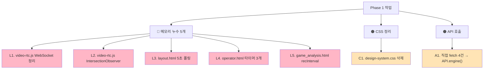

# 🔴 UI 최적화 Phase 1 — 메모리 누수 제거 + Quick Wins

> **5가지 메모리 누수 + CSS 중복 제거 + fetch 통합. 1주 작업.**
> 작성일: 2026-05-23 / 우선순위: 🔴 즉시

---

## 🎯 목표

> **메모리 누수 80% 제거 + CSS 40% 절감 + API 호출 통일.**
> 다른 Phase 의 안전 기반 마련.

---

## 📊 작업 항목 5+2



---

## 1. L1 — `video-rtc.js` WebSocket addEventListener 정리

### 1.1 문제

[courtview_ui/static/js/video-rtc.js:326](../../../courtview_ui/static/js/video-rtc.js#L326):

```javascript
// ❌ 현재 — 누수
this.ws.addEventListener('open', () => this.onopen());
this.ws.addEventListener('message', (e) => this.onmessage(e));
// ... 매번 페이지 이동마다 새 리스너 추가
// removeEventListener 호출 없음
```

→ 페이지 여러 번 이동 시 리스너 누적, 메모리 ↑

### 1.2 수정안

```javascript
// ✅ 수정
class VideoRTC extends HTMLElement {
    constructor() {
        super();
        // 핸들러 참조 보관 (removeEventListener 위해)
        this._onOpen = () => this.onopen();
        this._onMessage = (e) => this.onmessage(e);
        this._onClose = () => this.ondisconnect();
        this._onError = (e) => this.onerror(e);
    }

    onconnect() {
        this.ws = new WebSocket(this.wsUrl);
        this.ws.addEventListener('open', this._onOpen);
        this.ws.addEventListener('message', this._onMessage);
        this.ws.addEventListener('close', this._onClose);
        this.ws.addEventListener('error', this._onError);
    }

    ondisconnect() {
        if (this.ws) {
            // 명시적 제거
            this.ws.removeEventListener('open', this._onOpen);
            this.ws.removeEventListener('message', this._onMessage);
            this.ws.removeEventListener('close', this._onClose);
            this.ws.removeEventListener('error', this._onError);
            this.ws.close();
            this.ws = null;
        }
    }

    disconnectedCallback() {
        this.ondisconnect();
    }
}
```

### 1.3 검증

```javascript
// 브라우저 콘솔에서
let beforeMem = performance.memory.usedJSHeapSize;
// 페이지 5번 이동 후
let afterMem = performance.memory.usedJSHeapSize;
console.log(`메모리 증가: ${(afterMem - beforeMem) / 1024 / 1024} MB`);
// 목표: < 5MB
```

**예상 소요**: **2시간**

---

## 2. L2 — `video-rtc.js` IntersectionObserver disconnect

### 2.1 문제

[video-rtc.js:308](../../../courtview_ui/static/js/video-rtc.js#L308):

```javascript
// ❌ 현재
const observer = new IntersectionObserver(...);
observer.observe(this);
// disconnect() 호출 없음 → DOM 참조 유지
```

### 2.2 수정안

```javascript
// ✅ 수정
class VideoRTC extends HTMLElement {
    constructor() {
        super();
        this._observer = null;
    }

    connectedCallback() {
        this._observer = new IntersectionObserver((entries) => {
            entries.forEach(entry => {
                if (entry.isIntersecting) this.play();
                else this.pause();
            });
        });
        this._observer.observe(this);
    }

    disconnectedCallback() {
        // 명시적 정리
        if (this._observer) {
            this._observer.disconnect();
            this._observer = null;
        }
        this.ondisconnect();
    }
}
```

**예상 소요**: **1시간**

---

## 3. L3 — `layout.html` 5초 폴링 정리

### 3.1 문제

[courtview_ui/templates/components/layout.html](../../../courtview_ui/templates/components/layout.html) 의 헬스 체크:

```javascript
// ❌ 현재
setInterval(() => {
    fetch('/health').then(r => r.json()).then(updateClock);
}, 5000);
// clearInterval 호출 없음
// 모든 페이지 상속 → 모든 페이지에서 영구 폴링
```

→ 사용자가 페이지를 5번 이동하면 5개 폴링이 동시 동작 (??).
→ 백그라운드 탭에서도 계속 동작 → 배터리/CPU 낭비.

### 3.2 수정안

```javascript
// ✅ 수정 — Page Visibility API + cleanup
(function() {
    let healthTimer = null;

    function startHealthCheck() {
        if (healthTimer) return;  // 중복 시작 방지
        healthTimer = setInterval(checkEngine, 10000);  // 5s → 10s
        checkEngine();  // 즉시 1번
    }

    function stopHealthCheck() {
        if (healthTimer) {
            clearInterval(healthTimer);
            healthTimer = null;
        }
    }

    // 백그라운드 탭 → 일시정지
    document.addEventListener('visibilitychange', () => {
        if (document.hidden) stopHealthCheck();
        else startHealthCheck();
    });

    // 페이지 떠날 때 → 정리
    window.addEventListener('beforeunload', stopHealthCheck);

    // 시작
    startHealthCheck();
})();
```

### 3.3 추가 — `/health` → `API.engine()` 사용

```javascript
// Before
fetch('/health').then(r => r.json())

// After
API.engine('GET', '/health')   // 401 자동 재시도 + 로깅
```

**예상 소요**: **2시간**

---

## 4. L4 — `operator.html` 타이머 3개 정리

### 4.1 문제

[operator.html](../../../courtview_ui/templates/pages/operator.html):

```javascript
// ❌ 현재 — 정리 코드 전혀 없음
setInterval(updateOpClock, 1000);       // 운영 타이머
setInterval(checkEngineSync, 5000);     // 엔진 동기
setInterval(syncRecStatus, 5000);       // 녹화 상태
```

### 4.2 수정안

```javascript
// ✅ 수정
const _timers = {
    clock: null,
    engine: null,
    rec: null,
};

function startTimers() {
    _timers.clock = setInterval(updateOpClock, 1000);
    _timers.engine = setInterval(checkEngineSync, 5000);
    _timers.rec = setInterval(syncRecStatus, 5000);
}

function stopTimers() {
    Object.values(_timers).forEach(t => t && clearInterval(t));
    Object.keys(_timers).forEach(k => _timers[k] = null);
}

// Visibility 처리
document.addEventListener('visibilitychange', () => {
    if (document.hidden) stopTimers();
    else startTimers();
});

window.addEventListener('beforeunload', stopTimers);

// 시작
startTimers();
```

**예상 소요**: **2시간**

---

## 5. L5 — `game_analysis.html` recInterval 정리

### 5.1 문제

[game_analysis.html](../../../courtview_ui/templates/pages/game_analysis.html):

```javascript
// ❌ 현재 — recInterval 일부 cleanup 누락
const recInterval = setInterval(_renderRecTime, 1000);
// ... 게임 종료 시 clearInterval(recInterval) 호출이 일부 경로에서만
```

### 5.2 수정안

```javascript
// ✅ 수정 — 중앙 관리
const _gameTimers = new Set();

function addTimer(fn, ms) {
    const id = setInterval(fn, ms);
    _gameTimers.add(id);
    return id;
}

function clearAllTimers() {
    _gameTimers.forEach(id => clearInterval(id));
    _gameTimers.clear();
}

// 사용
const recId = addTimer(_renderRecTime, 1000);
const goId = addTimer(fetchGo2rtcHealth, 30000);

// 게임 종료 / 페이지 떠날 때
window.addEventListener('beforeunload', clearAllTimers);
document.addEventListener('visibilitychange', () => {
    if (document.hidden) clearAllTimers();
});
```

**예상 소요**: **3시간**

---

## 6. C1 — `design-system.css` 삭제 (중복)

### 6.1 발견

| 파일 | 줄수 | 비고 |
|---|---|---|
| `courtview_ui/static/css/theme.css` | 1,303 | 운영 정본 |
| **`COURTVIEW/design-system.css`** | **219** | **theme.css 의 869-1087 줄과 동일** ⚠️ |

→ **완전 중복**. 삭제해도 영향 없음.

### 6.2 작업

```powershell
# 1. 사용처 확인 (없어야 정상)
Select-String -Path "**\*.html" -Pattern "design-system\.css"
Select-String -Path "**\*.py" -Pattern "design-system\.css"

# 2. 없으면 삭제
git rm COURTVIEW\design-system.css

# 3. 커밋
git commit -m "chore(css): remove design-system.css (duplicate of theme.css 869-1087)"
```

**예상 소요**: **30분**

---

## 7. A1 — 직접 fetch 4건 → API 래퍼 통합

### 7.1 대상

| 위치 | 현재 코드 | 수정 |
|---|---|---|
| `layout.html:79` | `fetch('/health')` | `API.engine('GET', '/health')` |
| `equipment.html:506` | `fetch('/api/v1/camera/{id}/calibration')` | `API.engine('POST', '/camera/{id}/calibration', body)` |
| `equipment.html:673` | `fetch('/api/v1/metrics/storage')` | `API.engine('GET', '/metrics/storage')` |
| `equipment.html:683` | `fetch('/api/v1/game/status')` | `API.engine('GET', '/game/status')` |

### 7.2 효과

```javascript
// Before — 4가지 다른 패턴
fetch('/api/v1/metrics/storage')
    .then(r => r.json())
    .catch(e => console.error(e));

// After — 통일된 패턴
const { success, data, error } = await API.engine('GET', '/metrics/storage');
if (!success) {
    logger.error('storage', error);
    return;
}
// data 사용
```

→ **401 자동 재시도**, **에러 처리 일관성**, **추적 가능**

**예상 소요**: **2시간**

---

## 8. 단계별 작업 (STEP 0~7)

### STEP 0: 사전 준비 (30분)

- [ ] 새 브랜치: `git checkout -b feat/ui-opt-phase1-memory`
- [ ] 기존 동작 확인 — 한 페이지 1시간 사용 후 Chrome DevTools Memory 측정
- [ ] baseline 메모리 기록

### STEP 1: L1 + L2 — video-rtc.js (3시간)

- [ ] `video-rtc.js` 핸들러 참조 보관
- [ ] WebSocket addEventListener / removeEventListener 짝맞추기
- [ ] IntersectionObserver disconnect 추가
- [ ] 단위 테스트: 페이지 10번 이동 후 메모리 측정

### STEP 2: L3 — layout.html 폴링 (2시간)

- [ ] Visibility API + clearInterval 적용
- [ ] 5s → 10s 폴링 간격 확대
- [ ] `/health` API.engine() 으로 변경

### STEP 3: L4 — operator.html 타이머 (2시간)

- [ ] `_timers` Set 중앙 관리
- [ ] 3개 타이머 모두 정리 보장

### STEP 4: L5 — game_analysis.html (3시간)

- [ ] `_gameTimers` Set 도입
- [ ] 모든 setInterval cleanup

### STEP 5: C1 — design-system.css 삭제 (30분)

- [ ] 사용처 grep
- [ ] 안 쓰면 삭제

### STEP 6: A1 — fetch → API.engine (2시간)

- [ ] 4건 모두 수정
- [ ] 에러 처리 통일

### STEP 7: 검증 + PR (1시간)

- [ ] 모든 페이지 동작 확인
- [ ] 메모리 누수 검증
- [ ] PR 작성

---

## 9. 검증 방법

### 9.1 메모리 누수 검증

```javascript
// Chrome DevTools → Performance → Memory 탭

// 1. 페이지 진입 → Take snapshot (baseline)
// 2. 페이지 10번 이동 / 새로고침
// 3. 강제 GC (DevTools 휴지통 아이콘)
// 4. Take snapshot
// 5. 비교

// 목표: 누수 5MB 이하
```

### 9.2 타이머 누수 검증

```javascript
// 페이지 종료 후에도 타이머 도는지 확인
// Chrome DevTools → Sources → Event Listener Breakpoints → Timer
// 또는
let count = 0;
const original = setInterval;
window.setInterval = function(...args) {
    count++;
    console.log(`setInterval #${count}`);
    return original.apply(window, args);
};
// 페이지 이동 후 count 가 줄어드는지 확인
```

### 9.3 페이지별 동작 확인

- [ ] login → home: 정상
- [ ] home → equipment → calibrate: 카메라 동작
- [ ] operator + scoreboard + game_analysis 3 페이지 동시: WebSocket 정상
- [ ] replay → replay_view → game_result: REPLAY 흐름 정상
- [ ] 1시간 사용 후 메모리 < 100MB

---

## 10. 위험 / 주의사항

### 10.1 ⚠️ video-rtc.js 변경 주의

go2rtc 라이브러리의 한 부분 ([라이선스 MIT](../../../courtview_ui/static/js/video-rtc.js#L2))이라 외부 코드 같음. 수정 시 라이선스 주석 보존 + 변경 명시 권장.

### 10.2 ⚠️ Page Visibility API 호환성

```
지원: Chrome 14+, Firefox 18+, Safari 7+
```

→ 모든 현대 브라우저 OK.

### 10.3 ⚠️ Page 이동 → unload 이벤트

`beforeunload` 가 일부 모바일 브라우저에서 안 발동:
```javascript
// 안전망
['beforeunload', 'pagehide', 'visibilitychange'].forEach(ev => {
    window.addEventListener(ev, () => {
        if (ev === 'visibilitychange' && !document.hidden) return;
        cleanup();
    });
});
```

---

## 11. 예상 소요 + 효과

| STEP | 작업 | 소요 |
|---|---|---|
| STEP 0 | 준비 | 0.5시간 |
| STEP 1 | L1 + L2 video-rtc | 3시간 |
| STEP 2 | L3 layout | 2시간 |
| STEP 3 | L4 operator | 2시간 |
| STEP 4 | L5 game_analysis | 3시간 |
| STEP 5 | C1 design-system 삭제 | 0.5시간 |
| STEP 6 | A1 fetch 통합 | 2시간 |
| STEP 7 | 검증 + PR | 1시간 |
| **합계** | | **14시간 (2 작업일)** |

→ 여유 포함 **3~5일** 완료.

### 효과

| 항목 | Before | After |
|---|---|---|
| 메모리 누수 | 5개 영역 | 0~1개 (**-80%**) |
| 백그라운드 CPU | 항상 동작 | 일시정지 (**-50%**) |
| CSS 파일 | 2개 (1303 + 219) | 1개 (**-219줄**) |
| 직접 fetch | 4건 | 0건 |

---

## 12. 작업 체크리스트

### 시작 전
- [ ] [UI_INVENTORY.md](../../UI_INVENTORY.md) 읽기
- [ ] baseline 메모리 측정 (Chrome DevTools)
- [ ] 새 브랜치 생성

### 작업 중
- [ ] STEP 1: L1 + L2 → 메모리 -5MB 확인
- [ ] STEP 2: L3 → 백그라운드 polling 멈춤 확인
- [ ] STEP 3: L4 → operator 페이지 떠나면 타이머 0
- [ ] STEP 4: L5 → game_analysis 동상
- [ ] STEP 5: design-system.css 사용처 0 확인 후 삭제
- [ ] STEP 6: 4건 fetch 통합

### 완료 후
- [ ] 전체 페이지 동작 확인
- [ ] 1시간 사용 후 메모리 증가 < 10MB
- [ ] PR 작성

---

## 📖 관련 문서

- [UI_OPTIMIZATION_INDEX.md](UI_OPTIMIZATION_INDEX.md) — 종합 인덱스
- [UI_OPT_PHASE2_INLINE_JS_CSS.md](UI_OPT_PHASE2_INLINE_JS_CSS.md) — 다음 Phase
- [../../UI_INVENTORY.md](../../UI_INVENTORY.md) — UI 78 파일 인벤토리

---

**예상 완료**: 5 작업일
**다음**: Phase 2 (인라인 JS/CSS 분리)
