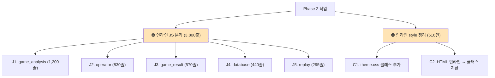
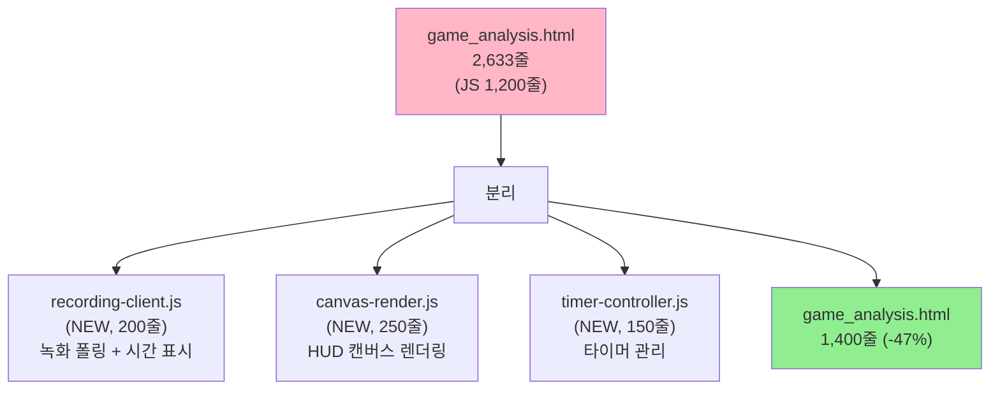

# 🟠 UI 최적화 Phase 2 — 인라인 JS/CSS 분리

> **HTML 5개에 있는 인라인 JS 3,800줄 + 인라인 style 616건 분리. 2주 작업.**
> 작성일: 2026-05-23 / 우선순위: 🟠 중요

---

## 🎯 목표

> **HTML 파일을 가볍게 + JS/CSS 모듈화 + 캐싱 효율 향상.**

---

## 📊 작업 항목



---

## 1. J1 — `game_analysis.html` (가장 큼)

### 1.1 현재

[courtview_ui/templates/pages/game_analysis.html](../../../courtview_ui/templates/pages/game_analysis.html):
- 총 2,633줄
- 인라인 JS **1,200줄 (45%)**
- 200줄 이상 함수 1개 (캔버스 렌더링)

### 1.2 분리 제안



### 1.3 파일별 책임

#### `recording-client.js` (NEW)

```javascript
// courtview_ui/static/js/recording-client.js
class RecordingClient {
    constructor() {
        this._timer = null;
        this._startTime = null;
    }

    async start() {
        const result = await API.engine('POST', '/recording/start');
        if (result.success) {
            this._startTime = Date.now();
            this._startTimer();
        }
        return result;
    }

    async stop() {
        this._stopTimer();
        return await API.engine('POST', '/recording/stop');
    }

    async getStatus() {
        return await API.engine('GET', '/recording/status');
    }

    _startTimer() {
        this._timer = setInterval(() => {
            const elapsed = (Date.now() - this._startTime) / 1000;
            this._renderTime(elapsed);
        }, 1000);
    }

    _stopTimer() {
        if (this._timer) {
            clearInterval(this._timer);
            this._timer = null;
        }
    }

    _renderTime(elapsed) {
        const el = document.getElementById('rec-time');
        if (el) el.textContent = formatDuration(elapsed);
    }

    dispose() {
        this._stopTimer();
    }
}

window.RecordingClient = RecordingClient;
```

#### `canvas-render.js` (NEW)

```javascript
// courtview_ui/static/js/canvas-render.js
class HUDCanvasRenderer {
    constructor(canvasEl) {
        this._canvas = canvasEl;
        this._ctx = canvasEl.getContext('2d');
        this._state = {};
    }

    render(frameData) {
        this._clear();
        this._drawCamera(frameData.detection);
        this._drawPlayers(frameData.players);
        this._drawBall(frameData.ball);
        this._drawHoop(frameData.hoops);
        this._drawEvents(frameData.events);
    }

    _drawPlayers(players) {
        players.forEach(p => {
            this._ctx.fillStyle = p.team_color;
            this._ctx.fillRect(p.bbox.x, p.bbox.y, p.bbox.w, p.bbox.h);
            // ... 이전 인라인 JS 의 200줄 로직
        });
    }

    // ... 다른 _drawXxx 메서드
}

window.HUDCanvasRenderer = HUDCanvasRenderer;
```

#### `timer-controller.js` (NEW)

```javascript
// courtview_ui/static/js/timer-controller.js
class GameTimerController {
    constructor() {
        this._timers = new Set();
    }

    add(fn, ms) {
        const id = setInterval(fn, ms);
        this._timers.add(id);
        return id;
    }

    clear(id) {
        clearInterval(id);
        this._timers.delete(id);
    }

    clearAll() {
        this._timers.forEach(id => clearInterval(id));
        this._timers.clear();
    }

    // Visibility API 자동 처리
    handleVisibility(onHide, onShow) {
        document.addEventListener('visibilitychange', () => {
            if (document.hidden) onHide?.();
            else onShow?.();
        });
    }
}

window.GameTimerController = GameTimerController;
```

### 1.4 game_analysis.html 변경 — 단축된 인라인 JS

```html
<!-- game_analysis.html (1,400줄로 축소) -->

<script src="/static/js/recording-client.js"></script>
<script src="/static/js/canvas-render.js"></script>
<script src="/static/js/timer-controller.js"></script>

<script>
const recClient = new RecordingClient();
const hudRenderer = new HUDCanvasRenderer(document.getElementById('hud-canvas'));
const timerCtrl = new GameTimerController();

// Visibility 자동 처리
timerCtrl.handleVisibility(
    () => timerCtrl.clearAll(),
    () => startAllTimers(),
);

// 게임 시작
async function startGame() {
    await recClient.start();
    timerCtrl.add(syncState, 1000);
}

// WebSocket 이벤트 → HUD 렌더
cvWS.on('frame', (data) => hudRenderer.render(data));

// 페이지 떠날 때
window.addEventListener('beforeunload', () => {
    recClient.dispose();
    timerCtrl.clearAll();
});
</script>
```

**예상 소요**: **3일**

---

## 2. J2 — `operator.html` 분리

### 2.1 현재

- 총 2,086줄, 인라인 JS 830줄
- 이미 `ops.js`, `auth-client.js`, `api.js` 외부 로드 중
- 그러나 팀/선수 렌더링 + 핫키 처리 인라인

### 2.2 분리 제안

```javascript
// courtview_ui/static/js/operator-controller.js (NEW, 200줄)
class OperatorController {
    constructor() {
        this._timers = new GameTimerController();
        this._hotkeys = new Map();
    }

    init() {
        this._registerHotkeys();
        this._startTimers();
    }

    _registerHotkeys() {
        this._hotkeys.set('M', () => this._scoreHome(2));
        this._hotkeys.set('N', () => this._scoreAway(2));
        this._hotkeys.set('K', () => this._foulHome());
        this._hotkeys.set('L', () => this._foulAway());
        this._hotkeys.set('T', () => this._timeoutHome());
        // ...

        document.addEventListener('keydown', (e) => {
            const fn = this._hotkeys.get(e.key.toUpperCase());
            if (fn) fn();
        });
    }

    _scoreHome(points) {
        // 점수 +
        Ops.publish('score_update', { team: 'home', points });
    }

    // ... 다른 핫키 핸들러

    dispose() {
        this._timers.clearAll();
    }
}

window.OperatorController = OperatorController;
```

**예상 소요**: **2일**

---

## 3. J3 — `game_result.html` 분리

### 3.1 현재

- 총 1,635줄, 인라인 JS 570줄
- 6 섹션: 쿼터/팀스탯/MVP/리더/박스/샷차트

### 3.2 분리 제안

```javascript
// courtview_ui/static/js/result-renderer.js (NEW, 350줄)
class ResultRenderer {
    constructor() {
        this._sessionData = null;
    }

    async load(sessionId) {
        this._sessionData = await API.engine('GET', `/finalize/results/${sessionId}`);
        this.renderAll();
    }

    renderAll() {
        this._renderScoreboard();
        this._renderTeamStats();
        this._renderLeaders();
        this._renderBoxScore();
        this._renderShotChart();
        this._renderMomentum();
    }

    _renderShotChart() {
        // 캔버스 기반 차트 (cv-graph.js 사용 가능)
        const ctx = document.getElementById('shot-chart').getContext('2d');
        // ... 인라인 JS 의 차트 로직
    }

    // ... 다른 _render* 메서드
}

window.ResultRenderer = ResultRenderer;
```

```javascript
// courtview_ui/static/js/graph-render.js (NEW, 180줄)
class GraphRenderer {
    static drawLine(ctx, data, opts = {}) { /* ... */ }
    static drawBar(ctx, data, opts = {}) { /* ... */ }
    static drawScatter(ctx, points, opts = {}) { /* shot chart */ }
}

window.GraphRenderer = GraphRenderer;
```

**예상 소요**: **2일**

---

## 4. J4 + J5 — `database.html` + `replay.html`

### 4.1 database.html (1,477줄)

- 인라인 JS 440줄
- 모달/CRUD 분산 잘됨 (함수 39개)
- **분리 우선순위 낮음** — 이미 잘 정리됨

→ Phase 2 대상 제외 가능. 시간 남으면 진행.

### 4.2 replay.html (1,183줄)

- 인라인 JS 295줄
- 충분히 작음
- **분리 우선순위 낮음**

→ Phase 2 대상 제외. 향후 작업.

**예상 소요**: **0일 (선택, Phase 4 로 미룸)**

---

## 5. CSS — 인라인 style 616건 정리

### 5.1 분포

| HTML 파일 | 인라인 style 개수 |
|---|---|
| `game_result.html` | 165 |
| `game_analysis.html` | 145 |
| `operator.html` | 83 |
| `equipment.html` | 60+ |
| `calibrate.html` | 50+ |
| 기타 | ~120 |

### 5.2 패턴 분석 — 자주 쓰는 인라인

```html
<!-- 패턴 1: 비디오 표시/숨김 -->
<video style="width:100%;height:100%;display:none;background:#000;"></video>

<!-- 패턴 2: 플렉스 컬럼 -->
<div style="display:flex;flex-direction:column;height:100%;min-height:0;">

<!-- 패턴 3: 작은 버튼 -->
<button style="height:32px;padding:0 16px;font-size:11px;letter-spacing:1px;">

<!-- 패턴 4: 상태 표시 -->
<span style="color:#FF5A1F;font-weight:600;">LIVE</span>
```

### 5.3 theme.css 추가할 유틸리티 클래스

```css
/* theme.css 또는 utilities.css (NEW) */

/* 비디오 */
.cv-video {
    width: 100%;
    height: 100%;
    background: #000;
    position: relative;
    z-index: 1;
}
.cv-video-hidden { display: none; }
.cv-video-playing { display: block; }

/* 플렉스 */
.cv-flex-col { display: flex; flex-direction: column; }
.cv-flex-col-full {
    display: flex;
    flex-direction: column;
    height: 100%;
    min-height: 0;
    overflow: hidden;
}
.cv-flex-row { display: flex; flex-direction: row; }
.cv-flex-center { display: flex; align-items: center; justify-content: center; }

/* 버튼 사이즈 */
.cv-btn-compact {
    height: 32px;
    padding: 0 16px;
    font-size: 11px;
    letter-spacing: 1px;
}
.cv-btn-sm { height: 28px; padding: 0 12px; font-size: 10px; }
.cv-btn-lg { height: 40px; padding: 0 20px; font-size: 14px; }

/* 상태 색상 */
.cv-text-hot { color: var(--hot); font-weight: 600; }
.cv-text-good { color: var(--good); font-weight: 600; }
.cv-text-bad { color: var(--bad); font-weight: 600; }

/* 동적 토글 (JS 로 추가/제거) */
.is-hidden { display: none; }
.is-visible { display: block; }
.is-active { background: var(--hot); color: white; }
```

### 5.4 HTML 변경 예시

```html
<!-- Before -->
<video style="width:100%;height:100%;display:none;background:#000;"></video>
<div style="display:flex;flex-direction:column;height:100%;min-height:0;">
<button style="height:32px;padding:0 16px;font-size:11px;">

<!-- After -->
<video class="cv-video is-hidden"></video>
<div class="cv-flex-col-full">
<button class="cv-btn-compact">
```

```javascript
// JS 에서 토글
videoEl.classList.toggle('is-hidden');
videoEl.classList.add('cv-video-playing');
```

**예상 소요**: **4일**

---

## 6. 단계별 작업 (STEP 0~8)

### STEP 0: 사전 준비 (반나절)

- [ ] Phase 1 완료 확인 (메모리 누수 해결)
- [ ] 새 브랜치: `git checkout -b feat/ui-opt-phase2-inline`
- [ ] baseline 페이지 동작 캡처 (스크린샷)

### STEP 1: J1 — game_analysis.html (3일)

- [ ] **STEP 1.1** `recording-client.js` 생성 (200줄)
- [ ] **STEP 1.2** `canvas-render.js` 생성 (250줄)
- [ ] **STEP 1.3** `timer-controller.js` 생성 (150줄)
- [ ] **STEP 1.4** `game_analysis.html` 의 인라인 JS 600줄 제거
- [ ] **STEP 1.5** 검증: 페이지 동작 동일

### STEP 2: J2 — operator.html (2일)

- [ ] **STEP 2.1** `operator-controller.js` 생성 (200줄)
- [ ] **STEP 2.2** 핫키/렌더링 분리
- [ ] **STEP 2.3** 검증

### STEP 3: J3 — game_result.html (2일)

- [ ] **STEP 3.1** `result-renderer.js` 생성 (350줄)
- [ ] **STEP 3.2** `graph-render.js` 생성 (180줄)
- [ ] **STEP 3.3** 6 섹션 렌더링 동작 확인

### STEP 4: CSS 유틸리티 클래스 (1일)

- [ ] **STEP 4.1** `theme.css` 에 유틸리티 클래스 30개 추가
- [ ] **STEP 4.2** 또는 별도 `utilities.css` 생성

### STEP 5: 인라인 style 정리 (3일)

- [ ] **STEP 5.1** `game_result.html` 165건 → 클래스 (1일)
- [ ] **STEP 5.2** `game_analysis.html` 145건 → 클래스 (1일)
- [ ] **STEP 5.3** `operator.html` + 나머지 (1일)

### STEP 6: 검증 + PR (반나절)

- [ ] 모든 페이지 시각적 동일성 확인
- [ ] PR 작성

---

## 7. 위험 / 주의사항

### 7.1 ⚠️ 인라인 JS 분리 시 closure 의존

```javascript
// HTML 안의 인라인 JS 는 페이지 변수에 직접 접근
<script>
let homeScore = 0;   // 페이지 변수
function addScore() {
    homeScore += 2;
}
</script>

// 외부 JS 로 분리 시 — 전역 변수 또는 모듈 패턴 필요
// recording-client.js
class RecordingClient {
    constructor(state) {
        this.state = state;   // 명시적 주입
    }
}
```

→ **상태 명시적 전달** 필요. 전역 변수 의존도 ↓.

### 7.2 ⚠️ 인라인 style → 클래스 치환

```html
<!-- ⚠️ JS 가 직접 style 조작하는 경우 -->
<div id="dynamic-box"></div>
<script>
document.getElementById('dynamic-box').style.backgroundColor = userColor;
</script>
```

→ 동적 색상은 인라인 유지 OK. 정적 스타일만 클래스화.

### 7.3 ⚠️ 캐싱 영향

기존:
```
HTML 매번 로드 → 2,633줄 + 1,200 JS 인라인 = 큰 페이지
```

분리 후:
```
HTML 1,400줄 (빠른 로드)
+ recording-client.js (캐시됨)
+ canvas-render.js (캐시됨)
+ timer-controller.js (캐시됨)
→ 첫 방문 후엔 JS 캐시 hit, HTML 만 새로 로드
```

→ 첫 방문은 약간 느릴 수 있지만, **반복 방문에서 빠름**.

### 7.4 ⚠️ 페이지 의존성 추가

각 페이지 `<head>` 에 새 `<script>` 태그 추가 필요:

```html
<!-- game_analysis.html -->
<script src="/static/js/recording-client.js"></script>
<script src="/static/js/canvas-render.js"></script>
<script src="/static/js/timer-controller.js"></script>
```

→ Phase 4 의 번들링으로 해결 가능.

---

## 8. 검증 방법

### 8.1 시각적 동일성

```powershell
# Before / After 스크린샷 비교
# 1. 각 페이지의 baseline 스크린샷 저장
# 2. 분리 후 동일 페이지 캡처
# 3. diff (인지 가능한 차이 없어야)
```

### 8.2 기능 동일성

- [ ] **operator**: M/N/K/L/T/Y 핫키 동작
- [ ] **game_analysis**: 8 카메라 그리드 + HUD 동작
- [ ] **game_result**: 6 섹션 모두 렌더
- [ ] **WebSocket**: 이벤트 수신 + HUD 업데이트

### 8.3 줄 수 검증

```powershell
# 목표 도달 확인
foreach ($f in @("game_analysis.html", "operator.html", "game_result.html")) {
    $path = "courtview_ui\templates\pages\$f"
    $lines = (Get-Content $path | Measure-Object -Line).Lines
    Write-Host "$f : $lines lines"
}

# 목표:
#   game_analysis.html ≤ 1,500
#   operator.html      ≤ 1,900
#   game_result.html   ≤ 1,500
```

---

## 9. 예상 소요 + 효과

| STEP | 작업 | 소요 |
|---|---|---|
| STEP 0 | 준비 | 0.5일 |
| STEP 1 | J1 game_analysis | 3일 |
| STEP 2 | J2 operator | 2일 |
| STEP 3 | J3 game_result | 2일 |
| STEP 4 | CSS 유틸리티 | 1일 |
| STEP 5 | 인라인 style 정리 | 3일 |
| STEP 6 | 검증 + PR | 0.5일 |
| **합계** | | **12 작업일** (~2주) |

### 효과

| 항목 | Before | After |
|---|---|---|
| game_analysis.html | 2,633줄 | **1,400줄 (-47%)** |
| operator.html | 2,086줄 | **1,850줄 (-11%)** |
| game_result.html | 1,635줄 | **1,300줄 (-21%)** |
| 인라인 style | 616건 | **<50건 (-92%)** |
| 새 JS 파일 | 0 | **6개** (재사용 가능) |
| 캐싱 효율 | HTML 매번 | JS 캐시 + HTML 만 |

---

## 10. 작업 체크리스트

### 시작 전
- [ ] Phase 1 완료
- [ ] baseline 스크린샷
- [ ] 새 브랜치

### 작업 중
- [ ] STEP 1: J1 → game_analysis ≤ 1,500줄
- [ ] STEP 2: J2 → operator ≤ 1,900줄
- [ ] STEP 3: J3 → game_result ≤ 1,500줄
- [ ] STEP 4: 유틸리티 클래스 30개 추가
- [ ] STEP 5: 인라인 style < 50건

### 완료 후
- [ ] 시각적 동일성 확인
- [ ] 기능 동일성 확인
- [ ] PR 작성

---

## 📖 관련 문서

- [UI_OPTIMIZATION_INDEX.md](UI_OPTIMIZATION_INDEX.md) — 종합 인덱스
- [UI_OPT_PHASE1_MEMORY_LEAKS.md](UI_OPT_PHASE1_MEMORY_LEAKS.md) — 이전 Phase
- [UI_OPT_PHASE3_API_WEBSOCKET.md](UI_OPT_PHASE3_API_WEBSOCKET.md) — 다음 Phase
- [../../UI_INVENTORY.md](../../UI_INVENTORY.md) — UI 인벤토리

---

**예상 완료**: 12 작업일 (~2주)
**다음**: Phase 3 (API/WebSocket 전환)
