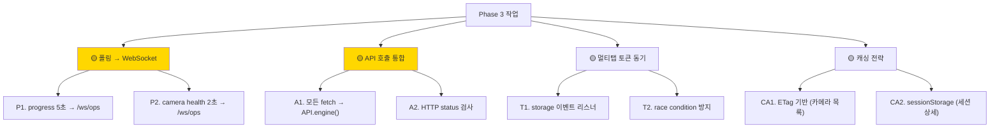
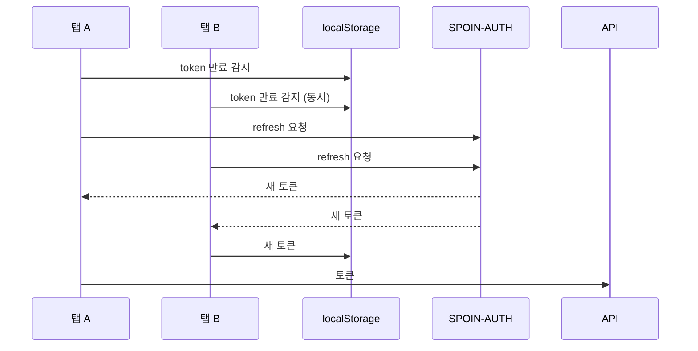

# 🟡 UI 최적화 Phase 3 — API / WebSocket 전환

> **폴링 → WebSocket 전환 + API 호출 통합 + 멀티탭 토큰 동기화. 2주 작업.**
> 작성일: 2026-05-23 / 우선순위: 🟡 권장

---

## 🎯 목표

> **대역폭 -85% + 응답성 ↑ + 멀티탭 안정성.**

---

## 📊 작업 항목



---

## 1. P1 — `/api/v1/tasks/progress` 폴링 → WebSocket

### 1.1 현재

[replay_view.html](../../../courtview_ui/templates/pages/replay_view.html):

```javascript
// ❌ 5초마다 HTTP 폴링
const progressTimer = setInterval(async () => {
    const res = await fetch('/api/v1/tasks/progress');
    const data = await res.json();
    updateProgress(data);
}, 5000);
```

### 1.2 문제점

- **대역폭 낭비**: 1쿼터 5시간 분석 = **3,600회 폴링** (HTTP overhead 큼)
- **지연**: 진행률 변화 즉시 반영 안 됨 (최대 5초)
- **백그라운드 탭에서도 계속 동작** (Phase 1 일부 해결됨)

### 1.3 WebSocket 전환

**백엔드 (`api_server`) 측 필요한 변경**:
```python
# api_server/websocket/progress_handler.py
# 진행률 변화 시 /ws/ops 또는 /ws/live 로 push
await websocket.send_json({
    "type": "progress",
    "frame_current": 1234,
    "frame_total": 5128,
    "fps": 1.15,
    "eta_sec": 14400,
})
```

**프론트 변경**:
```javascript
// ✅ replay_view.html (또는 RecordingClient 안)
cvWS.on('progress', (data) => {
    updateProgress(data);   // 즉시 반영
});

// 폴링 제거
// const progressTimer = setInterval(...);  ← 삭제
```

### 1.4 효과

```
Before:
  5초 폴링 × 1쿼터 분석 (5시간) = 3,600 HTTP 요청
  대역폭: ~500 bytes × 3,600 = 1.8 MB

After:
  WebSocket push 진행률 변경 시만
  실제 변경: ~수십 번 (큰 변화 시만)
  대역폭: ~수십 KB

→ 대역폭 -85%, 지연 -100% (즉시)
```

📄 참조: [PLAN_REPLAY_ETA_UI.md](../PLAN_REPLAY_ETA_UI.md) (진행 중인 ETA 작업)

**예상 소요**: **3일**

---

## 2. P2 — 카메라 health 폴링 → WebSocket

### 2.1 현재

[equipment.html](../../../courtview_ui/templates/pages/equipment.html):

```javascript
// ❌ 2초마다 8 카메라 헬스 체크
setInterval(async () => {
    const res = await fetch('/api/v1/camera/health');
    const cameras = await res.json();
    updateCameraGrid(cameras);
}, 2000);
```

### 2.2 문제

- **8 카메라 health → 큰 JSON** (각 카메라 stats 포함)
- **2초마다 = 30 req/min**
- **변화 없어도 폴링** (낭비)

### 2.3 WebSocket 전환

**백엔드 변경**:
```python
# api_server/services/camera_service.py
# 카메라 상태 변경 시 WebSocket 푸시
async def on_camera_state_change(camera_id, new_state):
    await ops_ws.broadcast({
        "type": "camera_state",
        "camera_id": camera_id,
        "state": new_state,
        "timestamp": time.time(),
    })
```

**프론트 변경**:
```javascript
// ✅ equipment.html
cvWS.on('camera_state', (data) => {
    updateCameraTile(data.camera_id, data.state);
});

// 초기 로드 1회만 폴링 (스냅샷)
const initial = await API.engine('GET', '/camera/health');
renderCameraGrid(initial);
```

**예상 소요**: **2일**

---

## 3. A1 — 모든 fetch → API.engine() 통합

### 3.1 직접 fetch 호출 (Phase 1 이외)

| 위치 | 현재 | 수정 |
|---|---|---|
| `equipment.html:506` | `fetch('/api/v1/camera/{id}/calibration')` | `API.engine('POST', '/camera/{id}/calibration', body)` |
| `equipment.html:673` | `fetch('/api/v1/metrics/storage')` | `API.engine('GET', '/metrics/storage')` |
| `equipment.html:683` | `fetch('/api/v1/game/status')` | `API.engine('GET', '/game/status')` |
| `replay_view.html:345` | `Auth.fetch('/api/v1/recording/sessions/{id}')` | `API.engine('GET', '/recording/sessions/{id}')` |
| 기타 | grep 결과 | (전수조사) |

### 3.2 grep 명령

```powershell
# 직접 fetch 호출 모두 찾기
Select-String -Path "courtview_ui\templates\**\*.html" `
              -Pattern "fetch\(['\""]/api/" `
              -AllMatches | Select Path, LineNumber, Line
```

### 3.3 효과

```javascript
// Before
try {
    const res = await fetch('/api/v1/metrics/storage');
    if (!res.ok) throw new Error(res.statusText);
    const data = await res.json();
    // ...
} catch (e) {
    console.error(e);
}

// After
const { success, data, error } = await API.engine('GET', '/metrics/storage');
if (!success) {
    logger.error('storage', error);
    return;
}
// data 사용
```

**예상 소요**: **1.5일**

---

## 4. A2 — HTTP status 검사

### 4.1 현재 — api.js 의 누락

```javascript
// ❌ api.js — status 검사 없음
async function callApi(endpoint, method, path, body) {
    try {
        const res = await fetch(endpoint + path, {
            method,
            headers: { 'Content-Type': 'application/json' },
            body: body ? JSON.stringify(body) : undefined,
        });
        return await res.json();   // ← 200 OK 가정
    } catch (e) {
        return { success: false, message: e.message };
    }
}
```

### 4.2 수정안

```javascript
// ✅ status 분기 처리
async function callApi(endpoint, method, path, body) {
    try {
        const res = await fetch(endpoint + path, {
            method,
            headers: { 'Content-Type': 'application/json' },
            body: body ? JSON.stringify(body) : undefined,
        });

        // 상태 코드별 분기
        if (res.status === 401) {
            // 토큰 만료 → auth-client 가 자동 처리 (재시도)
            return { success: false, error: 'auth_required', status: 401 };
        }
        if (res.status === 404) {
            return { success: false, error: 'not_found', status: 404 };
        }
        if (res.status === 500) {
            return { success: false, error: 'server_error', status: 500 };
        }
        if (!res.ok) {
            return { success: false, error: res.statusText, status: res.status };
        }

        const data = await res.json();
        return { success: true, data };
    } catch (e) {
        // 네트워크 오류
        return { success: false, error: 'network_error', message: e.message };
    }
}
```

**예상 소요**: **반나절**

---

## 5. T1 — 멀티탭 토큰 동기화

### 5.1 문제 — Race Condition



### 5.2 수정안 — storage 이벤트로 동기화

```javascript
// auth-client.js 에 추가

class AuthSync {
    constructor() {
        this._lastSync = Date.now();
        this._listen();
    }

    _listen() {
        // 다른 탭이 토큰 갱신 → storage 이벤트
        window.addEventListener('storage', (e) => {
            if (e.key === 'access_token' && e.newValue) {
                console.log('[AUTH] 다른 탭에서 토큰 갱신됨, 동기화');
                Auth._token = e.newValue;
                this._lastSync = Date.now();
            }
        });
    }

    // refresh 시작 전 — 다른 탭이 이미 갱신했나 확인
    async checkPendingRefresh() {
        const stored = localStorage.getItem('access_token');
        if (stored !== Auth._token) {
            // 다른 탭이 갱신함, 우리는 새 토큰 사용
            Auth._token = stored;
            return true;   // 재시도 안 함
        }
        return false;
    }
}

const authSync = new AuthSync();

// 기존 refresh 로직 수정
async function refreshAccessToken() {
    // 이미 다른 탭이 갱신했나?
    if (await authSync.checkPendingRefresh()) {
        return Auth._token;
    }

    // _refreshPromise 단일 플라이트 (기존 코드)
    if (_refreshPromise) return _refreshPromise;

    _refreshPromise = doRefresh();
    return _refreshPromise.finally(() => {
        _refreshPromise = null;
    });
}
```

### 5.3 검증

```javascript
// 두 탭에서 동시에 401 발생 시
// → 한 탭만 refresh, 다른 탭은 즉시 새 토큰 사용
```

**예상 소요**: **2일**

---

## 6. CA1 — ETag 기반 캐싱 (카메라 목록)

### 6.1 현재

```javascript
// 매번 전체 카메라 목록 받아옴
const cameras = await API.engine('GET', '/camera/list');
```

### 6.2 수정안 — ETag 검증

**백엔드**:
```python
# api_server/routes/v1/camera_routes.py
from fastapi import Response

@router.get("/camera/list")
async def list_cameras(response: Response, if_none_match: str | None = Header(None)):
    cameras = camera_service.list()
    etag = hashlib.md5(json.dumps(cameras).encode()).hexdigest()

    if if_none_match == etag:
        response.status_code = 304
        return None

    response.headers["ETag"] = etag
    response.headers["Cache-Control"] = "private, max-age=60"
    return cameras
```

**프론트**:
```javascript
// api.js 에 ETag 캐시 추가
class APICache {
    constructor() {
        this._etags = new Map();
        this._data = new Map();
    }

    async get(endpoint, path) {
        const key = endpoint + path;
        const etag = this._etags.get(key);

        const res = await fetch(endpoint + path, {
            headers: etag ? { 'If-None-Match': etag } : {},
        });

        if (res.status === 304) {
            // 변경 없음 → 캐시 반환
            return this._data.get(key);
        }

        const data = await res.json();
        const newEtag = res.headers.get('ETag');
        if (newEtag) {
            this._etags.set(key, newEtag);
            this._data.set(key, data);
        }
        return data;
    }
}
```

**예상 소요**: **1일**

---

## 7. CA2 — sessionStorage 캐싱 (세션 상세)

### 7.1 현재

```javascript
// replay_view.html — 매번 GET
const session = await API.engine('GET', `/recording/sessions/${id}`);
```

### 7.2 수정안

```javascript
function getSessionCached(sessionId) {
    const cacheKey = `cv_session_${sessionId}`;

    // sessionStorage 캐시 확인
    const cached = sessionStorage.getItem(cacheKey);
    if (cached) {
        const { data, ts } = JSON.parse(cached);
        // 5분 이내면 캐시 사용
        if (Date.now() - ts < 5 * 60 * 1000) {
            return Promise.resolve(data);
        }
    }

    // 캐시 없음/만료 → API
    return API.engine('GET', `/recording/sessions/${sessionId}`).then(({ data }) => {
        sessionStorage.setItem(cacheKey, JSON.stringify({
            data,
            ts: Date.now(),
        }));
        return data;
    });
}
```

**예상 소요**: **반나절**

---

## 8. 단계별 작업 (STEP 0~8)

### STEP 0: 사전 준비 (반나절)

- [ ] Phase 1, 2 완료 확인
- [ ] 새 브랜치: `git checkout -b feat/ui-opt-phase3-api`
- [ ] 백엔드 팀과 WebSocket 메시지 스키마 합의

### STEP 1: A1 — 직접 fetch 통합 (1.5일)

- [ ] grep 으로 모든 fetch 호출 찾기
- [ ] `API.engine()` 으로 변환
- [ ] 에러 처리 통일

### STEP 2: A2 — HTTP status 검사 (반나절)

- [ ] `api.js` 에 status 분기 추가
- [ ] 단위 테스트

### STEP 3: P1 — progress → WebSocket (3일)

- [ ] 백엔드: `/ws/ops` 에 progress 메시지 추가
- [ ] 프론트: 폴링 제거, WS 핸들러 추가
- [ ] 검증: 5초 폴링 → 즉시 반영

### STEP 4: P2 — camera health → WebSocket (2일)

- [ ] 백엔드: 카메라 상태 변경 시 push
- [ ] 프론트: 초기 1회 + WS 푸시
- [ ] 검증

### STEP 5: T1 — 멀티탭 토큰 동기 (2일)

- [ ] `AuthSync` 클래스 추가
- [ ] `storage` 이벤트 리스너
- [ ] race condition 시뮬레이션 테스트

### STEP 6: CA1 — ETag 캐싱 (1일)

- [ ] 백엔드: ETag 헤더 추가
- [ ] 프론트: `APICache` 클래스
- [ ] 304 응답 처리

### STEP 7: CA2 — sessionStorage 캐싱 (반나절)

- [ ] 세션 상세 캐싱
- [ ] 5분 TTL

### STEP 8: 검증 + PR (반나절)

- [ ] 모든 페이지 동작
- [ ] WebSocket 정상 / 폴링 제거 확인
- [ ] 멀티탭 시나리오 검증
- [ ] PR 작성

---

## 9. 위험 / 주의사항

### 9.1 ⚠️ 백엔드 변경 필요

Phase 3 의 P1, P2 는 백엔드 협조 필요:
- `/ws/ops` 에 새 메시지 타입 (`progress`, `camera_state`)
- ETag 헤더 추가

→ **백엔드 팀과 사전 합의** 필수. 백엔드 작업이 늦으면 Phase 3 도 늦어짐.

### 9.2 ⚠️ WebSocket 끊김 시 폴백

```javascript
// 안전망
cvWS.on('disconnect', () => {
    // WS 끊김 → 폴링으로 임시 폴백
    logger.warn('ws', 'disconnected, falling back to polling');
    fallbackTimer = setInterval(checkProgress, 10000);
});

cvWS.on('connect', () => {
    // 재연결 → 폴링 중단
    if (fallbackTimer) {
        clearInterval(fallbackTimer);
        fallbackTimer = null;
    }
});
```

### 9.3 ⚠️ sessionStorage 용량 한계

- 일반 ~5MB 제한
- 세션 데이터가 클 수 있음 (스탯/이벤트)
- 캐시 크기 모니터링 + 오래된 항목 제거

```javascript
function cleanOldCache() {
    Object.keys(sessionStorage).forEach(key => {
        if (key.startsWith('cv_session_')) {
            const { ts } = JSON.parse(sessionStorage.getItem(key) || '{}');
            if (Date.now() - ts > 24 * 60 * 60 * 1000) {   // 24시간
                sessionStorage.removeItem(key);
            }
        }
    });
}
```

### 9.4 ⚠️ ETag 충돌

같은 데이터에 대해 백엔드가 다른 ETag 를 줄 수 있음 (직렬화 순서 차이).

→ ETag 생성 시 **정렬된 JSON** 사용:
```python
etag = hashlib.md5(json.dumps(data, sort_keys=True).encode()).hexdigest()
```

---

## 10. 검증 방법

### 10.1 폴링 → WS 효과 측정

```javascript
// 네트워크 탭 — Before
// /api/v1/tasks/progress: 5초마다 ~720회/시간
// /api/v1/camera/health: 2초마다 1,800회/시간

// 네트워크 탭 — After
// /ws/ops: 1개 영속 연결
// progress 메시지: ~수십 회/시간 (변화 시만)
```

### 10.2 멀티탭 시나리오

```javascript
// 1. 두 탭 동시 열기 (operator + scoreboard)
// 2. 한 탭에서 강제로 토큰 만료 (개발자 도구)
//    localStorage.setItem('access_token_exp', 0);
// 3. 두 탭에서 API 호출 트리거
// 4. 한 탭만 refresh 발생 확인

// 콘솔 로그:
// 탭 A: [AUTH] refreshing...
// 탭 B: [AUTH] 다른 탭에서 토큰 갱신됨, 동기화
```

### 10.3 ETag 검증

```javascript
// Chrome DevTools Network
// 1. 카메라 목록 첫 호출 → 200 OK, ETag 헤더
// 2. 같은 호출 재시도 → 304 Not Modified
// 3. 데이터 변경 후 호출 → 200 OK, 새 ETag
```

---

## 11. 예상 소요 + 효과

| STEP | 작업 | 소요 |
|---|---|---|
| STEP 0 | 준비 | 0.5일 |
| STEP 1 | A1 fetch 통합 | 1.5일 |
| STEP 2 | A2 status 검사 | 0.5일 |
| STEP 3 | P1 progress WS | 3일 |
| STEP 4 | P2 camera health WS | 2일 |
| STEP 5 | T1 멀티탭 토큰 | 2일 |
| STEP 6 | CA1 ETag | 1일 |
| STEP 7 | CA2 sessionStorage | 0.5일 |
| STEP 8 | 검증 + PR | 0.5일 |
| **합계** | | **11.5 작업일** (~2주) |

### 효과

| 항목 | Before | After |
|---|---|---|
| progress 폴링 | 5초 (720/시간) | WS push (~수십/시간) |
| camera health 폴링 | 2초 (1,800/시간) | WS push |
| 직접 fetch | 4건 | 0건 (전부 API.engine) |
| 멀티탭 race | ⚠️ 위험 | 안전 (storage 동기) |
| 응답성 | 5초 지연 | 즉시 |
| 대역폭 | ~2 MB/시간 | ~수십 KB/시간 (**-85%**) |

---

## 12. 작업 체크리스트

### 시작 전
- [ ] Phase 1, 2 완료
- [ ] 백엔드 팀과 메시지 스키마 합의
- [ ] 새 브랜치

### 작업 중
- [ ] STEP 1: 모든 fetch → API.engine
- [ ] STEP 3: progress WS 전환 → 5초 지연 제거 확인
- [ ] STEP 4: camera health WS → 폴링 종료
- [ ] STEP 5: 멀티탭 race 시나리오 통과
- [ ] STEP 6-7: 캐싱 적용 → 응답 시간 단축

### 완료 후
- [ ] 모든 폴링 → WS 또는 visibility 적용
- [ ] 멀티탭 안정성 검증
- [ ] PR 작성

---

## 📖 관련 문서

- [UI_OPTIMIZATION_INDEX.md](UI_OPTIMIZATION_INDEX.md) — 종합 인덱스
- [UI_OPT_PHASE2_INLINE_JS_CSS.md](UI_OPT_PHASE2_INLINE_JS_CSS.md) — 이전 Phase
- [UI_OPT_PHASE4_MODULARIZATION.md](UI_OPT_PHASE4_MODULARIZATION.md) — 다음 Phase
- [PLAN_REPLAY_ETA_UI.md](../PLAN_REPLAY_ETA_UI.md) — 진행 중 ETA 작업 (연계)
- [DATA_FLOW_CONTRACT.md](../../project/architecture/DATA_FLOW_CONTRACT.md) §11 — REST API + WS 스키마

---

**예상 완료**: 11.5 작업일 (~2주)
**다음**: Phase 4 (모듈화 + 번들링)
