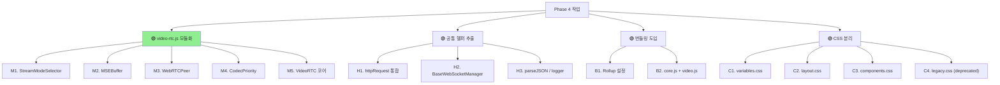

# 🟢 UI 최적화 Phase 4 — 모듈화 + 번들링

> **video-rtc.js (717줄) 분리 + 공통 헬퍼 추출 + 번들링 도입. 1주 작업.**
> 작성일: 2026-05-23 / 우선순위: 🟢 장기

---

## 🎯 목표

> **장기 유지보수성 향상 — 거대 JS 분리 + HTTP 요청 통합.**

---

## 📊 작업 항목



---

## 1. M — `video-rtc.js` 모듈화 (가장 큰 작업)

### 1.1 현재 — 717줄 monolith

```
video-rtc.js (717줄)
├── 1-143: 초기화 + config 설정
├── 196-234: connectedCallback / disconnectedCallback
├── 316-404: onconnect / onopen
├── 427-509: onmse() — MSE 디코딩 (2MB 버퍼)
├── 511-581: onwebrtc() — RTCPeerConnection
├── 613-652: onpcvideo() — 코덱 우선순위
└── 654-706: onmjpeg / onhls / onmp4 — fallback
```

### 1.2 분리 후 구조

```
courtview_ui/static/js/video/             NEW 폴더
├── stream-mode-selector.js              (~50줄)
├── mse-buffer.js                        (~80줄)
├── webrtc-peer.js                       (~70줄)
├── codec-priority.js                    (~40줄)
└── video-rtc.js                         (~200줄, 코어만)
```

### 1.3 각 모듈 책임

#### `stream-mode-selector.js` (50줄)

```javascript
// courtview_ui/static/js/video/stream-mode-selector.js
export class StreamModeSelector {
    static MODES = {
        MSE: 'mse',
        WEBRTC: 'webrtc',
        MJPEG: 'mjpeg',
        HLS: 'hls',
        MP4: 'mp4',
    };

    static select(serverCaps, browserCaps) {
        // 우선순위: WebRTC > MSE > MJPEG > HLS > MP4
        if (serverCaps.webrtc && browserCaps.webrtc) {
            return StreamModeSelector.MODES.WEBRTC;
        }
        if (serverCaps.mse && browserCaps.mse) {
            return StreamModeSelector.MODES.MSE;
        }
        // ... fallback
        return StreamModeSelector.MODES.MJPEG;
    }

    static canPlay(mimeType) {
        const video = document.createElement('video');
        return !!video.canPlayType(mimeType);
    }
}
```

#### `mse-buffer.js` (80줄)

```javascript
// courtview_ui/static/js/video/mse-buffer.js
export class MSEBuffer {
    constructor(video, mimeType) {
        this.video = video;
        this.mimeType = mimeType;
        this.mediaSource = new MediaSource();
        this.sourceBuffer = null;
        this.queue = new Uint8Array(2 * 1024 * 1024);  // 2MB
        this.queueLen = 0;
    }

    async init() {
        this.video.src = URL.createObjectURL(this.mediaSource);

        await new Promise(resolve => {
            this.mediaSource.addEventListener('sourceopen', () => {
                this.sourceBuffer = this.mediaSource.addSourceBuffer(this.mimeType);
                this.sourceBuffer.addEventListener('updateend', () => this._flushQueue());
                resolve();
            });
        });
    }

    append(segment) {
        if (this.sourceBuffer.updating) {
            // 큐에 보관
            this.queue.set(segment, this.queueLen);
            this.queueLen += segment.length;
        } else {
            this.sourceBuffer.appendBuffer(segment);
        }
    }

    _flushQueue() {
        if (this.queueLen > 0) {
            const data = this.queue.slice(0, this.queueLen);
            this.queueLen = 0;
            this.sourceBuffer.appendBuffer(data);
        }
    }

    dispose() {
        if (this.mediaSource.readyState === 'open') {
            this.mediaSource.endOfStream();
        }
        URL.revokeObjectURL(this.video.src);
    }
}
```

#### `webrtc-peer.js` (70줄)

```javascript
// courtview_ui/static/js/video/webrtc-peer.js
export class WebRTCPeer {
    constructor(iceServers = []) {
        this.pc = new RTCPeerConnection({ iceServers });
        this.video = null;
    }

    async negotiate(serverOfferUrl) {
        // 트랜시버 추가
        this.pc.addTransceiver('video', { direction: 'recvonly' });
        this.pc.addTransceiver('audio', { direction: 'recvonly' });

        // Offer 생성
        const offer = await this.pc.createOffer();
        await this.pc.setLocalDescription(offer);

        // 서버에 전송
        const response = await fetch(serverOfferUrl, {
            method: 'POST',
            headers: { 'Content-Type': 'application/sdp' },
            body: offer.sdp,
        });
        const answerSdp = await response.text();

        await this.pc.setRemoteDescription({
            type: 'answer',
            sdp: answerSdp,
        });
    }

    attachVideo(videoEl) {
        this.video = videoEl;
        this.pc.ontrack = (e) => {
            this.video.srcObject = e.streams[0];
        };
    }

    dispose() {
        this.pc.close();
        this.pc = null;
    }
}
```

#### `codec-priority.js` (40줄)

```javascript
// courtview_ui/static/js/video/codec-priority.js
export class CodecPriority {
    static H264_PROFILES = {
        BASELINE: 0x42,
        MAIN: 0x4D,
        HIGH: 0x64,
    };

    static getPriority(codec) {
        // H.264 High > Main > Baseline
        // VP9, AV1 등은 후순위
        if (codec.startsWith('avc1.0240')) return 100;  // H.264 High
        if (codec.startsWith('avc1.0220')) return 80;   // H.264 Main
        if (codec.startsWith('avc1.0142')) return 60;   // H.264 Baseline
        if (codec.startsWith('vp09')) return 40;
        if (codec.startsWith('av01')) return 20;
        return 0;
    }

    static sortByPriority(codecs) {
        return [...codecs].sort(
            (a, b) => CodecPriority.getPriority(b) - CodecPriority.getPriority(a)
        );
    }
}
```

#### `video-rtc.js` (200줄, 코어만)

```javascript
// courtview_ui/static/js/video/video-rtc.js
import { StreamModeSelector } from './stream-mode-selector.js';
import { MSEBuffer } from './mse-buffer.js';
import { WebRTCPeer } from './webrtc-peer.js';
import { CodecPriority } from './codec-priority.js';

export class VideoRTC extends HTMLElement {
    constructor() {
        super();
        this.ws = null;
        this.mode = null;
        this.peer = null;
        this.buffer = null;
        this.observer = null;

        // 핸들러 보관 (Phase 1 의 메모리 누수 수정 반영)
        this._onOpen = () => this.onopen();
        this._onMessage = (e) => this.onmessage(e);
        this._onClose = () => this.ondisconnect();
    }

    connectedCallback() {
        this._setupObserver();
        this.onconnect();
    }

    disconnectedCallback() {
        this._cleanupObserver();
        this.ondisconnect();
    }

    onconnect() {
        const wsUrl = this.getAttribute('src');
        this.ws = new WebSocket(wsUrl);
        this.ws.addEventListener('open', this._onOpen);
        this.ws.addEventListener('message', this._onMessage);
        this.ws.addEventListener('close', this._onClose);
    }

    onopen() {
        // 서버 capabilities 협상
        this.ws.send(JSON.stringify({ type: 'capabilities' }));
    }

    onmessage(event) {
        const data = JSON.parse(event.data);

        if (data.type === 'capabilities') {
            // 모드 선택
            this.mode = StreamModeSelector.select(data.server, this._browserCaps());
            this._startMode(this.mode);
        }
        else if (data.type === 'segment' && this.buffer) {
            this.buffer.append(new Uint8Array(data.data));
        }
    }

    _startMode(mode) {
        if (mode === StreamModeSelector.MODES.WEBRTC) {
            this.peer = new WebRTCPeer();
            this.peer.attachVideo(this.querySelector('video'));
            this.peer.negotiate(`/api/webrtc/${this.id}`);
        }
        else if (mode === StreamModeSelector.MODES.MSE) {
            const mime = `video/mp4; codecs="avc1.640028"`;
            this.buffer = new MSEBuffer(this.querySelector('video'), mime);
            this.buffer.init();
        }
        // ... fallback modes
    }

    ondisconnect() {
        if (this.ws) {
            this.ws.removeEventListener('open', this._onOpen);
            this.ws.removeEventListener('message', this._onMessage);
            this.ws.removeEventListener('close', this._onClose);
            this.ws.close();
            this.ws = null;
        }
        if (this.peer) {
            this.peer.dispose();
            this.peer = null;
        }
        if (this.buffer) {
            this.buffer.dispose();
            this.buffer = null;
        }
    }

    _setupObserver() {
        this.observer = new IntersectionObserver((entries) => {
            entries.forEach(entry => {
                if (entry.isIntersecting) this.play();
                else this.pause();
            });
        });
        this.observer.observe(this);
    }

    _cleanupObserver() {
        if (this.observer) {
            this.observer.disconnect();
            this.observer = null;
        }
    }

    _browserCaps() {
        return {
            webrtc: 'RTCPeerConnection' in window,
            mse: 'MediaSource' in window,
            mjpeg: true,
        };
    }
}

customElements.define('video-rtc', VideoRTC);
```

**예상 소요**: **3일**

---

## 2. H — 공통 헬퍼 추출

### 2.1 H1 — `httpRequest()` 통합

#### 현재 — `api.js` 의 3개 래퍼

```javascript
// ❌ 90% 동일한 코드 3개
const API = {
    engine: async (method, path, body) => { ... },
    cloud: async (method, path, body) => { ... },
    spoin: async (method, path, body) => { ... },
};
```

#### 수정

```javascript
// ✅ courtview_ui/static/js/core/http.js
const ENDPOINTS = {
    engine: '',           // 동일 origin
    cloud: '',            // 동일 origin /cloud
    spoin: '',            // 동일 origin /spoin
};

export async function httpRequest(target, method, path, body = null) {
    const endpoint = ENDPOINTS[target];
    const url = endpoint + path;

    try {
        const res = await fetch(url, {
            method,
            headers: {
                'Content-Type': 'application/json',
                'Authorization': `Bearer ${Auth.getToken()}`,
            },
            body: body ? JSON.stringify(body) : undefined,
        });

        // 상태 검사 (Phase 3 와 통합)
        if (res.status === 401) {
            // auth-client 에 위임 (자동 refresh)
            return await Auth.handleUnauthorized(() => httpRequest(target, method, path, body));
        }
        if (!res.ok) {
            return { success: false, status: res.status, error: res.statusText };
        }

        return { success: true, data: await res.json() };
    } catch (e) {
        return { success: false, error: 'network_error', message: e.message };
    }
}

// 편의 함수
export const API = {
    engine: (method, path, body) => httpRequest('engine', method, path, body),
    cloud:  (method, path, body) => httpRequest('cloud', method, path, body),
    spoin:  (method, path, body) => httpRequest('spoin', method, path, body),
};
```

**예상 소요**: **반나절**

### 2.2 H2 — `BaseWebSocketManager`

#### 현재 — 재연결 로직 3곳

| 위치 | 재연결 로직 |
|---|---|
| `ops.js:47-52` | `setTimeout(connect, 2000)` |
| `websocket.js:39` | `setTimeout(() => this.connect(), ...)` |
| `webrtc-stream.js:85-92` | `scheduleReconnect()` |

#### 수정

```javascript
// ✅ courtview_ui/static/js/core/base-ws-manager.js
export class BaseWebSocketManager {
    constructor(url, options = {}) {
        this.url = url;
        this.ws = null;
        this.reconnectDelay = options.reconnectDelay || 1000;
        this.maxDelay = options.maxDelay || 30000;
        this.currentDelay = this.reconnectDelay;
        this._reconnectTimer = null;
        this._handlers = new Map();
        this._stopped = false;
    }

    connect() {
        if (this._stopped) return;
        if (this.ws && this.ws.readyState !== WebSocket.CLOSED) return;

        this.ws = new WebSocket(this.url);
        this.ws.onopen = () => {
            this.currentDelay = this.reconnectDelay;   // 리셋
            this._emit('open');
        };
        this.ws.onmessage = (e) => {
            try {
                const data = JSON.parse(e.data);
                this._emit('message', data);
            } catch (err) {
                console.error('JSON parse error:', err);
            }
        };
        this.ws.onclose = () => {
            this._emit('close');
            this._scheduleReconnect();
        };
        this.ws.onerror = (err) => this._emit('error', err);
    }

    disconnect() {
        this._stopped = true;
        if (this._reconnectTimer) {
            clearTimeout(this._reconnectTimer);
            this._reconnectTimer = null;
        }
        if (this.ws) {
            this.ws.onclose = null;   // 재연결 방지
            this.ws.close();
            this.ws = null;
        }
    }

    send(data) {
        if (this.ws && this.ws.readyState === WebSocket.OPEN) {
            this.ws.send(JSON.stringify(data));
            return true;
        }
        return false;
    }

    on(event, handler) {
        if (!this._handlers.has(event)) this._handlers.set(event, []);
        this._handlers.get(event).push(handler);
    }

    off(event, handler) {
        const handlers = this._handlers.get(event) || [];
        this._handlers.set(event, handlers.filter(h => h !== handler));
    }

    _emit(event, data) {
        (this._handlers.get(event) || []).forEach(h => h(data));
    }

    _scheduleReconnect() {
        if (this._stopped) return;
        this._reconnectTimer = setTimeout(() => {
            this.connect();
            // Exponential backoff
            this.currentDelay = Math.min(this.currentDelay * 2, this.maxDelay);
        }, this.currentDelay);
    }
}
```

기존 코드 변경:
```javascript
// websocket.js
import { BaseWebSocketManager } from './core/base-ws-manager.js';

class CourtViewWS extends BaseWebSocketManager {
    constructor() {
        super('/ws/live');
    }
}

window.cvWS = new CourtViewWS();
```

**예상 소요**: **1일**

### 2.3 H3 — `parseJSON` + `logger`

```javascript
// courtview_ui/static/js/core/utils.js
export function parseJSON(data, fallback = null) {
    try {
        return JSON.parse(data);
    } catch {
        return fallback;
    }
}

export function logger(module, level, message, ...args) {
    const ts = new Date().toISOString();
    const prefix = `[${ts}] [${module.toUpperCase()}]`;

    switch (level) {
        case 'error':
            console.error(prefix, message, ...args);
            break;
        case 'warn':
            console.warn(prefix, message, ...args);
            break;
        case 'info':
            console.info(prefix, message, ...args);
            break;
        case 'debug':
            if (window.__DEBUG__) console.debug(prefix, message, ...args);
            break;
    }
}
```

**예상 소요**: **반나절**

---

## 3. B — 번들링 도입 (Rollup)

### 3.1 현재 — 8 JS 개별 로드

```html
<!-- layout.html -->
<script src="/static/js/auth-guard.js"></script>
<script src="/static/js/auth-client.js"></script>
<script src="/static/js/api.js"></script>
<script src="/static/js/websocket.js"></script>
<script src="/static/js/ops.js"></script>
<script type="module" src="/static/js/video-stream.js"></script>
<!-- 페이지별 추가 JS -->
```

→ **8 HTTP 요청** (병렬이지만 대기 시간 누적).

### 3.2 Rollup 설정

```javascript
// rollup.config.js (NEW)
import { nodeResolve } from '@rollup/plugin-node-resolve';
import terser from '@rollup/plugin-terser';

export default [
    // core 번들 — 모든 페이지에서 사용
    {
        input: 'courtview_ui/static/js/core/index.js',
        output: {
            file: 'courtview_ui/static/dist/core.js',
            format: 'iife',
            name: 'CV',
            sourcemap: true,
        },
        plugins: [nodeResolve(), terser()],
    },
    // video 번들 — 카메라 페이지에서만
    {
        input: 'courtview_ui/static/js/video/index.js',
        output: {
            file: 'courtview_ui/static/dist/video.js',
            format: 'iife',
            name: 'CVVideo',
            sourcemap: true,
        },
        plugins: [nodeResolve(), terser()],
    },
];
```

### 3.3 entry point

```javascript
// courtview_ui/static/js/core/index.js
export { Auth } from './auth-client.js';
export { API, httpRequest } from './http.js';
export { CourtViewWS } from '../websocket.js';
export { Ops } from '../ops.js';
export { BaseWebSocketManager } from './base-ws-manager.js';
export { parseJSON, logger } from './utils.js';

// 글로벌 노출 (호환성)
window.Auth = Auth;
window.API = API;
window.cvWS = new CourtViewWS();
window.Ops = Ops;
```

### 3.4 HTML 변경

```html
<!-- ✅ layout.html (간소화) -->
<script src="/static/js/auth-guard.js"></script>  <!-- 즉시 로드 -->
<script src="/static/dist/core.js"></script>       <!-- 번들 1개 -->
<!-- 비디오 페이지만 -->
<script src="/static/dist/video.js"></script>
```

### 3.5 빌드 스크립트

```json
// courtview_ui/package.json (NEW)
{
    "name": "courtview-ui",
    "scripts": {
        "build": "rollup -c",
        "watch": "rollup -c -w"
    },
    "devDependencies": {
        "rollup": "^4.0.0",
        "@rollup/plugin-node-resolve": "^15.0.0",
        "@rollup/plugin-terser": "^0.4.0"
    }
}
```

```powershell
# 빌드
cd courtview_ui
npm install
npm run build

# 개발 (watch)
npm run watch
```

### 3.6 효과

```
Before:
  8 JS 파일 × 평균 5KB = 40KB (gzip 후 ~15KB)
  8 HTTP 요청

After:
  core.js (22KB gzip)
  video.js (8KB gzip, 필요시만)
  2~3 HTTP 요청

→ 로딩 시간 약 30% 단축
```

**예상 소요**: **2일**

---

## 4. CSS — 분리 (theme.css 1,303줄)

### 4.1 현재 구조 (충돌)

| 영역 | 줄 범위 | 비고 |
|---|---|---|
| **레거시** | 1-862 | `--bg-main`, `.btn`, `.card`, `.sidebar` |
| **현대** | 869-1303 | `--bg-0~4`, `.cv-*` (editorial) |

### 4.2 분리 후 구조

```
courtview_ui/static/css/                  변경
├── theme.css                              (호환 shim, 모두 @import)
├── variables.css                          (~80줄, 모든 CSS 변수)
├── layout.css                             (~150줄, 그리드/플렉스)
├── components.css                         (~400줄, .cv-* 컴포넌트)
└── legacy.css                             (~600줄, deprecated, 점진 제거)
```

### 4.3 theme.css 호환 shim

```css
/* theme.css (호환 유지) */
@import 'variables.css';
@import 'layout.css';
@import 'components.css';
@import 'legacy.css';   /* 점진적 제거 예정 */
```

### 4.4 효과

| 영역 | Before | After |
|---|---|---|
| 단일 파일 | 1,303줄 | 분리 |
| Critical CSS | 전체 30KB | variables + layout (~10KB) |
| 캐싱 | 한 번에 전체 | 변경된 영역만 |

**예상 소요**: **1일**

---

## 5. 단계별 작업 (STEP 0~6)

### STEP 0: 사전 준비 (반나절)

- [ ] Phase 1, 2, 3 완료 확인
- [ ] 새 브랜치: `git checkout -b feat/ui-opt-phase4-modular`
- [ ] Node.js / npm 환경 확인

### STEP 1: M — video-rtc 모듈화 (3일)

- [ ] **STEP 1.1** `video/` 폴더 생성
- [ ] **STEP 1.2** `stream-mode-selector.js` 추출 + 테스트
- [ ] **STEP 1.3** `mse-buffer.js` 추출 + 테스트
- [ ] **STEP 1.4** `webrtc-peer.js` 추출 + 테스트
- [ ] **STEP 1.5** `codec-priority.js` 추출
- [ ] **STEP 1.6** `video-rtc.js` 코어 단순화 (717 → 200줄)
- [ ] **STEP 1.7** 카메라 스트림 동작 확인

### STEP 2: H — 공통 헬퍼 추출 (1.5일)

- [ ] **STEP 2.1** `core/http.js` — `httpRequest()` 통합
- [ ] **STEP 2.2** `core/base-ws-manager.js` 작성
- [ ] **STEP 2.3** 기존 `websocket.js`, `ops.js`, `webrtc-stream.js` 가 사용
- [ ] **STEP 2.4** `core/utils.js` — `parseJSON`, `logger`

### STEP 3: B — Rollup 번들링 (2일)

- [ ] **STEP 3.1** `package.json` + `rollup.config.js` 작성
- [ ] **STEP 3.2** core/index.js, video/index.js entry point
- [ ] **STEP 3.3** `npm run build` → `dist/core.js` + `dist/video.js`
- [ ] **STEP 3.4** HTML 의 `<script>` 태그 정리

### STEP 4: CSS 분리 (1일)

- [ ] **STEP 4.1** variables.css 분리
- [ ] **STEP 4.2** layout.css 분리
- [ ] **STEP 4.3** components.css 분리
- [ ] **STEP 4.4** legacy.css (deprecated 마크)
- [ ] **STEP 4.5** theme.css 를 @import shim 으로

### STEP 5: 통합 검증 (반나절)

- [ ] 모든 페이지 동작
- [ ] 카메라 스트림 (WebRTC / MSE / MJPEG)
- [ ] 네트워크 탭 — HTTP 요청 8 → 2~3개
- [ ] 번들 크기 측정

### STEP 6: PR + 문서화 (반나절)

- [ ] PR 작성
- [ ] README 업데이트 (빌드 방법)

---

## 6. 위험 / 주의사항

### 6.1 ⚠️ go2rtc 라이브러리 라이선스

`video-rtc.js` 첫 줄에 `MIT License - go2rtc project` 표시. 분리 시:

```javascript
// 각 분리 파일 상단에 라이선스 유지
/**
 * Originally from go2rtc project (MIT License)
 * Modified by SPOIN for COURTVIEW
 * Split from video-rtc.js (2026-XX-XX)
 */
```

### 6.2 ⚠️ ES Modules vs IIFE

```javascript
// ES Modules (현대)
import { Auth } from './auth.js';

// IIFE (호환)
(function() { ... window.Auth = ...; })();
```

→ 일부 옛 브라우저 호환성 고려. Rollup `format: 'iife'` 사용 (호환성 ↑).

### 6.3 ⚠️ 빌드 단계 추가

```
Before: HTML/JS 수정 → 새로고침 → 동작
After:  HTML/JS 수정 → npm run build → 새로고침 → 동작
```

→ **개발 흐름 변경**. `npm run watch` 자동 빌드로 완화.

### 6.4 ⚠️ Sourcemap

```javascript
// 디버깅 가능하도록 sourcemap 활성화
output: {
    file: 'dist/core.js',
    sourcemap: true,   // ← 필수
}
```

### 6.5 ⚠️ CSS @import 성능

```css
/* @import 은 추가 HTTP 요청 발생 */
@import 'variables.css';   /* 별도 다운로드 */
```

→ **Critical CSS 만 인라인** + 나머지는 별도. 또는 빌드 시 concat.

---

## 7. 검증 방법

### 7.1 모듈화 동작

```javascript
// 브라우저 콘솔
console.log(typeof CV.Auth);        // 'object'
console.log(typeof CV.API);         // 'object'
console.log(typeof CV.BaseWebSocketManager);   // 'function'
console.log(typeof CVVideo.VideoRTC);          // 'function'
```

### 7.2 번들 크기

```powershell
# 빌드 후
ls courtview_ui/static/dist/
# core.js: ~22KB (gzip ~7KB)
# video.js: ~8KB (gzip ~3KB)
```

### 7.3 HTTP 요청 수 감소

```
Chrome DevTools → Network

Before: 8 JS 파일 = 8 요청
After: core.js + video.js = 2 요청
```

### 7.4 카메라 스트림 동작

- [ ] equipment.html — 8 카메라 표시
- [ ] WebRTC 모드 → 0.3초 지연
- [ ] MSE 모드 → 작동
- [ ] MJPEG fallback → 작동

---

## 8. 예상 소요 + 효과

| STEP | 작업 | 소요 |
|---|---|---|
| STEP 0 | 준비 | 0.5일 |
| STEP 1 | M video-rtc 모듈화 | 3일 |
| STEP 2 | H 공통 헬퍼 | 1.5일 |
| STEP 3 | B 번들링 | 2일 |
| STEP 4 | CSS 분리 | 1일 |
| STEP 5 | 검증 | 0.5일 |
| STEP 6 | PR | 0.5일 |
| **합계** | | **9 작업일** (~2주, 압축 시 1주) |

### 효과

| 항목 | Before | After |
|---|---|---|
| video-rtc.js | 717줄 monolith | 5 모듈 (총 ~440줄) |
| JS 파일 로드 | 8개 (40KB) | 2개 (30KB, gzip 10KB) |
| HTTP 요청 | 8 | 2~3 |
| 로딩 시간 | 1.5~2s | ~1s (**-33%**) |
| 코드 중복 | fetch 3개, WS 재연결 3개 | 1개씩 통합 |
| CSS 분리 | 1303줄 단일 | 4 모듈 |
| 유지보수성 | 낮음 | 높음 ↑↑ |

---

## 9. 작업 체크리스트

### 시작 전
- [ ] Phase 1, 2, 3 완료
- [ ] Node.js / npm 환경
- [ ] 새 브랜치

### 작업 중
- [ ] STEP 1: video-rtc 5 모듈
- [ ] STEP 2: 공통 헬퍼 통합
- [ ] STEP 3: Rollup 빌드 → HTTP -75%
- [ ] STEP 4: CSS 4 모듈

### 완료 후
- [ ] 카메라 스트림 정상 (WebRTC/MSE/MJPEG)
- [ ] 번들 크기 측정
- [ ] PR + README 빌드 방법 추가

---

## 10. 모든 Phase 완료 후

### 최종 효과

| 항목 | Before | After (Phase 1-4) |
|---|---|---|
| 메모리 누수 | 5개 영역 | 0~1개 |
| HTML 평균 줄수 | 1,600 | 1,200 |
| 인라인 style | 616건 | <50건 |
| 폴링 대역폭 | ~2MB/시간 | ~수십 KB |
| 백그라운드 CPU | 항상 | 일시정지 |
| JS 파일 로드 | 8 HTTP | 2 HTTP |
| 로딩 시간 | 1.5~2s | ~1s |
| 코드 중복 | 다수 | 통합 |

### 종합

```
30 작업일 (6주) 투입
→ UI 가 빠르고, 안정적이고, 유지보수 가능
→ 신규 기능 추가 + 디자인 변경 쉬워짐
```

---

## 📖 관련 문서

- [UI_OPTIMIZATION_INDEX.md](UI_OPTIMIZATION_INDEX.md) — 종합 인덱스
- [UI_OPT_PHASE1_MEMORY_LEAKS.md](UI_OPT_PHASE1_MEMORY_LEAKS.md)
- [UI_OPT_PHASE2_INLINE_JS_CSS.md](UI_OPT_PHASE2_INLINE_JS_CSS.md)
- [UI_OPT_PHASE3_API_WEBSOCKET.md](UI_OPT_PHASE3_API_WEBSOCKET.md)
- [../../UI_INVENTORY.md](../../UI_INVENTORY.md)

---

**예상 완료**: 9 작업일 (~2주)
**전체 UI 최적화 완료**: 6주 (Phase 1-4 합산)
