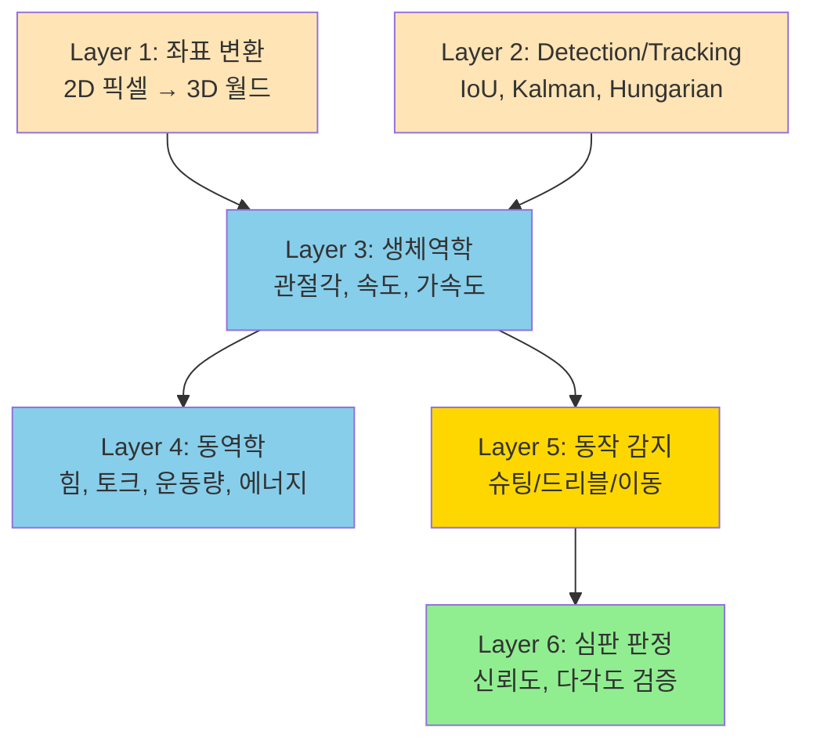
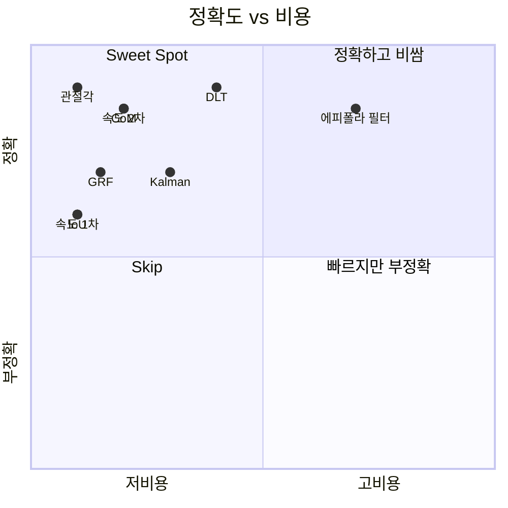

# 🧮 COURTVIEW 파이프라인 계산 코드 백과사전

> 농구 분석 파이프라인의 **모든 수학적 계산 코드** 를 한 곳에 모은 레퍼런스.
> 좌표 변환, 생체역학, 감지·트래킹, 동작 분석, 심판 판정 — 전 영역.
> 작성일: 2026-05-22 / 기준 커밋: `daf30d6`

---

## 📚 목차

1. [전체 구조 한눈에](#1-전체-구조)
2. [Layer 1 — 좌표 변환 / 3D 복원](#2-layer-1)
3. [Layer 2 — Detection / Tracking 수학](#3-layer-2)
4. [Layer 3 — 생체역학 (Kinematics)](#4-layer-3)
5. [Layer 4 — 동역학 (Dynamics)](#5-layer-4)
6. [Layer 5 — 동작 감지 (Motion Detection)](#6-layer-5)
7. [Layer 6 — 심판 판정 (AI Referee)](#7-layer-6)
8. [한눈에 보는 계산 카탈로그](#8-카탈로그)

---

## 1. 전체 구조 한눈에 {#1-전체-구조}



---

## 2. Layer 1 — 좌표 변환 / 3D 복원 {#2-layer-1}

**파일**: [infrastructure/multi_camera/coordinate_transformer.py](../infrastructure/multi_camera/coordinate_transformer.py)

### 2.1 사전 계산되는 행렬 (line 143-156)

```python
self._K          # (3×3) intrinsic matrix
self._K_inv      # (3×3) np.linalg.inv(K)
self._dist       # (5,) 또는 (8,) 렌즈 왜곡 계수
self._R          # (3×3) 회전 행렬
self._t          # (3,) 이동 벡터
self._P          # (3×4) P = K · [R | t] (투영 행렬)
self._camera_pos # (3,) -R^T · t (카메라 월드 위치)
```

### 2.2 world_to_pixel — 3D → 2D 투영 (왜곡 적용)

[coordinate_transformer.py:178-209](../infrastructure/multi_camera/coordinate_transformer.py#L178):

```python
def world_to_pixel(self, point_3d):
    rvec, _ = cv2.Rodrigues(self._R)
    projected, _ = cv2.projectPoints(
        point_3d.reshape(-1, 1, 3).astype(np.float64),
        rvec,
        self._t.reshape(3, 1),
        self._K,
        self._dist,
    )
    return projected.reshape(-1, 2)
```

| 항목 | 값 |
|---|---|
| 입력 | 3D 월드 좌표 (m 단위) |
| 출력 | 2D 픽셀 좌표 (왜곡 포함) |
| 사용 함수 | `cv2.Rodrigues`, `cv2.projectPoints` |
| Big-O | O(N) — N=입력점 수 |

### 2.3 pixel_to_ray — 2D 픽셀 → 3D 광선

[coordinate_transformer.py:211-249](../infrastructure/multi_camera/coordinate_transformer.py#L211):

```python
def pixel_to_ray(self, pixel):
    undistorted = cv2.undistortPoints(pixel.reshape(-1, 1, 2), self._K, self._dist)
    rays_cam = np.hstack([undistorted.reshape(n, 2), np.ones((n, 1))])
    rays_world = (self._R.T @ rays_cam.T).T              # R^T @ ray
    norms = np.linalg.norm(rays_world, axis=1, keepdims=True)
    rays_unit = rays_world / np.maximum(norms, _EPSILON)
    return rays_unit
```

**무엇을 함**: 픽셀 1개 → 카메라에서 그 픽셀을 통과하는 광선 (단위 벡터)

### 2.4 undistort_pixel — 왜곡 보정 (DLT 호환)

[coordinate_transformer.py:251-276](../infrastructure/multi_camera/coordinate_transformer.py#L251):

```python
def undistort_pixel(self, pixel):
    undistorted = cv2.undistortPoints(
        pixel.reshape(-1, 1, 2).astype(np.float64),
        self._K, self._dist,
        P=self._K,                          # ← 핵심: K 재적용
    )
    return undistorted.reshape(-1, 2)
```

→ `pixel_to_ray()` 와 다른 점: **K 재적용으로 픽셀 공간 유지** (DLT 삼각측량 호환).

### 2.5 pixel_to_court_plane — 픽셀 → 코트 평면

[coordinate_transformer.py:278-310](../infrastructure/multi_camera/coordinate_transformer.py#L278):

```python
def pixel_to_court_plane(self, pixel, plane_height=0.0):
    ray_dir = self.pixel_to_ray(pixel)
    cam_pos = self._camera_pos
    denom = ray_dir[2]                       # z 성분
    if abs(denom) < _EPSILON:
        return None
    t = (plane_height - cam_pos[2]) / denom
    if t < 0:
        return None
    intersection = cam_pos + t * ray_dir
    return intersection
```

**수학**: 직선 `P(t) = cam_pos + t·ray_dir` 와 평면 `z = plane_height` 의 교점.

### 2.6 compute_reprojection_error — 재투영 오차

[coordinate_transformer.py:312-329](../infrastructure/multi_camera/coordinate_transformer.py#L312):

```python
def compute_reprojection_error(self, point_3d, observed_pixel):
    projected = self.world_to_pixel(point_3d)
    if np.any(np.isinf(projected)):
        return float("inf")
    return float(np.linalg.norm(projected - observed_pixel))
```

**공식**: `error = ||projected - observed||₂`

### 2.7 triangulate — 멀티뷰 삼각측량 진입점

[coordinate_transformer.py:406-481](../infrastructure/multi_camera/coordinate_transformer.py#L406):

```python
def triangulate(self, observations, reprojection_threshold):
    with self._lock:
        valid_entries = []
        for cam_id, pixel in observations.items():
            transformer = self._transformers.get(cam_id)
            if transformer is not None:
                undistorted = transformer.undistort_pixel(pixel)
                valid_entries.append((transformer, undistorted, pixel.copy()))

        if len(valid_entries) < MIN_CAMERAS_FOR_TRIANGULATION:
            return TriangulatedPoint(is_valid=False, num_views=...)

        if len(valid_entries) >= 3:
            filtered = self._filter_epipolar_outliers(...)

        valid_cameras = [(t, u) for t, u, _ in valid_entries]
        point_3d = self._dlt_triangulate(valid_cameras)

        total_error = sum(
            t.compute_reprojection_error(point_3d, original)
            for t, _, original in valid_entries
        )
        mean_error = total_error / len(valid_entries)

        return TriangulatedPoint(point_3d, mean_error, ...)
```

### 2.8 _dlt_triangulate — DLT 알고리즘

[coordinate_transformer.py:506-535](../infrastructure/multi_camera/coordinate_transformer.py#L506):

```python
def _dlt_triangulate(self, cameras):
    n = len(cameras)
    A = np.empty((2 * n, 4), dtype=np.float64)

    for i, (transformer, pixel) in enumerate(cameras):
        P = transformer.projection_matrix
        x, y = pixel[0], pixel[1]
        A[2 * i]     = x * P[2] - P[0]
        A[2 * i + 1] = y * P[2] - P[1]

    _, _, Vt = np.linalg.svd(A)
    X = Vt[-1]
    if abs(X[3]) < _EPSILON:
        return np.array([np.inf, np.inf, np.inf])
    return (X[:3] / X[3]).astype(np.float64)
```

**수학**: 동차 좌표 `Ax = 0` 의 null space 추출 (SVD 의 마지막 right singular vector).

### 2.9 _filter_epipolar_outliers — 에피폴라 outlier 필터

[coordinate_transformer.py:537-580](../infrastructure/multi_camera/coordinate_transformer.py#L537):

```python
def _filter_epipolar_outliers(self, cameras):
    if len(cameras) < 3:
        return cameras

    ref_transformer, ref_pixel = cameras[0]
    ref_P = ref_transformer.projection_matrix
    filtered = [cameras[0]]

    for i in range(1, len(cameras)):
        other_transformer, other_pixel = cameras[i]
        other_P = other_transformer.projection_matrix
        F = self._fundamental_from_projections(ref_P, other_P)
        distance = self._epipolar_distance(F, ref_pixel, other_pixel)
        if distance <= self._epipolar_threshold:
            filtered.append(cameras[i])

    return filtered
```

→ 자세한 설명은 [EPIPOLAR_GEOMETRY_EXPLAINED.md](EPIPOLAR_GEOMETRY_EXPLAINED.md).

### 2.10 _fundamental_from_projections — F-matrix 계산

[coordinate_transformer.py:582-627](../infrastructure/multi_camera/coordinate_transformer.py#L582):

```python
@staticmethod
def _fundamental_from_projections(P1, P2):
    _, _, Vt = np.linalg.svd(P1)
    C1 = Vt[-1]                              # 카메라 1 중심 (null space)

    e_prime = P2 @ C1                         # 에피폴
    e_prime = e_prime / (np.linalg.norm(e_prime) + _EPSILON)

    ex = np.array([                           # skew-symmetric
        [0.0, -e_prime[2], e_prime[1]],
        [e_prime[2], 0.0, -e_prime[0]],
        [-e_prime[1], e_prime[0], 0.0],
    ])
    P1_pinv = np.linalg.pinv(P1)
    F = ex @ P2 @ P1_pinv

    norm = np.linalg.norm(F)
    if norm > _EPSILON:
        F = F / norm
    return F
```

**공식**: F = [e']× · P₂ · P₁⁺ (Hartley & Zisserman, Result 9.1)

### 2.11 _epipolar_distance — 에피폴라 거리 (양방향)

[coordinate_transformer.py:629-660](../infrastructure/multi_camera/coordinate_transformer.py#L629):

```python
@staticmethod
def _epipolar_distance(F, pt1, pt2):
    pt1_h = np.array([pt1[0], pt1[1], 1.0])
    pt2_h = np.array([pt2[0], pt2[1], 1.0])

    line_fwd = F @ pt1_h
    denom_fwd = np.sqrt(line_fwd[0]**2 + line_fwd[1]**2)
    dist_fwd = abs(pt2_h @ line_fwd) / max(denom_fwd, _EPSILON)

    line_bwd = F.T @ pt2_h
    denom_bwd = np.sqrt(line_bwd[0]**2 + line_bwd[1]**2)
    dist_bwd = abs(pt1_h @ line_bwd) / max(denom_bwd, _EPSILON)

    return float((dist_fwd + dist_bwd) / 2.0)
```

### 2.12 상수

| 상수 | 값 | 위치 |
|---|---|---|
| `_EPSILON` | 1e-10 | line 28 |
| `DEFAULT_REPROJECTION_THRESHOLD` | 5.0 픽셀 | line 61 |
| `DEFAULT_EPIPOLAR_THRESHOLD` | 3.0 픽셀 | line 62 |
| `MIN_CAMERAS_FOR_TRIANGULATION` | 2 | — |
| `MAX_TRIANGULATION_BATCH` | 10,000 | — |
| `COURT_MARGIN_M` | 3.0 m | — |

---

## 3. Layer 2 — Detection / Tracking 수학 {#3-layer-2}

### 3.1 IoU (Intersection over Union)

[detection/player_detection/player_tracker.py:656-700](../detection/player_detection/player_tracker.py#L656):

```python
def _compute_iou(self, candidate, track):
    # xywh → xyxy 변환
    x1_min = candidate.cx - candidate.w / 2
    y1_min = candidate.cy - candidate.h / 2
    x1_max = candidate.cx + candidate.w / 2
    y1_max = candidate.cy + candidate.h / 2
    # (track 도 동일)

    # 교집합
    inter_x_min = max(x1_min, x2_min)
    inter_y_min = max(y1_min, y2_min)
    inter_x_max = min(x1_max, x2_max)
    inter_y_max = min(y1_max, y2_max)

    if inter_x_max <= inter_x_min or inter_y_max <= inter_y_min:
        return 0.0

    inter_area = (inter_x_max - inter_x_min) * (inter_y_max - inter_y_min)
    union_area = area1 + area2 - inter_area
    return inter_area / union_area
```

| 항목 | 값 |
|---|---|
| 입력 | 두 bbox |
| 출력 | 0.0 ~ 1.0 |
| Big-O | O(1) per pair |

### 3.2 Kalman Filter (8D 상태)

[detection/player_detection/player_tracker.py:79-187](../detection/player_detection/player_tracker.py#L79):

```python
# 상태: [x, y, w, h, vx, vy, vw, vh]
# 측정: [x, y, w, h]

F = np.eye(8)                                # 전이 행렬
F[0, 4] = F[1, 5] = F[2, 6] = F[3, 7] = 1.0  # 등속 운동 (dt=1.0)

Q = np.diag([1.0]*4 + [0.01]*4)              # 프로세스 노이즈

# Predict
x = F @ x
P = F @ P @ F.T + Q

# Update (Joseph form)
y = z - H @ x                                # 혁신
S = H @ P @ H.T + R                          # 혁신 공분산
K = P @ H.T @ np.linalg.inv(S)               # 칼만 게인
x = x + K @ y
I_KH = np.eye(8) - K @ H
P = I_KH @ P @ I_KH.T + K @ R @ K.T          # Joseph form (수치 안정)
```

### 3.3 Mahalanobis Distance (Gating)

[detection/ball_detection/ball_tracker.py:96-278](../detection/ball_detection/ball_tracker.py#L96):

```python
def gating_distance(self, measurement):
    innovation = measurement - H @ self.x
    S = H @ self.P @ H.T + R
    S_inv = np.linalg.inv(S)
    return innovation.T @ S_inv @ innovation
```

**용도**: 매칭 후보를 사전 필터링 (chi-squared 임계값).

### 3.4 Hungarian Algorithm (할당)

[detection/player_detection/player_tracker.py:551-653](../detection/player_detection/player_tracker.py#L551):

```python
from scipy.optimize import linear_sum_assignment

# 비용 행렬 구성
cost_matrix = np.zeros((num_detections, num_tracks))
for i, det in enumerate(detections):
    for j, track in enumerate(tracks):
        iou_cost = 1.0 - self._compute_iou(det, track)
        appearance_cost = 1.0 - cosine_similarity(det.feat, track.feat)
        cost_matrix[i, j] = (
            iou_cost * iou_weight +
            appearance_cost * (1.0 - iou_weight)
        )

# 헝가리안 매칭
row_ind, col_ind = linear_sum_assignment(cost_matrix)
```

| 항목 | 값 |
|---|---|
| Big-O | O(n³) |
| 호출 빈도 | 매 프레임 |

### 3.5 Cosine Similarity (Re-ID)

[detection/player_detection/reid_module.py:869-885](../detection/player_detection/reid_module.py#L869):

```python
def _cosine_similarity(self, a, b):
    # a, b 는 이미 L2 정규화됨
    return float(np.dot(a, b))               # [-1.0, 1.0]
```

**ResNet50 임베딩** (line 743-798):
- 입력: 256×128 RGB crop
- 출력: 512-dim L2 정규화 벡터

### 3.6 K-Means Clustering (Team Classification)

[detection/team_classification/team_classifier.py:1309-1359](../detection/team_classification/team_classifier.py#L1309):

```python
def _classify_by_cluster(self, roi):
    hsv = extract_hsv_features(roi)
    distances = [
        np.linalg.norm(hsv - center)
        for center in self._cluster_centers      # K=2
    ]
    cluster = np.argmin(distances)
    confidence = 1.0 - (distances[cluster] / sum(distances))
    return Team(cluster), confidence
```

### 3.7 Homography (Perspective Transform)

[detection/court_detection/arena_profile_extractor.py:271](../detection/court_detection/arena_profile_extractor.py#L271):

```python
H, mask = cv2.findHomography(
    src_points,                              # 이미지 위 코트 코너
    dst_points,                              # 실제 코트 좌표 (m)
    method=cv2.RANSAC,
)
# pixel → court 변환
court_pt = cv2.perspectiveTransform(pixel_pt, H)
```

---

## 4. Layer 3 — 생체역학 Kinematics {#4-layer-3}

### 4.1 관절각 계산 (3D 벡터 내적)

[biomechanics/kinematics/joint_angle_calculator.py:206-247](../biomechanics/kinematics/joint_angle_calculator.py#L206):

```python
def _compute_angle_3d(self, joint, proximal, distal):
    vec_a = proximal - joint                  # 어깨 → 팔꿈치
    vec_b = distal - joint                    # 손목 → 팔꿈치
    norm_a = np.linalg.norm(vec_a)
    norm_b = np.linalg.norm(vec_b)

    if norm_a < _EPSILON or norm_b < _EPSILON:
        return None

    cos_theta = np.dot(vec_a, vec_b) / (norm_a * norm_b)
    cos_theta = np.clip(cos_theta, -1.0, 1.0)  # 수치 안정
    return math.degrees(math.acos(cos_theta))
```

**공식**:
```
θ = arccos( (A · B) / (|A| × |B|) )
```

| 항목 | 값 |
|---|---|
| 입력 | 3개 3D 점 (cm 단위) |
| 출력 | 각도 0~180° |
| Big-O | O(1) |

### 4.2 체간 전방 기울기

[joint_angle_calculator.py:393-436](../biomechanics/kinematics/joint_angle_calculator.py#L393):

```python
def calculate_trunk_forward_lean(self, shoulder_center, hip_center):
    trunk_vec = shoulder_center - hip_center
    vertical = np.array([0, 1, 0])           # 수직축
    cos_theta = np.dot(trunk_vec, vertical) / np.linalg.norm(trunk_vec)
    return math.degrees(math.acos(np.clip(cos_theta, -1, 1)))
```

### 4.3 속도 — 전방차분법 (1차)

[biomechanics/kinematics/velocity_analyzer.py:211-274](../biomechanics/kinematics/velocity_analyzer.py#L211):

```python
def calculate_joint_velocity(self, joint_prev, joint_curr, dt):
    delta = joint_curr.position - joint_prev.position    # cm
    velocity = delta / dt                                # cm/s
    speed = np.linalg.norm(velocity)

    if speed > MAX_REASONABLE_SPEED:                     # 2000 cm/s
        return None                                       # outlier 제외

    return JointVelocity(linear=velocity, magnitude=speed)
```

### 4.4 속도 — 중앙차분법 (2차)

[velocity_analyzer.py:413-468](../biomechanics/kinematics/velocity_analyzer.py#L413):

```python
def calculate_central_velocity(self, joint_prev, joint_curr, joint_next, dt):
    # v(t) = [x(t+dt) - x(t-dt)] / (2·dt)
    velocity = (joint_next.position - joint_prev.position) / (2 * dt)
    return velocity
```

→ 정확도 O(dt²), 1차보다 한 단계 정확.

### 4.5 가속도 — 1차 (속도 차분)

[biomechanics/kinematics/acceleration_analyzer.py:145-188](../biomechanics/kinematics/acceleration_analyzer.py#L145):

```python
def calculate_joint_acceleration(self, v_prev, v_curr, dt):
    delta_v = v_curr.linear - v_prev.linear
    acceleration = delta_v / dt              # cm/s²
    magnitude = np.linalg.norm(acceleration)

    if magnitude > MAX_REASONABLE_ACCEL:      # 8000 cm/s²
        return None

    return JointAcceleration(...)
```

### 4.6 가속도 — 중앙차분법 (2차)

[acceleration_analyzer.py:191-244](../biomechanics/kinematics/acceleration_analyzer.py#L191):

```python
def calculate_position_acceleration(self, p_prev, p_curr, p_next, dt):
    # a(t) = [x(t+dt) - 2·x(t) + x(t-dt)] / dt²
    accel = (p_next - 2*p_curr + p_prev) / (dt ** 2)
    return accel
```

→ 속도 없이 3 프레임 위치만으로 직접 가속도.

### 4.7 자세각 — Euler Angles

[biomechanics/kinematics/body_orientation.py:173-251](../biomechanics/kinematics/body_orientation.py#L173):

```python
def calculate_body_orientation(self, shoulders, trunk_vec):
    # Roll: 좌우 기울기
    roll = math.degrees(math.asin(shoulder_axis[1]))

    # Pitch: 전후 기울기
    cos_pitch = np.dot(trunk_unit, np.array([0, 1, 0]))
    pitch = math.degrees(math.acos(np.clip(cos_pitch, -1, 1)))

    # Yaw: 회전 방향
    yaw = math.degrees(math.atan2(-shoulder_z, shoulder_x))

    return (roll, pitch, yaw)
```

| 각 | 범위 | 의미 |
|---|---|---|
| Roll | ±90° | 좌우 기울기 |
| Pitch | 0~180° | 전후 기울기 |
| Yaw | -180~180° | 회전/방향 |

### 4.8 무게중심 (CoM)

[biomechanics/anthropometry/body_segment.py:369-426](../biomechanics/anthropometry/body_segment.py#L369):

```python
def calculate_whole_body_com(self, segments):
    total_mass = 0.0
    weighted_sum = np.zeros(3)

    for segment in segments:
        m = segment.mass                      # 체질량 × 비율 (de Leva 1996)
        com_pos = segment.proximal + segment.ratio * (segment.distal - segment.proximal)
        weighted_sum += m * com_pos
        total_mass += m

    return weighted_sum / total_mass
```

**공식**: `COM = Σ(m_i × com_i) / Σ(m_i)` (질량 가중 평균)

**10개 세그먼트**: HEAD, NECK, TRUNK_UPPER, TRUNK_LOWER, UPPER_ARM, FOREARM, HAND, THIGH, SHANK, FOOT

---

## 5. Layer 4 — 동역학 Dynamics {#5-layer-4}

### 5.1 안정성 지수 (Stability Index)

[biomechanics/dynamics/balance_analyzer.py:307-360](../biomechanics/dynamics/balance_analyzer.py#L307):

```python
def calculate_stability_index(self, com_projection, bos_center, bos_width):
    d_com = np.linalg.norm(com_projection - bos_center)
    d_max = bos_width / 2

    # 0~100 스케일
    stability = 100 * (1 - min(d_com / d_max, 1.0))
    return stability
```

**원리**: Hof (2008) Extrapolated CoM — CoM 이 지지기저면(BoS) 중심에 가까울수록 안정.

### 5.2 BoS 면적 — Shoelace 공식

[balance_analyzer.py:231-275](../biomechanics/dynamics/balance_analyzer.py#L231):

```python
def calculate_bos_area(self, foot_points):
    # foot_points = [좌발목, 좌발끝, 우발끝, 우발목] (시계방향)
    n = len(foot_points)
    area = 0.0
    for i in range(n):
        j = (i + 1) % n
        area += foot_points[i][0] * foot_points[j][2]
        area -= foot_points[j][0] * foot_points[i][2]
    return abs(area) / 2.0
```

**Shoelace 공식**: `Area = ½|Σ(xᵢ·zᵢ₊₁ - xᵢ₊₁·zᵢ)|`

### 5.3 관절 힘/토크 (Inverse Dynamics)

[biomechanics/dynamics/force_estimator.py:215-250](../biomechanics/dynamics/force_estimator.py#L215):

```python
def calculate_joint_force(self, distal_segment, joint_accel):
    # Newton-Euler (단일 세그먼트 근사)
    F_linear = distal_segment.mass * joint_accel.linear  # N
    F_torque = distal_segment.inertia * joint_accel.angular  # N·m
    return F_linear, F_torque
```

**공식**:
```
F = m × a
τ = I × α
```

**관성 모멘트**: `I = m × (k × L)²` (k=회전반경 비율, L=세그먼트 길이)

### 5.4 지면반력 (GRF)

```python
def calculate_ground_reaction_force(self, body_mass, com_accel):
    g = 9.80665                              # m/s²
    F_vertical = body_mass * (g + com_accel[1])
    F_horizontal = body_mass * np.linalg.norm(com_accel[[0, 2]])
    F_total = math.sqrt(F_vertical**2 + F_horizontal**2)
    BW_multiple = F_total / (body_mass * g)
    return F_total, BW_multiple
```

| 활동 | BW 배수 |
|---|---|
| 걷기 | ~1.1 |
| 달리기 | 2~3 |
| 점프 착지 | 2~11 (농구 평균 4.6) |
| 안전 한계 | 10 |

### 5.5 운동량

[biomechanics/dynamics/momentum_calculator.py:133-193](../biomechanics/dynamics/momentum_calculator.py#L133):

```python
def calculate_segment_momentum(self, segment, velocity_cms, angular_dps):
    v_ms = velocity_cms / 100                # cm/s → m/s
    omega_rad = math.radians(angular_dps)    # deg/s → rad/s

    # 선형 운동량 p = m × v
    p_linear = segment.mass * v_ms

    # 각운동량 L = I × ω
    I = segment.mass * (segment.radius_of_gyration * segment.length) ** 2
    L_angular = I * omega_rad

    return p_linear, L_angular
```

| 양 | 단위 |
|---|---|
| 선형 운동량 | kg·m/s |
| 각운동량 | kg·m²/s |

### 5.6 에너지

[biomechanics/dynamics/energy_analyzer.py:122-150](../biomechanics/dynamics/energy_analyzer.py#L122):

```python
def calculate_segment_energy(self, segment, velocity_cms, angular_dps):
    v_ms = velocity_cms / 100
    omega_rad = math.radians(angular_dps)

    KE_linear = 0.5 * segment.mass * v_ms ** 2           # J
    I = segment.mass * (segment.k * segment.length) ** 2
    KE_rotational = 0.5 * I * omega_rad ** 2             # J

    return KE_linear + KE_rotational
```

**위치 에너지**: `PE = m × g × h`

**파워 (에너지 전달률)**: `P = ΔE / Δt`

---

## 6. Layer 5 — 동작 감지 {#6-layer-5}

### 6.1 슈팅 감지 — 4조건 가중평균

[motion_analysis/detection/shot_detector.py:483-508](../motion_analysis/detection/shot_detector.py#L483):

```python
def _compute_shot_confidence(self, frames):
    weights = {
        "wrist_elevation": 0.30,
        "elbow_angle":     0.25,
        "wrist_velocity":  0.25,
        "arm_extension":   0.20,
    }

    frame_scores = []
    for frame in frames:
        scores = {
            "wrist_elevation": min(1.0, frame.wrist_above_shoulder_m / 0.1),
            "elbow_angle": elbow_in_range_score(frame.elbow_angle_deg, 80, 160, 120),
            "wrist_velocity": min(1.0, frame.wrist_speed_ms / 3.0),
            "arm_extension": frame.wrist_shoulder_dist / (frame.wrist_elbow + frame.elbow_shoulder),
        }
        weighted = sum(scores[k] * weights[k] for k in scores)
        frame_scores.append(weighted)

    confidence = sum(frame_scores) / len(frame_scores)

    # 피크 보정
    max_score = max(frame_scores)
    if max_score >= 0.7:
        confidence += 0.1

    return min(1.0, max(0.0, confidence))
```

**임계값**:
- wrist_above_shoulder: ≥ 0.1m
- elbow_angle: 80°~160° (최적 120°)
- release speed: ≥ 3.0 m/s
- 최소 지속: 8 프레임

### 6.2 드리블 감지 — 바운스 + 주파수

[motion_analysis/detection/dribble_detector.py:244-278](../motion_analysis/detection/dribble_detector.py#L244):

```python
def _detect_bounces(self, hand_y_series, hip_y, torso_length):
    bounces = []
    threshold = torso_length * 0.15          # 체형 비례

    for i in range(1, len(hand_y_series) - 1):
        # 로컬 최솟값
        if hand_y_series[i] < hand_y_series[i-1] and hand_y_series[i] < hand_y_series[i+1]:
            amplitude = abs(hand_y_series[i] - hip_y)
            if amplitude >= threshold and hand_y_series[i] < hip_y:
                bounces.append(i)

    return bounces
```

**주파수 분석** (line 320-321):
```python
freq_hz = 30 / mean_gap_frames              # 30 fps 가정
# 유효 범위: 1~5 Hz (Arias et al. 2012)
```

**신뢰도** (line 410-453):
```
confidence = bounce_score × 0.35
           + freq_score × 0.35
           + amplitude_score × 0.30
```

### 6.3 이동 분류

[motion_analysis/detection/movement_detector.py:230-274](../motion_analysis/detection/movement_detector.py#L230):

```python
def _compute_velocity_profile(self, positions, dt):
    vx = (positions[i, 0] - positions[i-1, 0]) / dt / 100   # cm/s → m/s
    vz = (positions[i, 2] - positions[i-1, 2]) / dt / 100
    speed = math.sqrt(vx**2 + vz**2)
    direction = math.degrees(math.atan2(vz, vx)) % 360
    return speed, direction
```

**분류 임계값**:
| 동작 | 속도 |
|---|---|
| 스프린트 | ≥ 5.0 m/s |
| 조깅 | 2.0 ~ 5.0 m/s |
| 횡이동 | \|vx\| ≥ 1.5 m/s ∧ \|vx\| > \|vz\| |
| 걷기 | 0.3 ~ 2.0 m/s |
| 정지 | < 0.3 m/s |

---

## 7. Layer 6 — 심판 판정 {#7-layer-6}

### 7.1 신뢰도 보정

[ai_referee/decisions/confidence_scorer.py:106-177](../ai_referee/decisions/confidence_scorer.py#L106):

```python
def calibrate(self, original_confidence, rule_result, game_context):
    calibrated = original_confidence

    # 근거 부스트
    evidence_boost = min(rule_result.evidence_count * 0.02, 0.10)
    calibrated += evidence_boost

    # 클러치 페널티 (4Q/OT + ≤5분 + ≤5점차)
    if self._is_clutch(game_context):
        calibrated -= 0.05

    # 득점 플레이 페널티
    if rule_result.is_scoring_play:
        calibrated -= 0.03

    # 퇴장 페널티
    if rule_result.penalty_type == PenaltyType.EJECTION:
        calibrated -= 0.05

    # 파울 주관성
    if rule_result.category == "FOUL":
        calibrated -= 0.02

    return max(0.0, min(1.0, calibrated))
```

### 7.2 다각도 검증

[ai_referee/decisions/multi_angle_validator.py:146-205](../ai_referee/decisions/multi_angle_validator.py#L146):

```python
def validate(self, views):
    supporting = [v for v in views if v.supports_call]
    agreement_ratio = len(supporting) / len(views)

    # 뷰 품질 가중 평균
    total_weight = sum(v.view_quality for v in supporting)
    weighted_conf = sum(v.confidence * v.view_quality for v in supporting) / total_weight

    # 합의 부스트
    if agreement_ratio >= 0.75:
        boost = min((agreement_ratio - 0.75) * 0.20, 0.10)
        weighted_conf = min(weighted_conf + boost, 1.0)

    is_valid = agreement_ratio >= 0.75 and weighted_conf > 0
    return ValidationResult(weighted_conf, agreement_ratio, is_valid)
```

### 7.3 일관성 추적

[ai_referee/decisions/consistency_tracker.py:148-214](../ai_referee/decisions/consistency_tracker.py#L148):

```python
def check_consistency(self, current_result, similar_events):
    score = 1.0

    if len(similar_events) >= 2:
        calls = sum(1 for e in similar_events if e.violated)
        call_rate = calls / len(similar_events)

        if current_result.violated and call_rate < 0.75:
            # 평소 안 부르는데 부름 → 일관성 ↓
            score -= (1.0 - call_rate) * 0.5
        elif not current_result.violated and call_rate > 0.25:
            # 평소 부르는데 안 부름 → 일관성 ↓
            score -= call_rate * 0.5

    # 팀 편향 감지
    if max_team_calls / total > 0.70:
        score -= 0.15

    is_consistent = score >= 0.75
    return ConsistencyReport(score, is_consistent)
```

### 7.4 최종 판정

[ai_referee/decisions/decision_engine.py:176-297](../ai_referee/decisions/decision_engine.py#L176):

```python
def make_decision(self, ...):
    # 1. 규칙 평가
    rule_result = rule_engine.evaluate(...)

    # 2. 신뢰도 보정
    calibration = confidence_scorer.calibrate(...)
    final_confidence = calibration.calibrated_confidence

    # 3. 다각도 검증
    if multi_view_results:
        validation = multi_angle_validator.validate(views)
        final_confidence = (final_confidence + validation.confidence) / 2.0

    # 4. 일관성 추적
    consistency = consistency_tracker.check_consistency(...)
    if not consistency.is_consistent:
        final_confidence *= 0.95

    final_confidence = max(0.0, min(1.0, final_confidence))

    # 5. 페널티 심각도 결정
    confidence_level = self._determine_level(final_confidence)
    is_final = final_confidence >= 0.7
    requires_review = 0.5 <= final_confidence < 0.7

    return FinalDecision(...)
```

**페널티 심각도 우선순위** (line 73-81):
| 페널티 | 점수 |
|---|---|
| EJECTION | 6 |
| FREE_THROWS_AND_POSSESSION | 5 |
| FREE_THROWS | 4 |
| TECHNICAL_FREE_THROW | 3 |
| TURNOVER | 2 |
| JUMP_BALL | 1 |
| NONE | 0 |

---

## 8. 한눈에 보는 계산 카탈로그 {#8-카탈로그}

### 8.1 영역별 비교

| 영역 | 계산 개수 | 대표 공식 | Big-O |
|---|---|---|---|
| **좌표 변환** | 11개 | DLT + SVD | O(n) |
| **Detection** | 7개 | IoU, Kalman | O(n³) (Hungarian) |
| **Kinematics** | 8개 | arccos(A·B/\|A\|\|B\|) | O(1) |
| **Dynamics** | 6개 | F=ma, KE=½mv² | O(1) |
| **Motion** | 3개 | 가중 평균 confidence | O(n) |
| **Referee** | 4개 | 다단계 보정 | O(1) |

### 8.2 호출 빈도 카탈로그 (한 프레임 기준)

| 함수 | 호출 횟수 | 누적 비용 |
|---|---|---|
| `IoU` | ~450회 | ~5ms |
| `Kalman predict/update` | ~30회 | ~3ms |
| `Hungarian` | 1회 | ~2ms |
| `cv2.undistortPoints` | ~340회 | ~40ms |
| `cv2.projectPoints` (reprojection) | ~340회 | ~60ms |
| `F-matrix 계산` | ~255회 | ~120ms |
| `DLT + SVD` | 85회 | ~6ms |
| `관절각` | ~40회 (8관절 × 5선수) | ~1ms |
| `속도/가속도` | ~40회 | ~2ms |
| `CoM 계산` | 5회 | <1ms |
| `슈팅/드리블 감지` | ~5회 | ~10ms |

### 8.3 단위 일관성

| 도메인 | 단위 | 변환 |
|---|---|---|
| 픽셀 | px | 정수 (원본 좌표) |
| 키포인트 3D | cm | bio 모듈 입력 |
| 속도 | cm/s, m/s | 100 으로 나눔 |
| 각도 | degree | 일관 |
| 각속도 | deg/s, rad/s | math.radians() 로 변환 |
| 질량 | kg | de Leva 비율 |
| 힘 | N | m × a |
| 토크 | N·m | I × α |
| 에너지 | J | ½mv² |
| 운동량 | kg·m/s | m × v |

### 8.4 정확도 vs 비용



---

## 9. 최적화 우선순위 매트릭스

코드 분석 기반으로 정정된 우선순위:

| 순위 | 항목 | 예상 효과 | 위치 |
|---|---|---|---|
| 1️⃣ | F-matrix 캐싱 | **12배 가속** | [coordinate_transformer.py:582](../infrastructure/multi_camera/coordinate_transformer.py#L582) |
| 2️⃣ | cv2 배치 호출 (undistort/project) | **7배 가속** | [coordinate_transformer.py:251, 178](../infrastructure/multi_camera/coordinate_transformer.py#L251) |
| 3️⃣ | 선수 단위 ThreadPool | **3배 가속** | [pose_fusion.py:219](../engine/pipeline/fusion/pose_fusion.py#L219) |
| 4️⃣ | TRT batch=8 | **2배 가속** | [tensorrt_engine.py:162](../pose_estimation/backends/tensorrt_engine.py#L162) |
| 5️⃣ | 프레임 스킵 (motion gate) | **2배 가속** | [frame_pipeline.py](../engine/pipeline/frame_pipeline.py) |

→ 자세한 가이드는 [PIPELINE_SPEEDUP_GUIDE.md](PIPELINE_SPEEDUP_GUIDE.md).

---

## 📖 관련 문서

| 주제 | 문서 |
|---|---|
| PoseFusion 입문 | [POSE_FUSION_EXPLAINED.md](POSE_FUSION_EXPLAINED.md) |
| Triangulate 비용 분석 | [TRIANGULATE_COST_BREAKDOWN.md](TRIANGULATE_COST_BREAKDOWN.md) |
| 에피폴라 기하학 | [EPIPOLAR_GEOMETRY_EXPLAINED.md](EPIPOLAR_GEOMETRY_EXPLAINED.md) |
| Big-O 결정 | [BIG_O_DECISIONS.md](BIG_O_DECISIONS.md) |
| Fusion 병목 분석 | [FUSION_BOTTLENECK_ANALYSIS.md](FUSION_BOTTLENECK_ANALYSIS.md) |
| 최적화 실행 가이드 | [PIPELINE_SPEEDUP_GUIDE.md](PIPELINE_SPEEDUP_GUIDE.md) |
| 데이터 흐름 전체 | [DATA_FLOW_CONTRACT.md](DATA_FLOW_CONTRACT.md) |

---

## 🗺️ 정확한 코드 위치 인덱스

### 좌표 변환
| 항목 | 위치 |
|---|---|
| `__init__` 행렬 사전계산 | [coordinate_transformer.py:143-156](../infrastructure/multi_camera/coordinate_transformer.py#L143) |
| `world_to_pixel` | [:178-209](../infrastructure/multi_camera/coordinate_transformer.py#L178) |
| `pixel_to_ray` | [:211-249](../infrastructure/multi_camera/coordinate_transformer.py#L211) |
| `undistort_pixel` | [:251-276](../infrastructure/multi_camera/coordinate_transformer.py#L251) |
| `pixel_to_court_plane` | [:278-310](../infrastructure/multi_camera/coordinate_transformer.py#L278) |
| `compute_reprojection_error` | [:312-329](../infrastructure/multi_camera/coordinate_transformer.py#L312) |
| `triangulate` | [:406-481](../infrastructure/multi_camera/coordinate_transformer.py#L406) |
| `_dlt_triangulate` | [:506-535](../infrastructure/multi_camera/coordinate_transformer.py#L506) |
| `_filter_epipolar_outliers` | [:537-580](../infrastructure/multi_camera/coordinate_transformer.py#L537) |
| `_fundamental_from_projections` | [:582-627](../infrastructure/multi_camera/coordinate_transformer.py#L582) |
| `_epipolar_distance` | [:629-660](../infrastructure/multi_camera/coordinate_transformer.py#L629) |

### Detection / Tracking
| 항목 | 위치 |
|---|---|
| `_compute_iou` (player) | [player_tracker.py:656-700](../detection/player_detection/player_tracker.py#L656) |
| Kalman Filter | [player_tracker.py:79-187](../detection/player_detection/player_tracker.py#L79) |
| `gating_distance` | [ball_tracker.py:96-278](../detection/ball_detection/ball_tracker.py#L96) |
| Hungarian | [player_tracker.py:551-653](../detection/player_detection/player_tracker.py#L551) |
| Cosine Similarity (Re-ID) | [reid_module.py:869-885](../detection/player_detection/reid_module.py#L869) |
| K-Means (Team) | [team_classifier.py:1309-1359](../detection/team_classification/team_classifier.py#L1309) |
| Homography | [arena_profile_extractor.py:271](../detection/court_detection/arena_profile_extractor.py#L271) |

### Kinematics
| 항목 | 위치 |
|---|---|
| `_compute_angle_3d` | [joint_angle_calculator.py:206-247](../biomechanics/kinematics/joint_angle_calculator.py#L206) |
| `calculate_trunk_forward_lean` | [:393-436](../biomechanics/kinematics/joint_angle_calculator.py#L393) |
| `calculate_joint_velocity` (1차) | [velocity_analyzer.py:211-274](../biomechanics/kinematics/velocity_analyzer.py#L211) |
| `calculate_central_velocity` (2차) | [:413-468](../biomechanics/kinematics/velocity_analyzer.py#L413) |
| `calculate_joint_acceleration` | [acceleration_analyzer.py:145-188](../biomechanics/kinematics/acceleration_analyzer.py#L145) |
| `calculate_position_acceleration` | [:191-244](../biomechanics/kinematics/acceleration_analyzer.py#L191) |
| `calculate_body_orientation` | [body_orientation.py:173-251](../biomechanics/kinematics/body_orientation.py#L173) |
| `calculate_whole_body_com` | [body_segment.py:369-426](../biomechanics/anthropometry/body_segment.py#L369) |

### Dynamics
| 항목 | 위치 |
|---|---|
| `calculate_stability_index` | [balance_analyzer.py:307-360](../biomechanics/dynamics/balance_analyzer.py#L307) |
| `calculate_bos_area` | [:231-275](../biomechanics/dynamics/balance_analyzer.py#L231) |
| `calculate_joint_force` | [force_estimator.py:215-250](../biomechanics/dynamics/force_estimator.py#L215) |
| `calculate_segment_momentum` | [momentum_calculator.py:133-193](../biomechanics/dynamics/momentum_calculator.py#L133) |
| `calculate_segment_energy` | [energy_analyzer.py:122-150](../biomechanics/dynamics/energy_analyzer.py#L122) |

### Motion / Referee
| 항목 | 위치 |
|---|---|
| `_compute_shot_confidence` | [shot_detector.py:483-508](../motion_analysis/detection/shot_detector.py#L483) |
| `_detect_bounces` | [dribble_detector.py:244-278](../motion_analysis/detection/dribble_detector.py#L244) |
| `_compute_velocity_profile` | [movement_detector.py:230-274](../motion_analysis/detection/movement_detector.py#L230) |
| `calibrate` (confidence) | [confidence_scorer.py:106-177](../ai_referee/decisions/confidence_scorer.py#L106) |
| `validate` (multi-angle) | [multi_angle_validator.py:146-205](../ai_referee/decisions/multi_angle_validator.py#L146) |
| `check_consistency` | [consistency_tracker.py:148-214](../ai_referee/decisions/consistency_tracker.py#L148) |
| `make_decision` | [decision_engine.py:176-297](../ai_referee/decisions/decision_engine.py#L176) |
