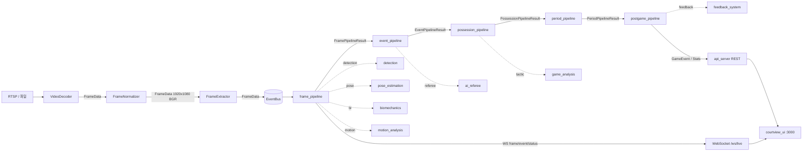
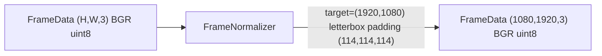
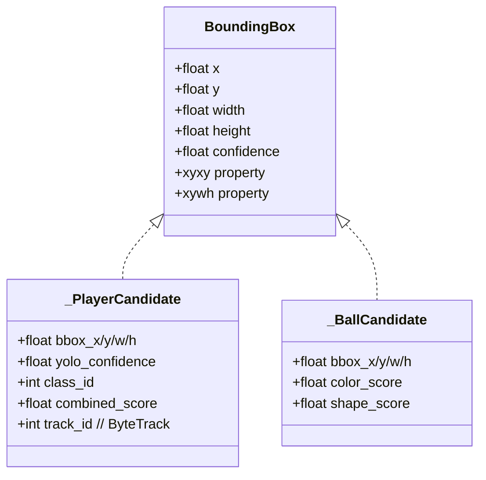
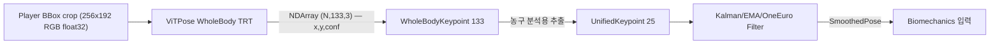
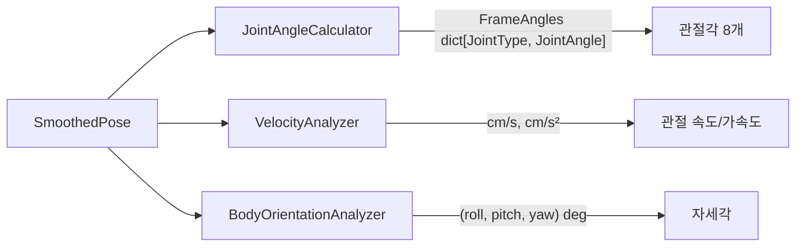
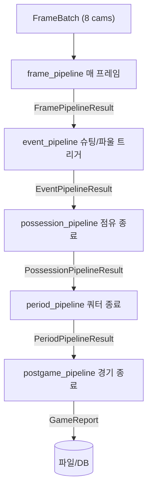
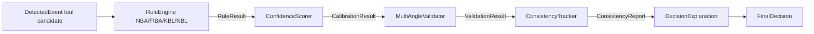

# COURTVIEW 데이터 흐름 & 타입 계약 (Data Flow Contract)

> 카메라 입력부터 UI 응답까지 각 계층 경계에서 오가는 데이터의 **타입·shape·필드**를 정리한 문서.
> 작성일: 2026-05-22 / 기준 커밋: `daf30d6`

---

## 0. 전체 흐름 한눈에 보기



| 경계 | 입력 | 출력 | 정의 위치 |
|---|---|---|---|
| 카메라 → 전처리 | RTSP stream | `FrameData` | `shared/dto/video_dto.py:596` |
| 전처리 → 파이프라인 | `FrameData` (BGR uint8) | `FrameBatch` | `engine/pipeline/frame_pipeline.py` |
| frame → event | `FramePipelineResult` | `EventPipelineResult` | `engine/pipeline/` |
| event → possession | `DetectedEvent[]` | `PossessionPipelineResult` | 〃 |
| possession → period | possession 리스트 | `PeriodPipelineResult` | 〃 |
| period → postgame | game 전체 | `PostgamePipelineResult` | 〃 |
| 엔진 → UI | DTO | Pydantic Response / WS msg | `api_server/schemas/` |

---

## 1. Layer 1 — 카메라 입력 / 전처리

### 1.1 `FrameData` (raw frame container)
**정의**: [shared/dto/video_dto.py:596](shared/dto/video_dto.py#L596)

| 필드 | 타입 | 비고 |
|---|---|---|
| `image` | `NDArray[np.uint8]` | shape `(H, W, 3)`, **BGR** (OpenCV 기본) |
| `index` | `int` | 순차 프레임 번호 |
| `timestamp` | `float` | 캡처 시각 (monotonic 또는 UTC sec) |
| `status` | `FrameStatus` | enum (OK / DROPPED / DUP) |

### 1.2 `CameraFrame` (camera-level wrapper)
**정의**: [shared/dto/camera_dto.py:532](shared/dto/camera_dto.py#L532)

| 필드 | 타입 |
|---|---|
| `image` | `NDArray[np.uint8]` (H,W,3) BGR |
| `timestamp` | `datetime` (UTC) |
| `camera_id` | `UUID \| None` |
| `frame_index` | `int` |
| `metadata` | `dict[str, Any]` |

### 1.3 정규화 단계
**클래스**: `FrameNormalizer` ([infrastructure/preprocessing/video_normalizer.py:68](infrastructure/preprocessing/video_normalizer.py#L68))



### 1.4 카메라 메타 / 캘리브레이션

| 클래스 | 위치 | 핵심 필드 |
|---|---|---|
| `CameraInfo` | `shared/dto/camera_dto.py:379` | `camera_id:UUID`, `camera_type:CameraType`, `resolution:VideoResolution`, `fps:float` |
| `CalibrationResult` | `shared/dto/calibration_dto.py:684` | `intrinsic`, `distortion`, `extrinsic`, `reprojection_error:float`, `status:CalibrationStatus` |
| `CameraSetup` | `shared/dto/camera_dto.py:634` | `info + config + position + status` 통합 |

### 1.5 EventBus 메시지
**정의**: [infrastructure/events/event_types.py:91](infrastructure/events/event_types.py#L91)

```python
@dataclass
class Event:
    event_type: EventType
    payload: dict[str, Any]   # 최대 64KB
    event_id: str             # "evt_*"
    timestamp: float
    source: str
    correlation_id: str | None
    priority: int             # 0(최우선) ~ 4(최저)
```

---

## 2. Layer 2 — Detection (객체 인식)

### 2.1 출력 클래스



| 클래스 | 위치 | 좌표 형식 | 단위 |
|---|---|---|---|
| `BoundingBox` | `shared/interfaces/detector_interface.py:349` | xywh (center) / xyxy 변환 가능 | **픽셀** |
| `_PlayerCandidate` | `detection/player_detection/models.py:347` | xywh | 픽셀 |
| `_BallCandidate` | `detection/ball_detection/ball_detector.py:178` | xywh | 픽셀 |
| HoopDetection / CourtDetection | `detection/hoop_detection/`, `detection/court_detection/` | xywh + 폴리곤 | 픽셀 |

**ByteTrack** 통과 시 `track_id:int` 필드가 추가되어 프레임 간 동일 객체 추적.

---

## 3. Layer 3 — Pose Estimation (포즈 추정)

### 3.1 키포인트 표준



| 표준 | 점 수 | 구성 | 정의 |
|---|---|---|---|
| **WholeBody** | 133 | Body 17 + Foot 6 + Face 68 + Hand 42 | `pose_estimation/keypoint_types.py:188` |
| **Unified** (COURTVIEW) | 25 | Body + Foot + 손가락 6 + 척추 2 | `pose_estimation/keypoint_types.py:135` |

### 3.2 데이터 구조

```python
@dataclass
class KeypointData:                          # pose_estimation/keypoint_types.py:300
    x: float
    y: float
    z: float            # 2D 모델이면 0.0
    confidence: float   # 0~1
    visibility: float   # 0~1

@dataclass
class SmoothedPose:                          # pose_estimation/processing.py:187
    keypoints: NDArray[np.float32]   # shape (N, 4) [x, y, z, conf]
    velocities: NDArray[np.float32]
    track_state: Any                  # Kalman 상태
    timestamp: float
```

**좌표계**: 픽셀 단위 (입력 프레임 기준). 정규화는 선택사항.

---

## 4. Layer 4 — Biomechanics (생체역학)



| 클래스 | 위치 | 핵심 필드 | 단위 |
|---|---|---|---|
| `JointAngle` | `biomechanics/kinematics/joint_angle_calculator.py:133` | `joint_type:JointType`, `angle_deg:float`, `confidence:float`, `is_within_rom:bool` | 도 |
| `FrameAngles` | `:151` | `angles:dict[JointType,JointAngle]`, `completeness:float` | — |
| `VelocityAnalysis` | `biomechanics/kinematics/` | 관절별 속력 | cm/s |
| `BodyOrientation` | `biomechanics/posture/` | `(roll, pitch, yaw)` | 도 |
| `BodySegment` | `biomechanics/anthropometry/` | 신체 부위 길이·질량 추정 | cm, kg |

**관절 8개**: 양쪽 어깨/팔꿈치/엉덩이/무릎. ROM (Range of Motion) 검증 포함.

---

## 5. Layer 5 — Motion Analysis (동작 분석)

### 5.1 통합 입력 — `MotionSnapshot`

biomechanics + detection 결과를 **스칼라 dict로 평탄화**하여 모든 동작 감지기가 공유.

**정의**: [motion_analysis/models.py:213](motion_analysis/models.py#L213)

| 필드 | 타입 | 단위 |
|---|---|---|
| `joint_angles` | `dict[JointType, float]` | 도 |
| `joint_speeds` | `dict[JointType, float]` | cm/s |
| `joint_positions` | `dict[JointType, tuple[float,float,float]]` | cm |
| `body_orientation` | `tuple[float,float,float]` (roll,pitch,yaw) | 도 |
| `com_position` | `tuple[float,float,float]` (무게중심) | cm |
| `stability_index` | `float` | 0~100 |
| `ball_position` | `tuple[float,float] \| None` | 픽셀 |
| `court_position` | `tuple[float,float] \| None` | 코트좌표 |
| `hoop_position` | `tuple[float,float] \| None` | 픽셀 |

### 5.2 출력 — `DetectionCandidate`

**정의**: [motion_analysis/models.py:392](motion_analysis/models.py#L392)

```python
@dataclass
class DetectionCandidate:
    action_type: ActionType                 # SHOT, DRIBBLE, PASS, …
    confidence: float                       # 0~1
    start_frame: int
    end_frame: int
    duration_frames: int
    evidence: dict[str, float]              # 감지 근거 메트릭
    # 예) 슈팅: "wrist_above_shoulder_m", "elbow_angle_deg", "release_speed_ms"
    # 예) 드리블: "hand_below_hip_ratio", "frequency_hz"
```

### 5.3 위상 분석 (Phase)

| Enum | 값 |
|---|---|
| `ShotPhase` | PREPARATION / LOADING / RELEASE / FOLLOW_THROUGH |
| `DribblePhase` | PUSH_DOWN / BALL_CONTACT / RISE / CATCH |

`PhaseSegment` (`models.py:454`): `{phase_name, key_metrics:dict, quality:float}`

---

## 6. Layer 6 — Engine 5단계 Cadence Pipeline



### 6.1 `FramePipelineResult`
**정의**: [engine/pipeline/frame_pipeline.py:149](engine/pipeline/frame_pipeline.py#L149)

| 필드 | 타입 |
|---|---|
| `detection` | `SceneFusionResult` (선수·공·골대·코트 융합) |
| `pose` | `PoseFusionResult` (멀티뷰 포즈) |
| `tracking` | `TrackingFusionResult` (ByteTrack) |
| `biomechanics_angles` | `dict[person_id, FrameAngles]` |
| `velocities / accelerations / forces / energy` | `dict[person_id, dict]` |
| `stage_times_ms` | `dict[str, float]` — 33ms 예산 추적 |

### 6.2 `EventPipelineResult`
**정의**: [engine/pipeline/event_pipeline.py:301](engine/pipeline/event_pipeline.py#L301)

```python
@dataclass
class DetectedEvent:                # event_pipeline.py:274
    event_type: str
    frame_index: int
    confidence: float
    player_id: str
    team_id: str
    source_detector: str
    details: dict[str, Any]
```

**16종 감지기**:
- **EVENT cadence (6)**: ShotEventDetector, ReboundDetector, FoulDetector, ScreenDetector, FastBreakDetector, DriveDetector
- **역추적 (4)**: AssistDetector, BlockDetector, StealDetector, TurnoverDetector
- **SPECIAL (3)**: FreeThrowDetector, BoxOutDetector, JumpBallDetector

### 6.3 `PossessionPipelineResult` (line 216)
- 전술 분석 6종 (screen, fast_break, set_play, passing_network, possession, turnover)
- 개인 분석 6종 (drive, off_ball, clutch, fatigue, impact, rebound)
- 하이라이트 3종 + 공간 분석 4종

### 6.4 `PeriodPipelineResult` (line 109)
- `flow_results`: momentum, tempo, timeout, lead
- `rotation_results`: rotation_tracker, stagger, bench, rest
- `summary_result`, `season_results[3]`

### 6.5 `PostgamePipelineResult` (line 160)
- `report_generated:bool`, `feedback_generated:bool`
- `datasets_extracted:int` (game_analysis 7종)
- `referee_datasets_extracted:int` (ai_referee 6종)
- `extracted_training_data:dict` (Cloud 전송)

### 6.6 Cadence 트리거
**위치**: [engine/orchestrator/cadence_scheduler.py:107](engine/orchestrator/cadence_scheduler.py#L107)

| Cadence | 트리거 키 |
|---|---|
| FRAME | (매 프레임) |
| EVENT | `pending_shooting`, `pending_foul_contact`, `pending_violation` |
| POSSESSION | `pending_possession_end` |
| PERIOD | `pending_period_end` |
| POSTGAME | `pending_game_end` |

---

## 7. Layer 7 — GameEvent (정식 이벤트 DTO)

엔진 내부 `DetectedEvent` 와 별개로, **저장·전송용** 정식 이벤트는 `GameEvent`.

**정의**: [shared/dto/game_dto.py:362](shared/dto/game_dto.py#L362)

```python
class GameEvent(BaseModel):    # Pydantic
    event_id: UUID
    event_type: EventType       # shot_made, personal_foul, ...
    primary_player_id: int | None
    secondary_player_id: int | None
    team_id: str | None
    court_x: float              # 정규화 좌표 0~1
    court_y: float
    frame_number: int
    timestamp: float
    quarter: int
    game_clock: str
    points: int
    home_score: int
    away_score: int
    description: str
    confidence: float           # 0~1
```

---

## 8. Layer 8 — AI Referee (심판 판정)



**정의**: [ai_referee/decisions/decision_engine.py:85](ai_referee/decisions/decision_engine.py#L85)

```python
@dataclass
class FinalDecision:
    decision_id: UUID
    result: RuleResult | None
    calibration: CalibrationResult | None
    validation: ValidationResult | None
    consistency: ConsistencyReport | None
    explanation: DecisionExplanation | None   # 한글 설명
    final_confidence: float                    # 0~1
    confidence_level: DecisionConfidence       # LOW/MEDIUM/HIGH/VERY_HIGH
    is_final: bool
    requires_review: bool
    should_replay: bool
    frame_number: int
    decided_at: float
```

**`RuleResult` 핵심 필드** (`ai_referee/rules/base_rule.py`):
- `violated: bool`
- `penalty_type: PenaltyType` (FREE_THROWS / FREE_THROWS_AND_POSSESSION / TECHNICAL_FREE_THROW / TURNOVER / JUMP_BALL / EJECTION / NONE)
- `rule_id: str`
- `evidence_frames: list[int]`
- `confidence: float`

---

## 9. Layer 9 — Feedback System

**FeedbackResult** (`shared/dto/feedback_dto.py`)
- `feedback_items: list[FeedbackItem]`
- `summary: FeedbackSummary`

**TemplateEntry** (frozen dataclass, [feedback_system/templates/_types.py:20](feedback_system/templates/_types.py#L20))

| 필드 | 용도 |
|---|---|
| `title` | 피드백 제목 |
| `positive` | GOOD/EXCELLENT 등급 |
| `correction` | NEEDS_WORK/CRITICAL 등급 |
| `suggestion` | 개선 제안 |

**18종 피드백 생성기** ([feedback_system/report/game_report_generator.py:48](feedback_system/report/game_report_generator.py#L48)):
- 기본 8종: Game / Tactical / Defensive / Individual / Spatial / Lineup / Referee / Visual
- 신규 7종: QuarterMomentum / Clutch / PaceTempo / ShotQuality / OpponentTendency / Rotation / StrategicRecommendation
- 고급 3종: Causal / GameContext / Scouting

---

## 10. Layer 10 — Statistics

**`PlayerStats`** (`shared/dto/game_dto.py` + [game_analysis/stats/statistics/basic_stats.py:181](game_analysis/stats/statistics/basic_stats.py#L181))

| 카테고리 | 필드 |
|---|---|
| 득점 | PTS, FGM/FGA, 3PM/3PA, FTM/FTA |
| 리바운드 | OREB + DREB → REB |
| 어시스트/스틸/블락/턴오버 | AST, STL, BLK, TOV |
| 파울 | PF |
| 출전 | MIN |
| 효율 | +/- (plus/minus) |

내부 누적은 `_PlayerAccumulator` ([:118](game_analysis/stats/statistics/basic_stats.py#L118)) → `to_player_stats()` 로 변환.

`TeamStats`: 팀 수준 집계 (선수별 → 팀 합산).

---

## 11. Layer 11 — API Server (UI 경계)

### 11.1 REST 라우트

| Method | 경로 | 요청 DTO | 응답 DTO |
|---|---|---|---|
| POST | `/api/v1/game/start` | `StartGameRequest` | `GameStartResponse` |
| POST | `/api/v1/game/stop` | `StopGameRequest` | `GameStatusResponse` |
| POST | `/api/v1/game/pause` | — | `GameStatusResponse` |
| POST | `/api/v1/game/resume` | — | `GameStatusResponse` |
| GET | `/api/v1/game/status` | — | `GameStatusResponse` |
| GET | `/api/v1/camera/discover` | — | `APIResponse` |
| POST | `/api/v1/camera/connect` | `CameraConnectRequest` | `CameraStatusResponse` |
| POST | `/api/v1/camera/connect-all` | `CameraConnectAllRequest` | `CameraStatusAllResponse` |
| GET | `/api/v1/camera/status-all` | — | `CameraStatusAllResponse` |
| GET | `/api/v1/camera/{id}/status` | — | `CameraStatusResponse` |
| POST | `/api/v1/camera/{id}/calibrate` | `CameraCalibrationRequest` | `CameraCalibrationResponse` |
| POST | `/api/v1/camera/{id}/calibrate/manual` | `ManualCalibrationRequest` | `ManualCalibrationResponse` |
| POST | `/api/v1/camera/{id}/ai-test` | `CameraAITestRequest` | `CameraAITestResponse` |
| GET | `/api/v1/camera/go2rtc/health` | — | `Go2rtcHealthResponse` |
| GET | `/api/v1/referee/decisions` | — | `RefereeListResponse` |
| POST | `/api/v1/referee/challenge` | `ChallengeRequest` | `APIResponse` |
| GET | `/api/v1/tactical/summary` | — | `TacticalSummaryResponse` |
| GET | `/api/v1/tactical/boxscore` | — | `BoxScoreResponse` |
| POST | `/api/v1/report/generate` | `GenerateReportRequest` | `APIResponse` |
| GET | `/api/v1/report/list` | — | `APIResponse` |
| GET | `/api/v1/task/progress` | — | `ProgressResponse` |
| GET | `/api/v1/metrics/gpu` | — | `GPUMetricsResponse` |
| GET | `/api/v1/metrics/system` | — | `SystemMetricsResponse` |

### 11.2 주요 응답 DTO 필드

| DTO | 위치 | 핵심 필드 |
|---|---|---|
| `APIResponse` | `api_server/schemas/response_schemas.py:25` | `success:bool`, `message:str`, `data:Any`, `error_code:int` |
| `GameStatusResponse` | `:45` | `engine_state`, `game_state`, `quarter`, `game_clock_sec`, `shot_clock_sec`, `home_score`, `away_score` |
| `ProgressResponse` | `:72` | `frame_current`, `frame_total`, `progress_pct`, `phase`, `eta_sec` |
| `RefereeDecisionResponse` | `:86` | `decision_id`, `call_type`, `violation_type`, `foul_type`, `confidence`, `requires_review` |
| `PlayerStatsResponse` | `:108` | `player_id`, `jersey_number`, `points`, `rebounds`, `assists`, `fg_pct`, `three_pct`, `ft_pct`, `plus_minus` |
| `BoxScoreResponse` | `:141` | `home_team:TeamStatsResponse`, `away_team`, `home_players[]`, `away_players[]` |
| `TacticalSummaryResponse` | `:152` | `offensive_rating`, `defensive_rating`, `pace`, `top_play_type`, `spacing_score`, `ball_movement_rating` |
| `CameraStatusResponse` | `:208` | `camera_id`, `connected`, `width`, `height`, `fps`, `calibrated`, `transport_mode` |
| `Go2rtcHealthResponse` | `:223` | `go2rtc{}`, `cameras[]`, `summary{total, relay, direct, unknown}` |

### 11.3 WebSocket — `/ws/live`

**Envelope**:
```json
{
  "type": "frame | event | status",
  "event_type": "foul | goal | turnover | ...",   // type=="event" 일 때만
  "frame_index": 1234,
  ...payload
}
```

| `type` | 빈도 / 트리거 | 비고 |
|---|---|---|
| `frame` | 매 프레임 (100건마다 로그) | 가벼운 메타만 (전체 이미지 X) |
| `event` | 이벤트 감지 시 | `event_type` 필수 — foul / goal / turnover / … |
| `status` | 30초 idle 또는 상태 변경 | engine_state, game_state |

**연결 유지**: client `ping` → server `pong`. 실패 시 `close(code=1011)`.

**파일**:
- `api_server/websocket/progress_handler.py` — WS 라우트
- `engine/io/result_dispatcher.py` — 메시지 큐 관리

### 11.4 공통 에러 형식

```json
{
  "success": false,
  "message": "에러 설명",
  "data": null,
  "error_code": 400
}
```

---

## 12. 핵심 단위·관례 요약

| 도메인 | 단위 | 비고 |
|---|---|---|
| 이미지 픽셀 | `uint8 BGR` (OpenCV) | 입력 단계 |
| 정규화 프레임 | `(1080, 1920, 3) uint8 BGR` | letterbox 패딩 (114,114,114) |
| 모델 입력 | YOLO `640x640`, ViTPose `256x192`, MiDaS `256x256` | `launcher_warmup.py:_default_dims_for` |
| BBox 좌표 | xywh (center 기준) | 픽셀 |
| 키포인트 좌표 | `(x, y, z, conf)` float32 | 픽셀 |
| 관절각 | 도(degree) | ROM 검증 포함 |
| 거리 | cm | biomechanics 전반 |
| 속도 | cm/s | 관절 속력 |
| 코트 좌표 (GameEvent) | 0~1 정규화 | `court_x`, `court_y` |
| confidence | 0.0 ~ 1.0 | 전체 일관 |
| Cadence 트리거 키 | `pending_*` 문자열 | `cadence_scheduler.py` |

---

## 13. 알려진 약점 / 개선 포인트

(코드 조사 중 발견 — 별도 PLAN 문서 참조)

- **`Event.payload: dict[str, Any]`** — EventBus 메시지가 dict 기반이라 타입 안정성 부족. 도메인별 TypedDict 도입 가치 있음.
- **`DetectedEvent.details: dict[str, Any]`** vs **`GameEvent`** — 엔진 내부와 저장용 이벤트 DTO 이중화. 변환 매퍼가 어디인지 명시되어 있지 않음.
- **WebSocket envelope 비공식** — `{"type": ..., "event_type": ...}` 가 TypedDict/Pydantic 모델로 정의되어 있지 않아 UI 측 클라이언트 코드와 drift 위험.
- **`MotionSnapshot` 의 좌표 단위 혼재** — `joint_positions` 은 cm, `ball_position` 은 픽셀. 명시 주석 필요.
- **`UnifiedKeypoint` 25점이 농구 분석 표준이지만, 일부 모듈은 여전히 `WholeBodyKeypoint` 133점에 직접 접근.** 일관성 확인 필요.

---

## 부록 — 주요 파일 인덱스

| 카테고리 | 파일 |
|---|---|
| 카메라 DTO | [shared/dto/camera_dto.py](shared/dto/camera_dto.py), [shared/dto/calibration_dto.py](shared/dto/calibration_dto.py) |
| 프레임 DTO | [shared/dto/video_dto.py](shared/dto/video_dto.py) |
| 전처리 | [infrastructure/preprocessing/video_normalizer.py](infrastructure/preprocessing/video_normalizer.py), [frame_extractor.py](infrastructure/preprocessing/frame_extractor.py) |
| 이벤트 버스 | [infrastructure/events/event_types.py](infrastructure/events/event_types.py) |
| Detection | [shared/interfaces/detector_interface.py](shared/interfaces/detector_interface.py), [detection/player_detection/models.py](detection/player_detection/models.py) |
| Pose | [pose_estimation/keypoint_types.py](pose_estimation/keypoint_types.py), [pose_estimation/processing.py](pose_estimation/processing.py) |
| Biomechanics | [biomechanics/kinematics/joint_angle_calculator.py](biomechanics/kinematics/joint_angle_calculator.py) |
| Motion | [motion_analysis/models.py](motion_analysis/models.py) |
| Engine Pipelines | [engine/pipeline/frame_pipeline.py](engine/pipeline/frame_pipeline.py), [event_pipeline.py](engine/pipeline/event_pipeline.py), [possession_pipeline.py](engine/pipeline/possession_pipeline.py), [period_pipeline.py](engine/pipeline/period_pipeline.py), [postgame_pipeline.py](engine/pipeline/postgame_pipeline.py) |
| Cadence | [engine/orchestrator/cadence_scheduler.py](engine/orchestrator/cadence_scheduler.py), [game_orchestrator.py](engine/orchestrator/game_orchestrator.py) |
| Game DTO | [shared/dto/game_dto.py](shared/dto/game_dto.py) |
| Referee | [ai_referee/decisions/decision_engine.py](ai_referee/decisions/decision_engine.py), [ai_referee/rules/base_rule.py](ai_referee/rules/base_rule.py) |
| Feedback | [feedback_system/report/game_report_generator.py](feedback_system/report/game_report_generator.py), [feedback_system/templates/_types.py](feedback_system/templates/_types.py) |
| Stats | [game_analysis/stats/statistics/basic_stats.py](game_analysis/stats/statistics/basic_stats.py) |
| API | [api_server/schemas/request_schemas.py](api_server/schemas/request_schemas.py), [response_schemas.py](api_server/schemas/response_schemas.py), [api_server/websocket/progress_handler.py](api_server/websocket/progress_handler.py) |
