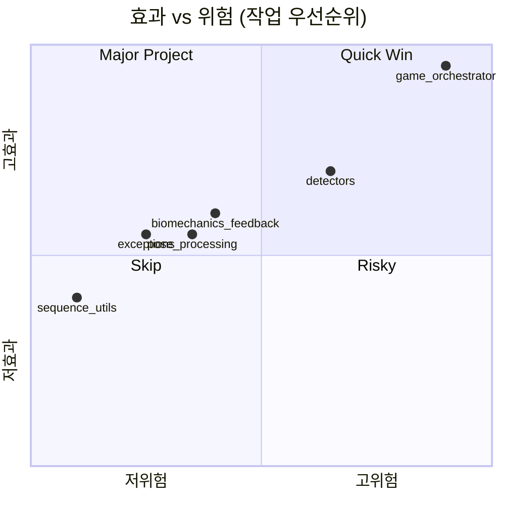
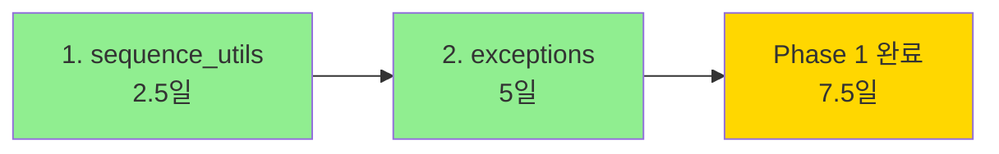
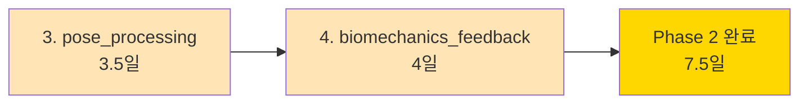
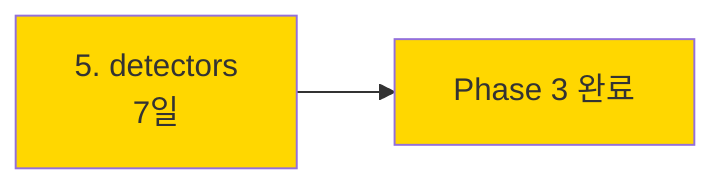
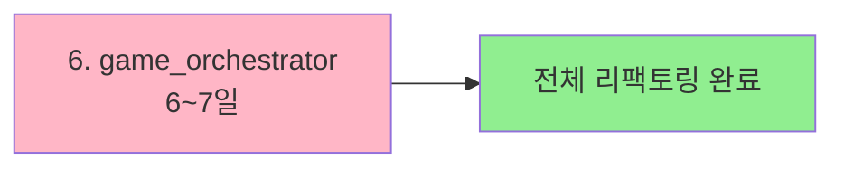
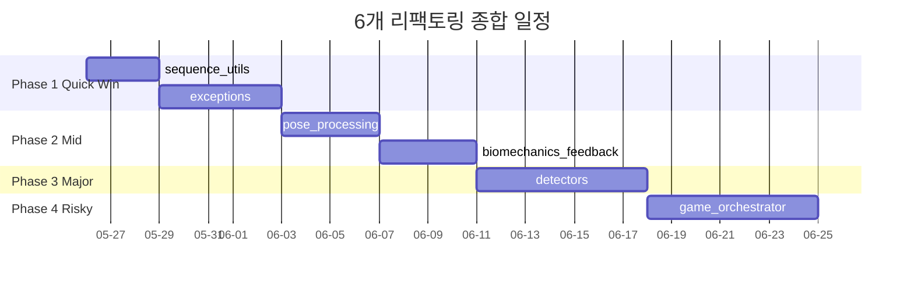
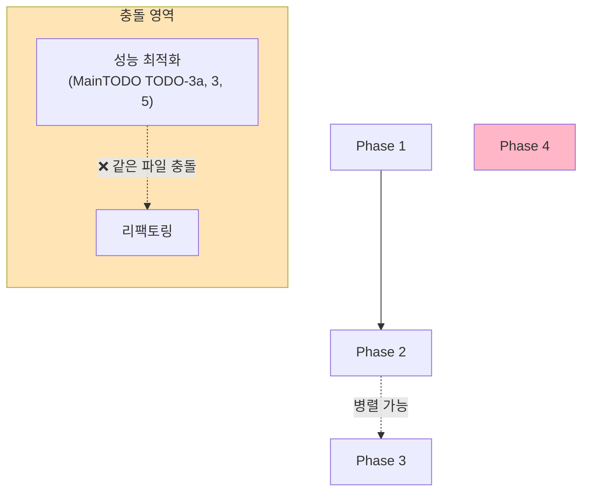
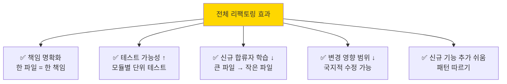

# 🛠️ 리팩토링 계획 종합 인덱스

> **6개 거대 파일 분리 계획서를 한눈에.** 작업 순서, 우선순위, 의존성을 종합.
> 작성일: 2026-05-23

---

## 📚 작성된 계획서 6개

| # | 계획서 | 대상 파일 | 줄 수 | 예상 일정 |
|---|---|---|---|---|
| 1 | [REFACTOR_PLAN_GAME_ORCHESTRATOR.md](REFACTOR_PLAN_GAME_ORCHESTRATOR.md) | game_orchestrator.py | 2,947 → 1,950 | **6~7일** |
| 2 | [REFACTOR_PLAN_EXCEPTIONS.md](REFACTOR_PLAN_EXCEPTIONS.md) | infrastructure + validation exceptions | 5,653 → 4,750 | **5일** |
| 3 | [REFACTOR_PLAN_DETECTORS.md](REFACTOR_PLAN_DETECTORS.md) | ball/player/hoop detector | 3,946 → 3,350 | **7일** |
| 4 | [REFACTOR_PLAN_BIOMECHANICS_FEEDBACK.md](REFACTOR_PLAN_BIOMECHANICS_FEEDBACK.md) | biomechanics_feedback.py | 1,696 → 1,500 | **4일** |
| 5 | [REFACTOR_PLAN_POSE_PROCESSING.md](REFACTOR_PLAN_POSE_PROCESSING.md) | pose_estimation/processing.py | 1,764 → 1,600 | **3.5일** |
| 6 | [REFACTOR_PLAN_SEQUENCE_UTILS.md](REFACTOR_PLAN_SEQUENCE_UTILS.md) | utils/sequence_utils.py | 1,968 → 1,800 | **2.5일** |

---

## 🎯 종합 효과

| 항목 | Before | After | 절감 |
|---|---|---|---|
| 총 줄 수 | 17,974 | 14,950 | **3,024줄 (17%)** |
| 가장 큰 파일 | 3,373줄 (infrastructure_exc) | ~700줄 | **-79%** |
| 클래스/파일 평균 | 매우 큼 | ~5~10 | 책임 분리 |
| 단위 테스트 가능성 | 낮음 | 높음 | ↑↑ |

> ⚠️ **단순 줄수 절감보다 "책임 분리 + 테스트 가능성 + 유지보수성" 향상이 핵심**.

---

## 📊 우선순위 매트릭스



| 위치 | 의미 | 해당 작업 |
|---|---|---|
| Quick Win | 낮은 위험 + 중간 효과 | sequence_utils, exceptions |
| Major Project | 중간 위험 + 높은 효과 | pose_processing, biomechanics, detectors |
| Risky | 높은 위험 + 매우 큰 효과 | **game_orchestrator** |

---

## 🗓️ 권장 작업 순서

### Phase 1 — Quick Wins (1.5주)



**근거**:
- **sequence_utils**: 가장 안전 (순수 함수). 리팩토링 감각 잡기.
- **exceptions**: 카테고리 분리만, 로직 변경 없음. 위험 낮음.

→ **1.5주에 ~1,000줄 절감 + 카테고리 명확화**.

### Phase 2 — Mid-level (2.5주)



**근거**:
- **pose_processing**: 필터들이 독립적이라 분리 쉬움. bit-exact 검증.
- **biomechanics_feedback**: 7 카테고리가 독립적. Strategy Pattern.

→ **2.5주에 ~500줄 추가 절감 + 클래스 책임 명확**.

### Phase 3 — Major Projects (2주)



**근거**:
- **detectors**: BaseObjectDetector 추출 → 3 detector 공통화. 70% 중복 제거.
- 단, **engine 호출자 영향** 있어서 신중히.

### Phase 4 — High Risk (1.5주)



**근거**:
- **game_orchestrator**: 가장 큰 효과 (997줄 절감)지만 가장 위험.
- 외부 호출자 많고 nested closure 복잡.
- 다른 모든 리팩토링 후 마지막으로.

---

## 📅 전체 일정 — 7주



| Phase | 기간 | 작업일 | 효과 |
|---|---|---|---|
| Phase 1 | 1.5주 | 7.5일 | 1,000줄 절감 |
| Phase 2 | 1.5주 | 7.5일 | 500줄 절감 |
| Phase 3 | 1.5주 | 7일 | 600줄 절감 |
| Phase 4 | 1.5주 | 7일 | 1,000줄 절감 |
| **합계** | **6~7주** | **29일** | **~3,100줄** |

---

## 🚦 의존성 / 충돌 주의

### 동시 작업 가능 (병렬)



| 작업 조합 | 충돌? | 비고 |
|---|---|---|
| Phase 1 + Phase 2 동시 | ❌ 없음 | 완전 독립 영역 |
| Phase 1 + Phase 3 동시 | ❌ 없음 | |
| Phase 2 + Phase 3 동시 | ⚠️ 주의 | pose_processing 과 detectors 둘 다 engine 영향 |
| Phase 4 (game_orchestrator) | ⚠️ 단독 | 너무 큰 영향 — 동시 작업 X |
| **성능 최적화 + Phase 4** | ❌ **금지** | 같은 파일 (game_orchestrator, frame_ingestion) 충돌 |

### MainTODO 와의 관계

[MainTODO.md](../../MainTODO.md) 의 성능 최적화 TODO 와 충돌 영역:

| 성능 TODO | 충돌 리팩토링 | 권장 순서 |
|---|---|---|
| TODO-3a (decode 병렬화) | detectors, game_orchestrator | **성능 먼저** |
| TODO-3 (F-matrix 캐싱) | pose_processing | 둘 다 영향 |
| TODO-5 (Pose ThreadPool) | pose_processing | **성능 먼저** |
| TODO-7 (TRT batch=8) | detectors, game_orchestrator | **성능 먼저** |

→ **권장 순서**: **성능 최적화 (MainTODO) → 리팩토링 (이 인덱스)**.

---

## 🎓 공통 작업 패턴

모든 계획서가 따르는 공통 패턴:

### 1. STEP 0 — 사전 준비 (필수)

- 새 브랜치 생성
- 외부 호출자 grep
- 기존 테스트 green
- baseline 산출물 저장 (events.json, feedback.json 등)

### 2. STEP 1 — 가장 단순한 부분 분리 (워밍업)

- enums, dataclass, 헬퍼 먼저
- 의존성 없는 부분
- 단위 테스트로 검증

### 3. STEP 2~N — 카테고리/책임별 분리

- 작은 것부터
- 각 STEP 후 commit
- 회귀 테스트

### 4. STEP (마지막-1) — 호환 Shim

- 기존 import 경로 유지
- Deprecation 경고 추가
- 6개월 후 shim 제거

### 5. STEP (마지막) — 통합 검증 + PR

- 전체 테스트 green
- baseline diff = 0
- 성능 회귀 < 5%
- 라인 카운트 목표 달성

---

## 🧪 공통 검증 방법

### 1. Bit-exact 회귀 검증

```python
def test_refactor_preserves_output():
    """리팩토링 전후 동일 입력 → 동일 출력."""
    baseline = load("baseline.pkl")
    new = function_after_refactor(test_input)
    assert new == baseline
```

### 2. Baseline 산출물 비교

```powershell
# Before
git checkout main
python tools\bench_pipeline_realistic.py --frames 100
Copy-Item events.json baseline_events.json

# After
git checkout refactor/<branch>
python tools\bench_pipeline_realistic.py --frames 100
Compare-Object (Get-Content baseline_events.json) (Get-Content events.json)
# → 비어있어야 함
```

### 3. import 회귀 — 이전 경로 모두 동작

```python
def test_all_old_imports_work():
    """이전 import 경로 유지 확인."""
    # 분리 전 사용하던 모든 import 시도
    from old_module import OldClass, old_function
    assert callable(old_function)
```

### 4. 라인 카운트

```powershell
foreach ($f in (Get-ChildItem path\to\new\files\*.py -Recurse)) {
    (Get-Content $f | Measure-Object -Line).Lines
}
# 각 파일 < 800줄 (또는 계획서 목표)
```

---

## ⚠️ 공통 주의사항

### 1. 외부 인터페이스 절대 변경 X

```python
# 외부 코드는 이전과 동일하게 사용 가능해야 함
from shared.exceptions import DatabaseException     # ✅
from pose_estimation.processing import PoseProcessor  # ✅
```

### 2. Shim 으로 하위 호환 보장

```python
# 구 모듈/파일은 호환 shim 으로 유지
import warnings
warnings.warn("Deprecated. 신규 경로 사용 권장", DeprecationWarning)
from .new_location import *
```

### 3. 단위 테스트 + 통합 테스트

```
단위: 각 모듈 추출 후 즉시 테스트
통합: STEP 마지막에 baseline 비교
```

### 4. 위험 단계는 시간 여유 확보

```
game_orchestrator (Phase 4): 6~7일 예상 → 10일 여유
detectors (Phase 3): 7일 예상 → 9일 여유
```

### 5. 성능과 분리 작업

```
권장: 성능 최적화 먼저 → baseline 확정 → 리팩토링
이유: 분리 중 성능 회귀 발생 시 원인 추적 어려움
```

---

## 📈 종합 효과 — 전체 리팩토링 완료 후

### 정량적

| 항목 | Before | After | 개선 |
|---|---|---|---|
| 거대 파일 (>1000줄) | 12개 | 0개 | **-100%** |
| 가장 큰 파일 | 3,373줄 | <800줄 | **-76%** |
| 총 줄 수 (대상) | 17,974 | 14,950 | **-3,024 (-17%)** |
| 평균 파일 크기 | ~1,500 | ~400 | **-73%** |

### 정성적



---

## 🚀 시작 가이드

### 다른 컴퓨터에서 시작할 때

```powershell
# 1. 리포 클론 + 최신 상태
git clone https://github.com/SPOIN-HQ/COURTVIEW-DESK.git
cd COURTVIEW-DESK
git pull

# 2. 환경 설정
.\venv\Scripts\activate

# 3. 이 인덱스 열기
code docs\project\architecture\REFACTOR_INDEX.md

# 4. Phase 1 부터 시작
code docs\project\architecture\REFACTOR_PLAN_SEQUENCE_UTILS.md

# 5. 새 브랜치 생성
git checkout -b refactor/sequence-utils-split

# 6. STEP 0 부터 차근차근
```

---

## 📋 진행 체크리스트

작업하면서 갱신:

### Phase 1 — Quick Wins
- [ ] sequence_utils 분리 완료
- [ ] exceptions 분리 완료
- [ ] Phase 1 검증 (모든 테스트 green)

### Phase 2 — Mid
- [ ] pose_processing 분리 완료
- [ ] biomechanics_feedback 분리 완료
- [ ] Phase 2 검증

### Phase 3 — Major
- [ ] detectors (BaseObjectDetector) 추출 완료
- [ ] Phase 3 검증

### Phase 4 — Risky
- [ ] game_orchestrator 5 모듈 분리 완료
- [ ] Phase 4 검증

### 최종
- [ ] 전체 테스트 green
- [ ] 모든 baseline diff = 0
- [ ] 성능 회귀 < 5%
- [ ] 거대 파일 (>1000줄) 0개

---

## 📖 관련 문서

### 작업 계획서
- [REFACTOR_PLAN_GAME_ORCHESTRATOR.md](REFACTOR_PLAN_GAME_ORCHESTRATOR.md)
- [REFACTOR_PLAN_EXCEPTIONS.md](REFACTOR_PLAN_EXCEPTIONS.md)
- [REFACTOR_PLAN_DETECTORS.md](REFACTOR_PLAN_DETECTORS.md)
- [REFACTOR_PLAN_BIOMECHANICS_FEEDBACK.md](REFACTOR_PLAN_BIOMECHANICS_FEEDBACK.md)
- [REFACTOR_PLAN_POSE_PROCESSING.md](REFACTOR_PLAN_POSE_PROCESSING.md)
- [REFACTOR_PLAN_SEQUENCE_UTILS.md](REFACTOR_PLAN_SEQUENCE_UTILS.md)

### 관련 문서
- [MainTODO.md](../../MainTODO.md) — 성능 최적화 TODO
- [INDEX.md](../../INDEX.md) — docs 전체 인덱스
- [DATA_FLOW_CONTRACT.md](DATA_FLOW_CONTRACT.md) — 데이터 흐름
- [COMPUTATION_CODES_REFERENCE.md](COMPUTATION_CODES_REFERENCE.md) — 계산 코드 인덱스

### 개념 문서
- [INSTANCE_EXPLAINED](../../concepts/INSTANCE_EXPLAINED.md) — 인스턴스 개념 (game_orchestrator 이해용)
- [BIG_O_DECISIONS](../../concepts/BIG_O_DECISIONS.md) — 알고리즘 선택

---

## 💡 작업자 노트

### 권장 자세

1. **한 PR = 한 STEP** — 작게 자주 머지
2. **각 STEP 후 commit** — 롤백 포인트 확보
3. **테스트 실패 시 즉시 멈춤** — 다음 STEP X
4. **외부 인터페이스 절대 변경 X** — Shim 으로 호환
5. **위험한 작업은 시간 여유 확보**

### 피해야 할 것

1. ❌ 여러 리팩토링 동시 진행 (충돌 위험)
2. ❌ 성능 최적화와 리팩토링 같이 (변경 영향 추적 불가)
3. ❌ 함수/클래스 이름 변경 (분리 후 별도 PR)
4. ❌ 테스트 없이 다음 단계 진행
5. ❌ 한 PR 에 모든 변경 몰아넣기

---

**마지막 업데이트**: 2026-05-23 (모든 계획서 작성 완료)
**다음 작업**: Phase 1 (sequence_utils) 부터 시작
**전체 예상 완료**: 6~7주 (29 작업일)
