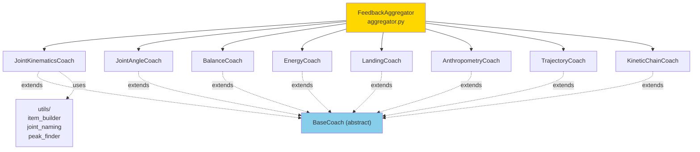

# 🛠️ biomechanics_feedback.py 분리 계획서

> **1,696줄 단일 클래스를 7개 카테고리 coach 모듈로 분리.**
> Strategy Pattern 적용 — 카테고리별 독립 진화 가능.
> 작성일: 2026-05-23 / 기준: [feedback_system/coach/biomechanics_feedback.py](../../../feedback_system/coach/biomechanics_feedback.py)

---

## 📚 목차

1. [요약](#1-요약)
2. [현재 상태 진단](#2-현재-상태)
3. [목표 구조](#3-목표-구조)
4. [단계별 작업 (STEP 0~5)](#4-단계별-작업)
5. [주의사항](#5-주의사항)
6. [검증 방법](#6-검증-방법)
7. [예상 일정](#7-일정)

---

## 1. 요약 {#1-요약}

### 🎯 한 줄 목표

> **1,696줄 메가 클래스 → 7개 coach 모듈 + Aggregator (총 ~1,500줄)**

### 📊 Before / After

```mermaid
flowchart LR
  BEFORE["❌ Before<br/>biomechanics_feedback.py<br/>1696줄<br/>1 클래스 × 18 메서드"] --> AFTER

  subgraph AFTER["✅ After (7+2 파일)"]
    direction TB
    A1["joint_kinematics_coach.py (200줄)"]
    A2["joint_angle_coach.py (170줄)"]
    A3["balance_coach.py (280줄)"]
    A4["energy_coach.py (180줄)"]
    A5["landing_coach.py (190줄)"]
    A6["anthropometry_coach.py (160줄)"]
    A7["trajectory_coach.py (150줄)"]
    A8["kinetic_chain_coach.py (100줄)"]
    A9["aggregator.py (150줄)"]
    A10["base_coach.py + utils.py (100줄)"]
  end

  style BEFORE fill:#FFB6C6
  style AFTER fill:#90EE90
```



### 📈 기대 효과

| 항목 | Before | After | 개선 |
|---|---|---|---|
| 단일 파일 줄 수 | 1,696 | 평균 ~180 | **-89%** |
| 클래스당 메서드 | 18 | ~3 | **-83%** |
| 카테고리별 테스트 | 불가능 | 가능 | **↑↑** |
| 새 카테고리 추가 | 어려움 | 새 파일 추가만 | **↑↑** |

---

## 2. 현재 상태 진단 {#2-현재-상태}

### 2.1 BiomechanicsFeedbackGenerator 메서드 — 7 카테고리 × 평균 140줄

[biomechanics_feedback.py](../../../feedback_system/coach/biomechanics_feedback.py):

| 카테고리 | 메서드 | 라인 | 줄수 |
|---|---|---|---|
| 1. **관절 운동학** | `_generate_joint_kinematics_feedback` | 331 | ~150줄 |
| 　└ 보조 | `_evaluate_shooting_angular_velocity` | 418 | ~20 |
| 　└ 보조 | `_add_angular_velocity_item` | 441 | ~30 |
| 2. **관절 각도** | `_generate_joint_angle_feedback` | 510 | ~120줄 |
| 3. **균형 안정성** | `_generate_balance_feedback` | 632 | **~240줄** ⭐ |
| 4. **에너지 효율** | `_generate_energy_feedback` | 874 | ~140줄 |
| 5. **착지 충격** | `_generate_landing_feedback` | 1020 | ~145줄 |
| 6. **인체측정** | `_generate_anthropometry_feedback` | 1169 | ~135줄 |
| 7. **궤적** | `_generate_trajectory_feedback` | 1307 | ~110줄 |
| 8. **동작 체인** | `_generate_kinetic_chain_feedback` | 1423 | ~60줄 |

### 2.2 공통 유틸 (static methods)

```python
@staticmethod
def _joint_name(...)                    # L1500
@staticmethod
def _angle_key_to_label(...)            # L1520
@staticmethod
def _match_angle_key_to_measurement(...) # L1546
@staticmethod
def _find_peak_speed_frame(...)         # L1573
@staticmethod
def _make_item(...)                     # L1588 — FeedbackItem 생성, 80+ 회 호출
```

### 2.3 외부 템플릿 의존

[feedback_system/templates/korean_templates.py](../../../feedback_system/templates/korean_templates.py) 에서 import:
- `get_angle_deviation_text()` — 2회 호출 (L583, 606)
- `get_speed_deviation_text()` — 4회 호출
- `get_balance_deviation_text()` — 3회 호출
- `get_landing_text()` — 3회 호출
- `get_coach_ending()` — **70회+ 호출**

→ 템플릿 함수는 **이미 분리되어 있음**. 좋은 패턴 유지.

### 2.4 내부 통계 집계

```python
class _JointKinematicsStats:  # L1623
    """내부 통계 집계기"""
```

→ joint_kinematics_coach 와 함께 이동.

### 2.5 메인 진입점

```python
def generate(self,
             frames: list[BiomechanicsFrame],
             ...) -> list[FeedbackItem]:
    """공개 API — 모든 카테고리 피드백 통합."""
    items = []
    items.extend(self._generate_joint_kinematics_feedback(...))
    items.extend(self._generate_joint_angle_feedback(...))
    items.extend(self._generate_balance_feedback(...))
    items.extend(self._generate_energy_feedback(...))
    items.extend(self._generate_landing_feedback(...))
    items.extend(self._generate_anthropometry_feedback(...))
    items.extend(self._generate_trajectory_feedback(...))
    items.extend(self._generate_kinetic_chain_feedback(...))
    return items
```

→ 이게 새 `FeedbackAggregator` 역할이 됨.

---

## 3. 목표 구조 {#3-목표-구조}

### 3.1 분리 후 디렉토리

```
feedback_system/coach/
├── __init__.py                              # 기존 (re-export 추가)
├── base_coach.py                            # NEW (~80줄)
│   └── BaseCoach (abstract)
│
├── biomechanics_feedback.py                 # 호환 shim (~50줄, deprecated)
│   └── BiomechanicsFeedbackGenerator → FeedbackAggregator 위임
│
├── aggregator.py                            # NEW (~150줄)
│   └── FeedbackAggregator — 7 coach 통합
│
├── coaches/                                 # NEW 폴더
│   ├── __init__.py
│   ├── joint_kinematics_coach.py            # ~200줄
│   ├── joint_angle_coach.py                 # ~170줄
│   ├── balance_coach.py                     # ~280줄 (가장 큼)
│   ├── energy_coach.py                      # ~180줄
│   ├── landing_coach.py                     # ~190줄
│   ├── anthropometry_coach.py               # ~160줄
│   ├── trajectory_coach.py                  # ~150줄
│   └── kinetic_chain_coach.py               # ~100줄
│
└── utils/                                   # NEW 폴더
    ├── __init__.py
    ├── joint_naming.py                      # _joint_name, _angle_key_to_label
    ├── peak_finder.py                       # _find_peak_speed_frame
    ├── item_builder.py                      # _make_item (FeedbackItem 생성)
    └── stats.py                             # _JointKinematicsStats
```

### 3.2 BaseCoach 인터페이스

```python
# feedback_system/coach/base_coach.py

class BaseCoach(ABC):
    """모든 카테고리 coach 의 공통 인터페이스."""

    def __init__(self, config: BiomechanicsFeedbackConfig, templates):
        self._config = config
        self._templates = templates

    @abstractmethod
    def category_name(self) -> str:
        """카테고리 이름 (예: 'joint_kinematics')."""

    @abstractmethod
    def generate(
        self,
        frames: list[BiomechanicsFrame],
        context: GameContext,
    ) -> list[FeedbackItem]:
        """이 카테고리의 피드백 생성."""

    # 공통 유틸
    def _make_item(self, ...) -> FeedbackItem:
        return make_feedback_item(...)
```

### 3.3 FeedbackAggregator

```python
# feedback_system/coach/aggregator.py

class FeedbackAggregator:
    """모든 coach 를 등록하고 통합 피드백 생성."""

    def __init__(self, config: BiomechanicsFeedbackConfig):
        self._coaches: list[BaseCoach] = [
            JointKinematicsCoach(config),
            JointAngleCoach(config),
            BalanceCoach(config),
            EnergyCoach(config),
            LandingCoach(config),
            AnthropometryCoach(config),
            TrajectoryCoach(config),
            KineticChainCoach(config),
        ]

    def generate(self, frames, context) -> list[FeedbackItem]:
        items = []
        for coach in self._coaches:
            try:
                items.extend(coach.generate(frames, context))
            except Exception:
                logger.exception("coach %s 실패", coach.category_name())
        return items
```

### 3.4 시각화



---

## 4. 단계별 작업 (STEP 0~5) {#4-단계별-작업}

### STEP 0: 사전 준비

- [ ] **0.1** 새 브랜치 `refactor/biomechanics-feedback-split`
- [ ] **0.2** 외부 호출자 grep:
  ```powershell
  Select-String -Path "**\*.py" -Pattern "BiomechanicsFeedbackGenerator"
  ```
- [ ] **0.3** 기존 테스트 green
- [ ] **0.4** baseline 영상 분석 → `feedback.json` 저장

### STEP 1: `BaseCoach` + utils 추출 (반나절)

- [ ] **1.1** `feedback_system/coach/base_coach.py` 생성
- [ ] **1.2** `feedback_system/coach/utils/` 폴더 생성
- [ ] **1.3** static 메서드 이동:
  - `_joint_name`, `_angle_key_to_label`, `_match_angle_key_to_measurement` → `joint_naming.py`
  - `_find_peak_speed_frame` → `peak_finder.py`
  - `_make_item` → `item_builder.py`
  - `_JointKinematicsStats` → `stats.py`

- [ ] **1.4** 단위 테스트:
  ```python
  def test_make_item():
      item = make_feedback_item(title="...", severity=...)
      assert item.title == "..."
  ```

### STEP 2: 각 Coach 추출 — 작은 것부터 (1.5일)

작업 순서 (작은 것부터):
1. **KineticChainCoach** (~60줄) — 가장 단순, 첫 검증용
2. **TrajectoryCoach** (~110줄)
3. **JointAngleCoach** (~120줄)
4. **AnthropometryCoach** (~135줄)
5. **EnergyCoach** (~140줄)
6. **LandingCoach** (~145줄)
7. **JointKinematicsCoach** (~150줄 + 보조 메서드 50줄)
8. **BalanceCoach** (~240줄) — 가장 크므로 마지막

각 Coach 작업:
- [ ] **2.x.1** `coaches/{name}_coach.py` 생성
- [ ] **2.x.2** `_generate_*_feedback()` 메서드 → `generate()` 로 이름 변경
- [ ] **2.x.3** `self._config`, `self._templates` 의존성 명시
- [ ] **2.x.4** 단위 테스트:
  ```python
  def test_balance_coach_generates_items():
      coach = BalanceCoach(config)
      items = coach.generate(mock_frames, mock_context)
      assert len(items) > 0
      assert all(i.category == "balance" for i in items)
  ```

### STEP 3: `FeedbackAggregator` 작성 (반나절)

- [ ] **3.1** `aggregator.py` 생성
- [ ] **3.2** 8개 coach 등록
- [ ] **3.3** `generate()` 통합 메서드
- [ ] **3.4** 에러 격리 — 한 coach 실패해도 다른 coach 진행

### STEP 4: `BiomechanicsFeedbackGenerator` Shim 으로 변환 (반나절)

**목적**: 외부 호출자 변경 없이 동작

```python
# feedback_system/coach/biomechanics_feedback.py (shim)

import warnings
from .aggregator import FeedbackAggregator

class BiomechanicsFeedbackGenerator:
    """⚠️ DEPRECATED — FeedbackAggregator 사용 권장."""

    def __init__(self, config):
        warnings.warn(
            "BiomechanicsFeedbackGenerator 는 deprecated. "
            "FeedbackAggregator 사용 권장",
            DeprecationWarning,
            stacklevel=2,
        )
        self._aggregator = FeedbackAggregator(config)

    def generate(self, frames, context):
        return self._aggregator.generate(frames, context)
```

### STEP 5: 통합 + PR (반나절)

- [ ] **5.1** 전체 테스트 green
- [ ] **5.2** baseline 비교:
  ```powershell
  # feedback.json diff
  Compare-Object baseline_feedback.json after_feedback.json
  # → 비어있어야 함
  ```
- [ ] **5.3** 라인 카운트:
  ```
  base_coach.py            ~80
  aggregator.py            ~150
  coaches/*_coach.py × 8   각 100~280
  utils/*.py × 4           각 30~80
  ─────────────────────────────────
  합계                     ~1,500줄 (11% 절감)
  ```
- [ ] **5.4** PR 작성

---

## 5. 주의사항 {#5-주의사항}

### 5.1 ⚠️ 카테고리 간 데이터 공유 없음 확인

```python
# 각 카테고리는 독립적으로 동작해야 함
def _generate_balance_feedback(...):
    # 만약 self._kinematics_cache 같은 걸 참조하면 위험
    # → 분리 시 코치 간 의존성 폭발
```

→ 분리 전 **각 메서드의 self.* 사용 grep** 으로 확인.

### 5.2 ⚠️ 템플릿 함수 import 일관성

```python
# 8 coach 가 모두 같은 템플릿 사용
from feedback_system.templates.korean_templates import (
    get_coach_ending,
    get_angle_deviation_text,
    # ...
)
```

→ `BaseCoach` 에서 `self._templates` 로 주입.

### 5.3 ⚠️ FeedbackItem 생성 일관성

`_make_item()` 이 80+ 회 호출되는 핵심 유틸. utils/item_builder.py 로 이동 시 **시그니처 완전 보존**.

### 5.4 ⚠️ Balance Coach 가 가장 큼 (240줄)

5단계 평가가 한 메서드 안에 있음:
1. 안정성 지수 평가
2. 동요 속도 평가
3. 체중 분배 평가
4. 지지기저면 평가
5. 안정프레임 비율 평가
6. 이력 기반 추가

→ 분리 후에도 한 coach 안에 둘 것. 추가 분리는 별도 PR.

### 5.5 ⚠️ generate() 호출 순서

```python
# 기존 코드 순서를 유지해야 함
items.extend(self._generate_joint_kinematics_feedback(...))   # 1
items.extend(self._generate_joint_angle_feedback(...))         # 2
# ...
```

→ FeedbackAggregator 의 coach 리스트 순서가 결과 순서. 변경 시 외부 영향.

---

## 6. 검증 방법 {#6-검증-방법}

### 6.1 단위 테스트

```python
def test_each_coach_independent():
    """각 coach 가 독립적으로 동작."""
    config = mock_config()
    coaches = [
        JointKinematicsCoach(config),
        BalanceCoach(config),
        # ...
    ]
    for coach in coaches:
        items = coach.generate(mock_frames, mock_context)
        assert isinstance(items, list)

def test_aggregator_matches_old_output():
    """FeedbackAggregator 출력 = 기존 BiomechanicsFeedbackGenerator 출력."""
    old = BiomechanicsFeedbackGenerator(config)  # shim
    new = FeedbackAggregator(config)

    old_items = old.generate(frames, context)
    new_items = new.generate(frames, context)

    assert len(old_items) == len(new_items)
    for o, n in zip(old_items, new_items):
        assert o.title == n.title
        assert o.severity == n.severity
```

### 6.2 회귀 테스트 — feedback.json diff

```powershell
# Before
git checkout main
python tools\generate_feedback.py --session <id> > baseline_feedback.json

# After
git checkout refactor/biomechanics-feedback-split
python tools\generate_feedback.py --session <id> > after_feedback.json

Compare-Object (Get-Content baseline_feedback.json) (Get-Content after_feedback.json)
# → 비어있어야 함
```

---

## 7. 예상 일정 {#7-일정}

| STEP | 작업 | 소요 |
|---|---|---|
| STEP 0 | 사전 준비 | 0.5일 |
| STEP 1 | Base + utils | 0.5일 |
| STEP 2 | 8 coach 추출 | 1.5일 |
| STEP 3 | Aggregator | 0.5일 |
| STEP 4 | Shim 변환 | 0.5일 |
| STEP 5 | 통합 + PR | 0.5일 |
| **합계** | | **4 작업일** |

---

## 8. 작업 체크리스트

### 시작 전
- [ ] 외부 호출자 grep
- [ ] feedback 관련 테스트 green
- [ ] baseline feedback.json 저장

### 작업 중
- [ ] 각 STEP 후 commit
- [ ] 각 coach 작성 후 단위 테스트

### 완료 후
- [ ] feedback.json diff = 0
- [ ] 외부 호출 (BiomechanicsFeedbackGenerator) 정상 동작 (deprecated 경고만)
- [ ] PR 작성

---

## 📖 관련 문서

- [REFACTOR_PLAN_GAME_ORCHESTRATOR.md](REFACTOR_PLAN_GAME_ORCHESTRATOR.md)
- [REFACTOR_PLAN_EXCEPTIONS.md](REFACTOR_PLAN_EXCEPTIONS.md)
- [REFACTOR_PLAN_DETECTORS.md](REFACTOR_PLAN_DETECTORS.md)

---

**예상 완료**: 4 작업일
