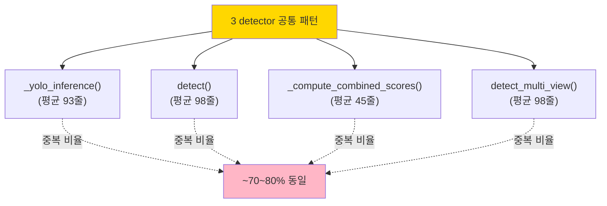
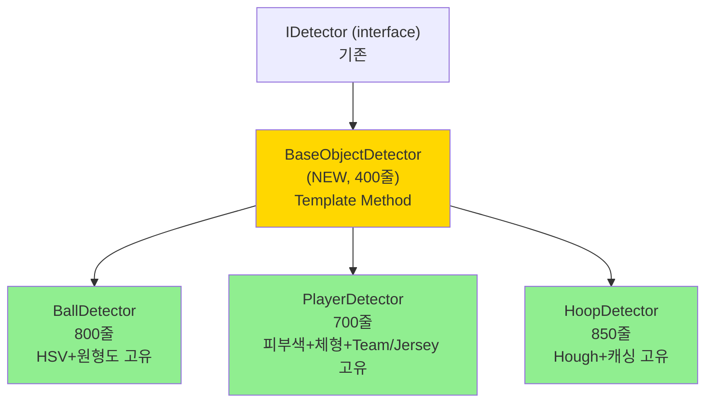

# 🛠️ Detector 3개 분리 계획서

> **ball/player/hoop detector (4,128줄) 를 BaseObjectDetector + 각 detector 로 분리.**
> 공통 패턴 70%+ → Template Method Pattern 적용.
> 작성일: 2026-05-23 / 기준: [detection/](../../../detection/)

---

## 📚 목차

1. [요약](#1-요약)
2. [현재 상태 진단](#2-현재-상태)
3. [목표 구조](#3-목표-구조)
4. [단계별 작업 (STEP 0~6)](#4-단계별-작업)
5. [주의사항](#5-주의사항)
6. [검증 방법](#6-검증-방법)
7. [예상 일정](#7-일정)

---

## 1. 요약 {#1-요약}

### 🎯 한 줄 목표

> **3개 detector (4,128줄) → BaseObjectDetector + 3 detector (총 2,350줄, 43% 절감)**

### 📊 Before / After

| 파일 | Before | After |
|---|---|---|
| `ball_detector.py` | 1,472줄 | 800줄 |
| `player_detector.py` | 1,162줄 | 700줄 |
| `hoop_detector.py` | 1,312줄 | 850줄 |
| **NEW**: `base_object_detector.py` | — | 400줄 |
| `pattern_validators/` (NEW) | — | 600줄 (3 파일) |
| **합계** | **3,946** | **3,350** |
| **절감** | — | **~600줄 (15%)** ⚠️ |

⚠️ 단순 줄수 절감은 작지만 **중복 제거 + 책임 분리 + 신규 detector 추가 쉬워짐**이 핵심.

---

## 2. 현재 상태 진단 {#2-현재-상태}

### 2.1 공통 메서드 — 70%+ 중복



### 2.2 각 detector 의 고유 부분

| 영역 | Ball | Player | Hoop |
|---|---|---|---|
| **패턴 검증** | HSV 색상 + 원형도 | 피부색 + 체형 | Hough Circle + HSV + 종횡비 |
| **상태 관리** | 없음 | TeamClassifier, JerseyOCR, PlayerIDManager | **캐싱 (HOOP_CACHE_TTL_SEC)** |
| **비즈니스** | predict_trajectory, is_in_hoop_region | `_post_process_players` | detect_score |
| **기타** | `_filter_by_size` 매우 큼 | 멀티뷰 융합이 92줄 | 캐싱 상태머신 3개 메서드 |

### 2.3 상세 메서드 매핑 (조사 결과)

#### ball_detector.py (1472줄)
| 메서드 | 라인 | 줄수 | 카테고리 |
|---|---|---|---|
| `__init__` | 257 | 24 | 초기화 |
| `initialize` | 309 | 152 | 초기화 |
| `detect` | 461 | **129** | 메인 파이프라인 |
| `process_detections` | 590 | 69 | 후처리 |
| `detect_ball` | 681 | 70 | 비즈니스 |
| `predict_trajectory` | 752 | 42 | 비즈니스 |
| `detect_multi_view` | 836 | 114 | 멀티뷰 |
| `detect_to_dto` | 950 | 48 | DTO 변환 |
| `_yolo_inference` | 998 | **116** | YOLO 추론 |
| `_filter_by_size` | 1114 | 113 | 필터링 |
| `_pattern_validation` | 1227 | **114** | HSV+원형도 |
| `_validate_color` | 1341 | 74 | HSV 검증 |
| `_validate_shape` | 1415 | 74 | 원형도 |
| `_compute_combined_scores` | 1489 | 66 | 점수 |
| `_candidates_to_objects` | 1555 | 44 | 변환 |
| `_fuse_multi_view` | 1599 | (대) | 멀티뷰 융합 |

#### player_detector.py (1162줄)
| 메서드 | 라인 | 줄수 | 카테고리 |
|---|---|---|---|
| `__init__`, `initialize` | 154, 204 | 32, 101 | 초기화 |
| `set_triangulator` | 577 | 21 | 멀티뷰 |
| `detect` | 598 | 71 | 메인 |
| `detect_multi_view` | 669 | 67 | 멀티뷰 |
| `_yolo_inference` | 736 | 94 | YOLO |
| `_filter_by_size` | 830 | 44 | 필터링 |
| `_pattern_validation` | 874 | 48 | 피부색+체형 |
| `_validate_skin_presence` | 923 | 56 | 피부색 |
| `_validate_body_shape` | 979 | 43 | 체형 |
| `_compute_combined_scores` | 1022 | 29 | 점수 |
| `_fuse_multi_view` | 1095 | 92 | 멀티뷰 융합 |
| `_find_best_match` | 1187 | 53 | 팀 매칭 |
| `_post_process_players` | 1298 | (대) | 비즈니스 |

#### hoop_detector.py (1312줄)
| 메서드 | 라인 | 줄수 | 카테고리 |
|---|---|---|---|
| `detect` | 490 | 94 | 메인 |
| `detect_hoops` | 704 | 37 | 비즈니스 |
| `detect_score` | 741 | 71 | 비즈니스 |
| `set_triangulator` | 812 | 17 | 멀티뷰 |
| `detect_multi_view` | 829 | 114 | 멀티뷰 |
| **`get_cached_hoops`** | 943 | 12 | **캐싱** ⭐ |
| **`get_rim_positions`** | 956 | 13 | **캐싱** ⭐ |
| **`_should_run_full_detection`** | 974 | 20 | **캐싱** ⭐ |
| **`_full_detection_pipeline`** | 995 | 48 | **캐싱** ⭐ |
| `_yolo_inference` | 1043 | 68 | YOLO |
| `_hough_circle_validation` | 1111 | **93** | Hough ⭐ |
| `_color_validation` | 1204 | 72 | HSV |
| `_backboard_aspect_validation` | 1276 | 43 | 종횡비 |
| `_compute_combined_scores` | 1319 | 39 | 점수 |
| `_fuse_multi_view` | 1472 | 85 | 멀티뷰 융합 |

### 2.4 기존 인터페이스

[shared/interfaces/detector_interface.py](../../../shared/interfaces/detector_interface.py) 에 이미 존재:
- `IDetector` (추상 기본 클래스)
- `IBallDetector`, `IPlayerDetector`, `IHoopDetector`
- 공통 추상 메서드: `initialize()`, `detect()`, `reset()`, `shutdown()`, `set_triangulator()`

→ **인터페이스는 준비됨**. Concrete base 클래스만 추출하면 됨.

---

## 3. 목표 구조 {#3-목표-구조}

### 3.1 분리 후 디렉토리

```
detection/
├── _base/                              # NEW
│   ├── __init__.py
│   ├── base_object_detector.py         # ~400줄 (공통 로직)
│   ├── yolo_inference_mixin.py         # ~150줄 (_yolo_inference 공통)
│   ├── multiview_mixin.py              # ~150줄 (detect_multi_view 공통)
│   └── score_computer.py               # ~100줄 (_compute_combined_scores)
│
├── _patterns/                          # NEW
│   ├── __init__.py
│   ├── color_validator.py              # HSV 검증 공통화 (~150줄)
│   ├── shape_validator.py              # 원형도/종횡비 (~150줄)
│   └── hough_validator.py              # Hough Circle (~100줄)
│
├── ball_detection/
│   ├── ball_detector.py                # ~800줄 (Ball 고유 로직만)
│   └── ball_pattern.py                 # ~200줄 (HSV+원형도 조합)
│
├── player_detection/
│   ├── player_detector.py              # ~700줄 (Player 고유)
│   ├── player_pattern.py               # ~200줄 (피부색+체형)
│   └── player_post_processor.py        # ~200줄 (Team/Jersey/ID 통합)
│
├── hoop_detection/
│   ├── hoop_detector.py                # ~850줄 (Hoop 고유 + 캐싱)
│   ├── hoop_pattern.py                 # ~200줄 (Hough+HSV+종횡비)
│   └── hoop_cache.py                   # ~150줄 (캐싱 상태머신)
```

### 3.2 BaseObjectDetector 설계

```python
# detection/_base/base_object_detector.py

class BaseObjectDetector(IDetector):
    """모든 detector 의 공통 베이스.

    Template Method Pattern:
      detect() 가 정의된 순서로
      _yolo_inference() → _pattern_validation() → _compute_scores()
      → _filter() → _build_candidates() 호출.
    """

    def __init__(self, model_path: Path, config: DetectorConfig):
        self._model = self._load_model(model_path)
        self._config = config
        self._triangulator: MultiViewTriangulator | None = None

    # 공통 인터페이스
    def initialize(self) -> None: ...
    def reset(self) -> None: ...
    def shutdown(self) -> None: ...
    def set_triangulator(self, triangulator) -> None: ...

    # Template Method (모든 detector 동일 흐름)
    def detect(self, frame: NDArray) -> list[DetectedObject]:
        raw = self._yolo_inference(frame)
        filtered = self._filter_by_confidence(raw)
        validated = self._pattern_validation(filtered, frame)
        scored = self._compute_combined_scores(validated)
        return self._build_objects(scored)

    # 공통 구현 (Mixin 으로 분리 가능)
    def _yolo_inference(self, frame): ...
    def _compute_combined_scores(self, candidates): ...
    def detect_multi_view(self, frames): ...

    # Abstract — 각 detector 가 구현
    @abstractmethod
    def _pattern_validation(self, candidates, frame): ...

    @abstractmethod
    def _build_objects(self, scored): ...
```

### 3.3 시각화



---

## 4. 단계별 작업 (STEP 0~6) {#4-단계별-작업}

### STEP 0: 사전 준비

- [ ] **0.1** 새 브랜치 `refactor/detectors-base-class`
- [ ] **0.2** 외부 호출자 grep:
  ```powershell
  Select-String -Path "**\*.py" -Pattern "BallDetector|PlayerDetector|HoopDetector"
  ```
- [ ] **0.3** 기존 detection 테스트 모두 green 확인
- [ ] **0.4** baseline 영상 분석 → `events.json` 저장 (회귀 비교용)

### STEP 1: `BaseObjectDetector` 추출 (1일)

- [ ] **1.1** `detection/_base/base_object_detector.py` 생성
- [ ] **1.2** 공통 메서드 정의:
  - `__init__()` — model_path, config
  - `initialize()`, `reset()`, `shutdown()` — 공통 생명주기
  - `set_triangulator()` — 멀티뷰 주입
  - `detect()` — Template Method
  - abstract: `_pattern_validation()`, `_build_objects()`

- [ ] **1.3** `_yolo_inference()` 공통화 (Mixin or method):
  ```python
  class YoloInferenceMixin:
      def _yolo_inference(self, frame, conf_threshold):
          # 3 detector 공통 로직
          # 차이점은 conf_threshold, target_class_ids 만
          ...
  ```

- [ ] **1.4** 단위 테스트:
  ```python
  def test_base_detector_template_method():
      class TestDetector(BaseObjectDetector):
          def _pattern_validation(self, candidates, frame):
              return candidates  # passthrough
          def _build_objects(self, scored):
              return [...]

      det = TestDetector(model_path, config)
      result = det.detect(mock_frame)
      assert len(result) > 0
  ```

### STEP 2: Pattern Validator 추출 (1일)

**목적**: HSV 검증, Hough Circle, 종횡비 검증을 공통 클래스로

- [ ] **2.1** `detection/_patterns/color_validator.py`:
  ```python
  class HSVColorValidator:
      def __init__(self, color_ranges: list[tuple]):
          self._ranges = color_ranges

      def validate(self, hsv_roi: NDArray) -> float:
          # 공통 HSV 마스킹 + 비율 계산
          ...
  ```

- [ ] **2.2** `detection/_patterns/shape_validator.py`:
  - 원형도 (ball)
  - 종횡비 (hoop)

- [ ] **2.3** `detection/_patterns/hough_validator.py`:
  - Hough Circle (hoop 전용이지만 일반화)

### STEP 3: BallDetector 리팩토링 (1일)

- [ ] **3.1** `BallDetector` 가 `BaseObjectDetector` 상속하도록 수정
- [ ] **3.2** Ball 고유만 남기기:
  - `_pattern_validation()`: HSV (color_validator) + 원형도 (shape_validator) 조합
  - `predict_trajectory()`, `is_ball_in_hoop_region()`
  - `_filter_by_size()` (Ball 고유 크기 필터)

- [ ] **3.3** 공통 메서드 제거:
  - `_yolo_inference()` → Mixin 사용
  - `_compute_combined_scores()` → Base 사용
  - `set_triangulator()` → Base 사용

- [ ] **3.4** 검증: events.json diff = 0

### STEP 4: PlayerDetector 리팩토링 (1일)

- [ ] **4.1** `BaseObjectDetector` 상속
- [ ] **4.2** Player 고유:
  - 피부색/체형 패턴 (player_pattern.py)
  - Team/Jersey/ID 통합 (`player_post_processor.py` 신설)
  - `_find_best_match()`

- [ ] **4.3** `_post_process_players()` 를 별도 클래스로:
  ```python
  class PlayerPostProcessor:
      def __init__(self, team_classifier, jersey_ocr, id_manager):
          ...

      def enrich(self, candidates):
          # team_id, jersey_number, player_id 부여
          ...
  ```

### STEP 5: HoopDetector 리팩토링 (1.5일) ⚠️ 캐싱 주의

- [ ] **5.1** `BaseObjectDetector` 상속
- [ ] **5.2** Hoop 고유:
  - Hough Circle (hough_validator)
  - HSV + 종횡비 (color + shape validator)

- [ ] **5.3** **캐싱 상태머신 분리** (가장 까다로움):
  ```python
  # detection/hoop_detection/hoop_cache.py
  class HoopDetectionCache:
      def __init__(self, ttl_sec: float):
          self._cache = None
          self._cache_time = 0.0
          self._ttl = ttl_sec

      def should_run_full_detection(self, current_frame_idx) -> bool:
          # _should_run_full_detection 로직 이동
          ...

      def get_cached(self): ...
      def update(self, hoops, frame_idx): ...
  ```

- [ ] **5.4** detect() Template Method 에서 캐싱 적용:
  ```python
  def detect(self, frame, frame_index):
      if not self._cache.should_run_full_detection(frame_index):
          return self._cache.get_cached()
      result = super().detect(frame)
      self._cache.update(result, frame_index)
      return result
  ```

### STEP 6: 통합 + PR (1일)

- [ ] **6.1** 전체 detection 테스트 green
- [ ] **6.2** baseline 영상 비교 — events.json diff = 0
- [ ] **6.3** 성능 회귀 측정 — fps 차이 < 5%
- [ ] **6.4** 라인 카운트:
  ```
  ball_detector.py        ≤ 800
  player_detector.py      ≤ 700
  hoop_detector.py        ≤ 850
  base_object_detector.py ≤ 400
  pattern validators × 3  ≤ 150 each
  ```
- [ ] **6.5** PR 작성

---

## 5. 주의사항 {#5-주의사항}

### 5.1 ⚠️ Template Method 의 함정 — 호출 순서 보장

```python
# detect() 의 호출 순서가 바뀌면 결과가 다를 수 있음
def detect(self, frame):
    raw = self._yolo_inference(frame)           # ① 순서 중요
    filtered = self._filter_by_confidence(raw)  # ②
    validated = self._pattern_validation(filtered, frame)  # ③
    # ...
```

→ 단위 테스트로 순서 검증.

### 5.2 ⚠️ Hoop 캐싱 호환성

기존 코드:
```python
hoop_detector.get_cached_hoops()
hoop_detector.get_rim_positions()
```

→ 외부 호출 인터페이스 유지 필요. `HoopDetector` 가 `_cache` 위임:
```python
def get_cached_hoops(self):
    return self._cache.get_cached()
```

### 5.3 ⚠️ Player 의 TeamClassifier/JerseyOCR 주입

기존엔 `__init__` 에서 받아서 인스턴스 변수로 보관:
```python
self._team_classifier = team_classifier
self._jersey_ocr = jersey_ocr
```

리팩토링 후엔 `PlayerPostProcessor` 로 위임. 외부 인터페이스 유지.

### 5.4 ⚠️ 멀티뷰 융합 (`_fuse_multi_view`)

- ball: 미측정 줄수
- player: 92줄
- hoop: 85줄

→ 공통 부분이 많지만 detector 별 미묘한 차이 (ball 은 trajectory 보존, hoop 은 정적 객체). **Base 보다 각자 두는 게 안전**.

---

## 6. 검증 방법 {#6-검증-방법}

### 6.1 단위 테스트

```python
# 각 detector 가 BaseObjectDetector 인터페이스 준수
def test_all_detectors_implement_base():
    assert isinstance(BallDetector(), BaseObjectDetector)
    assert isinstance(PlayerDetector(), BaseObjectDetector)
    assert isinstance(HoopDetector(), BaseObjectDetector)

# Template Method 가 올바른 순서로 호출
def test_detect_calls_methods_in_order():
    det = BallDetector()
    with patch.multiple(det, _yolo_inference=Mock(), ...):
        det.detect(mock_frame)
        assert det._yolo_inference.called
        # 순서 검증
```

### 6.2 회귀 테스트 — events.json diff

```powershell
# Before
git checkout main
python tools\bench_pipeline_realistic.py --frames 100
Copy-Item baseline_events.json baseline.json

# After
git checkout refactor/detectors-base-class
python tools\bench_pipeline_realistic.py --frames 100
Compare-Object (Get-Content baseline.json) (Get-Content baseline_events.json)
# → 비어있어야 함
```

### 6.3 성능 회귀

| 항목 | 허용 |
|---|---|
| 평균 fps | ± 5% |
| detection_fusion stage_times | ± 10% |
| GPU util | ± 5% |

---

## 7. 예상 일정 {#7-일정}

| STEP | 작업 | 소요 |
|---|---|---|
| STEP 0 | 사전 준비 | 0.5일 |
| STEP 1 | BaseObjectDetector | 1일 |
| STEP 2 | Pattern Validators | 1일 |
| STEP 3 | BallDetector | 1일 |
| STEP 4 | PlayerDetector | 1일 |
| STEP 5 | HoopDetector (캐싱) ⚠️ | 1.5일 |
| STEP 6 | 통합 + PR | 1일 |
| **합계** | | **7 작업일** |

---

## 8. 작업 체크리스트

### 시작 전
- [ ] [REFACTOR_PLAN_GAME_ORCHESTRATOR.md](REFACTOR_PLAN_GAME_ORCHESTRATOR.md) 작업 중이면 → 보류 (engine ↔ detection 의존)
- [ ] 외부 호출자 grep
- [ ] detection 테스트 모두 green
- [ ] baseline events.json 저장

### 작업 중
- [ ] 각 STEP 후 commit + 회귀 테스트
- [ ] Template Method 호출 순서 단위 테스트

### 완료 후
- [ ] 전체 테스트 green
- [ ] events.json diff = 0
- [ ] 성능 회귀 < 5%
- [ ] 라인 카운트 목표 달성

---

## 📖 관련 문서

- [REFACTOR_PLAN_GAME_ORCHESTRATOR.md](REFACTOR_PLAN_GAME_ORCHESTRATOR.md)
- [REFACTOR_PLAN_EXCEPTIONS.md](REFACTOR_PLAN_EXCEPTIONS.md)
- [FUSION_BOTTLENECK_ANALYSIS](../performance/FUSION_BOTTLENECK_ANALYSIS.md) — detection 병목
- [MainTODO.md](../../MainTODO.md)

---

**마지막 업데이트**: 2026-05-23
**예상 완료**: 7 작업일
