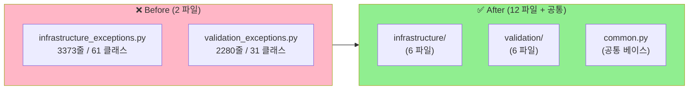
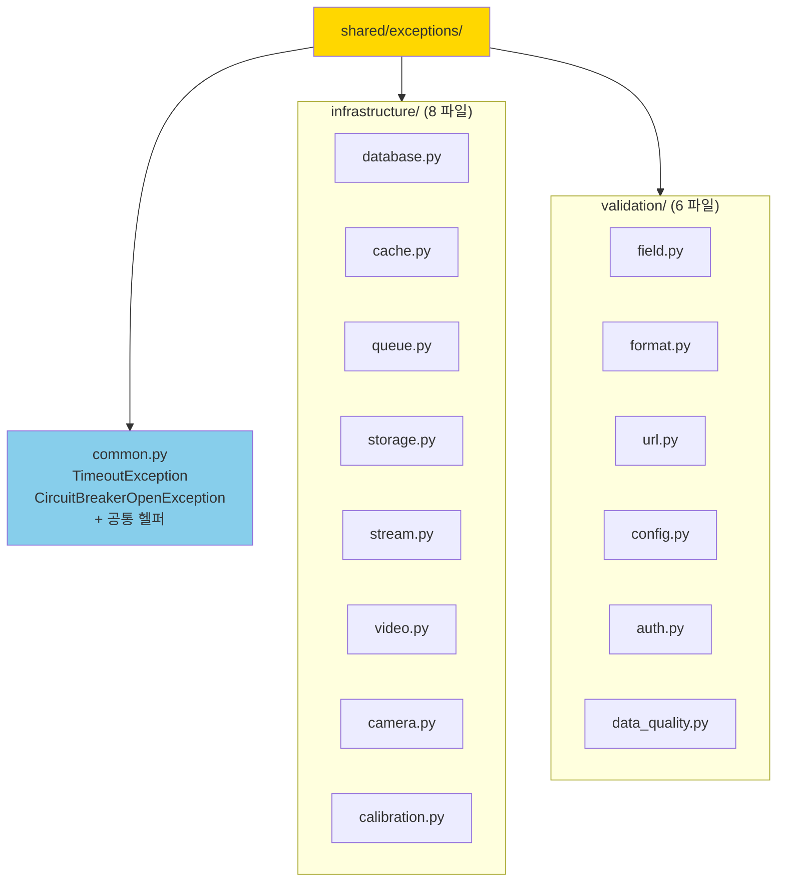

# 🛠️ Exceptions 파일 분리 계획서

> **`infrastructure_exceptions.py` (3,373줄) + `validation_exceptions.py` (2,280줄) 를 카테고리별로 분리.**
> 합계 5,653줄 → 4,750줄 (약 16% 절감) + **카테고리별 명확화**.
> 작성일: 2026-05-23 / 기준: [shared/exceptions/](../../../shared/exceptions/)

---

## 📚 목차

1. [요약](#1-요약)
2. [현재 상태 진단](#2-현재-상태)
3. [목표 구조](#3-목표-구조)
4. [단계별 작업 (STEP 1~6)](#4-단계별-작업)
5. [주의사항](#5-주의사항)
6. [검증 방법](#6-검증-방법)
7. [예상 일정](#7-일정)
8. [작업 체크리스트](#8-체크리스트)

---

## 1. 요약 {#1-요약}

### 🎯 한 줄 목표

> **2개 파일 (5,653줄) → 카테고리별 12개 파일로 분리**.

### 📊 Before / After



### 📈 기대 효과

| 항목 | Before | After | 개선 |
|---|---|---|---|
| 파일 수 | 2 | 13 | 카테고리 명확화 |
| 가장 큰 파일 | 3,373줄 | ~600줄 | **-82%** |
| 클래스/파일 평균 | 46 | 7~8 | **책임 분리** |
| import 영향 범위 | 전체 | 카테고리별 | **변경 영향 최소화** |

---

## 2. 현재 상태 진단 {#2-현재-상태}

### 2.1 infrastructure_exceptions.py — 61개 클래스 카테고리 분포

| 카테고리 | 개수 | 핵심 클래스 |
|---|---|---|
| **Database** | 7 | DatabaseException, ConnectionPoolException, TransactionException, RecordNotFoundException |
| **Cache** | 5 | CacheException, RedisException, CacheKeyNotFoundException |
| **Queue/Event** | 9 | QueueException, TaskExecutionException, EventBusException |
| **Storage (S3/Local)** | 8 | S3Exception, S3UploadException, LocalStorageException, DiskSpaceException |
| **Stream/External** | 4 | StreamException, ExternalServiceException, WebhookException |
| **Video Processing** | 7 | DecodingException, CodecException, NormalizationException |
| **Camera** | 3 | CameraException, CameraConnectionException |
| **Calibration** | 3 | CalibrationException, TransformationException |
| **Analysis/Sampling** | 2 | ClassificationException, SamplingException |
| **공통 베이스** | 13 | TimeoutException, CircuitBreakerOpenException 등 |

### 2.2 validation_exceptions.py — 31개 클래스 카테고리 분포

| 카테고리 | 개수 | 핵심 클래스 |
|---|---|---|
| **Base/Generic** | 4 | ValidationException, InvalidRequestException, MissingFieldException |
| **Field 검증** | 3 | InvalidFieldTypeException, ValueOutOfRangeException |
| **Format (JSON/Date)** | 6 | InvalidJsonFormatException, InvalidDateFormatException, FormatDetectionException |
| **URL/Security** | 2 | **URLValidationException (227줄)**, SecurityException |
| **Configuration** | 5 | ConfigurationException, ConfigurationParseException 등 |
| **Auth** | 2 | AuthenticationException, AuthorizationException |
| **Rate Limit** | 1 | RateLimitException |
| **Data Quality** | 2 | DataQualityException, LowQualityException |
| **Rule Set** | 3 | RuleSetNotFoundException, RuleSetValidationException |
| **기타** | 3 | StringLengthException, ResolutionException, SchemaValidationException |

### 2.3 공통 패턴 — 왜 클래스당 평균 55~85줄?

```python
class ConnectionPoolException(RetryableException):  # 평균 95줄
    """커넥션 풀 예외. (docstring 8줄)"""

    def __init__(self,                                  # __init__ 20~40줄
                 message: str = "...",
                 pool_name: str | None = None,
                 pool_size: int | None = None,
                 active_connections: int | None = None,
                 waiting_requests: int | None = None,
                 retry_after: float = 1.0,
                 max_retries: int = 3,
                 **kwargs):
        """(docstring 12줄)"""
        super().__init__(...)
        if pool_name: self.details["pool_name"] = pool_name      # 반복 패턴
        if pool_size: self.details["pool_size"] = pool_size
        if active_connections: self.details["active_connections"] = active_connections
        if waiting_requests: self.details["waiting_requests"] = waiting_requests

    @classmethod
    def pool_exhausted(cls, ...): ...                   # classmethod 30줄
        """(docstring 10줄)"""

    @classmethod
    def acquisition_timeout(cls, ...): ...              # classmethod 20줄
```

→ **반복 패턴: docstring 8줄 + __init__ 30줄 + classmethod 50줄 = 95줄**.

---

## 3. 목표 구조 {#3-목표-구조}

### 3.1 분리 후 디렉토리 구조

```
shared/exceptions/
├── __init__.py                          # 모든 export 유지 (하위 호환)
├── base_exception.py                    # (기존)
├── common.py                            # NEW — 공통 베이스 + Timeout/CircuitBreaker
│
├── infrastructure/                      # NEW 폴더
│   ├── __init__.py
│   ├── database.py                      # ~600줄 (7 클래스)
│   ├── cache.py                         # ~400줄 (5 클래스)
│   ├── queue.py                         # ~600줄 (9 클래스)
│   ├── storage.py                       # ~700줄 (8 클래스)
│   ├── stream.py                        # ~500줄 (4 클래스) — StreamException 340줄 포함
│   ├── video.py                         # ~500줄 (7 클래스)
│   ├── camera.py                        # ~300줄 (3 클래스)
│   └── calibration.py                   # ~300줄 (3 + Analysis/Sampling)
│
└── validation/                          # NEW 폴더
    ├── __init__.py
    ├── field.py                         # ~500줄 (Base + Field 7 클래스)
    ├── format.py                        # ~500줄 (6 클래스)
    ├── url.py                           # ~300줄 (URLValidationException 227줄)
    ├── config.py                        # ~400줄 (5 클래스)
    ├── auth.py                          # ~300줄 (Auth 2 + RateLimit 1)
    └── data_quality.py                  # ~400줄 (Data + RuleSet + 기타 8)
```

### 3.2 모듈 책임



---

## 4. 단계별 작업 (STEP 1~6) {#4-단계별-작업}

### STEP 0: 사전 준비

- [ ] **0.1** 새 브랜치 생성
  ```powershell
  git checkout -b refactor/exceptions-split
  ```
- [ ] **0.2** 외부 의존자 grep (필수)
  ```powershell
  Select-String -Path "**\*.py" -Pattern "from shared.exceptions"
  # → 결과 → refactor_notes.md 에 기록
  ```
- [ ] **0.3** 기존 테스트 green 확인
- [ ] **0.4** 파일 백업

### STEP 1: `common.py` 추출 (반나절)

**대상**: 공통 베이스 + 어디에도 속하지 않는 공통 예외

- [ ] **1.1** `shared/exceptions/common.py` 생성
- [ ] **1.2** 이동 대상 (infrastructure_exceptions.py 에서):
  - `TimeoutException`
  - `CircuitBreakerOpenException`
  - `InfraConfigurationException`
  - `InfraValidationException`
  - `AlignmentException`
  - `FrameDropException`
  - `SyncException`
  - 공통 헬퍼 (`_mask_sensitive_key()`, `_sanitize_query()`, `_sanitize_stream_url()`)

- [ ] **1.3** 단위 테스트 추가
  ```python
  def test_common_exceptions_importable():
      from shared.exceptions.common import TimeoutException, CircuitBreakerOpenException
      assert TimeoutException("test").message == "test"
  ```

### STEP 2: `infrastructure/` 폴더 — DB/Cache/Queue (1일)

- [ ] **2.1** `shared/exceptions/infrastructure/__init__.py` 생성
- [ ] **2.2** `database.py` — 7 클래스 이동
  ```python
  from .common import *

  class DatabaseException(NonRetryableException): ...
  class DatabaseConnectionException(RetryableException): ...
  class DatabaseTimeoutException(...): ...
  class DatabaseIntegrityException(...): ...
  class TransactionException(...): ...
  class RecordNotFoundException(...): ...
  class ConnectionPoolException(RetryableException): ...
  ```

- [ ] **2.3** `cache.py` — 5 클래스
- [ ] **2.4** `queue.py` — 9 클래스 (EventBusException 포함)
- [ ] **2.5** 각 파일 끝에 `__all__` 명시:
  ```python
  __all__ = ["DatabaseException", "DatabaseConnectionException", ...]
  ```

### STEP 3: `infrastructure/` 폴더 — Storage/Stream/Video (1일)

- [ ] **3.1** `storage.py` — 8 클래스 (S3Exception 등)
- [ ] **3.2** `stream.py` — 4 클래스 (StreamException 340줄 포함)
- [ ] **3.3** `video.py` — 7 클래스 (DecodingException 등)
- [ ] **3.4** `camera.py` — 3 클래스
- [ ] **3.5** `calibration.py` — 3 + Analysis/Sampling (총 5)

### STEP 4: `validation/` 폴더 (1일)

- [ ] **4.1** `shared/exceptions/validation/__init__.py` 생성
- [ ] **4.2** `field.py` — Base + Field 검증 7 클래스
- [ ] **4.3** `format.py` — 6 클래스 (JSON, Date, Format)
- [ ] **4.4** `url.py` — URLValidationException + SecurityException (총 2, 한 파일 큰 클래스라 단독)
- [ ] **4.5** `config.py` — 5 클래스
- [ ] **4.6** `auth.py` — Auth 2 + RateLimit 1
- [ ] **4.7** `data_quality.py` — DataQuality + RuleSet + 기타 8

### STEP 5: `__init__.py` 하위 호환 보장 (반나절) ⚠️ 가장 중요

**목적**: 외부 코드가 `from shared.exceptions import XxxException` 으로 계속 동작해야 함

- [ ] **5.1** `shared/exceptions/__init__.py` 전면 재작성:
  ```python
  # 모든 이전 import 경로 유지
  from .common import (
      TimeoutException,
      CircuitBreakerOpenException,
      ...
  )
  from .infrastructure.database import (
      DatabaseException,
      ConnectionPoolException,
      ...
  )
  from .infrastructure.cache import *
  from .infrastructure.queue import *
  from .infrastructure.storage import *
  from .infrastructure.stream import *
  from .infrastructure.video import *
  from .infrastructure.camera import *
  from .infrastructure.calibration import *

  from .validation.field import *
  from .validation.format import *
  from .validation.url import *
  from .validation.config import *
  from .validation.auth import *
  from .validation.data_quality import *

  __all__ = [...]  # 이전과 완전히 동일한 목록
  ```

- [ ] **5.2** `infrastructure_exceptions.py` 와 `validation_exceptions.py` 를 **호환성 shim** 으로 변환:
  ```python
  # shared/exceptions/infrastructure_exceptions.py (호환성 shim)
  import warnings
  warnings.warn(
      "infrastructure_exceptions 는 deprecated 입니다. "
      "shared.exceptions 또는 shared.exceptions.infrastructure.* 사용 권장",
      DeprecationWarning,
      stacklevel=2,
  )
  from .infrastructure.database import *
  from .infrastructure.cache import *
  # ... 모든 클래스 re-export
  ```

- [ ] **5.3** 외부 호출자 모두 그대로 동작 확인

### STEP 6: 검증 + PR (반나절)

- [ ] **6.1** 전체 테스트 실행
  ```powershell
  pytest tests/ -v
  ```
- [ ] **6.2** import 경로 검증
  ```python
  # 이전 방식 — 여전히 동작해야 함
  from shared.exceptions import DatabaseException
  from shared.exceptions.infrastructure_exceptions import S3Exception   # deprecated 경고
  # 신규 방식
  from shared.exceptions.infrastructure.database import DatabaseException
  from shared.exceptions.infrastructure.storage import S3Exception
  ```
- [ ] **6.3** 라인 카운트 확인 (목표: 각 파일 < 700줄)
- [ ] **6.4** PR 작성

---

## 5. 주의사항 {#5-주의사항}

### 5.1 ⚠️ 하위 호환성 절대 깨지면 안 됨

```python
# 외부 코드 (현재 ~30개 파일)
from shared.exceptions import DatabaseException, S3Exception
from shared.exceptions.infrastructure_exceptions import RedisException

# 분리 후에도 위 import 모두 작동해야 함
```

→ **`__init__.py` re-export** + **기존 파일을 shim 으로 변환** 필수.

### 5.2 ⚠️ 순환 import 위험

```python
# 위험
infrastructure/database.py:
    from .stream import StreamException  # ← 순환 가능

infrastructure/stream.py:
    from .database import DatabaseException
```

→ **카테고리 간 import 금지**. 공통 베이스만 `common.py` 에서 가져오기.

### 5.3 ⚠️ ErrorCode enum 의존

각 예외가 사용하는 `ErrorCode` enum 위치 확인:
```python
from shared.constants.error_codes import ErrorCode  # 기존 경로 유지
```

### 5.4 ⚠️ classmethod factory 메서드 이동 시

```python
# Before
ConnectionPoolException.pool_exhausted(pool_name, pool_size)

# After (변경 없음 — 클래스 위치만 바뀜)
from shared.exceptions.infrastructure.database import ConnectionPoolException
ConnectionPoolException.pool_exhausted(pool_name, pool_size)
```

→ 동작 변경 없음. 단, deprecation 경고 발생 가능.

### 5.5 ⚠️ Deprecation 정책

- **STEP 5** 의 shim 은 **6개월 후 제거** 권장
- 그동안 외부 코드가 신규 경로로 마이그레이션
- shim 제거 시 별도 PR

---

## 6. 검증 방법 {#6-검증-방법}

### 6.1 단위 테스트

```python
# tests/shared/exceptions/test_imports.py (신규)
def test_all_old_imports_still_work():
    """기존 import 경로 모두 유지 확인."""
    from shared.exceptions import (
        DatabaseException, S3Exception, RedisException,
        ConnectionPoolException, StreamException,
        ValidationException, RateLimitException,
    )

    # 인스턴스 생성 검증
    assert DatabaseException("test").message == "test"
    assert isinstance(S3Exception("test"), Exception)

def test_new_imports_work():
    """신규 카테고리별 import 동작."""
    from shared.exceptions.infrastructure.database import DatabaseException
    from shared.exceptions.validation.url import URLValidationException
    assert True

def test_deprecated_path_warns():
    """구 경로 import 시 deprecation 경고."""
    import warnings
    with warnings.catch_warnings(record=True) as w:
        warnings.simplefilter("always")
        from shared.exceptions.infrastructure_exceptions import S3Exception
        assert any("deprecated" in str(warn.message).lower() for warn in w)
```

### 6.2 회귀 테스트

```powershell
# 모든 테스트
pytest tests/ -v

# 예외 관련만
pytest tests/shared/exceptions/ -v
pytest tests/ -k "exception" -v
```

### 6.3 라인 카운트

```powershell
foreach ($f in (Get-ChildItem shared\exceptions\**\*.py -Recurse)) {
    $lines = (Get-Content $f | Measure-Object -Line).Lines
    Write-Host "$($f.FullName): $lines"
}

# 목표: 모든 파일 < 800줄
```

### 6.4 import 영향도 확인

```powershell
# 외부에서 import 하는 곳 grep — 모두 정상 동작해야
Select-String -Path "**\*.py" -Pattern "from shared.exceptions"
```

---

## 7. 예상 일정 {#7-일정}

| STEP | 작업 | 소요 | 누적 |
|---|---|---|---|
| STEP 0 | 사전 준비 | 0.25일 | 0.25일 |
| STEP 1 | common.py 추출 | 0.5일 | 0.75일 |
| STEP 2 | DB/Cache/Queue 분리 | 1일 | 1.75일 |
| STEP 3 | Storage/Stream/Video/Camera/Calibration | 1일 | 2.75일 |
| STEP 4 | validation/ 폴더 | 1일 | 3.75일 |
| STEP 5 | __init__ 하위 호환 ⚠️ | 0.5일 | 4.25일 |
| STEP 6 | 검증 + PR | 0.5일 | **4.75일** |

→ **총 5 작업일** (약 1주).

---

## 8. 작업 체크리스트 {#8-체크리스트}

### 시작 전
- [ ] [REFACTOR_PLAN_GAME_ORCHESTRATOR.md](REFACTOR_PLAN_GAME_ORCHESTRATOR.md) 작업 중이면 → 끝나길 기다림 (충돌 가능성 낮지만 안전)
- [ ] 외부 import 경로 grep → refactor_notes.md
- [ ] 모든 테스트 green
- [ ] 새 브랜치 생성

### 작업 중
- [ ] 각 STEP 후 commit
- [ ] 각 카테고리 파일 작성 후 import 테스트
- [ ] shim 작성 시 deprecation 경고 추가

### 완료 후
- [ ] 전체 테스트 green
- [ ] 기존 import 경로 모두 동작
- [ ] 신규 경로 모두 동작
- [ ] 라인 카운트 < 800줄/파일
- [ ] PR 작성

---

## 📖 관련 문서

- [REFACTOR_PLAN_GAME_ORCHESTRATOR.md](REFACTOR_PLAN_GAME_ORCHESTRATOR.md) — game_orchestrator 분리 계획
- [MainTODO.md](../../MainTODO.md) — 전체 작업 우선순위
- [INDEX.md](../../INDEX.md) — docs 인덱스

---

**마지막 업데이트**: 2026-05-23 (계획서 작성)
**예상 완료**: 작업 시작 후 5 작업일
