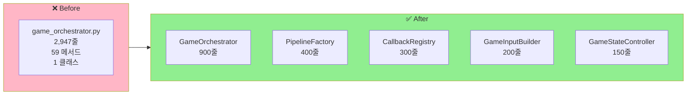
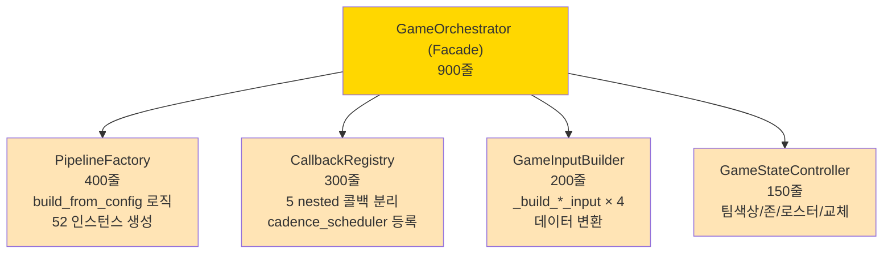
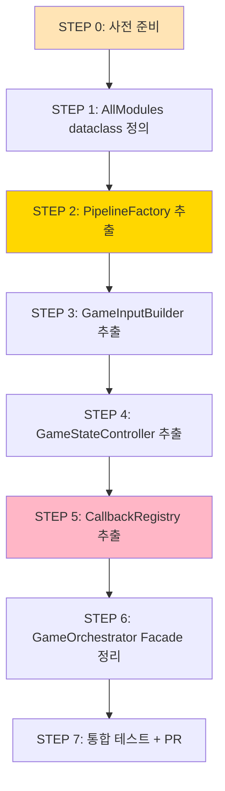
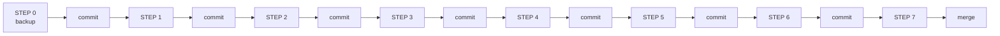
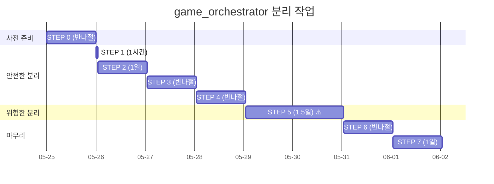
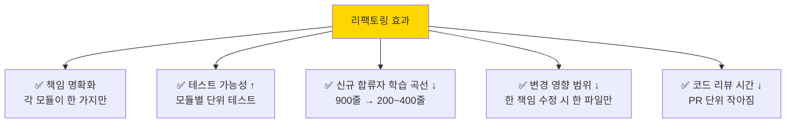

# 🛠️ game_orchestrator.py 분리 계획서

> **2,947줄 메가파일을 5개 모듈로 분리하는 단계별 계획.**
> 코드 수정 없이 계획서만 작성 — 다른 컴퓨터에서 작업 시 그대로 따라 실행 가능.
> 작성일: 2026-05-23 / 기준: [engine/orchestrator/game_orchestrator.py](../../../engine/orchestrator/game_orchestrator.py)

---

## 📚 목차

1. [요약](#1-요약)
2. [현재 상태 진단](#2-현재-상태)
3. [목표 구조 — 5개 모듈](#3-목표-구조)
4. [단계별 작업 (STEP 1~7)](#4-단계별-작업)
5. [주의사항 / 함정](#5-주의사항)
6. [검증 방법](#6-검증-방법)
7. [롤백 전략](#7-롤백)
8. [예상 일정](#8-일정)
9. [작업 시작 체크리스트](#9-체크리스트)

---

## 1. 요약 {#1-요약}

### 🎯 한 줄 목표

> **`game_orchestrator.py` (2,947줄) 를 5개 모듈 (총 1,950줄) 로 분리해 책임 명확화 + 테스트 가능성 향상.**

### 📊 Before / After



### 📈 기대 효과

| 항목 | Before | After | 개선 |
|---|---|---|---|
| 총 줄 수 | 2,947 | 1,950 | **-997 (-34%)** |
| 가장 긴 메서드 | 441줄 | ~100줄 | **-77%** |
| 단일 클래스 메서드 수 | 59 | ~15/클래스 | **책임 분리** |
| 테스트 가능성 | 낮음 (god class) | 높음 (모듈별) | **↑↑↑** |
| 신규 합류자 학습 곡선 | 가파름 | 완만 | **↑↑** |

---

## 2. 현재 상태 진단 {#2-현재-상태}

### 2.1 파일 구조 분석

[game_orchestrator.py](../../../engine/orchestrator/game_orchestrator.py) 의 책임 분포:

| 책임 영역 | 줄 수 | 비중 |
|---|---|---|
| 모듈 인스턴스화 (build_from_config) | ~341 | 12% |
| Cadence 콜백 등록 + 5 nested 함수 | ~441 | 15% |
| 데이터 변환 (_build_*_input × 4) | ~370 | 13% |
| FSM + 수명주기 (start/stop/pause/resume) | ~300 | 10% |
| 메인 루프 (_main_loop) | ~104 | 4% |
| TensorRT 동적 빌드 | ~76 | 3% |
| Stage2 ViTPose 트리거 | ~68 | 2% |
| 기타 헬퍼/속성 | ~1,247 | 41% |

→ **5가지 책임이 한 파일에 혼재**.

### 2.2 핫스팟 — 가장 큰 3개 메서드

| 순위 | 메서드 | 라인 | 줄수 | 비고 |
|---|---|---|---|---|
| 🥇 | `_register_cadence_callbacks` | 1287-1727 | **441** | nested 5 함수 |
| 🥈 | `build_from_config` | 355-695 | **341** | 52 인스턴스 생성 |
| 🥉 | `_frame_cb` (nested) | 1298-1540 | **243** | 가장 무거운 콜백 |

→ **상위 3개 = 1,025줄 (전체의 39%)**.

### 2.3 외부 호출자 (이미 의존하는 코드)

분리 시 영향받는 파일들:

```bash
# 외부에서 GameOrchestrator import 하는 곳 (사전 grep 필요)
grep -rn "from engine.orchestrator.game_orchestrator import" --include="*.py"
grep -rn "import GameOrchestrator" --include="*.py"
```

**예상 호출자**:
- `api_server/services/game_service.py`
- `tests/engine/test_*.py`
- `tools/bench_pipeline_realistic.py`
- `launcher_workers.py`

→ **외부 인터페이스 (public 메서드) 는 절대 변경하지 않음**.

---

## 3. 목표 구조 — 5개 모듈 {#3-목표-구조}

### 3.1 분리 후 디렉토리 구조

```
engine/orchestrator/
├── game_orchestrator.py            (900줄) ← Facade 유지
├── pipeline_factory.py             (400줄) ← NEW
├── callback_registry.py            (300줄) ← NEW
├── game_input_builder.py           (200줄) ← NEW
├── game_state_controller.py        (150줄) ← NEW
├── cadence_scheduler.py            (기존)
└── mode_controller.py              (기존)
```

### 3.2 각 모듈의 책임



### 3.3 모듈별 상세

#### Module 1: `GameOrchestrator` (Facade, 900줄)

**책임**: 외부 인터페이스 유지 + 수명주기 관리만

**유지할 메서드**:
- `__init__` (간소화)
- `start_game()`, `stop_game()`, `pause_game()`, `resume_game()`
- `_initialize_all()`, `_shutdown_all()`
- `_main_loop()`
- 모든 public property (`is_running`, `state_manager`, `gpu_manager` 등)

**위임할 메서드**:
- `build_from_config()` → `PipelineFactory`
- `_register_cadence_callbacks()` → `CallbackRegistry`
- `_build_*_input()` → `GameInputBuilder`
- `set_team_colors()`, `set_court_zones()`, `set_roster()` → `GameStateController`

---

#### Module 2: `PipelineFactory` (400줄, NEW)

**책임**: 52개 모듈 인스턴스화 로직 분리

**포함할 메서드** (game_orchestrator.py 에서 이동):
- `build_from_config()` (line 355-695)
- `_build_event_modules()` (line 2021-2074)
- `_build_possession_modules()` (line ~2080)
- `_build_period_modules()` (line ~2130)
- `_build_postgame_modules()` (line ~2180)
- `_ensure_engine_built()` (line 1907-1982) — TRT 빌드
- `_resolve_weights_dir()` (line ~2005)
- `_load_all_calibrations()` (line 1983)

**인터페이스**:
```python
class PipelineFactory:
    @classmethod
    def create_modules(cls, config: EngineConfig) -> AllModules:
        """52개 모듈 인스턴스 dict 반환"""
        return AllModules(
            gpu=cls._build_gpu_modules(config),
            detection=cls._build_detection_modules(config),
            pose=cls._build_pose_modules(config),
            motion=cls._build_motion_modules(config),
            pipelines=cls._build_pipelines(config),
            event_detection=cls._build_event_modules(config),
            game_management=cls._build_game_mgmt_modules(config),
            orchestration=cls._build_orchestration_modules(config),
            workers=cls._build_workers(config),
            io=cls._build_io_modules(config),
        )
```

---

#### Module 3: `CallbackRegistry` (300줄, NEW)

**책임**: 5단계 cadence 콜백 분리 + 등록

**포함할 메서드**:
- `register_all()` — cadence_scheduler 에 5개 콜백 등록
- `_frame_callback()` — 243줄 → 메서드로 추출
- `_event_callback()` — 68줄
- `_possession_callback()` — 19줄
- `_period_callback()` — 18줄
- `_postgame_callback()` — 56줄
- `_try_stage2_vitpose()` — 68줄 (line 2366-2433)
- `_update_ball_state()` — 52줄
- `_update_game_management()` — 68줄

**인터페이스**:
```python
class CallbackRegistry:
    def __init__(self,
                 modules: AllModules,
                 state_manager: GameStateManager,
                 input_builder: GameInputBuilder):
        self._modules = modules
        self._state_manager = state_manager
        self._input_builder = input_builder

    def register_all(self, scheduler: CadenceScheduler) -> None:
        scheduler.register(CadenceLevel.FRAME, self._frame_callback)
        scheduler.register(CadenceLevel.EVENT, self._event_callback)
        scheduler.register(CadenceLevel.POSSESSION, self._possession_callback)
        scheduler.register(CadenceLevel.PERIOD, self._period_callback)
        scheduler.register(CadenceLevel.POSTGAME, self._postgame_callback)
```

---

#### Module 4: `GameInputBuilder` (200줄, NEW)

**책임**: FramePipelineResult → 각 stage 입력 변환

**포함할 메서드**:
- `build_score_input()` (line 2489-2661, 173줄)
- `build_possession_input()` (line 2752-2816, 65줄)
- `build_dead_ball_input()` (line 2818-2862, 45줄)
- `build_referee_context()` (line 2863-2947, 85줄)
- `_extract_bbox_width()` (헬퍼)

**인터페이스**:
```python
class GameInputBuilder:
    def __init__(self, modules: AllModules):
        self._modules = modules

    def build_score_input(self, result: FramePipelineResult) -> ScoreFrameInput:
        # 픽셀 → 미터 동적 변환
        # rim 거리 계산
        ...
```

---

#### Module 5: `GameStateController` (150줄, NEW)

**책임**: 팀/존/로스터/교체 상태 관리

**포함할 메서드**:
- `set_team_colors()` (line ~770)
- `set_court_zones()` (line ~810)
- `set_roster()` (line ~880)
- 교체 처리 (`handle_substitution`)
- 쿼터 전환 (`handle_period_change`)

**인터페이스**:
```python
class GameStateController:
    def __init__(self, modules: AllModules):
        self._modules = modules

    def set_team_colors(self, home: str, away: str) -> None:
        self._modules.detection.team_classifier.set_colors(home, away)
        # ... 다른 모듈 동기화

    def set_roster(self, players: list[Player]) -> None:
        ...
```

---

## 4. 단계별 작업 (STEP 1~7) {#4-단계별-작업}



### STEP 0: 사전 준비 (반나절)

**목적**: 작업 환경 + 안전망 확보

- [ ] **0.1** 새 브랜치 생성
  ```powershell
  git checkout -b refactor/game-orchestrator-split
  ```

- [ ] **0.2** 현재 테스트 모두 green 확인
  ```powershell
  pytest tests/ -v
  ```

- [ ] **0.3** 외부 호출자 grep
  ```powershell
  Select-String -Path "**\*.py" -Pattern "from engine.orchestrator.game_orchestrator|GameOrchestrator"
  ```
  → 호출자 목록을 `refactor_notes.md` 에 기록

- [ ] **0.4** 현재 `game_orchestrator.py` 백업
  ```powershell
  Copy-Item engine\orchestrator\game_orchestrator.py engine\orchestrator\_game_orchestrator_backup.py.bak
  ```

- [ ] **0.5** baseline 동작 영상 캡처
  - LIVE 모드 30초 분석 → events.json 저장
  - 비교 기준으로 사용

---

### STEP 1: `AllModules` Dataclass 정의 (1시간)

**목적**: 52개 모듈 인스턴스를 담을 컨테이너 정의

- [ ] **1.1** `engine/orchestrator/_module_container.py` 생성
  ```python
  @dataclass(slots=True, frozen=True)
  class GPUModules:
      manager: GPUManager
      cuda_stream: CUDAStreamManager
      trt_pool: TensorRTPool
      batch_accumulator: BatchAccumulator

  @dataclass(slots=True, frozen=True)
  class DetectionModules:
      ball: BallDetector
      player: PlayerDetector
      hoop: HoopDetector

  # ... 그룹별 dataclass

  @dataclass(slots=True, frozen=True)
  class AllModules:
      gpu: GPUModules
      detection: DetectionModules
      pose: PoseModules
      motion: MotionModules
      pipelines: PipelineModules
      event_detection: EventDetectionModules
      game_management: GameMgmtModules
      orchestration: OrchestrationModules
      workers: WorkerModules
      io: IOModules
  ```

- [ ] **1.2** 단위 테스트 작성
  ```python
  def test_all_modules_immutable():
      modules = AllModules(...)
      with pytest.raises(FrozenInstanceError):
          modules.gpu = None  # frozen 이라 에러
  ```

---

### STEP 2: `PipelineFactory` 추출 (1일)

**목적**: 52 인스턴스 생성 로직 분리

- [ ] **2.1** `engine/orchestrator/pipeline_factory.py` 생성

- [ ] **2.2** game_orchestrator.py 의 다음 메서드 이동:
  - `build_from_config` (355-695)
  - `_build_event_modules` (2021-2074)
  - `_build_possession_modules`
  - `_build_period_modules`
  - `_build_postgame_modules`
  - `_ensure_engine_built` (1907-1982)
  - `_resolve_weights_dir`
  - `_load_all_calibrations`

- [ ] **2.3** Facade 에서 위임:
  ```python
  # game_orchestrator.py
  @classmethod
  def build_from_config(cls, config):
      modules = PipelineFactory.create_modules(config)
      return cls(modules=modules)
  ```

- [ ] **2.4** 단위 테스트:
  ```python
  def test_factory_creates_all_modules():
      modules = PipelineFactory.create_modules(test_config)
      assert isinstance(modules.gpu.manager, GPUManager)
      assert isinstance(modules.detection.ball, BallDetector)
      # ... 52개 모두 검증
  ```

- [ ] **2.5** 회귀 테스트:
  ```powershell
  pytest tests/engine/orchestrator/ -v
  ```

---

### STEP 3: `GameInputBuilder` 추출 (반나절)

**목적**: 데이터 변환 메서드 4개 분리

- [ ] **3.1** `engine/orchestrator/game_input_builder.py` 생성

- [ ] **3.2** 메서드 이동:
  - `_build_score_input` (2489-2661, 173줄)
  - `_build_possession_input` (2752-2816)
  - `_build_dead_ball_input` (2818-2862)
  - `_build_referee_context` (2863-2947)
  - `_extract_bbox_width` 헬퍼

- [ ] **3.3** `self._modules` 의존성 명시:
  ```python
  class GameInputBuilder:
      def __init__(self, modules: AllModules):
          self._modules = modules
          self._ball_state_machine = modules.detection.ball.state_machine
          # 자주 쓰는 것만 캐싱
  ```

- [ ] **3.4** 단위 테스트:
  ```python
  def test_build_score_input_pixel_to_meter():
      builder = GameInputBuilder(mock_modules)
      result = builder.build_score_input(mock_frame_result)
      assert 0.4 < result.px_to_m < 0.5  # 림 직경 기반
  ```

---

### STEP 4: `GameStateController` 추출 (반나절)

**목적**: 팀/존/로스터 관리 분리

- [ ] **4.1** `engine/orchestrator/game_state_controller.py` 생성

- [ ] **4.2** 메서드 이동:
  - `set_team_colors`
  - `set_court_zones`
  - `set_roster`
  - 교체 처리 헬퍼

- [ ] **4.3** Facade 에서 위임:
  ```python
  # game_orchestrator.py
  def set_team_colors(self, home, away):
      self._state_controller.set_team_colors(home, away)
  ```

---

### STEP 5: `CallbackRegistry` 추출 (1.5일) ⚠️ 가장 위험

**목적**: 441줄 콜백 등록 메서드 분리 — 가장 까다로움

#### 위험 요소

- nested 함수의 closure 가 self.* 에 광범위 접근
- 5개 콜백 간 공유 상태 있을 수 있음
- frame_index, 타이밍 의존성

- [ ] **5.1** `engine/orchestrator/callback_registry.py` 생성

- [ ] **5.2** **신중하게** nested 함수를 메서드로 변환:
  ```python
  # Before (nested)
  def _register_cadence_callbacks(self):
      def _frame_cb(level, triggers):
          # self.* 접근 다수
          self._frame_pipeline.process(...)

  # After (메서드)
  class CallbackRegistry:
      def __init__(self, modules, state_manager, input_builder):
          self._modules = modules
          # ... 의존성 명시적 주입

      def _frame_callback(self, level, triggers):
          self._modules.pipelines.frame.process(...)
  ```

- [ ] **5.3** 5개 콜백 하나씩 마이그레이션:
  - **5.3a** `_frame_cb` (243줄) — 가장 무거움
  - **5.3b** `_event_cb` (68줄) — Stage2 ViTPose 포함
  - **5.3c** `_possession_cb` (19줄)
  - **5.3d** `_period_cb` (18줄)
  - **5.3e** `_postgame_cb` (56줄)

- [ ] **5.4** 각 콜백 추출마다 회귀 테스트
  - LIVE 모드 30초 분석
  - events.json 이 baseline 과 동일한지 비교

- [ ] **5.5** `_try_stage2_vitpose` (68줄) 도 함께 이동
- [ ] **5.6** `_update_ball_state` (52줄) 이동
- [ ] **5.7** `_update_game_management` (68줄) 이동

---

### STEP 6: `GameOrchestrator` Facade 정리 (반나절)

**목적**: 남은 코드를 깨끗하게 정리

- [ ] **6.1** game_orchestrator.py 에 남는 것만 정리:
  - `__init__` (간소화)
  - `start_game`, `stop_game`, `pause_game`, `resume_game`
  - `_initialize_all`, `_shutdown_all`
  - `_main_loop`
  - 모든 public property

- [ ] **6.2** 외부 인터페이스 유지 검증:
  ```python
  # 외부에서 이전과 동일하게 사용 가능해야 함
  orch = GameOrchestrator.build_from_config(config)
  orch.start_game()
  orch.set_team_colors("red", "blue")
  orch.stop_game()
  ```

- [ ] **6.3** import 정리 — 더 이상 필요 없는 import 제거

- [ ] **6.4** 줄 수 확인:
  ```powershell
  (Get-Content engine\orchestrator\game_orchestrator.py | Measure-Object -Line).Lines
  # 목표: ~900줄
  ```

---

### STEP 7: 통합 테스트 + PR (1일)

- [ ] **7.1** 전체 테스트 스위트 실행
  ```powershell
  pytest tests/ -v --tb=short
  # 324개 모두 green 확인
  ```

- [ ] **7.2** 실제 영상 분석 비교
  - 같은 영상으로 baseline (Before) vs After 비교
  - events.json diff — **반드시 동일해야 함**
  - stage_times_ms diff — 큰 차이 없어야 함

- [ ] **7.3** 성능 측정
  ```powershell
  python tools\bench_pipeline_realistic.py --frames 100
  # fps 가 기존 baseline 과 동일/유사한지
  ```

- [ ] **7.4** 라인 카운트 최종 확인
  ```
  game_orchestrator.py       ≤ 900줄
  pipeline_factory.py        ≤ 400줄
  callback_registry.py       ≤ 300줄
  game_input_builder.py      ≤ 200줄
  game_state_controller.py   ≤ 150줄
  _module_container.py       ≤ 100줄
  ─────────────────────────────────
  합계                       ≤ 2,050줄
  ```

- [ ] **7.5** 외부 호출자 영향 확인 (이전 grep 목록)
  - api_server, tests, tools 모두 정상 동작

- [ ] **7.6** PR 작성
  ```
  refactor(orchestrator): split game_orchestrator into 5 modules

  - GameOrchestrator (facade, 900 lines)
  - PipelineFactory (400 lines)
  - CallbackRegistry (300 lines)
  - GameInputBuilder (200 lines)
  - GameStateController (150 lines)

  Total: 2947 → 1950 lines (-34%)
  All 324 tests passing.
  Baseline analysis output identical (events.json diff = empty).
  ```

---

## 5. 주의사항 / 함정 {#5-주의사항}

### 5.1 ⚠️ Closure 의존성 (가장 위험)

nested 함수가 self.* 에 광범위 접근:

```python
# Before (nested — closure 로 self 자동 접근)
def _register_cadence_callbacks(self):
    def _frame_cb(level, triggers):
        self._frame_pipeline.process(...)        # closure
        self._ball_state_machine.update(...)     # closure
        self._event_converter.update_ball_state(...)  # closure

# After (메서드 — self 명시 필요)
class CallbackRegistry:
    def _frame_callback(self, level, triggers):
        self._modules.pipelines.frame.process(...)
        self._modules.detection.ball.state_machine.update(...)
        # ... 모든 self.* 를 self._modules.* 로 변환
```

**완화**: 자주 쓰는 모듈을 `__init__` 에서 단축 변수로 저장.

### 5.2 ⚠️ FSM 일관성

상태 전이 (`_state_manager.transition_engine(...)`) 가 분산되면 위험:

```python
# 잘못 — 여러 모듈이 상태 변경
ModuleA: self._state.transition(LOADING)
ModuleB: self._state.transition(RUNNING)  # ← 순서 보장 안 됨

# 올바름 — Facade 만 상태 변경
GameOrchestrator.start_game():
    self._state.transition(LOADING)
    self._factory.build()
    self._state.transition(RUNNING)
```

→ **상태 전이는 무조건 `GameOrchestrator` 만**.

### 5.3 ⚠️ 모듈 간 순환 참조

```python
# 위험
pipeline_factory.py:
    from .callback_registry import CallbackRegistry  # ← A

callback_registry.py:
    from .pipeline_factory import PipelineFactory    # ← B (순환!)
```

**완화**: `AllModules` 컨테이너만 양쪽에서 import.

### 5.4 ⚠️ 테스트 mock 변경

```python
# Before
mock_orchestrator = Mock(spec=GameOrchestrator)
mock_orchestrator._frame_pipeline = ...        # 직접 접근

# After
mock_orchestrator._modules.pipelines.frame = ...  # 한 단계 깊어짐
```

→ **기존 테스트 다수 수정 필요** (예상 ~30~50개).

### 5.5 ⚠️ Stage2 트리거 동작 검증

`_try_stage2_vitpose` 이동 후 트리거 빈도가 변하면 안 됨:
- 임시 카운터 삽입해서 Before/After 호출 횟수 비교
- [MainTODO TODO-6](../../MainTODO.md) 와 연계

### 5.6 ⚠️ TensorRT 캐시 재빌드

`_ensure_engine_built` 이동 시:
- `.engine.marker` 파일 처리 로직 보존
- v0.5.8.0-dynamic-batch 마커 호환성 유지

---

## 6. 검증 방법 {#6-검증-방법}

### 6.1 단위 테스트 (각 STEP 마다)

```powershell
# STEP 2 후
pytest tests/engine/orchestrator/test_pipeline_factory.py -v

# STEP 3 후
pytest tests/engine/orchestrator/test_game_input_builder.py -v

# STEP 5 후 (가장 중요)
pytest tests/engine/orchestrator/test_callback_registry.py -v
```

### 6.2 통합 테스트 — Output Diff

```powershell
# Before (baseline 저장)
git checkout main
python tools\bench_pipeline_realistic.py --frames 100 > baseline.txt
# events.json 도 백업

# After
git checkout refactor/game-orchestrator-split
python tools\bench_pipeline_realistic.py --frames 100 > after.txt

# Diff
Compare-Object (Get-Content baseline.txt) (Get-Content after.txt)
# → 차이 없어야 함 (또는 stage_times 의 미세 노이즈만)
```

### 6.3 회귀 검증 — events.json

```powershell
# 같은 입력 → 같은 출력 확인
diff baseline_events.json after_events.json
# → 비어있어야 함
```

### 6.4 성능 회귀 검증

| 측정 항목 | Before | After 허용 범위 |
|---|---|---|
| 평균 fps | X | X ± 5% |
| stage_times_ms 평균 | Y | Y ± 10% |
| 메모리 사용량 | Z | Z ± 5% |
| GPU util | W | W ± 5% |

### 6.5 외부 인터페이스 호환성

```powershell
# api_server 정상 동작 확인
.\venv\Scripts\python.exe -m api_server.main
curl http://localhost:8000/api/v1/game/status

# launcher 정상 동작 확인
python launcher.py
```

---

## 7. 롤백 전략 {#7-롤백}

### 7.1 단계별 롤백 포인트

각 STEP 마다 커밋 → 문제 시 해당 커밋 이전으로 reset:



### 7.2 STEP 별 commit 메시지

```
STEP 0: chore(orchestrator): backup before split
STEP 1: refactor(orchestrator): add AllModules dataclass
STEP 2: refactor(orchestrator): extract PipelineFactory
STEP 3: refactor(orchestrator): extract GameInputBuilder
STEP 4: refactor(orchestrator): extract GameStateController
STEP 5: refactor(orchestrator): extract CallbackRegistry
STEP 6: refactor(orchestrator): cleanup GameOrchestrator facade
STEP 7: test(orchestrator): integration + regression tests
```

### 7.3 비상 롤백

```powershell
# 어느 STEP에서든 문제 발생 시
git log --oneline -10                        # 커밋 확인
git reset --hard <step-N-commit-hash>        # 해당 STEP 직전으로
git push --force origin refactor/game-orchestrator-split
```

### 7.4 백업 파일 복원

```powershell
# STEP 0.4 에서 백업해둔 파일
Copy-Item engine\orchestrator\_game_orchestrator_backup.py.bak `
          engine\orchestrator\game_orchestrator.py
```

---

## 8. 예상 일정 {#8-일정}



**총 예상**: **6~7 작업일** (1.5주)

### 일정 상세

| STEP | 소요 시간 | 누적 |
|---|---|---|
| STEP 0 (준비) | 0.5일 | 0.5일 |
| STEP 1 (AllModules) | 0.125일 (1시간) | 0.6일 |
| STEP 2 (PipelineFactory) | 1일 | 1.6일 |
| STEP 3 (GameInputBuilder) | 0.5일 | 2.1일 |
| STEP 4 (GameStateController) | 0.5일 | 2.6일 |
| STEP 5 (CallbackRegistry) ⚠️ | 1.5일 | 4.1일 |
| STEP 6 (Facade 정리) | 0.5일 | 4.6일 |
| STEP 7 (통합 + PR) | 1일 | **5.6일** |

→ 여유 포함 **6~7일**.

---

## 9. 작업 시작 체크리스트 {#9-체크리스트}

다른 컴퓨터에서 시작할 때 이 순서대로:

### 시작 전

- [ ] [MainTODO.md](../../MainTODO.md) 의 성능 최적화 TODO (TODO-1, TODO-3a 등) 가 먼저 끝났는가?
  - 성능 작업 중이면 → 이 리팩토링은 **보류** (충돌 위험)
- [ ] 모든 테스트 green
- [ ] git working tree clean
- [ ] 새 브랜치 생성 가능한 상태

### STEP 0 시작

- [ ] `git checkout -b refactor/game-orchestrator-split`
- [ ] `pytest tests/ -v` → all pass
- [ ] 외부 호출자 grep → `refactor_notes.md` 에 기록
- [ ] `game_orchestrator.py` 백업
- [ ] baseline 영상 분석 → events.json 저장

### 작업 중

- [ ] 각 STEP 끝나면 commit
- [ ] 각 STEP 끝나면 회귀 테스트
- [ ] 문제 발생 시 즉시 롤백 (다음 STEP 진행 X)

### 완료 후

- [ ] 전체 테스트 green
- [ ] baseline diff 확인 (events.json 동일)
- [ ] 성능 회귀 5% 이내
- [ ] 외부 호출자 영향 없음
- [ ] PR 작성 + 리뷰 요청

---

## 10. 기대 효과 — 정리

### 10.1 정량적 효과

| 항목 | Before | After | 개선율 |
|---|---|---|---|
| 총 줄 수 | 2,947 | 1,950 | **-34%** |
| 가장 긴 메서드 | 441줄 | ~100줄 | **-77%** |
| 가장 긴 파일 | 2,947줄 | 900줄 | **-69%** |
| 클래스당 메서드 | 59 | ~15 | **-75%** |
| 테스트 가능 모듈 | 1 | 5 | **+400%** |

### 10.2 정성적 효과



### 10.3 향후 확장 가능성

분리 후 추가 개선 여지:
- **CallbackRegistry**: 각 콜백을 별도 클래스로 (`FrameCallback`, `EventCallback` 등)
- **PipelineFactory**: 빌더 패턴 (`PipelineFactoryBuilder`)
- **GameInputBuilder**: 입력별 별도 클래스 (`ScoreInputBuilder`, `PossessionInputBuilder`)

→ 이번 작업은 **1단계 분리**. 추후 더 세분화 가능.

---

## 11. 관련 문서

| 주제 | 문서 |
|---|---|
| 분석 결과 (이 계획의 근거) | [REFACTORING 종합 검사](../../MainTODO.md#) (이전 답변 참고) |
| game_orchestrator 상세 분석 | [GAME_ORCHESTRATOR_ANATOMY](GAME_ORCHESTRATOR_ANATOMY.md) (작성 예정) |
| Big-O / 최적화 결정 | [BIG_O_DECISIONS](../../concepts/BIG_O_DECISIONS.md) |
| 인스턴스 개념 | [INSTANCE_EXPLAINED](../../concepts/INSTANCE_EXPLAINED.md) (작성 예정) |
| 성능 최적화 TODO | [MainTODO](../../MainTODO.md) |

---

## 12. 메모 / 작업 중 발견

다른 컴퓨터에서 작업하며 이 섹션에 추가:

### 새 발견
(여기에 메모)

### 추가 검토 필요
(여기에 메모)

### 막힌 부분
(여기에 메모)

### 변경된 STEP
(STEP 순서/방법이 바뀌면 여기에 기록)

---

## 13. 작업자 노트

### 작업 시 권장 자세

1. **한 STEP 끝나면 반드시 commit** — 롤백 포인트 확보
2. **테스트 실패 시 즉시 멈춤** — 다음 STEP 으로 가지 말 것
3. **자주 의심하기** — "이게 정말 동일하게 동작하나?"
4. **events.json diff** 가 빈 게 가장 큰 안전장치
5. **STEP 5 (CallbackRegistry) 가 최대 위험** — 시간 여유 확보

### 작업 시 피해야 할 것

1. ❌ 한 PR 에 모든 STEP 몰아넣기 → **STEP 별 별도 PR 권장**
2. ❌ 테스트 없이 다음 단계 진행
3. ❌ 인터페이스 변경 (외부 호출자 영향 시 작업 중단)
4. ❌ 성능 최적화 같이 시도 (분리에만 집중)
5. ❌ 변수명/함수명 리네이밍 (분리 후 별도 작업)

---

**마지막 업데이트**: 2026-05-23 (계획서 작성)
**다음 작업**: 다른 컴퓨터에서 STEP 0 부터 시작
**예상 완료**: 작업 시작 후 6~7 작업일
