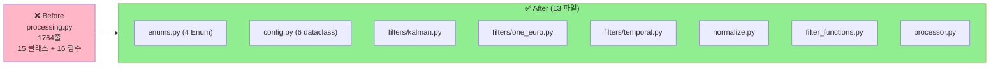
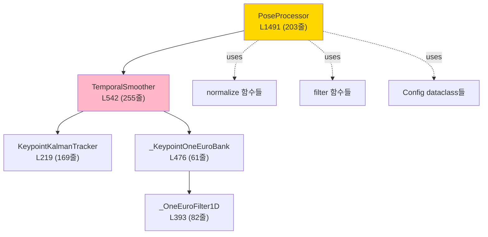

# 🛠️ pose_estimation/processing.py 분리 계획서

> **1,764줄 (15 클래스 + 16 함수) 를 enums/config/filters/functions 로 분리.**
> 작성일: 2026-05-23 / 기준: [pose_estimation/processing.py](../../../pose_estimation/processing.py)

---

## 📚 목차

1. [요약](#1-요약)
2. [현재 상태 진단](#2-현재-상태)
3. [목표 구조](#3-목표-구조)
4. [단계별 작업 (STEP 0~5)](#4-단계별-작업)
5. [주의사항](#5-주의사항)
6. [검증 방법](#6-검증-방법)
7. [예상 일정](#7-일정)

---

## 1. 요약 {#1-요약}

### 🎯 한 줄 목표

> **1,764줄 (15 클래스 + 16 함수) → 13개 작은 파일 (총 ~1,500줄, 15% 절감)**

### 📊 Before / After



---

## 2. 현재 상태 진단 {#2-현재-상태}

### 2.1 클래스 분류 — 15개

| # | 클래스 | 라인 | 종류 | 줄수 | 분류 |
|---|---|---|---|---|---|
| 1 | `NormalizationMethod` | 113 | Enum | 6 | enums |
| 2 | `ScaleReference` | 121 | Enum | 5 | enums |
| 3 | `SmoothingMode` | 129 | Enum | 6 | enums |
| 4 | `TrackState` | 138 | Enum | 4 | enums |
| 5 | `NormalizationConfig` | 150 | dataclass | 7 | config |
| 6 | `NormalizationResult` | 161 | dataclass | 9 | config |
| 7 | `SmoothingConfig` | 172 | dataclass | 13 | config |
| 8 | `SmoothedPose` | 187 | dataclass | 7 | config |
| 9 | `ConfidenceThresholds` | 197 | dataclass | 7 | config |
| 10 | `FilterResult` | 206 | dataclass | 8 | config |
| 11 | **`KeypointKalmanTracker`** | 219 | 필터 | **169** | filters/kalman |
| 12 | `_OneEuroFilter1D` | 393 | 필터 | 82 | filters/one_euro |
| 13 | `_KeypointOneEuroBank` | 476 | 필터 | 61 | filters/one_euro |
| 14 | **`TemporalSmoother`** | 542 | 필터 | **255** | filters/temporal |
| 15 | **`PoseProcessor`** | 1491 | 통합 | **203** | processor |

### 2.2 함수 — 16개

| 함수 | 라인 | 카테고리 |
|---|---|---|
| `normalize_pose` | 802 | normalize |
| `normalize_to_hip_center` | 838 | normalize |
| `normalize_to_torso` | 900 | normalize |
| `_normalize_to_shoulder_center` | 972 | normalize (내부) |
| `_normalize_to_bounding_box` | 1015 | normalize (내부) |
| `_calculate_scale` | 1063 | normalize (헬퍼) |
| `normalize_scale` | 1107 | normalize |
| `rotate_pose` | 1129 | transform |
| `mirror_pose` | 1165 | transform |
| `denormalize_pose` | 1206 | normalize |
| `filter_low_confidence` | 1242 | filter |
| `get_valid_keypoints` | 1303 | filter |
| `calculate_average_confidence` | 1334 | filter |
| `interpolate_missing` | 1359 | filter |
| `is_pose_valid` | 1413 | filter |
| `smooth_sequence` | 1461 | filter |

### 2.3 의존성 그래프



---

## 3. 목표 구조 {#3-목표-구조}

### 3.1 분리 후 디렉토리

```
pose_estimation/
├── processing.py                            # 호환 shim (~50줄)
│   └── 모든 이름을 re-export (deprecated)
│
├── processing/                              # NEW 폴더
│   ├── __init__.py                         # public API
│   ├── enums.py                            # ~40줄 (4 Enum)
│   ├── config.py                           # ~80줄 (6 dataclass)
│   │
│   ├── filters/                             # NEW 폴더
│   │   ├── __init__.py
│   │   ├── kalman.py                       # ~180줄 (KeypointKalmanTracker)
│   │   ├── one_euro.py                     # ~150줄 (1D + Bank)
│   │   └── temporal.py                     # ~260줄 (TemporalSmoother)
│   │
│   ├── normalize.py                        # ~350줄 (7 함수)
│   ├── transform.py                        # ~80줄 (rotate, mirror)
│   ├── filter_functions.py                 # ~250줄 (6 함수)
│   └── processor.py                        # ~210줄 (PoseProcessor)
```

### 3.2 import 경로 변화

```python
# Before
from pose_estimation.processing import (
    PoseProcessor,
    KeypointKalmanTracker,
    SmoothingMode,
    normalize_pose,
)

# After (신규 — 권장)
from pose_estimation.processing import PoseProcessor      # __init__.py
from pose_estimation.processing.filters.kalman import KeypointKalmanTracker
from pose_estimation.processing.enums import SmoothingMode
from pose_estimation.processing.normalize import normalize_pose

# After (구 경로 — shim, deprecated)
from pose_estimation.processing import KeypointKalmanTracker  # ⚠️ deprecated 경고
```

---

## 4. 단계별 작업 (STEP 0~5) {#4-단계별-작업}

### STEP 0: 사전 준비

- [ ] **0.1** 새 브랜치 `refactor/pose-processing-split`
- [ ] **0.2** 외부 호출자 grep:
  ```powershell
  Select-String -Path "**\*.py" -Pattern "from pose_estimation.processing"
  ```
- [ ] **0.3** pose 관련 테스트 green
- [ ] **0.4** baseline pose 출력 저장 (`SmoothedPose` 시계열)

### STEP 1: enums + config 추출 (1시간)

가장 단순 — 데이터 정의만

- [ ] **1.1** `pose_estimation/processing/` 폴더 생성
- [ ] **1.2** `enums.py`:
  - NormalizationMethod, ScaleReference, SmoothingMode, TrackState
- [ ] **1.3** `config.py`:
  - NormalizationConfig, NormalizationResult
  - SmoothingConfig, SmoothedPose
  - ConfidenceThresholds, FilterResult

- [ ] **1.4** 단위 테스트:
  ```python
  def test_enums_importable():
      from pose_estimation.processing.enums import SmoothingMode
      assert SmoothingMode.KALMAN.value == "kalman"
  ```

### STEP 2: Kalman + OneEuro 필터 분리 (1일)

- [ ] **2.1** `filters/kalman.py`:
  - `KeypointKalmanTracker` (169줄)
  - 단위 테스트: 칼만 상태 업데이트 검증

- [ ] **2.2** `filters/one_euro.py`:
  - `_OneEuroFilter1D` (82줄)
  - `_KeypointOneEuroBank` (61줄)
  - 두 클래스가 같은 파일 — 강결합

- [ ] **2.3** 의존성 import 수정:
  ```python
  # filters/kalman.py
  from pose_estimation.processing.config import ConfidenceThresholds
  from pose_estimation.processing.enums import TrackState
  ```

### STEP 3: TemporalSmoother 분리 (1일) ⚠️ 가장 큼

`TemporalSmoother` (255줄) 는 Kalman + OneEuro 모두 사용:

- [ ] **3.1** `filters/temporal.py`:
  ```python
  from .kalman import KeypointKalmanTracker
  from .one_euro import _KeypointOneEuroBank

  class TemporalSmoother:
      """SmoothingMode 에 따라 Kalman / OneEuro / EMA 등을 선택."""
      ...
  ```

- [ ] **3.2** 5가지 SmoothingMode 모두 검증:
  - NONE, EMA, KALMAN, ONE_EURO, MOVING_AVERAGE

- [ ] **3.3** 단위 테스트:
  ```python
  def test_temporal_smoother_kalman_mode():
      smoother = TemporalSmoother(SmoothingConfig(mode=SmoothingMode.KALMAN))
      result = smoother.smooth(keypoints, timestamp)
      assert isinstance(result, SmoothedPose)
  ```

### STEP 4: normalize + transform + filter 함수 분리 (반나절)

- [ ] **4.1** `normalize.py`:
  - normalize_pose, normalize_to_hip_center, normalize_to_torso
  - _normalize_to_shoulder_center, _normalize_to_bounding_box
  - _calculate_scale, normalize_scale, denormalize_pose

- [ ] **4.2** `transform.py`:
  - rotate_pose, mirror_pose

- [ ] **4.3** `filter_functions.py`:
  - filter_low_confidence, get_valid_keypoints
  - calculate_average_confidence, interpolate_missing
  - is_pose_valid, smooth_sequence

- [ ] **4.4** 단위 테스트 각각

### STEP 5: PoseProcessor + Shim + PR (반나절)

- [ ] **5.1** `processor.py`:
  - PoseProcessor (203줄) 이동
  - 의존성 모두 새 경로로 import

- [ ] **5.2** `processing/__init__.py`:
  ```python
  # public API
  from .processor import PoseProcessor
  from .enums import (
      NormalizationMethod, ScaleReference,
      SmoothingMode, TrackState,
  )
  from .config import (
      NormalizationConfig, SmoothingConfig,
      SmoothedPose, FilterResult,
  )
  from .filters.kalman import KeypointKalmanTracker
  from .filters.temporal import TemporalSmoother
  from .normalize import normalize_pose, normalize_scale
  from .filter_functions import (
      filter_low_confidence, smooth_sequence,
  )

  __all__ = [
      "PoseProcessor", "SmoothingMode", ...
  ]
  ```

- [ ] **5.3** **호환 shim** — 기존 `processing.py` 를 다음으로 교체:
  ```python
  # processing.py (deprecated shim)
  import warnings
  warnings.warn(
      "pose_estimation.processing 모듈 직접 import 는 deprecated. "
      "pose_estimation.processing.<submodule> 사용 권장",
      DeprecationWarning,
      stacklevel=2,
  )
  from .processing import *  # 새 패키지에서 re-export
  ```

- [ ] **5.4** 전체 테스트 + baseline 비교
- [ ] **5.5** 라인 카운트:
  ```
  enums.py             ~40
  config.py            ~80
  filters/kalman.py    ~180
  filters/one_euro.py  ~150
  filters/temporal.py  ~260
  normalize.py         ~350
  transform.py         ~80
  filter_functions.py  ~250
  processor.py         ~210
  ─────────────────────────
  합계                 ~1,600줄 (10% 절감)
  ```

---

## 5. 주의사항 {#5-주의사항}

### 5.1 ⚠️ 필터 간 의존성 순서

```python
# 순서 중요
filters/kalman.py        # 의존성 없음
filters/one_euro.py      # 의존성 없음
filters/temporal.py      # ← kalman + one_euro 사용
```

→ 순환 import 없도록 주의.

### 5.2 ⚠️ Private 클래스 (`_OneEuroFilter1D`, `_KeypointOneEuroBank`)

언더스코어로 시작 = 외부 노출 안 함. 그래도 import 가능 — `__init__.py` 에 포함 안 함.

### 5.3 ⚠️ PoseProcessor 의 의존성 모두 갱신

```python
# Before
class PoseProcessor:
    def __init__(self):
        self._smoother = TemporalSmoother(...)  # 같은 파일

# After
from .filters.temporal import TemporalSmoother
from .normalize import normalize_pose
from .filter_functions import filter_low_confidence

class PoseProcessor:
    def __init__(self):
        self._smoother = TemporalSmoother(...)  # 새 경로
```

### 5.4 ⚠️ 수치 정확도 검증

칼만/OneEuro 같은 필터는 부동소수점 연산 — 분리 후에도 **bit-exact** 결과여야 함:

```python
def test_kalman_bit_exact():
    """분리 전후 동일 입력 → 동일 출력."""
    # baseline (저장된 출력)
    expected = np.load("baseline_kalman_output.npy")

    # after refactor
    tracker = KeypointKalmanTracker(...)
    actual = []
    for kp in mock_keypoints:
        actual.append(tracker.update(kp))

    np.testing.assert_array_equal(expected, np.array(actual))
```

---

## 6. 검증 방법 {#6-검증-방법}

### 6.1 단위 테스트 — 각 모듈

```python
# test_processing/test_filters.py
def test_kalman_tracker():
    tracker = KeypointKalmanTracker(...)
    # ...

def test_one_euro_filter():
    f = _OneEuroFilter1D(...)
    # ...

def test_temporal_smoother():
    # 5가지 모드 모두
    for mode in SmoothingMode:
        # ...
```

### 6.2 통합 회귀 — PoseProcessor 출력

```python
def test_pose_processor_baseline():
    """분리 전후 PoseProcessor 출력 bit-exact."""
    proc = PoseProcessor(config)
    output = []
    for frame in baseline_frames:
        output.append(proc.process(frame))

    baseline = load_baseline("pose_processor_output.pkl")
    assert output == baseline
```

### 6.3 라인 카운트

```powershell
foreach ($f in (Get-ChildItem pose_estimation\processing\*.py -Recurse)) {
    (Get-Content $f | Measure-Object -Line).Lines
}
```

---

## 7. 예상 일정 {#7-일정}

| STEP | 작업 | 소요 |
|---|---|---|
| STEP 0 | 사전 준비 | 0.25일 |
| STEP 1 | enums + config | 0.125일 (1시간) |
| STEP 2 | Kalman + OneEuro | 1일 |
| STEP 3 | TemporalSmoother ⚠️ | 1일 |
| STEP 4 | normalize/transform/filter 함수 | 0.5일 |
| STEP 5 | Processor + Shim + PR | 0.5일 |
| **합계** | | **3.5 작업일** |

---

## 8. 작업 체크리스트

### 시작 전
- [ ] 외부 호출자 grep
- [ ] pose 테스트 green
- [ ] baseline pose 출력 저장

### 작업 중
- [ ] 각 STEP 후 commit
- [ ] bit-exact 검증 (필터 출력)

### 완료 후
- [ ] 전체 테스트 green
- [ ] PoseProcessor baseline diff = 0
- [ ] Shim 통한 구 경로 import 동작
- [ ] PR 작성

---

## 📖 관련 문서

- [REFACTOR_PLAN_EXCEPTIONS.md](REFACTOR_PLAN_EXCEPTIONS.md)
- [REFACTOR_PLAN_DETECTORS.md](REFACTOR_PLAN_DETECTORS.md)
- [REFACTOR_PLAN_BIOMECHANICS_FEEDBACK.md](REFACTOR_PLAN_BIOMECHANICS_FEEDBACK.md)
- [POSE_FUSION_EXPLAINED](../../concepts/POSE_FUSION_EXPLAINED.md) — Pose 영역 개념

---

**예상 완료**: 3.5 작업일
