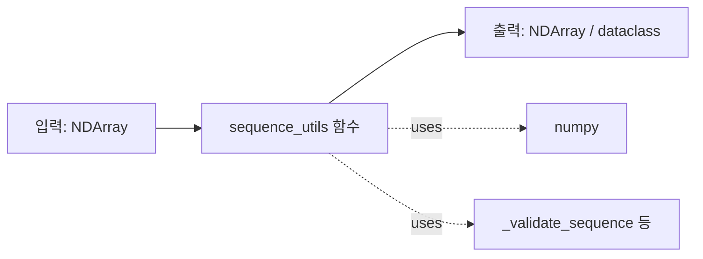

# 🛠️ utils/sequence_utils.py 분리 계획서

> **1,968줄 (34 함수 + 5 dataclass + 3 enum) 를 기능별 8 파일로 분리.**
> 가장 안전한 리팩토링 (순수 함수 모음).
> 작성일: 2026-05-23 / 기준: [utils/sequence_utils.py](../../../utils/sequence_utils.py)

---

## 📚 목차

1. [요약](#1-요약)
2. [현재 상태 진단](#2-현재-상태)
3. [목표 구조](#3-목표-구조)
4. [단계별 작업 (STEP 0~4)](#4-단계별-작업)
5. [주의사항](#5-주의사항)
6. [검증 방법](#6-검증-방법)
7. [예상 일정](#7-일정)

---

## 1. 요약 {#1-요약}

### 🎯 한 줄 목표

> **1,968줄 단일 파일 → 8 모듈 (총 ~1,800줄, 8% 절감)**

### 📊 Before / After

| 항목 | Before | After |
|---|---|---|
| 파일 수 | 1 | 8 + helpers |
| 가장 큰 파일 | 1,968줄 | ~400줄 |
| 함수/파일 평균 | 34 | 4 |
| 분리 위험도 | — | **낮음** (순수 함수) |

---

## 2. 현재 상태 진단 {#2-현재-상태}

### 2.1 구조 — Enum 3개 + Dataclass 5개 + 함수 29개

**Enum:**
- `PaddingMode` (L94) — zero, edge, reflect, wrap
- `DistanceMetric` (L103) — euclidean, manhattan, cosine, chebyshev
- `SegmentationMethod` (L112) — velocity, acceleration, curvature, zero_crossing

**Dataclass:**
- `DTWResult` (L125)
- `PhaseSegment` (L149)
- `PeakInfo` (L178)
- `SequenceAlignment` (L204)
- `PeriodicityResult` (L230)

**함수 — 카테고리별 29개:**

| 카테고리 | 함수 (라인, 줄수) |
|---|---|
| **정규화/전처리** | `z_normalize_sequence` (390, 34) <br> `min_max_normalize_sequence` (426, 41) <br> `resample_sequence` (469, 55) <br> `pad_or_truncate` (526, 36) <br> `standardize_lengths` (564, 26) |
| **거리/유사도** | `dtw_distance` (596, **81**) <br> `frechet_distance` (679, 43) <br> `sequence_cosine_similarity` (724, 33) <br> `sequence_pearson_correlation` (759, 51) <br> `sequence_euclidean_distance` (812, 31) |
| **위상 분할** | `detect_phase_transitions` (849, 79) <br> `segment_by_velocity` (930, **103**) <br> `segment_by_curvature` (1035, 80) <br> `find_zero_crossings` (1117, 32) |
| **슬라이딩 윈도우** | `sliding_window` (1155, 51) <br> `sliding_window_statistics` (1208, 32) <br> `extract_subsequences` (1242, 41) |
| **피크 검출** | `find_peaks` (1289, **98**) <br> `find_valleys` (1389, 35) |
| **상관/주기성** | `compute_autocorrelation` (1430, 41) <br> `compute_cross_correlation` (1473, 59) <br> `detect_periodicity` (1534, 77) <br> `calculate_sequence_entropy` (1613, 39) |
| **시퀀스 정렬** | `align_sequences_dtw` (1658, 58) <br> `warp_sequence` (1718, 29) <br> `template_match` (1749, 64) |
| **배치 처리** | `batch_dtw_distances` (1819, 35) <br> `batch_normalize_sequences` (1856, 26) |

**내부 헬퍼 (8개, L254-384):**
- `_validate_sequence`, `_point_distance`, `_ensure_2d`, `_apply_padding`
- `_compute_phase_confidence`, `_merge_short_segments`

### 2.2 가장 큰 함수 5개

1. `segment_by_velocity` (103줄)
2. `find_peaks` (98줄)
3. `dtw_distance` (81줄)
4. `segment_by_curvature` (80줄)
5. `detect_phase_transitions` (79줄)

→ 모두 알고리즘 자체가 무거움. 분리 시 한 함수 한 파일은 아님 — **카테고리별 묶기**.

### 2.3 의존성 — 순수 함수



→ **외부 상태 없음, 순수 함수**. 분리 위험 가장 낮음.

---

## 3. 목표 구조 {#3-목표-구조}

### 3.1 분리 후 디렉토리

```
utils/
├── sequence_utils.py                    # 호환 shim (~30줄, deprecated)
│
├── sequence_utils/                      # NEW 폴더
│   ├── __init__.py                     # 모든 함수 re-export
│   ├── enums.py                        # 3 Enum (~30줄)
│   ├── schemas.py                      # 5 dataclass (~80줄)
│   ├── _helpers.py                     # 8 내부 헬퍼 (~140줄)
│   │
│   ├── normalize.py                    # 5 함수 (~200줄)
│   │   ├ z_normalize_sequence
│   │   ├ min_max_normalize_sequence
│   │   ├ resample_sequence
│   │   ├ pad_or_truncate
│   │   └ standardize_lengths
│   │
│   ├── distance.py                     # 5 함수 (~250줄)
│   │   ├ dtw_distance
│   │   ├ frechet_distance
│   │   ├ sequence_cosine_similarity
│   │   ├ sequence_pearson_correlation
│   │   └ sequence_euclidean_distance
│   │
│   ├── segmentation.py                 # 4 함수 (~300줄)
│   │   ├ detect_phase_transitions
│   │   ├ segment_by_velocity
│   │   ├ segment_by_curvature
│   │   └ find_zero_crossings
│   │
│   ├── windowing.py                    # 3 함수 (~130줄)
│   │   ├ sliding_window
│   │   ├ sliding_window_statistics
│   │   └ extract_subsequences
│   │
│   ├── peaks.py                        # 2 함수 (~140줄)
│   │   ├ find_peaks
│   │   └ find_valleys
│   │
│   ├── correlation.py                  # 4 함수 (~220줄)
│   │   ├ compute_autocorrelation
│   │   ├ compute_cross_correlation
│   │   ├ detect_periodicity
│   │   └ calculate_sequence_entropy
│   │
│   ├── alignment.py                    # 3 함수 (~160줄)
│   │   ├ align_sequences_dtw
│   │   ├ warp_sequence
│   │   └ template_match
│   │
│   └── batch.py                        # 2 함수 (~70줄)
│       ├ batch_dtw_distances
│       └ batch_normalize_sequences
```

### 3.2 import 경로

```python
# Before
from utils.sequence_utils import dtw_distance, find_peaks, segment_by_velocity

# After (신규)
from utils.sequence_utils.distance import dtw_distance
from utils.sequence_utils.peaks import find_peaks
from utils.sequence_utils.segmentation import segment_by_velocity

# 또는 (간편)
from utils.sequence_utils import dtw_distance, find_peaks  # __init__.py 에서 re-export
```

---

## 4. 단계별 작업 (STEP 0~4) {#4-단계별-작업}

### STEP 0: 사전 준비

- [ ] **0.1** 새 브랜치 `refactor/sequence-utils-split`
- [ ] **0.2** 외부 호출자 grep:
  ```powershell
  Select-String -Path "**\*.py" -Pattern "from utils.sequence_utils"
  ```
- [ ] **0.3** sequence_utils 관련 테스트 green
- [ ] **0.4** 단순 테스트라면 baseline 보존 불필요 (순수 함수)

### STEP 1: enums + schemas + helpers 추출 (1시간)

- [ ] **1.1** `utils/sequence_utils/` 폴더 생성
- [ ] **1.2** `enums.py`:
  - PaddingMode, DistanceMetric, SegmentationMethod
- [ ] **1.3** `schemas.py`:
  - DTWResult, PhaseSegment, PeakInfo, SequenceAlignment, PeriodicityResult
- [ ] **1.4** `_helpers.py`:
  - 8 내부 헬퍼 모두

- [ ] **1.5** 단위 테스트:
  ```python
  def test_enums_importable():
      from utils.sequence_utils.enums import DistanceMetric
      assert DistanceMetric.EUCLIDEAN.value == "euclidean"
  ```

### STEP 2: 카테고리별 함수 분리 (1일)

순서 (작은 카테고리부터):
1. **batch.py** (2 함수) — 가장 단순
2. **windowing.py** (3 함수)
3. **alignment.py** (3 함수)
4. **peaks.py** (2 함수, 큰 함수)
5. **correlation.py** (4 함수)
6. **normalize.py** (5 함수)
7. **distance.py** (5 함수)
8. **segmentation.py** (4 함수, 가장 큼)

각 파일 작업:
- [ ] **2.x.1** 함수 이동
- [ ] **2.x.2** import 갱신:
  ```python
  # distance.py
  import numpy as np
  from ._helpers import _validate_sequence, _point_distance
  from .schemas import DTWResult
  from .enums import DistanceMetric
  ```
- [ ] **2.x.3** 단위 테스트 (해당 함수들)

### STEP 3: `__init__.py` re-export (반나절) ⚠️ 가장 중요

**목적**: 외부 코드가 변경 없이 동작

- [ ] **3.1** `utils/sequence_utils/__init__.py`:
  ```python
  # Public API — 기존 import 모두 유지
  from .enums import (
      PaddingMode, DistanceMetric, SegmentationMethod,
  )
  from .schemas import (
      DTWResult, PhaseSegment, PeakInfo,
      SequenceAlignment, PeriodicityResult,
  )
  from .normalize import (
      z_normalize_sequence, min_max_normalize_sequence,
      resample_sequence, pad_or_truncate, standardize_lengths,
  )
  from .distance import (
      dtw_distance, frechet_distance,
      sequence_cosine_similarity, sequence_pearson_correlation,
      sequence_euclidean_distance,
  )
  from .segmentation import (
      detect_phase_transitions, segment_by_velocity,
      segment_by_curvature, find_zero_crossings,
  )
  from .windowing import (
      sliding_window, sliding_window_statistics, extract_subsequences,
  )
  from .peaks import find_peaks, find_valleys
  from .correlation import (
      compute_autocorrelation, compute_cross_correlation,
      detect_periodicity, calculate_sequence_entropy,
  )
  from .alignment import (
      align_sequences_dtw, warp_sequence, template_match,
  )
  from .batch import (
      batch_dtw_distances, batch_normalize_sequences,
  )

  __all__ = [
      # ... 모든 이름 명시 (이전과 동일)
  ]
  ```

- [ ] **3.2** **호환 shim**: 기존 `utils/sequence_utils.py` 를 다음으로 교체:
  ```python
  # utils/sequence_utils.py (deprecated shim)
  """⚠️ 이 모듈은 deprecated. utils.sequence_utils.* 사용 권장.

  하위 호환을 위해 모든 이름을 re-export 합니다.
  """
  import warnings

  warnings.warn(
      "utils.sequence_utils 의 평면 import 는 deprecated. "
      "utils.sequence_utils.<submodule> 사용 권장.",
      DeprecationWarning,
      stacklevel=2,
  )

  from .sequence_utils import *  # type: ignore
  ```

### STEP 4: 검증 + PR (반나절)

- [ ] **4.1** 모든 테스트
  ```powershell
  pytest tests/ -v -k "sequence"
  ```
- [ ] **4.2** import 검증:
  ```python
  # 이전 방식 — 동작해야
  from utils.sequence_utils import dtw_distance

  # 신규 방식 — 동작해야
  from utils.sequence_utils.distance import dtw_distance

  # 둘이 같은 함수인지
  import utils.sequence_utils as old
  from utils.sequence_utils.distance import dtw_distance as new
  assert old.dtw_distance is new
  ```

- [ ] **4.3** 라인 카운트
- [ ] **4.4** PR 작성

---

## 5. 주의사항 {#5-주의사항}

### 5.1 ⚠️ 함수 시그니처 절대 변경 X

```python
# Before
def dtw_distance(seq1, seq2, distance_metric=DistanceMetric.EUCLIDEAN, ...):

# After (시그니처 동일)
def dtw_distance(seq1, seq2, distance_metric=DistanceMetric.EUCLIDEAN, ...):
```

→ 외부 호출 코드 변경 없이 동작 보장.

### 5.2 ⚠️ 내부 헬퍼 위치

`_helpers.py` 의 함수는 **여러 카테고리에서 사용**:

```python
# distance.py
from ._helpers import _validate_sequence, _point_distance

# segmentation.py
from ._helpers import _validate_sequence, _compute_phase_confidence, _merge_short_segments

# normalize.py
from ._helpers import _validate_sequence, _apply_padding, _ensure_2d
```

→ `_helpers.py` 가 모든 곳에서 import 됨. 순환 위험 없음 (단방향).

### 5.3 ⚠️ 함수가 다른 함수 호출

```python
# 예: align_sequences_dtw → dtw_distance 호출
# alignment.py
from .distance import dtw_distance

def align_sequences_dtw(seq1, seq2):
    result = dtw_distance(seq1, seq2)
    # ...
```

→ 카테고리 간 import 필요한 경우 있음. **순환 X** 만 확인.

### 5.4 ⚠️ Dataclass 위치

```python
# DTWResult 는 distance.py 의 dtw_distance 가 반환
# 하지만 외부 코드가 DTWResult 만 import 할 수도
from utils.sequence_utils import DTWResult
```

→ `schemas.py` 에 두고 `__init__.py` 에서 re-export. 분리 위치 변경 없음.

### 5.5 ✅ 위험 낮음

- 순수 함수 → 외부 상태 없음
- numpy 만 의존
- 단위 테스트 작성 쉬움
- → **가장 안전한 리팩토링 대상**

---

## 6. 검증 방법 {#6-검증-방법}

### 6.1 단위 테스트 — 각 함수 bit-exact

```python
def test_dtw_distance_unchanged():
    """분리 전후 동일 입력 → 동일 출력."""
    seq1 = np.array([1, 2, 3, 4, 5])
    seq2 = np.array([2, 3, 4, 5, 6])

    # 분리 전 결과 저장 (baseline)
    result = dtw_distance(seq1, seq2)
    assert result.distance == pytest.approx(BASELINE_DTW_DISTANCE)
```

### 6.2 import 회귀

```python
def test_all_old_imports_work():
    """이전 import 경로 모두 동작."""
    from utils.sequence_utils import (
        dtw_distance, find_peaks, segment_by_velocity,
        DTWResult, PhaseSegment, DistanceMetric,
    )
    assert callable(dtw_distance)
    assert callable(find_peaks)
```

### 6.3 라인 카운트

```powershell
foreach ($f in (Get-ChildItem utils\sequence_utils\*.py)) {
    $lines = (Get-Content $f | Measure-Object -Line).Lines
    Write-Host "$($f.Name): $lines"
}
# 목표: 모든 파일 < 400줄
```

---

## 7. 예상 일정 {#7-일정}

| STEP | 작업 | 소요 |
|---|---|---|
| STEP 0 | 사전 준비 | 0.25일 |
| STEP 1 | enums/schemas/helpers | 0.125일 (1시간) |
| STEP 2 | 8 카테고리 분리 | 1일 |
| STEP 3 | __init__ + shim | 0.5일 |
| STEP 4 | 검증 + PR | 0.5일 |
| **합계** | | **2.5 작업일** |

→ **가장 짧고 안전한 리팩토링**.

---

## 8. 작업 체크리스트

### 시작 전
- [ ] 외부 호출자 grep
- [ ] sequence 관련 테스트 green

### 작업 중
- [ ] 각 STEP 후 commit
- [ ] 각 함수별 단위 테스트 (bit-exact)

### 완료 후
- [ ] 전체 테스트 green
- [ ] 이전 import 경로 모두 동작
- [ ] 라인 카운트 < 400/파일
- [ ] PR 작성

---

## 📖 관련 문서

- [REFACTOR_PLAN_GAME_ORCHESTRATOR.md](REFACTOR_PLAN_GAME_ORCHESTRATOR.md)
- [REFACTOR_PLAN_EXCEPTIONS.md](REFACTOR_PLAN_EXCEPTIONS.md)
- [REFACTOR_PLAN_DETECTORS.md](REFACTOR_PLAN_DETECTORS.md)
- [REFACTOR_PLAN_BIOMECHANICS_FEEDBACK.md](REFACTOR_PLAN_BIOMECHANICS_FEEDBACK.md)
- [REFACTOR_PLAN_POSE_PROCESSING.md](REFACTOR_PLAN_POSE_PROCESSING.md)

---

**예상 완료**: 2.5 작업일 (가장 안전한 리팩토링)
