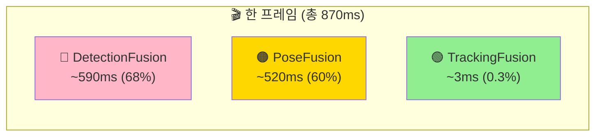
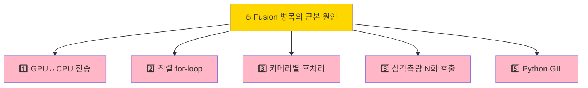
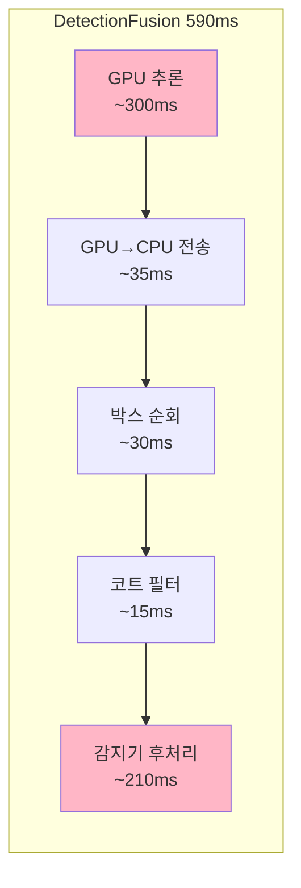
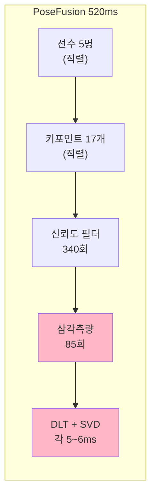
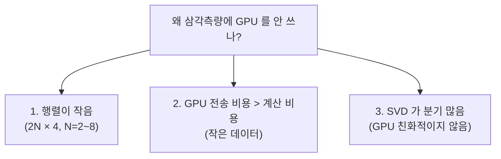
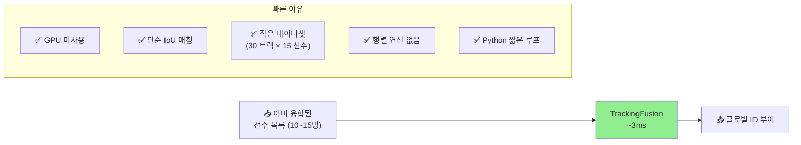
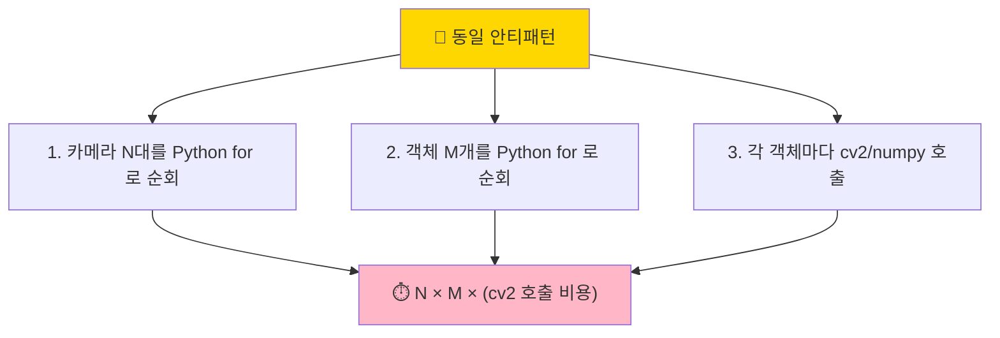
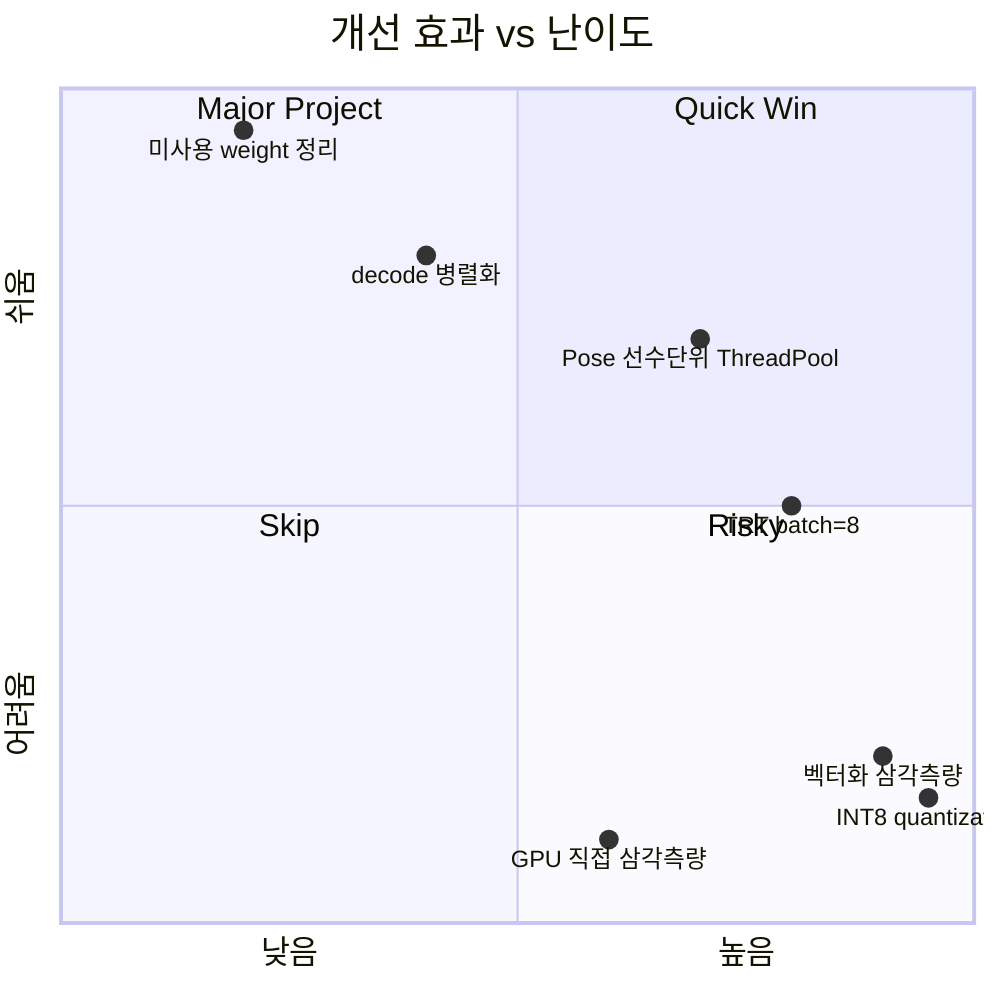
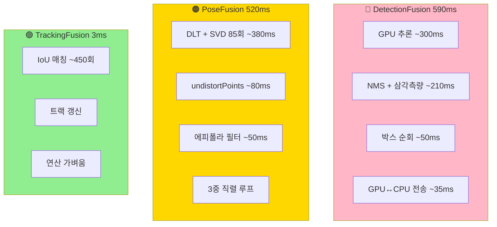

# 🔥 Fusion 병목 현상 완전 해부

> **왜 fusion 단계가 이렇게 느린가** — 3개 fusion 의 시간 차이가 173배 나는 진짜 이유.
> 작성일: 2026-05-22 / 기준: [engine/pipeline/fusion/](../engine/pipeline/fusion/)
> 관련 문서: [POSE_FUSION_EXPLAINED.md](POSE_FUSION_EXPLAINED.md), [PIPELINE_SPEEDUP_GUIDE.md](PIPELINE_SPEEDUP_GUIDE.md)

---

## 📚 목차

1. [한 화면 비교](#1-한-화면-비교)
2. [3개 Fusion 의 시간 차이](#2-시간-차이)
3. [근본 원인 5가지](#3-근본-원인)
4. [DetectionFusion 병목 해부](#4-detectionfusion)
5. [PoseFusion 병목 해부](#5-posefusion)
6. [TrackingFusion 은 왜 빠른가](#6-trackingfusion)
7. [공통 병목 패턴](#7-공통-패턴)
8. [개선 가능성 매트릭스](#8-개선-매트릭스)
9. [한눈에 보는 요약](#9-요약)

---

## 1. 한 화면 비교 {#1-한-화면-비교}



> ⚠️ DetectionFusion + PoseFusion 이 **부분적으로 병렬 실행**되어 합계가 1110ms 가 아니라 870ms.
> 실측은 [tools/bench_pipeline_realistic.py](../tools/bench_pipeline_realistic.py) 로 확정 가능.

---

## 2. 3개 Fusion 의 시간 차이 {#2-시간-차이}

| Fusion | 시간 | 점유율 | GPU 사용 | 주 작업 |
|---|---|---|---|---|
| 🔴 **DetectionFusion** | **~590ms** | 68% | ✅ YOLO 추론 | 4종 객체 감지 + NMS |
| 🟠 **PoseFusion** | **~520ms** | 60% | ❌ 순수 CPU | 17점 × 삼각측량 |
| 🟢 **TrackingFusion** | **~3ms** | 0.3% | ❌ 순수 CPU | IoU 매칭만 |

### 💡 173배 차이의 의미

```
DetectionFusion : TrackingFusion = 197 : 1
PoseFusion      : TrackingFusion = 173 : 1
```

> 같은 fusion 이라는 이름인데 왜 이렇게 차이?
> **답: 작업의 종류가 완전히 다르다.**

---

## 3. 근본 원인 5가지 {#3-근본-원인}

### 🎯 모든 병목은 결국 이 5가지로 귀결됩니다



| # | 원인 | 영향받는 fusion |
|---|---|---|
| 1️⃣ | **GPU → CPU 메모리 전송** | DetectionFusion |
| 2️⃣ | **Python 직렬 for-loop** | Detection, Pose |
| 3️⃣ | **카메라별 후처리** (8회 직렬) | Detection, Pose |
| 4️⃣ | **삼각측량 N회 호출** (NMS, SVD) | Detection (내부), Pose |
| 5️⃣ | **Python GIL** (스레드 못 살림) | Detection, Pose |

→ **TrackingFusion 은 이 5가지에 모두 해당 안 됨** → 그래서 빠름.

---

## 4. DetectionFusion 병목 해부 {#4-detectionfusion}

### 🔬 시간 분해 (590ms)



| 구간 | 시간 | 병목 원인 |
|---|---|---|
| GPU 추론 (`predict()`) | 250~350ms | 큰 모델 (CV-BBox v9) |
| GPU→CPU 전송 | 20~50ms | **원인 1️⃣** — 8 카메라 × bbox 텐서 |
| 박스 순회 | 20~50ms | **원인 2️⃣** — Python for-loop |
| 코트 영역 필터 | 10~20ms | `cv2.perspectiveTransform` × N_player |
| `player_detector.process_detections()` | **150~300ms** | **원인 4️⃣** — NMS + 삼각측량 |
| `ball/hoop` 후처리 | 60~180ms | NMS + 색상 검증 |
| TeamAwareTracker (5프레임마다) | 100~200ms | GPU ReID 모델 |

### 🎯 진짜 병목: 감지기 내부 후처리

[detection_fusion.py:642-735](../engine/pipeline/fusion/detection_fusion.py#L642):

```python
# CPU 후처리 — 감지기마다 순차 호출
ball_results = self._ball_detector.process_detections(...)      # ~30~100ms
player_results = self._player_detector.process_detections(...)  # ~150~300ms ← 가장 큼
hoop_results = self._hoop_detector.process_detections(...)      # ~30~80ms
```

이 안에서:
- **카메라 간 NMS**: 같은 선수가 8 카메라에 8번 잡힘 → 중복 제거
- **삼각측량**: 카메라 간 매칭된 bbox 의 발 위치 3D 복원
- **호모그래피 변환**: `cv2.perspectiveTransform` (코트 좌표계 변환)

### 📊 DetectionFusion 의 5가지 원인

| 원인 | 해당? | 어디서 |
|---|---|---|
| 1️⃣ GPU→CPU 전송 | ✅ | `boxes.xyxy.cpu().numpy()` |
| 2️⃣ Python for-loop | ✅ | line 598-626 박스 순회 |
| 3️⃣ 카메라별 후처리 | ✅ | line 588-630 cam_id 순회 |
| 4️⃣ 삼각측량 N회 | ✅ | player_detector 내부 |
| 5️⃣ GIL | ✅ | 후처리가 Python 코드 |

→ **5가지 모두 해당**. 그래서 590ms.

---

## 5. PoseFusion 병목 해부 {#5-posefusion}

### 🔬 시간 분해 (520ms, 선수 5명 기준)



| 작업 | 횟수 | 시간 비중 |
|---|---|---|
| 선수 순회 | 5 (직렬) | 외부 루프 |
| 키포인트 순회 | 5 × 17 = 85 (직렬) | 중간 루프 |
| 신뢰도 검사 | 5 × 17 × 4 = 340회 | ~10ms |
| `cv2.undistortPoints` | 85 × 4 = 340회 | ~80ms |
| 에피폴라 필터링 | 85회 (3뷰+ 일 때) | ~50ms |
| **DLT + SVD** | **85회** | **~380ms** ← 가장 큼 |

### 🎯 진짜 병목: 삼각측량 85회 × 5~6ms

[pose_fusion.py:259-313](../engine/pipeline/fusion/pose_fusion.py#L259):

```python
for kp_idx in range(17):                       # ① 17회
    for pose in group:                          # ② 4~8 카메라
        if score >= 0.3:                        # 신뢰도 필터
            valid_observations.append(...)

    if len(valid_observations) >= 2:
        point_3d = self._triangulator.triangulate(  # ③ DLT + SVD
            camera_ids=...,
            points_2d=...,
        )
```

**각 삼각측량 내부** ([coordinate_transformer.py:506-535](../infrastructure/multi_camera/coordinate_transformer.py#L506)):
1. 왜곡 보정 (cv2)
2. 에피폴라 필터링 (Python 루프)
3. DLT 행렬 조립 (Python for-loop)
4. `np.linalg.svd(A)` (numpy)

### 📊 PoseFusion 의 5가지 원인

| 원인 | 해당? | 어디서 |
|---|---|---|
| 1️⃣ GPU→CPU 전송 | ❌ | GPU 안 씀 |
| 2️⃣ Python for-loop | ✅✅ | **3중 루프** (선수×점×카메라) |
| 3️⃣ 카메라별 후처리 | ⚠️ | 내부 루프에서 |
| 4️⃣ 삼각측량 N회 | ✅✅ | **85회 호출** |
| 5️⃣ GIL | ✅ | Python 코드 비중 큼 |

→ **2️⃣ 와 4️⃣ 가 압도적**. 그래서 520ms.

### 💡 왜 GPU 를 안 쓰나?



→ 삼각측량 자체는 CPU 가 정답. **문제는 85회를 직렬로 호출** 한다는 것.

---

## 6. TrackingFusion 은 왜 빠른가 {#6-trackingfusion}

### 🎯 한 줄 답: "하는 일이 압도적으로 적다"



### 작업 분량 비교

| Fusion | 호출 횟수 | 호출당 비용 | 총 비용 |
|---|---|---|---|
| Detection | YOLO 1회 + 후처리 N회 | GPU + NMS + 삼각측량 | 590ms |
| Pose | 85회 SVD | 5~6ms (DLT) | 520ms |
| **Tracking** | **~450회 IoU** | **<10μs** (bbox 비교) | **3ms** |

→ TrackingFusion 은 **연산 자체가 가벼움**. for-loop 가 있어도 450회 × 10μs = 4.5ms 수준.

### 📊 TrackingFusion 의 5가지 원인

| 원인 | 해당? |
|---|---|
| 1️⃣ GPU→CPU 전송 | ❌ |
| 2️⃣ Python for-loop | ⚠️ (있지만 짧음) |
| 3️⃣ 카메라별 후처리 | ❌ (이미 융합된 결과 받음) |
| 4️⃣ 삼각측량 N회 | ❌ |
| 5️⃣ GIL | ⚠️ (짧아서 영향 없음) |

→ **5가지 모두 거의 해당 안 됨**. 그래서 3ms.

---

## 7. 공통 병목 패턴 {#7-공통-패턴}

### 🔁 동일한 안티패턴이 두 fusion 에 반복



### 💀 가장 흔한 안티패턴: "벡터화 불가능해 보이는 cv2 호출"

```python
# 안티패턴 (현재 코드)
for cam_id in cameras:               # 8회
    for box in boxes_per_cam:        # 10~30회
        transformed = cv2.perspectiveTransform(box, matrix)  # 240회 호출

# 개선안 (벡터화)
all_boxes = np.concatenate(...)      # 한 번에 모음
transformed = cv2.perspectiveTransform(all_boxes, matrix)  # 1회 호출
```

→ **cv2/numpy 는 배치로 부르면 압도적으로 빠름**. Python for-loop 가 GIL 점유로 진짜 비용.

### 📊 비교표

| 패턴 | 현재 | 개선 가능 |
|---|---|---|
| 카메라 순회 | 8회 직렬 | ThreadPool 8T → 1/8 시간 |
| 키포인트 순회 | 17회 직렬 | numpy vectorize → 1/10 시간 |
| 삼각측량 | 85회 단건 호출 | 배치 SVD → 1/5 시간 |
| GPU 추론 | batch=1 | batch=8 → 1/3 시간 |

---

## 8. 개선 가능성 매트릭스 {#8-개선-매트릭스}

### 🎯 각 병목의 개선 우선순위



### 표로 정리

| 개선안 | 효과 | 난이도 | 위험도 | 추천 순위 |
|---|---|---|---|---|
| 🟢 미사용 weight 정리 | 작음 | ⭐ | 없음 | 1 |
| 🟢 decode 병렬화 | 중 | ⭐⭐ | 낮음 | 2 |
| 🟢 **Pose 선수단위 ThreadPool** | **큼** | ⭐⭐⭐ | 중 | **3** |
| 🟡 TRT batch=8 | 큼 | ⭐⭐⭐ | 중 | 4 |
| 🟡 벡터화 삼각측량 | 매우큼 | ⭐⭐⭐⭐ | 중 | 5 |
| 🔴 INT8 quantization | 매우큼 | ⭐⭐⭐⭐⭐ | 높음 | 6 |
| 🔴 GPU 직접 삼각측량 | 큼 | ⭐⭐⭐⭐⭐ | 매우높음 | 7 |

→ 자세한 작업 가이드는 [PIPELINE_SPEEDUP_GUIDE.md](PIPELINE_SPEEDUP_GUIDE.md).

---

## 9. 한눈에 보는 요약 {#9-요약}

### 🎯 3대 fusion 비교 요약



### 📝 한 줄 정리

| Fusion | 한 줄 진단 |
|---|---|
| 🔴 Detection | **"GPU 가 무거운 모델 + CPU 후처리가 무거운 NMS/삼각측량"** |
| 🟠 Pose | **"삼각측량 85회를 Python for-loop 로 직렬 호출"** |
| 🟢 Tracking | **"단순 IoU 매칭만 — 가벼워서 빠름"** |

### 🔑 핵심 통찰 3가지

1. **GPU 사용 ≠ 빠름**: DetectionFusion 은 GPU 쓰는데도 PoseFusion 보다 살짝 더 느림. GPU↔CPU 전송 + CPU 후처리가 더 큼.
2. **for-loop 의 저주**: 두 무거운 fusion 모두 **Python 직렬 for-loop** 가 핵심 안티패턴.
3. **벡터화의 위력**: cv2/numpy 는 배치로 부르면 10배 빠름. 단건 호출 N회는 GIL 점유로 진짜 비용 발생.

### 🚀 결론

```
fusion 병목 = (Python for-loop × cv2/numpy 단건 호출) ÷ 배치 처리 부재
            = 870ms / 프레임
            = 1.15 fps

개선 후 예상 = (벡터화 + 병렬화 + 배치) → 100ms / 프레임 → 10 fps
```

---

## 🗺️ 정확한 코드 위치 인덱스

### DetectionFusion
| 항목 | 위치 |
|---|---|
| `fuse()` 진입점 | [detection_fusion.py:394-467](../engine/pipeline/fusion/detection_fusion.py#L394) |
| GPU 배치 추론 | [:555-572](../engine/pipeline/fusion/detection_fusion.py#L555) |
| GPU→CPU 전송 | [:593-596](../engine/pipeline/fusion/detection_fusion.py#L593) |
| 카메라별 후처리 루프 | [:598-626](../engine/pipeline/fusion/detection_fusion.py#L598) |
| 코트 영역 필터 | [:388](../engine/pipeline/fusion/detection_fusion.py#L388) |
| 감지기별 후처리 | [:642-735](../engine/pipeline/fusion/detection_fusion.py#L642) |

### PoseFusion
| 항목 | 위치 |
|---|---|
| `fuse()` 진입점 | [pose_fusion.py:193-239](../engine/pipeline/fusion/pose_fusion.py#L193) |
| 선수 외부 루프 | [:219](../engine/pipeline/fusion/pose_fusion.py#L219) |
| 키포인트 내부 루프 | [:259](../engine/pipeline/fusion/pose_fusion.py#L259) |
| 카메라 최내부 루프 | [:262](../engine/pipeline/fusion/pose_fusion.py#L262) |
| 삼각측량 호출 | [:288-291](../engine/pipeline/fusion/pose_fusion.py#L288) |
| DLT 본체 | [coordinate_transformer.py:506-535](../infrastructure/multi_camera/coordinate_transformer.py#L506) |
| 왜곡 보정 | [:406-481](../infrastructure/multi_camera/coordinate_transformer.py#L406) |

### TrackingFusion
| 항목 | 위치 |
|---|---|
| `fuse()` 진입점 | [tracking_fusion.py](../engine/pipeline/fusion/tracking_fusion.py) |
| 호출부 | [frame_pipeline.py:391-395](../engine/pipeline/frame_pipeline.py#L391) |
| MultiViewTracker (별도) | [frame_pipeline.py:402-415](../engine/pipeline/frame_pipeline.py#L402) |

### 측정
| 항목 | 위치 |
|---|---|
| stage_times["detection_fusion"] | [frame_pipeline.py:314](../engine/pipeline/frame_pipeline.py#L314) |
| stage_times["pose_fusion"] | [:353](../engine/pipeline/frame_pipeline.py#L353) |
| stage_times["tracking_fusion"] | [:396](../engine/pipeline/frame_pipeline.py#L396) |
| Bench 도구 | [tools/bench_pipeline_realistic.py](../tools/bench_pipeline_realistic.py) |

---

## 📖 더 읽어볼 문서

| 주제 | 문서 |
|---|---|
| PoseFusion 자세한 설명 | [POSE_FUSION_EXPLAINED.md](POSE_FUSION_EXPLAINED.md) |
| 전체 latency 예산 | [PIPELINE_LATENCY_BUDGET.md](PIPELINE_LATENCY_BUDGET.md) |
| 최적화 실행 가이드 | [PIPELINE_SPEEDUP_GUIDE.md](PIPELINE_SPEEDUP_GUIDE.md) |
| 데이터 타입 전체 | [DATA_FLOW_CONTRACT.md](DATA_FLOW_CONTRACT.md) |
| 메모리/VRAM 감사 | [../PLAN_MEMORY_USAGE_AUDIT.md](../PLAN_MEMORY_USAGE_AUDIT.md) |

---

## 💡 자주 묻는 질문

### Q1. PoseFusion 이 GPU 를 안 쓰는데 왜 이렇게 느린가?

**A**: GPU 안 써서 느린 게 아니라, **Python for-loop 가 85회 SVD 를 직렬로 호출**해서 느림. SVD 자체는 numpy 가 빠르지만, Python 인터프리터가 루프 돌면서 매번 함수 호출하는 오버헤드가 큼.

### Q2. DetectionFusion 이 GPU 쓰는데 왜 PoseFusion 보다 느린가?

**A**: GPU 추론 (~300ms) + CPU 후처리 (~210ms) 합계가 큼. 특히 `player_detector.process_detections()` 안에서 NMS + 삼각측량이 또 일어남. GPU 만으로 끝나면 빠르지만, **CPU 가 결과 받아 처리하는 시간이 더 큼**.

### Q3. 왜 NMS 와 삼각측량을 GPU 에서 안 하나?

**A**:
- **NMS**: 분기와 정렬이 많아 GPU 친화적이지 않음. CUDA NMS 도 있지만 데이터 전송 비용이 더 큼.
- **삼각측량**: 행렬 크기가 작아 (2N×4) GPU 전송 오버헤드가 계산 비용보다 큼.
- → **현재 CPU 선택은 합리적**. 문제는 "병렬화 안 함" 임.

### Q4. TrackingFusion 이 3ms 라면 그냥 다른 fusion 도 IoU 만으로 하면 안 되나?

**A**:
- Detection: NMS 가 필수 (같은 선수 8번 잡힘 → 중복 제거)
- Pose: 17점 × 3D 좌표 복원이 필수 (단순 매칭 아님)
- → 작업 종류가 본질적으로 달라서 단순화 불가.

### Q5. Python 말고 C++ 로 다시 쓰면 빨라지지 않나?

**A**: 일부 가능하지만:
- 이미 cv2 와 numpy 는 C++ (GIL 해제됨)
- 진짜 병목은 **Python 인터프리터 루프 오버헤드 + 함수 호출**
- → Cython 또는 numba 로 hot loop 만 컴파일하는 게 현실적
- → 더 간단한 방법: **벡터화 (배치 호출)** 와 **ThreadPool 병렬화**

### Q6. 한 fusion 만 빠르게 하면 의미가 있나?

**A**:
- DetectionFusion 과 PoseFusion 은 **순차 실행**되어야 함 (detection 결과가 pose 입력)
- 단, TrackingFusion 은 detection 결과만 필요 → pose 와 **병렬 가능**
- → 둘 다 빨라져야 전체 fps 가 올라감.

### Q7. 5가지 원인 중 가장 큰 건?

**A**: **2️⃣ Python 직렬 for-loop** 가 압도적. 1️⃣ GPU↔CPU 전송은 50ms 수준이지만, 직렬 루프는 누적 400ms+. 그래서 [PIPELINE_SPEEDUP_GUIDE.md](PIPELINE_SPEEDUP_GUIDE.md) 의 P0-2 (Pose ThreadPool 병렬화) 가 최우선.
