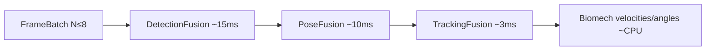
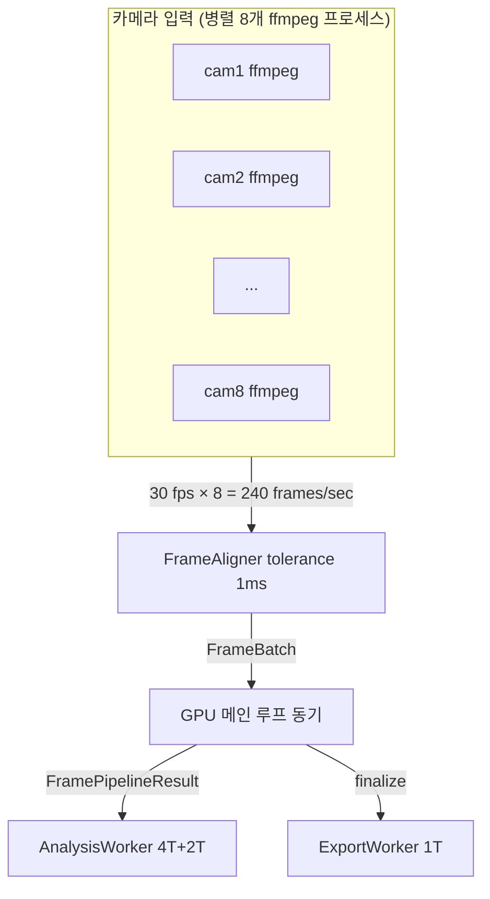
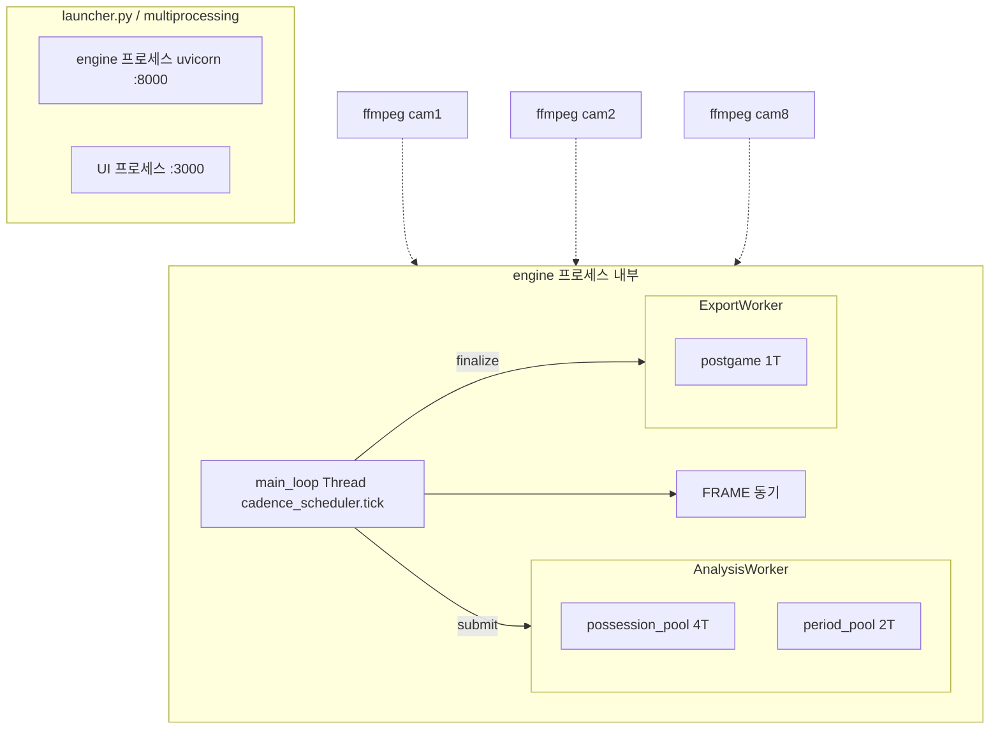

# COURTVIEW 파이프라인 Latency 예산 & 속도 예측

> 각 파이프라인 단계의 **명시된 예산값** + **모델 추론 비용 추정** + **병렬화 구조** 를 종합해 한 사이클의 처리 시간을 예측한다.
> 작성일: 2026-05-22 / 기준: `daf30d6` / 대상 하드웨어: RTX 4070 12GB (권장 사양)

---

## 0. 결론 먼저

```mermaid
gantt
  title 30fps LIVE 모드 1 cycle (8 cameras, 33ms budget)
  dateFormat X
  axisFormat %s ms

  section 메인 루프 (동기)
  Detection Fusion  :a1, 0, 15
  Pose Fusion       :a2, 15, 25
  Tracking Fusion   :a3, 25, 28
  Biomech (CPU)     :a4, 28, 30
  Reserve           :a5, 30, 33

  section 비동기 워커
  Event detector    :b1, 28, 38
  Possession (4T)   :b2, 100, 200
  Period (2T)       :b3, 720000, 721000
```



| 단계 | 명시 예산 | 추정 실측 (RTX 4070) | 빈도 | 실행 방식 |
|---|---|---|---|---|
| **🔴 FRAME** | **33.0 ms** | ~28 ms 목표 | 매 프레임 (30 fps) | 메인 루프 **동기** |
| 　 ├ Detection Fusion | ~15 ms | 12~18 ms | 매 프레임 | 동기, GPU 배치 8 |
| 　 ├ Pose Fusion | ~10 ms | 8~14 ms | 매 프레임 | 동기, GPU 배치 |
| 　 └ Tracking Fusion | ~3 ms | 2~4 ms | 매 프레임 | 동기, CPU |
| **🟠 EVENT** | **10.0 ms** | ~5~10 ms | 트리거 / 2프레임마다 | **비동기** (4T 풀) |
| **🟡 POSSESSION** | **100.0 ms** | ~50~120 ms | 점유 종료 트리거 (~20초) | 비동기 (4T 풀) |
| **🟢 PERIOD** | **1000.0 ms** | ~500~1500 ms | 쿼터 종료 (~12분) | 비동기 (2T 풀) |
| **🔵 POSTGAME** | (예산 없음) | 수 초 ~ 분 | 경기 종료 (1회) | 별도 export_worker (1T) |

**근거**: 모든 예산값은 [engine/config.py:223-229](engine/config.py#L223) `CadenceConfig` 에 명시. Frame 내부 stage 분배는 [engine/pipeline/frame_pipeline.py:20-25](engine/pipeline/frame_pipeline.py#L20) 주석에 명시.

---

## 1. 예산이 정의된 위치 (단일 출처)

[engine/config.py:223-229](engine/config.py#L223):

```python
@dataclass(slots=True)
class CadenceConfig:
    frame_budget_ms:        float = 33.0    # 30fps
    frame_module_budget_ms: float = 4.0     # 개별 모듈
    event_budget_ms:        float = 10.0
    possession_budget_ms:   float = 100.0
    possession_threads:     int   = 4
    period_budget_ms:       float = 1000.0
    period_threads:         int   = 2
```

**모드별 frame_budget_ms 동적 조정** ([mode_controller.py:178](engine/orchestrator/mode_controller.py#L178)):

| 모드 | frame_budget_ms | 비고 |
|---|---|---|
| LIVE | 33.0 | fps_limited=True |
| BATCH | 0.0 | 무제한 (오프라인 분석) |
| REPLAY | `33.0 / playback_speed` | 2배속 재생 시 16.5ms |

---

## 2. FRAME 단계 (33ms) 상세 분해

### 2.1 입력
**`FrameBatch`** ([batch_accumulator.py:9](engine/gpu/batch_accumulator.py#L9)) — 8 카메라가 ms 정밀도로 정렬된 텐서:
- shape: `(N, 1080, 1920, 3)` uint8 BGR, **N ≤ 8**
- 불완전 배치는 flush로 강제 통과

### 2.2 Stage1 — 동기 융합 (28 ms 목표)



| Stage | 예산 | 무엇 |
|---|---|---|
| `detection_fusion` | **~15 ms** | 4종 감지(player/ball/hoop/court) 멀티뷰 NMS + 삼각측량 |
| `pose_fusion` | **~10 ms** | YOLOv8-Pose Stage1 (모든 선수) + 멀티뷰 3D 복원 |
| `tracking_fusion` | **~3 ms** | ByteTrack 갱신 + 글로벌 ID 부여 |
| 여유 | **~5 ms** | 오버헤드 흡수 |

측정: [`stage_times_ms` dict](engine/pipeline/frame_pipeline.py#L188) 에 stage마다 `time.perf_counter()` 기록. 초과 시 [`budget_exceeded_count`](engine/pipeline/frame_pipeline.py#L259) 카운터 증가.

### 2.3 Stage2 — 조건부 ViTPose (트리거 시)

ViTPose-B 256×192 는 슈팅/파울 트리거 시에만 실행 — `pipeline.stage2_triggers` 로 제어. 33ms 예산 안에 들어가야 하므로 trigger 조건이 까다로움.

---

## 3. 모델 추론 시간 추정 (RTX 4070, TensorRT FP16)

> 코드에는 모델별 실측치가 적혀 있지 않다. 아래는 **공개 벤치마크 기반 추정**.

| 모델 | 입력 | 정밀도 | 단일 추론 (추정) | 배치 8 추정 |
|---|---|---|---|---|
| YOLO11s (player/ball) | 640×640 | TRT FP16 | 3~4 ms | 12~18 ms (batched) |
| YOLO11n (court/hoop) | 640×640 | TRT FP16 | 2~3 ms | 8~12 ms |
| YOLOv8x-Pose Stage1 | 640×640 | TRT FP16 | 6~8 ms | 20~30 ms* |
| ViTPose-B WholeBody | 256×192 | TRT FP16 | 5~7 ms / person | N persons × 6 ms |
| HRNet (보조) | 256×192 | TRT FP16 | 4~6 ms / person | — |

\* YOLO Pose Stage1 은 매 카메라 전체 프레임을 처리하므로 비용 큼. 그래서 코드는 **Stage1 = YOLO Pose** (저비용 모든 선수) → **Stage2 = ViTPose** (트리거 시 정밀) 의 2단 구조를 채택한 것.

**핵심 가정**:
- 카메라 8대 = GPU 배치 8 동시 추론
- `pose_fusion` 의 10ms 예산을 지키려면 batch-8 inference 가 GPU 점유 시간이 ~8ms 이내여야 함 → YOLO11-Pose 배치 8 ≈ 20ms 면 **예산 초과 위험**
- 실제로 [_plan_B_hwaccel](_plan_B_hwaccel_2026-05-13.md) (HW 디코딩) + [_plan_D_ffmpeg_prescale](_plan_D_ffmpeg_prescale_2026-05-13.md) (사전 리사이즈) 가 CPU 부하 80% 감소를 노리는 이유

---

## 4. 8 카메라 × 30fps 처리량 계산



| 항목 | 값 |
|---|---|
| 카메라 수 | 8 |
| 카메라당 분석 스트림 | 1920×1080 sub-stream @ 30fps |
| **분석용 픽셀 throughput** | 8 × 1920 × 1080 × 30 = **497 MPix/s** |
| 분석용 비트레이트 (BGR 8-bit) | 1.49 GB/s (decoded) |
| **메인 루프 budget** | 1 FrameBatch / 33 ms = **~30 batches/sec** |
| 동시 GPU 추론 | 배치당 ~5~7 모델 호출 (det × 4종, pose, track) |
| 4K 메인 스트림 | **녹화 전용**, GPU 우회 → SSD 직접 |

**병목 가능성 순위**:
1. **pose_fusion (10ms)** — 카메라 N대의 detected person 수에 따라 변동, 8명 × 8카메라 = 64 person crop 발생 가능
2. **detection_fusion (15ms)** — 4종 감지기 × 8 카메라 배치, GPU 메모리 transfer 비용
3. RTSP 디코딩 지터 — Plan B 가 D3D11VA 로 해결 시도
4. cv2.resize GIL 점유 — Plan D 가 ffmpeg 사전 리사이즈로 해결 시도

---

## 5. 비동기 단계의 영향

### 5.1 EVENT (10 ms, 비동기)

- 트리거 발생 시 (`pending_shooting` / `pending_foul_contact` / `pending_violation`)
- [cadence_scheduler.py:222](engine/orchestrator/cadence_scheduler.py#L222) — 2 프레임마다 주기적 평가 추가
- 16종 이벤트 감지기 중 활성화된 것만 평가
- **frame loop 블로킹 X** — possession_pool(4T) 에서 비동기 처리

### 5.2 POSSESSION (100 ms, 비동기, 4 threads)

- 트리거: `pending_possession_end` (점유 전환, ~20초 주기)
- 12종 분석 모듈 (전술 6 + 개인 6) 실행
- 4T 풀이므로 **연쇄 점유 4건까지 동시 처리** 가능
- 100ms 예산은 메인 루프와 무관 — 단지 4T 풀이 막혀 누적되지 않는다는 보장

### 5.3 PERIOD (1000 ms, 비동기, 2 threads)

- 트리거: `pending_period_end` (쿼터 종료, ~12분 주기)
- flow 4종 + rotation 4종 + summary + season 3종
- 2T 풀이지만 쿼터 간격이 길어 사실상 직렬

### 5.4 POSTGAME (예산 없음, 1 thread)

- export_worker 단일 스레드에서 순차 처리
- 게임 종료 후 한 번만 실행 — 리포트 + 18종 피드백 + 13종 데이터셋 추출
- 분 단위 소요 가능 (UI 는 ProgressResponse 폴링)

---

## 6. 한 사이클 시간 예측 모델

### 6.1 LIVE 모드 (30 fps 목표)

**이론상 최선** (4070, 8 카메라, 평균 부하):
```
T_frame_cycle ≈ 28 ms (Stage1 동기 완료)
T_event_async ≈ 메인 루프와 별개
유효 처리량 ≈ 30 fps (예산 33ms 내 완료)
```

**최악 (부하 시)**:
```
T_frame_cycle = 33+ ms → fps drop 시작 (budget_exceeded_count 증가)
8 cam × 많은 선수 → pose_fusion 15+ ms 초과 가능
```

### 6.2 BATCH 모드 (오프라인 리플레이 분석)

```
budget = 0 (제한 없음)
T_frame_cycle = max(GPU 처리 시간, IO 디코딩 시간)
일반적으로 RTSP 보다 빠른 파일 디코딩 → GPU bound
실측 추정: 50~100 fps (8 카메라 동시 분석 시)
```

### 6.3 REPLAY 모드 (UI 재생)

```
playback_speed × 33 ms 예산
2x 재생: 16.5 ms (어려움)
0.5x 재생: 66 ms (여유)
```

---

## 7. 알려진 측정 인프라

| 도구 | 위치 | 용도 |
|---|---|---|
| `stage_times_ms` 필드 | [frame_pipeline.py:188](engine/pipeline/frame_pipeline.py#L188) | 매 프레임 단계별 ms |
| `budget_exceeded_count/ratio` | [:259, :821](engine/pipeline/frame_pipeline.py#L259) | 예산 초과 통계 |
| `Profiler` | `core_foundation/monitoring/profiler.py` | 함수별 avg/p95/max |
| 벤치 스크립트 | [tools/bench_pipeline_realistic.py](tools/bench_pipeline_realistic.py) | stage_times 리포트 |
| GPU 메트릭 API | `GET /api/v1/metrics/gpu` | VRAM, 온도, 모델 로드 수 |

**측정 가능한 항목**:
- 매 프레임마다 stage 별 ms (실시간)
- 예산 초과율 (누적)
- GPU 사용량 / VRAM 사용량

**측정 불가능 / 미구현**:
- EVENT/POSSESSION/PERIOD 단계의 stage 별 ms (예산만 정의, 측정 코드 미확인)
- 모델별 추론 ms 의 분리 측정

---

## 8. 워커 구조 다이어그램



| 구성요소 | 종류 | 수 | 비고 |
|---|---|---|---|
| engine 프로세스 | OS process | 1 | uvicorn + main_loop |
| UI 프로세스 | OS process | 1 | Next.js / Python wrapper |
| ffmpeg 프로세스 | OS process | 8 | RTSP 디코더 카메라당 1개 |
| main_loop | Thread | 1 | cadence_scheduler tick |
| possession_pool | ThreadPool | 4 | EVENT + POSSESSION 비동기 |
| period_pool | ThreadPool | 2 | PERIOD 비동기 |
| export 1T | Thread | 1 | POSTGAME 비동기 |

---

## 9. 성능 최적화 PLAN 요약

| Plan | 목표 | 기대 효과 | 상태 |
|---|---|---|---|
| [_plan_B_hwaccel](_plan_B_hwaccel_2026-05-13.md) | ffmpeg `-hwaccel d3d11va` / CUDA | CPU 부하 **80% 감소** | 계획 |
| [_plan_D_ffmpeg_prescale](_plan_D_ffmpeg_prescale_2026-05-13.md) | ffmpeg 사전 리사이즈 (1920×1080) | cv2.resize 제거, **GIL 점유 단축** | 계획 |
| [_plan_C_reconnect_cooldown](_plan_C_reconnect_cooldown_2026-05-13.md) | 재연결 쿨다운 | 글리치 시 재시작 폭주 방지 | 계획 |
| [PLAN_MEMORY_USAGE_AUDIT](PLAN_MEMORY_USAGE_AUDIT.md) | VRAM/RAM 감사 | 모델 누수 추적 | 완료 |
| [PLAN_FRAME_CADENCE_BUFFER_GAP](PLAN_FRAME_CADENCE_BUFFER_GAP.md) | events.json 누락 | EVENT 누락 해결 | 진행 |

---

## 10. 핵심 추측 vs 확인 사실 구분

| 사실 (코드/문서에 명시) | 추측 (벤치마크 기반) |
|---|---|
| frame_budget_ms = 33.0 | YOLO11s TRT FP16 단일 ≈ 3~4ms |
| event/possession/period 예산 | ViTPose-B 256×192 단일 ≈ 5~7ms / person |
| Stage 분배: det 15 / pose 10 / track 3 | 배치 8 추론 비용 (선형 스케일링 아님) |
| 8 카메라 동시 정렬 | RTX 4070 에서 실측 30fps 유지 가능성 |
| possession_pool 4T, period_pool 2T | LIVE 모드 실제 평균 ms |
| stage_times_ms 측정 인프라 존재 | 실측 데이터 부재 — 벤치 필요 |

---

## 11. 다음 단계 추천

**측정값을 채우려면**:

1. `tools/bench_pipeline_realistic.py` 실행해서 실제 stage_times_ms 수집
   ```bash
   python tools/bench_pipeline_realistic.py
   ```

2. `GET /api/v1/metrics/system` 로 LIVE 운영 중 fps + 예산 초과율 모니터링

3. 모델별 분리 측정이 필요하면 [frame_pipeline.py](engine/pipeline/frame_pipeline.py) 의 `stage_times_ms` 키를 모델 단위로 세분화 (e.g. `detection_fusion.player_yolo_ms`, `detection_fusion.ball_yolo_ms`)

4. EVENT/POSSESSION/PERIOD 단계에도 동일한 `stage_times_ms` 측정 코드 추가 — 현재 예산만 정의되어 있고 실측 미구현
