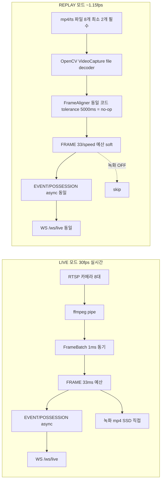

# COURTVIEW REPLAY 모드 파이프라인 Latency 예산 & 속도 예측

> LIVE 모드 문서([PIPELINE_LATENCY_BUDGET.md](PIPELINE_LATENCY_BUDGET.md)) 의 REPLAY 모드 짝꿍 문서.
> 녹화된 영상 파일을 재분석하는 경로의 timing 을 추적한다.
> 작성일: 2026-05-22 (개정: 카메라 동기화 표현 보정) / 기준: `daf30d6` / 대상 하드웨어: RTX 4070 12GB

> **📝 개정 노트 (2026-05-22)**:
> 초판에서 "sync_tolerance_ms = 5000ms (느슨함)" 라고만 적었던 부분을 보정.
> 실측 코드 추적 결과 — REPLAY 도 LIVE 와 **동일한 FrameAligner 코드 경로** 를 타며, tolerance 만 풀어놓아 **사실상 no-op 에 가까운 정렬** 을 수행한다 ([game_service.py:316](../api_server/services/game_service.py#L316) 주석에 직접 명시).
> 또한 [frame_aligner.py:313](../engine/io/frame_aligner.py#L313) 의 `min_cameras_required=2` 제약 때문에 **단일 카메라 REPLAY 는 분석 불가**. 이 두 사실을 새 챕터 (§3.5) 에 추가하고, 비교표/관련 표현을 수정.

---

## 0. 핵심 결론 먼저

```mermaid
flowchart LR
  USER[사용자] -->|replay.py 선택| HELPER[replay.py CLI 헬퍼]
  HELPER -->|"POST /game/start mode=replay source_urls"| API[api_server]
  API --> ORCH[GameOrchestrator REPLAY 모드]
  ORCH -->|"파일 디코더 8개"| FFMPEG[ffmpeg 카메라당 1개]
  FFMPEG -->|FrameBatch| SAME["동일한 5단계 cadence pipeline"]
  SAME -->|WS frame/event/status| UI[UI replay_view.html]
  UI -.5초 polling.-> PROG["GET /api/v1/tasks/progress"]
  PROG -->|ETA, fps, progress_pct| UI
```



**가장 중요한 사실 한 줄**:
> REPLAY 는 **LIVE 와 완전히 동일한 파이프라인 코드**를 사용한다. 차이는 (1) 입력이 RTSP 대신 파일, (2) `frame_budget_ms = 33 / playback_speed`, (3) `recording_enabled=False`, (4) `sync_tolerance_ms` 가 5000ms 로 풀려 **사실상 no-op 정렬**, (5) 최소 2 카메라 필수.

| 항목 | LIVE | REPLAY |
|---|---|---|
| 입력 소스 | RTSP 실시간 | 파일 (mp4 우선, ts fallback) |
| frame_budget_ms | 33.0 | 33.0 / playback_speed (0.25~4.0) |
| recording_enabled | True | **False** (이미 녹화된 영상) |
| FrameAligner 실행 | ✅ 매 프레임 | **✅ 매 프레임 (동일 코드)** |
| sync_tolerance_ms | ~33 ms (1프레임) | **5000 ms** → fps drift 흡수용, 사실상 no-op |
| min_cameras_required | 2 | **2** (단일 카메라 불가) |
| Cadence 단계 | 5단계 모두 | **5단계 모두 동일** |
| 결과 WS 디스패치 | 매 프레임 실시간 | **매 프레임 실시간** |
| 분석 워커 풀 | 4T + 2T + 1T | **동일** |
| 실측 처리 속도 | 30 fps (실시간 = 1.0x) | **~1.15 fps** (영상 시간의 ~25x 느림) |

→ **5초 영상이 87초 걸린다.** ([PLAN_REPLAY_ETA_UI.md:8](../PLAN_REPLAY_ETA_UI.md#L8))

---

## 1. 진입점 — replay.py + /api/v1/game/start

**진입 헬퍼**: 루트의 [replay.py](../replay.py) CLI 가 녹화 폴더를 자동 탐지 → 세션/쿼터 선택 UI → payload 조립.

**API 호출**: 기존 `POST /api/v1/game/start` 를 그대로 재사용. **별도 라우트 없음**.

```python
# replay.py:255-264
payload = {
    "mode": "replay",                            # ← LIVE 와 구분
    "rule_set": "fiba",
    "source_urls": {                             # ← 카메라별 파일 경로
        "cam_0": "D:/.../cam_0_Q1.mp4",
        "cam_1": "D:/.../cam_1_Q1.mp4",
        ...
    },
    "recording_enabled": False,                  # ← REPLAY 는 녹화 안 함
    "home_team_name": "HOME", "away_team_name": "AWAY",
    "home_team_color": "#FF5A1F", "away_team_color": "#4DA3FF",
}
```

**녹화 폴더 탐지 우선순위** ([replay.py:42-49](../replay.py#L42)):
1. `--recordings` CLI 인자
2. `./recordings/` (프로젝트 루트)
3. `%APPDATA%\COURTVIEW\recordings\`

**파일명 규칙**: `cam_<n>_<quarter>.(mp4|ts)` — mp4 (머지본) 우선, 없으면 ts (원본 세그먼트).

---

## 2. 데이터 소스 — 녹화 세션 구조

```
D:\COURTVIEW_Recordings\
└── 2026-05-09_143810\           ← session_id (timestamp)
    ├── cam_0_Q1.mp4             ← Quarter 1, Camera 0 머지본
    ├── cam_1_Q1.mp4
    ├── ...
    ├── cam_7_Q1.mp4
    ├── cam_0_Q2.mp4
    ├── manifest.json            ← (선택) 외부 영상 등록 메타
    └── finalize/                ← finalize 호출 시 생성
        └── events.json          ← 분석 결과
```

**중요 구분**:
- **LIVE 세션** (`<timestamp>/`): 70+ 개, **전부 `finalize/manifest.json` 존재** ✅
- **REPLAY 세션** (`import_*/`): 5개, **finalize/ 폴더 없음** ← STOP 버그 ([PLAN_REPLAY_STOP_FIX.md:60-72](../PLAN_REPLAY_STOP_FIX.md#L60))

**source_kind 분기** ([recording_routes.py:201-257](../api_server/routes/v1/recording_routes.py)):
- `local`: 세션 폴더 안에 영상 파일 (mp4/ts) 직접 존재
- `manifest`: `manifest.json` 이 외부 경로 등록 (영상 복사 없음 — 디스크 절약용 REPLAY 전용)

---

## 3. REPLAY vs LIVE 모드 설정 차이

**모드별 preset** ([mode_controller.py:90-99](../engine/orchestrator/mode_controller.py#L90)):

```python
_LIVE_PARAMS    = ModeParams(fps_limited=True,  frame_budget_ms=33.0, enable_recording=True,  ...)
_REPLAY_PARAMS  = ModeParams(fps_limited=True,  frame_budget_ms=33.0, enable_recording=False, ...)
_BATCH_PARAMS   = ModeParams(fps_limited=False, frame_budget_ms=0.0,  enable_recording=False, ...)
```

| Param | LIVE | **REPLAY** | BATCH |
|---|---|---|---|
| `fps_limited` | True | True | False |
| `frame_budget_ms` | 33.0 | **33.0 (조정 가능)** | 0.0 (무제한) |
| `enable_recording` | True | **False** | False |
| `enable_stage2` | True | **True** | True |
| `enable_referee` | True | **True** | True |
| `max_batch_size` | 8 | **8** | 8 |
| `sync_tolerance_ms` | ~33 (1프레임) | **5000** ([game_service.py:316](../api_server/services/game_service.py#L316)) | 5000 |

> **포인트**: REPLAY 는 LIVE 와 거의 동일하지만 **녹화만 끄고, 카메라 동기화는 사실상 no-op 으로 풀어둠**. 자세한 내용은 §3.5.

---

## 3.5 ⚠️ "REPLAY 는 카메라를 안 쓰는데 동기화를 왜 돌리나?" — 정밀 검증

### 3.5.1 결론 먼저

| 질문 | 답 |
|---|---|
| REPLAY 에서 카메라 동기화 코드가 실행되는가? | **✅ 예. LIVE 와 동일한 FrameAligner 코드 경로를 탄다.** |
| 그렇다면 낭비인가? | **❌ 아니다.** 5000ms tolerance 로 풀려 있어 실제 정렬 비용은 무시 가능 수준이며, 녹화 파일 간 fps drift 보정에는 여전히 필요. |
| 단일 카메라 REPLAY 는 가능한가? | **❌ 불가능.** `min_cameras_required=2` 제약 ([frame_aligner.py:313](../engine/io/frame_aligner.py#L313)) 때문에 `try_align()` 이 `None` 반환 → frame_pipeline 이 프레임을 받지 못함. |

### 3.5.2 실제 실행되는 동기화 코드 (경로 추적)

REPLAY 도 LIVE 와 **완전히 동일한 코드 경로**를 탑니다. 단 하나의 우회나 분기 없음:

```
POST /game/start (mode="replay")
  ↓
game_service.py:316  ← if mode in (REPLAY, BATCH): sync_tolerance_ms = 5000.0
  ↓
FrameIngestion.initialize()
  ↓
frame_ingestion.py:264-267  ← AlignmentConfig(tolerance_ms=5000) → FrameAligner 생성
  ↓
decode_all()  (BATCH/REPLAY 경로)
  ↓
frame_ingestion.py:539  ← self._aligner.add_frame(cam_id, normalized)
frame_ingestion.py:543  ← aligned = self._aligner.try_align()
  ↓
frame_aligner.py:301-383  ← 5000ms 허용 오차로 timestamp 매칭
```

### 3.5.3 game_service.py 가 자기 자신을 설명하는 주석

[game_service.py:316](../api_server/services/game_service.py#L316) 에 본인이 직접 적어둔 주석:

```python
if mode in (EngineMode.REPLAY, EngineMode.BATCH):
    config.camera.sync_tolerance_ms = 5000.0
    # 파일 재생: FPS 차이로 drift 누적 → 사실상 비활성
```

→ **"사실상 비활성"** 이 핵심. 코드는 실행되지만, 5초 tolerance 면 거의 모든 프레임이 매칭되므로 정렬 결정 로직이 거의 안 일어남.

### 3.5.4 그래도 동기화가 필요한 이유

**fps drift**: 녹화된 8개 mp4 파일은 ffmpeg 머지 과정에서 1~2 프레임씩 어긋날 수 있음.
- 카메라 A: 29.97fps 인코딩
- 카메라 B: 30.00fps 인코딩
- 1분 영상이면 누적 drift ≈ **1.8 프레임 ≈ 60ms**

**이벤트 정합성**: 슈팅 릴리스 순간 8 카메라의 동일 시점 프레임으로 삼각측량해야 함. 1 프레임이라도 어긋나면 3D 포즈 복원이 무너짐.

→ tolerance 가 작으면 매칭 실패가 늘고, 크면 (5초) 사실상 가장 가까운 frame_index 끼리 정렬됨.

### 3.5.5 단일 카메라 REPLAY 가 막혀 있는 코드 위치

[frame_aligner.py:313](../engine/io/frame_aligner.py#L313):
```python
def try_align(self) -> AlignedFrameSet | None:
    non_empty = sum(1 for buf in self._buffers.values() if buf)
    if non_empty < self._config.min_cameras_required:  # 기본값 2
        return None
```

→ `source_urls = {"cam_0": "video.mp4"}` 처럼 1대만 넣으면 영원히 `None` 만 반환. 분석 자체가 시작 안 됨.

**해결책**: `min_cameras_required` 를 1로 설정하는 옵션이 있으면 단일 카메라 REPLAY 가능. 현재 코드에는 설정 노출 안 됨 — 개선 여지.

### 3.5.6 속도 최적화 관점에서의 영향

| 관점 | 결론 |
|---|---|
| 동기화 코드가 1.15 fps 의 병목인가? | **❌ 아니다.** timestamp 비교 + dict 조회는 < 1ms |
| 5000ms tolerance 를 더 줄여서 빨라지는가? | **❌ 아니다.** tolerance 는 정확도용, 속도와 무관 |
| 동기화를 끄면 빨라지는가? | **❌ 거의 무의미.** 측정도 의미 없을 정도로 작은 비용 |
| 단일 카메라 모드를 풀면? | **속도엔 무영향**, 다만 단일 카메라 영상 분석 기능이 새로 열림 |

→ §6 의 fps 병목 분석에서 동기화는 **고려 대상이 아님**. detection/pose fusion 이 진짜 병목.

---

## 4. 재생 속도 (playback_speed) 의 의미

**범위**: 0.25x ~ 4.0x ([mode_controller.py:171-180](../engine/orchestrator/mode_controller.py#L171))

```python
def set_playback_speed(self, speed: float) -> None:
    self._current.playback_speed = max(0.25, min(4.0, speed))
    self._current.frame_budget_ms = base_budget / playback_speed
```

| playback_speed | frame_budget_ms | 의미 |
|---|---|---|
| 0.25x | 132.0 | 느린 분석 (정밀, 여유 시간 4배) |
| 0.5x | 66.0 | |
| **1.0x (기본)** | **33.0** | LIVE 와 동일 예산 |
| 2.0x | 16.5 | 빠른 분석 (위험 — 예산 빠듯) |
| 4.0x | 8.25 | 거의 불가능 (4070 기준) |

⚠️ **중요한 함정**: `playback_speed` 가 빠를수록 **GPU 부담은 그대로**인데 **예산만 줄어든다**. 즉 2x 재생은 GPU 가 두 배 빨라지는 게 아니라, 같은 GPU 작업을 절반 시간에 끝내야 한다는 뜻 — 실제로는 `budget_exceeded_count` 가 폭증한다.

**실측 사실**: 1.0x 에서도 **실제 처리율은 ~1.15 fps** ([PLAN_REPLAY_ETA_UI.md:8](../PLAN_REPLAY_ETA_UI.md#L8)).
즉 영상 1초 = 분석 26초. 영상 1시간 = 분석 17시간.

→ playback_speed 는 **이론값**이고, 실제 처리 속도는 GPU bound.

---

## 5. REPLAY 사이클 타이밍 모델

```mermaid
gantt
  title REPLAY 1 frame 처리 (실측 ~870ms vs 예산 33ms)
  dateFormat X
  axisFormat %s ms

  section 예산 (이상)
  FRAME budget       :done, b1, 0, 33

  section 실측 (1.15 fps)
  파일 디코딩 (8 cam)  :a1, 0, 30
  Detection Fusion    :a2, 30, 200
  Pose Fusion         :a3, 200, 500
  Tracking Fusion     :a4, 500, 540
  Biomech CPU         :a5, 540, 600
  Event/Possession async :a6, 600, 870
```



> 위 gantt 는 **실측 ~870 ms** 를 LIVE 예산(33 ms)과 대비시킨 추정. 실제로는 동기 stage 안에 GPU 추론들이 직렬화되어 거의 모든 시간을 점유.

### 5.1 ETA 계산식
[task_service.py:53](../api_server/services/task_service.py#L53) 의 `ProgressReporter.snapshot()`:

```
eta_sec = (frame_total - frame_current) / current_fps
progress_pct = frame_current / frame_total * 100
```

**현재 fps 계산**: 최근 100 frame 의 처리 시간 이동평균 ([frame_pipeline.py:836](../engine/pipeline/frame_pipeline.py#L836) `get_avg_processing_time()`).

### 5.2 ETA 정확도 단계

| 분석 진행 | ETA 신뢰도 | 비고 |
|---|---|---|
| 0~1분 | 낮음 | warm-up frame (TRT engine first-call, GPU clock ramp) |
| 1~5분 | 중간 | 이동평균 안정화 |
| 5분~ | 높음 | 일정 부하 |

### 5.3 영상 길이별 예상 분석 시간 (1.15 fps 기준, 8 카메라)

| 영상 길이 | 영상 frame 수 (30fps) | 예상 분석 시간 |
|---|---|---|
| 10초 | 300 | **4분 20초** |
| 1분 | 1,800 | **26분** |
| **1쿼터 (12분)** | 21,600 | **5시간 13분** |
| 한 게임 (48분) | 86,400 | **20시간 52분** |

> 출처: PLAN_REPLAY_ETA_UI.md 의 "5초 → 87초" 비율을 선형 외삽. 실제로는 부하 변동에 따라 ±30% 변동 가능.

---

## 6. 단계별 예산 — LIVE 와 동일

[engine/config.py:223-229](../engine/config.py#L223) `CadenceConfig` 는 LIVE/REPLAY 공용 — REPLAY 라고 별도 예산 없음.

| 단계 | 예산 | REPLAY 시 실제 |
|---|---|---|
| FRAME | 33 ms | **870 ms (실측)** ← 26x 초과 |
| EVENT | 10 ms | 비동기 (메인 루프 영향 X) |
| POSSESSION | 100 ms | 비동기 (4T 풀) |
| PERIOD | 1000 ms | 비동기 (2T 풀) |
| POSTGAME | 무제한 | finalize 호출 시 export_worker |

**왜 FRAME 이 26x 초과하는데도 동작하는가?**

→ `fps_limited=True` 지만 `frame_budget_ms` 가 **soft limit** 이라서. 예산을 초과해도 다음 프레임으로 진행. `budget_exceeded_count` 만 누적된다 ([frame_pipeline.py:259, 821-830](../engine/pipeline/frame_pipeline.py#L259)).

REPLAY 는 **실시간성이 무의미하므로** (이미 녹화된 영상), 예산 초과는 fps 하락으로만 나타남.

---

## 7. UI ↔ 백엔드 통신

```mermaid
flowchart TB
  subgraph UI[replay_view.html]
    BTN[REPLAY 시작 버튼]
    WS_CLIENT[WS client /ws/live]
    POLL[5초 polling]
    STOP[STOP 버튼]
  end

  BTN -->|"POST /api/v1/game/start mode=replay"| START_API
  POLL -->|"GET /api/v1/tasks/progress"| PROG_API
  STOP -->|순차 호출| STOP_FLOW

  subgraph STOP_FLOW[STOP 정식 흐름 4단계]
    S1[POST /api/v1/recording/stop 404=OK]
    S2[POST /api/v1/game/stop 60s]
    S3[POST /api/v1/finalize/game 120s ★]
    S4[/game/result?session_id=X 이동]
    S1 --> S2 --> S3 --> S4
  end

  WS_CLIENT -.실시간 이벤트.- BACKEND[api_server]
  PROG_API --> BACKEND
  START_API --> BACKEND
  STOP_FLOW --> BACKEND
```

### 7.1 진행률 polling
- **간격**: 5초 ([PLAN_REPLAY_ETA_UI.md:29](../PLAN_REPLAY_ETA_UI.md#L29))
- **응답**: `ProgressResponse` ([response_schemas.py:72](../api_server/schemas/response_schemas.py#L72))
  ```
  frame_current: int
  frame_total: int            ← progress_reporter.start(total) 호출돼야 채워짐
  progress_pct: float
  fps: float                  ← 최근 100 frame 평균
  eta_sec: float
  phase: str
  ```
- **분석 완료 시**: `onAnalysisDone()` 가 polling 자동 중단

### 7.2 STOP 흐름의 위험 (이미 수정됨)
[PLAN_REPLAY_STOP_FIX.md](../PLAN_REPLAY_STOP_FIX.md) 가 해결한 버그:
- 구 핸들러는 `/api/v1/game/stop` 만 호출 → finalize 미실행
- **REPLAY 5개 세션의 분석 결과가 영구 손실**
- 수정 후 4단계 순차 호출 + 진행 텍스트 갱신 + AbortController timeout

---

## 8. REPLAY 출력 산출물

| 위치 | 내용 | 생성 시점 |
|---|---|---|
| WS `/ws/live` | 실시간 frame/event/status 메시지 | 분석 중 매 프레임 |
| `<session>/finalize/events.json` | engine_events 전체 | finalize 호출 시 |
| `<session>/finalize/manifest.json` | 분석 메타 | finalize 호출 시 |
| `/game/result?session_id=X` | UI 결과 페이지 | 분석 종료 후 이동 |
| `box_score`, `report`, `feedback` 등 | postgame_pipeline 산출물 | finalize 시 |

⚠️ finalize 미호출 시 — WS 로 본 이벤트는 메모리에 있었지만 **디스크에 저장되지 않음**.

---

## 9. LIVE vs REPLAY 한 화면 비교



| 비교 축 | LIVE | REPLAY |
|---|---|---|
| 실시간성 | **필수** (실시간 코트에서 사용) | 무관 (이미 녹화됨) |
| FrameAligner 실행 | ✅ 매 프레임 | **✅ 매 프레임 (동일 코드)** |
| 동기화 허용오차 | ~33 ms (1프레임) | **5000 ms (사실상 no-op)** |
| min_cameras_required | 2 | **2 (단일 카메라 불가)** |
| 동기화의 목적 | 실시간 wall-clock sync | fps drift 흡수 (29.97 vs 30.00) |
| GPU 부하 | 30 fps 유지가 목표 | 100% 활용 (느려도 OK) |
| 사용자 경험 | 즉각 피드백 | ETA 와 진행률 |
| 산출물 위치 | `<session>/finalize/` (자동) | `<session>/finalize/` (STOP 시 명시 호출) |

---

## 10. 알려진 한계 / 개선 여지

### 10.1 코드/문서에 명시된 제약

| 항목 | 위치 | 비고 |
|---|---|---|
| 시킹(seek) 미지원 | [_session_changes_2026-05-13.md:402](../_session_changes_2026-05-13.md) | 파일 처음부터만 가능 |
| playback_speed UI 미지원 | replay.py 헬퍼만 | UI 위젯 없음 |
| ETA warm-up 1분 부정확 | [PLAN_REPLAY_ETA_UI.md:84](../PLAN_REPLAY_ETA_UI.md#L84) | TRT 첫 호출 + GPU clock ramp |
| **단일 카메라 REPLAY 불가** | [frame_aligner.py:313](../engine/io/frame_aligner.py#L313) | `min_cameras_required=2` — 1대 영상은 분석 시작조차 안 됨 |
| 동기화 사실상 no-op | [game_service.py:316](../api_server/services/game_service.py#L316) | tolerance 5000ms → fps drift 흡수만 함. 속도 영향은 없음 (§3.5) |
| frame_total 정렬 | [PLAN_REPLAY_ETA_UI.md:49](../PLAN_REPLAY_ETA_UI.md#L49) | 디코더별 total 중 **최솟값** 사용 |

### 10.2 추정 — 성능 최적화 여지

REPLAY 1.15 fps 가 실측이라면 (1쿼터 = 5시간), GPU 활용률 한계가 추정됨. 가능한 개선:

| 개선안 | 기대 효과 | 비고 |
|---|---|---|
| Stage2 ViTPose 트리거 강화 | -20~30% 시간 | 트리거 안 되는 프레임은 Stage1 만 |
| Mixed precision FP8 (Hopper+) | -30~40% 추론 | RTX 4070 (Ada) 미지원 |
| Multi-stream CUDA | -10~20% | 8 카메라 병렬 inference |
| `playback_speed=0.25` 고정 | 안정성 ↑ | 분석 시간은 4배 |

> 코드에 REPLAY 성능 최적화 PLAN 은 명시되어 있지 않음 — Plan B/D 는 LIVE 모드의 RTSP/디코딩 최적화임.

---

## 11. 핵심 ms 수치 요약 표

| 수치 | 값 | 출처 |
|---|---|---|
| FRAME 예산 (1.0x) | 33.0 ms | config.py:223 |
| FRAME 예산 (2.0x) | 16.5 ms | mode_controller.py:178 |
| 실측 1 frame 처리 | **~870 ms** | PLAN_REPLAY_ETA_UI.md (5s → 87s 외삽) |
| 실측 처리율 | **~1.15 fps** | 동상 |
| polling 간격 | 5 sec | replay_view.html |
| sync tolerance (REPLAY) | 5000 ms (사실상 no-op) | game_service.py:316 |
| sync tolerance (LIVE) | ~33 ms (1프레임) | engine/config.py 기본값 |
| min_cameras_required | 2 (단일 카메라 불가) | frame_aligner.py:313 |
| 동기화 자체 비용 | <1 ms (병목 아님) | timestamp 비교 + dict 조회 |
| ETA warm-up | ~1 min | PLAN_REPLAY_ETA_UI.md:84 |
| game/stop timeout | 60 sec | game_analysis.html:1614 |
| finalize timeout | 120 sec | game_analysis.html:1614 |

---

## 12. 다음 단계 추천

**실측 보강**:
1. `tools/bench_pipeline_realistic.py` 를 REPLAY 모드로 실행 → stage_times_ms 의 단계별 실측
2. `GET /api/v1/metrics/system` 으로 GPU 부하 모니터링 (REPLAY 중 GPU util %)
3. `progress_reporter.snapshot()` 값을 콘솔에 stream — fps 변동 그래프

**버그/한계 해결**:
- 시킹(seek) 기능 추가 → 1쿼터 전체 5시간 기다리지 않고 특정 구간만 재분석
- playback_speed UI 위젯 → 사용자가 정밀도 vs 속도 trade-off 조정
- Stage1-only 모드 → 정밀 ViTPose 없이 빠른 1차 분석

**문서 참조**:
- LIVE 모드: [PIPELINE_LATENCY_BUDGET.md](PIPELINE_LATENCY_BUDGET.md)
- 데이터 타입 전체: [DATA_FLOW_CONTRACT.md](DATA_FLOW_CONTRACT.md)
- ETA 구현 상세: [../PLAN_REPLAY_ETA_UI.md](../PLAN_REPLAY_ETA_UI.md)
- STOP 흐름 버그: [../PLAN_REPLAY_STOP_FIX.md](../PLAN_REPLAY_STOP_FIX.md)
