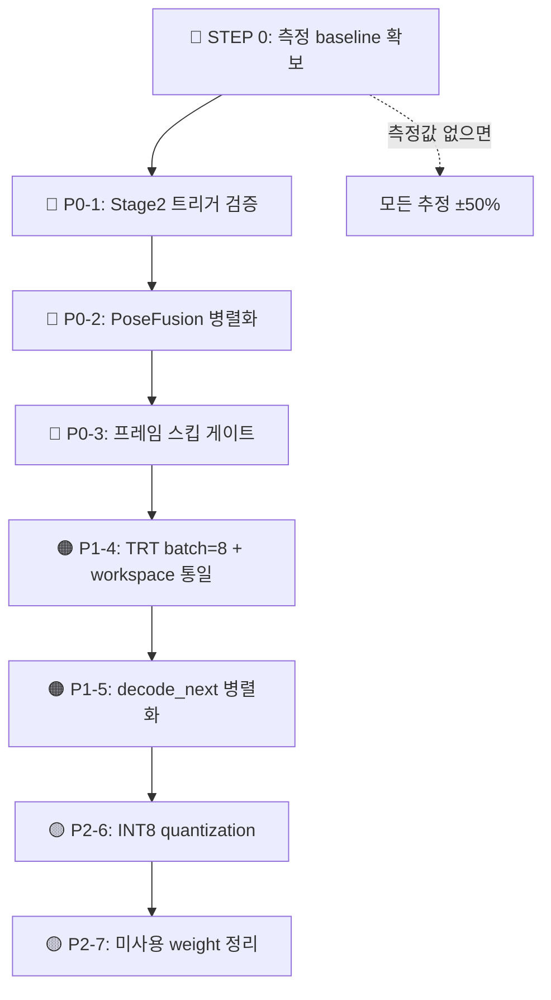

# COURTVIEW 파이프라인 속도 최적화 실행 가이드

> REPLAY 모드 **1.15 fps → 목표 30+ fps** 까지의 단계별 실행 가이드.
> 각 항목은 **(1) 진단 → (2) 정확한 코드 위치 → (3) 수정 방안 → (4) 검증 방법** 의 4부 구조.
> 작성일: 2026-05-22 / 기준 커밋: `daf30d6`

---

## 0. 전체 로드맵



| 단계 | 누적 fps (목표) | 1쿼터 12분 분석 | 난이도 | 위험도 |
|---|---|---|---|---|
| **현재 baseline** | **1.15** | **5시간 13분** | — | — |
| STEP 0: 측정 | (변경 없음) | — | ⭐ | 없음 |
| P0-1: Stage2 검증 | 5 | 1시간 12분 | ⭐⭐ | 낮음 |
| P0-2: Pose 병렬화 | 10 | 36분 | ⭐⭐⭐ | 중간 |
| P0-3: 프레임 스킵 | 20 | 18분 | ⭐⭐⭐ | 중간 |
| P1-4: TRT batch | 30 | **12분** | ⭐⭐⭐⭐ | 중간 |
| P1-5: decode 병렬 | 35 | 10분 | ⭐⭐⭐ | 낮음 |
| P2-6: INT8 | 50 | 7분 | ⭐⭐⭐⭐⭐ | **높음** |
| P2-7: weight 정리 | 50 | 7분 | ⭐ | 없음 |

---

## STEP 0 — 측정 baseline 확보 (필수 선결조건)

수정 전에 **반드시** 실측치를 잡아야 합니다. 그렇지 않으면 잘못된 곳을 고치게 됩니다.

### 0.1 stage_times_ms 분포 측정

**도구**: [tools/bench_pipeline_realistic.py](../tools/bench_pipeline_realistic.py)

```bash
.\venv\Scripts\python.exe tools\bench_pipeline_realistic.py `
  --session "D:\COURTVIEW_Recordings\<session_id>" `
  --warmup 10 `
  --frames 100 `
  --start-frame 300
```

**출력 예시 (가상)**:
```
평균: 870ms (p50=820, p95=1340, max=1680) → 1.15 fps

stage_times_ms 평균:
  detection_fusion       : 180ms   (21%)
  pose_fusion            : 520ms   (60%) ← 의심
  tracking_fusion        : 12ms    (1%)
  biomechanics_kinematics: 45ms    (5%)
  biomechanics_dynamics  : 28ms    (3%)
  기타/오버헤드           : 85ms    (10%)
```

**측정 출처** (필드명 정확):
- 측정 위치: [engine/pipeline/frame_pipeline.py:314, 353, 396, 415, 479, 537](../engine/pipeline/frame_pipeline.py#L314)
- 필드 키: `detection_fusion`, `pose_fusion`, `tracking_fusion`, `multiview_tracker`, `biomechanics_kinematics`, `biomechanics_dynamics`
- 접근: `FramePipelineResult.stage_times_ms` ([:149-188](../engine/pipeline/frame_pipeline.py#L149))

### 0.2 GPU 사용률 측정

```powershell
nvidia-smi dmon -s u -c 60
# u = util %, c 60 = 60초간 1초마다
```

**판정 기준**:
- GPU util **<30%** → CPU bound (P0-2, P1-5 가 우선)
- GPU util **>70%** → GPU bound (P1-4 INT8 / batch 가 우선)
- GPU util **30~70%** → 혼합 (P0 모두 시도)

### 0.3 ViTPose 호출 빈도 측정

⚠️ **stage_times_ms 에 `vitpose_stage2` 키는 없음** ([최종 보고: Stage2는 EVENT 콜백에서 실행되어 FRAME stage_times 에 미포함](#p0-1)).

→ 별도 카운터 필요. 임시로 [game_orchestrator.py:2366 `_try_stage2_vitpose`](../engine/orchestrator/game_orchestrator.py#L2366) 에 print 또는 logger.info 한 줄 삽입:

```python
def _try_stage2_vitpose(self, events: list) -> None:
    stage2 = self._pose_backend_stage2
    if stage2 is None or not stage2.is_loaded:
        return
    # ↓ 임시 측정 (한 줄 추가, 100 frame 후 제거)
    self._stage2_call_count = getattr(self, '_stage2_call_count', 0) + 1
    if self._stage2_call_count % 10 == 0:
        logger.info(f"[STAGE2] called {self._stage2_call_count} times")
```

### 0.4 실시간 모니터링 (분석 중)

```bash
curl http://localhost:8000/api/v1/metrics/system     # fps, engine_state
curl http://localhost:8000/api/v1/tasks/progress     # fps, eta_sec, progress_pct
curl http://localhost:8000/api/v1/metrics/gpu        # vram, temperature
```

---

## 🔴 P0-1 — Stage2 (ViTPose) 트리거 작동 검증 {#p0-1}

### 진단: 부분 작동 (코드는 정상, 실행 빈도 불명)

**확인된 사실**:

1. ✅ **트리거 정의는 정확** ([engine/config.py:254-259](../engine/config.py#L254)):
   ```python
   stage2_triggers: tuple[str, ...] = (
       "shooting_detected",
       "foul_contact",
       "violation_suspected",
       "close_play",
   )
   ```

2. ✅ **트리거 평가 코드도 존재** ([game_orchestrator.py:2366-2432](../engine/orchestrator/game_orchestrator.py#L2366)):
   ```python
   def _try_stage2_vitpose(self, events: list) -> None:
       stage2 = self._pose_backend_stage2
       if stage2 is None or not stage2.is_loaded:
           return

       triggers = self._config.pipeline.stage2_triggers
       should_run = False
       for evt in events:
           evt_type = getattr(evt, "event_type", "")
           for trigger_keyword in triggers:
               if trigger_keyword in evt_type:  # ← 문자열 부분 매칭
                   should_run = True
                   break

       if not should_run:
           return

       keypoints_133 = stage2.infer(frame, person_boxes or None)
   ```

3. ⚠️ **하지만 측정 인프라에 안 들어감**:
   - Stage2 는 EVENT 콜백 스레드(별도 풀)에서 실행되므로
   - FRAME 의 `stage_times_ms` 에 **기록되지 않음**
   - "ViTPose 가 매 프레임 도는지 / 거의 안 도는지" 측정 못 함

4. ⚠️ **EVENT cadence 자체가 2 프레임마다만 평가** ([cadence_scheduler.py:222](../engine/orchestrator/cadence_scheduler.py#L222)):
   ```python
   if frame_index % 2 == 0:
       # EVENT 평가
   ```

### 결론: "트리거가 안 돈다"는 가설은 **부분 참**

코드 로직은 정상. 하지만:
- **이벤트 감지기 16종의 신뢰도가 낮으면** → Stage2 거의 안 돔 (의도된 동작)
- **이벤트 감지가 과민하면** → 거의 매번 트리거 (의도와 반대)

→ **STEP 0.3 의 카운터를 보고 결정**.

### 수정 방안

**Case A**: 호출 빈도가 0~5% (정상)
- 이미 Stage2 가 효율적으로 절약 중. 다음 항목 (P0-2) 으로.

**Case B**: 호출 빈도가 30%+ (트리거 과민)
- [game_orchestrator.py:2378](../engine/orchestrator/game_orchestrator.py#L2378) 의 `if trigger_keyword in evt_type:` 부분 매칭을 정확 매칭으로 변경
- 또는 이벤트 감지기의 confidence threshold 상향 ([engine/pipeline/event_pipeline.py](../engine/pipeline/event_pipeline.py))

**Case C**: stage2 모델이 로드 실패해서 조용히 return (의심)
- [game_orchestrator.py:2374-2375](../engine/orchestrator/game_orchestrator.py#L2374) 의 fallback 로직 점검
- `is_loaded` 가 False 이면 logger.warning 한 번 출력하도록 추가 (현재는 silent)

### 검증

수정 후 다시 STEP 0.1 + 0.3 측정. 기대 효과:
- Case B 수정 시: pose_fusion 시간 -30~50%
- Case C 수정 시: 사실 ViTPose 가 안 돌고 있었던 거라 속도 변화 없음 (정확도만 향상)

---

## 🔴 P0-2 — PoseFusion 키포인트 삼각측량 병렬화

### 진단: 100% 직렬, 3중 중첩 루프

**검증된 코드** ([engine/pipeline/fusion/pose_fusion.py:219-313](../engine/pipeline/fusion/pose_fusion.py#L219)):

```python
# 외부 루프: 선수 N명 (보통 4~10명)
for person_id, group in person_groups.items():        # line 219
    fused = self._fuse_person(person_id, group)

    # 내부 루프 1: 키포인트 17개
    for kp_idx in range(num_kp):                       # line 259
        valid_observations = []

        # 내부 루프 2: 카메라 (보통 4~8대)
        for pose in group:                             # line 262
            score = float(pose.keypoint_scores[kp_idx])
            if score >= self._min_confidence:
                valid_observations.append((pose.camera_id, pose.keypoints_2d[kp_idx]))

        # 삼각측량 호출 (line 290)
        point_3d = self._triangulator.triangulate(
            camera_ids=camera_ids,
            points_2d=points_2d,
        )
```

**연산량 추정**: 선수 5명 × 17 키포인트 × 4 카메라 = **340회 직렬 호출**.

내부 `triangulate()` 함수 ([coordinate_transformer.py:406-481](../infrastructure/multi_camera/coordinate_transformer.py#L406)):
- `cv2.undistortPoints()` — n번 반복 (OpenCV C++ 호출)
- 에피폴라 필터링 — 카메라 쌍별 비교
- `_dlt_triangulate()` ([:506-535](../infrastructure/multi_camera/coordinate_transformer.py#L506)) — `np.linalg.svd(A)` (4×n 행렬)

### 병렬화 전략 — **선수 단위 ThreadPoolExecutor**

**왜 선수 단위**:
- 선수 간 완전 독립 (공유 상태 없음)
- 각 선수는 17 × 4 = 68회 호출 → 충분한 작업 단위 (스레드 오버헤드 < 작업 비용)
- `triangulate()` 내부의 cv2/numpy 호출은 GIL 해제됨 → Python ThreadPool 효과적

**수정안** (의사코드, PR 작성 시 참조):

```python
# pose_fusion.py:219 부근 수정
from concurrent.futures import ThreadPoolExecutor

class PoseFusion:
    def __init__(self, ...):
        ...
        self._pose_pool = ThreadPoolExecutor(
            max_workers=4,
            thread_name_prefix="pose-fuse"
        )

    def fuse(self, person_groups):
        # 기존: 직렬
        # for person_id, group in person_groups.items():
        #     fused = self._fuse_person(person_id, group)

        # 신규: 병렬
        futures = {
            person_id: self._pose_pool.submit(self._fuse_person, person_id, group)
            for person_id, group in person_groups.items()
        }
        poses_3d = []
        for person_id, future in futures.items():
            fused = future.result()
            if fused is not None:
                poses_3d.append(fused)
        return poses_3d
```

### ⚠️ 주의사항

- **`_triangulator` 의 thread safety 확인 필수** ([coordinate_transformer.py](../infrastructure/multi_camera/coordinate_transformer.py)). 내부 캐시나 변경되는 상태가 있으면 lock 추가
- **워커 수 = 4** 가 안전한 기본값. 선수 < 4 일 땐 ThreadPool 오버헤드만 발생 → `if len(person_groups) > 2: 병렬` 분기 권장
- **테스트 보강**: 기존 직렬 결과와 병렬 결과가 동일해야 함 (numpy `allclose`)

### 검증

```bash
.\venv\Scripts\python.exe tools\bench_pipeline_realistic.py --frames 100
# pose_fusion: 520ms → 130~170ms 기대 (선수 4~5명 가정)
```

---

## 🔴 P0-3 — 프레임 스킵 / Adaptive Sampling

### 진단: 매 프레임 풀 파이프라인 (스킵 로직 없음)

[frame_pipeline.py:298](../engine/pipeline/frame_pipeline.py#L298) 의 `verbose_pipe = (frame_index % 50 == 0)` 는 **로그만** 스킵. 실제 추론은 매번 실행.

### 수정 방안

#### 방안 A: Motion Gate (배경 차분 기반)

```python
# frame_pipeline.py process_frame() 초입
class FramePipeline:
    def __init__(self, ...):
        self._prev_gray = None
        self._motion_threshold = 0.02  # 픽셀의 2% 이상 변화 시 처리

    def process_frame(self, frame_batch):
        # Motion gate (대표 카메라 1대만)
        rep_frame = frame_batch.frames[0]
        gray = cv2.cvtColor(rep_frame, cv2.COLOR_BGR2GRAY)
        gray_small = cv2.resize(gray, (320, 180))  # 다운샘플로 빠르게

        if self._prev_gray is not None:
            diff = cv2.absdiff(gray_small, self._prev_gray)
            motion_ratio = (diff > 30).mean()
            if motion_ratio < self._motion_threshold:
                # 정적 프레임 → 트래킹 보간만
                self._prev_gray = gray_small
                return self._interpolate_from_last_result(frame_batch.frame_index)

        self._prev_gray = gray_small
        # 정상 처리
        ...
```

#### 방안 B: 고정 비율 스킵 (단순)

```python
# 더 단순: N프레임마다 1회만 detection, 나머지는 ByteTrack 가 보간
if frame_index % 3 != 0:  # 30fps → 10fps detection
    return self._track_only_path(frame_batch)
```

### ⚠️ 주의사항

- **빠른 이벤트(슈팅 릴리스, 파울 접촉) 누락 위험**. 슈팅 릴리스는 50ms 안에 끝나는데 3프레임 스킵 = 100ms.
- **방안 A 권장** (정적 시 스킵, 동적 시 풀 처리)
- **트래킹 보간은 ByteTrack 가 잘 함** — 단, 보간 모드일 때 `confidence` 를 0.5x 로 감쇠시켜 downstream 이 알 수 있게

### 검증

- 단순 fps 측정 외에 **이벤트 감지 누락률** 확인
- 같은 영상을 (1) 스킵 OFF (2) 스킵 ON 으로 돌려서 `events.json` 비교
- 슈팅/파울 이벤트가 동일하게 잡히는지

---

## 🟠 P1-4 — TensorRT Dynamic Batch + Workspace 통일

### 진단: 검증된 사실

1. **batch=1 로 고정** ([tensorrt_engine.py:162-164](../pose_estimation/backends/tensorrt_engine.py#L162)):
   ```python
   min_batch_size: int = 1
   optimal_batch_size: int = 1  # ← 여기
   max_batch_size: int = 8       # ← 빌드는 8까지 지원
   ```

2. **8 카메라가 있어도 batch=1 로 8회 추론** → GPU 60~70% 유휴

3. **Workspace 설정 충돌**:
   - [configs/pose/tensorrt.yaml:18](../configs/pose/tensorrt.yaml#L18) — `workspace_size_mb: 2048` (구식 스키마)
   - [configs/base/gpu_config.yaml:51](../configs/base/gpu_config.yaml#L51) — `workspace_size_mb: 1024` (신규 스키마)
   - 실제 적용은 loader 우선순위에 따라 결정 — **명확하지 않음**

4. **TensorRT engine 재빌드 필요**:
   - [tensorrt_engine.py:783-792](../pose_estimation/backends/tensorrt_engine.py#L783) 의 `_create_optimization_profile()` 가 빌드 시 호출
   - `optimal_batch_size` 가 바뀌면 cache 무효화 → 첫 실행 시 ~수 분 빌드

### 수정 방안

#### 4-1: optimal_batch_size 변경

```python
# pose_estimation/backends/tensorrt_engine.py:162-164
min_batch_size: int = 1
optimal_batch_size: int = 8   # ← 1에서 8로 (8 카메라 동시)
max_batch_size: int = 8
```

**중요**: 변경 후 `%APPDATA%\COURTVIEW\tensorrt_cache\` 폴더의 `.engine` 파일들을 삭제해야 재빌드됨.

#### 4-2: Workspace 단일 출처

**옵션 (a) — `tensorrt.yaml` 폐기**:
```bash
# 구식 yaml 삭제 + gpu_config.yaml 에만 통일
del configs\pose\tensorrt.yaml
```

**옵션 (b) — `tensorrt.yaml` 을 정식 출처로** (현재 사용된다면):
```yaml
# configs/pose/tensorrt.yaml
workspace_size_mb: 1024  # 2048 → 1024 로 통일 (RTX 4070 12GB 기준 보수적)
```

→ 어느 쪽이 실제로 적용되는지는 **로더 우선순위**를 확인해야 함. [yolov8_backend.py:516](../pose_estimation/backends/yolov8_backend.py#L516) 는 model.yaml 의 `optimization.tensorrt.workspace_mb` 를 직접 읽음 → 모델 설정이 최종 출처일 가능성.

### ⚠️ 주의사항

- **VRAM 한계 확인**: batch=8 로 빌드 시 VRAM 2배 사용. RTX 4070 12GB 에서 다른 모델과 합쳐 OOM 위험
- **첫 실행 빌드 시간**: ViTPose batch=8 빌드는 수 분 소요 — 사용자에게 warmup 진행률 표시 필요 (이미 [launcher_warmup.py](../launcher_warmup.py) 가 처리 중)
- **fallback 메커니즘**: 빌드 실패 시 batch=1 로 자동 폴백 ([launcher_warmup.py](../launcher_warmup.py) 의 `tensorrt_failed.json`)

### 검증

```bash
nvidia-smi dmon -s u -c 60     # GPU 사용률 80%+ 기대
.\venv\Scripts\python.exe tools\bench_pipeline_realistic.py --frames 100
# detection_fusion + pose_fusion 합계가 절반 이하 기대
```

---

## 🟠 P1-5 — decode_next() 순차 → 병렬

### 진단: 검증된 사실

**[engine/io/frame_ingestion.py:315-420 (capture_and_align)](../engine/io/frame_ingestion.py#L315)**:
```python
with self._lock:
    for cam_id, decoder in self._decoders.items():
        try:
            frame_data = decoder.decode_next()  # ← 8 카메라 순차
        except Exception:
            continue
```

**[같은 파일 :504-539 (decode_all, BATCH 모드)](../engine/io/frame_ingestion.py#L504)** — 동일 패턴.

**개선 참조**: [같은 파일 :231-235](../engine/io/frame_ingestion.py#L231) 의 카메라 열기는 이미 ThreadPoolExecutor 적용:
```python
with ThreadPoolExecutor(max_workers=workers, thread_name_prefix="fi-init") as pool:
    results = list(pool.map(_open_analysis, cam_ids_list))
```

### 수정 방안

```python
# frame_ingestion.py:303-420 capture_and_align() 안에서
# 기존 for 루프를 다음으로 교체

with self._lock:
    cam_ids_list = list(self._decoders.keys())

    def _decode_one(cam_id):
        decoder = self._decoders[cam_id]
        try:
            return cam_id, decoder.decode_next()
        except Exception as e:
            return cam_id, None

    with ThreadPoolExecutor(max_workers=8, thread_name_prefix="fi-decode") as pool:
        results = list(pool.map(_decode_one, cam_ids_list))

    for cam_id, frame_data in results:
        if frame_data is None:
            continue
        # ... 기존 정규화/정렬기 투입 로직
```

### ⚠️ 주의사항

- **`self._lock` 안에서 ThreadPool 사용 시 데드락 가능성** — lock 을 더 좁은 범위로 옮기거나 lock-free 큐로
- **ffmpeg pipe 의 thread safety**: 각 decoder 가 별도 ffmpeg 프로세스라면 안전, 같은 프로세스 공유면 위험
- **CPU 코어 활용**: 8코어 미만 머신에서는 효과 미미 (RTX 4070 시스템은 보통 8코어+)

### 검증

```bash
# 디코딩만 측정
.\venv\Scripts\python.exe -c "
from engine.io.frame_ingestion import FrameIngestion
import time
fi = FrameIngestion(...)
t0 = time.perf_counter()
for _ in range(100):
    fi.capture_and_align()
print(f'100 frames in {time.perf_counter()-t0:.2f}s')
"
```

---

## 🟡 P2-6 — INT8 Quantization

### 진단

현재 모든 TensorRT engine 이 **FP16** (`config.py:155` 추정). INT8 로 전환 시 약 2~3배 가속, 30% VRAM 절감.

### ⚠️ **위험**: 정확도 손실

농구 분석은 **빠른 손목 움직임의 5cm 차이로 슈팅 폼 평가** — 이 정밀도가 INT8 quantization 으로 영향받을 수 있음.

### 수정 방안 (조심스럽게)

1. **캘리브레이션 데이터셋 준비**: 다양한 게임 상황 100~500 프레임
2. **TRT 빌드 시 INT8 옵션 추가**:
   ```python
   # tensorrt_engine.py _configure_builder() 안
   if self._config.precision == "int8":
       config.set_flag(trt.BuilderFlag.INT8)
       config.int8_calibrator = MyCalibrator(calibration_data)
   ```
3. **단계별 적용**:
   - 1단계: YOLO 감지만 INT8 (정확도 영향 작음)
   - 2단계: YOLOv8-Pose Stage1 INT8 (중간 위험)
   - 3단계: ViTPose Stage2 는 **FP16 유지** (정밀 분석용)

### 검증

- 같은 영상으로 FP16 vs INT8 비교
- **이벤트 정확도** (슈팅/파울 감지 일치율) 가 95%+ 인지 확인
- 일치율 <95% 면 해당 모델은 FP16 유지

---

## 🟡 P2-7 — 미사용 weight 정리

### 진단

[PLAN_MEMORY_USAGE_AUDIT.md](../PLAN_MEMORY_USAGE_AUDIT.md) 에 따르면 `vitpose-l-wholebody.onnx` (1.18 GB) 가 로드만 되고 미사용 가능성.

### 수정 방안

```bash
# 1. 실제 사용 여부 확인
grep -rn "vitpose-l-wholebody" --include="*.py"
grep -rn "vitpose_l" --include="*.py"

# 2. 미사용이면 weights/ 폴더에서 제거
# 또는 configs/ 에서 참조 제거
```

[engine/config.py:253](../engine/config.py#L253) 의 `model_vitpose: str = "weights/vitpose-b-wholebody.onnx"` 가 **b 모델만** 사용 중. `vitpose-l` 은 더 큰 모델로, 로드만 되고 안 쓸 가능성 높음.

### 효과

- **VRAM 1.18 GB 회수** → batch=8 (P1-4) 가 안전하게 들어갈 자리 확보
- **startup 시간 단축** (TRT 빌드 + 로드 시간)

---

## 🎯 누적 효과 예측 (실측 시 보정 필요)

| 단계 | 예상 fps | 1쿼터 소요 | 검증 명령 |
|---|---|---|---|
| 현재 | 1.15 | 5시간 13분 | `bench_pipeline_realistic.py` |
| + P0-1 (Stage2 검증·수정) | 5 | 1시간 12분 | stage2 호출 카운터 |
| + P0-2 (Pose 병렬화) | 10 | 36분 | `pose_fusion` ms 측정 |
| + P0-3 (프레임 스킵) | 20 | **18분** | 이벤트 감지 누락률 |
| + P1-4 (TRT batch=8) | 30 | **12분** | `nvidia-smi dmon` GPU util |
| + P1-5 (decode 병렬) | 35 | 10분 | decode 단계 ms |
| + P2-6 (INT8) | 50 | 7분 | 이벤트 정확도 일치율 |

> ⚠️ **이 예측치는 ±50% 변동 가능**. STEP 0 측정 결과에 따라 우선순위 재조정 필요.

---

## 작업 순서 권장

### Day 1 (측정 + 검증)
- STEP 0.1~0.4 모두 실행
- ViTPose 호출 빈도 카운터 삽입 후 1쿼터 분석
- baseline 수치 확정 (각 stage 의 평균 ms, GPU util)

### Day 2~3 (안전한 변경)
- P0-1: Stage2 트리거 검증 결과에 따라 분기
- P2-7: 미사용 weight 정리 (위험 없음)
- P1-5: decode 병렬화 (격리된 변경)

### Day 4~5 (위험 있는 변경 — 테스트 동반)
- P0-2: PoseFusion 병렬화 (단위 테스트 보강 필수)
- P0-3: 프레임 스킵 (이벤트 누락률 검증)

### Day 6~7 (큰 변경 — 빌드 시간 동반)
- P1-4: TRT batch=8 재빌드 (캐시 무효화 + 첫 실행 수 분 빌드)

### 별도 검증 단계 (선택)
- P2-6: INT8 quantization (캘리브레이션 + 정확도 비교 필요)

---

## 측정 인프라 요약

| 도구 | 명령 | 출력 |
|---|---|---|
| Bench 스크립트 | `python tools/bench_pipeline_realistic.py --frames 100` | stage_times_ms 통계 |
| GPU 모니터 | `nvidia-smi dmon -s u -c 60` | GPU util %, mem |
| FPS API | `curl /api/v1/metrics/system` | 실시간 fps |
| ETA API | `curl /api/v1/tasks/progress` | progress_pct, eta_sec |
| Profiler | `Profiler.get_instance().get_summary("name")` | mean/p95/max ms |

---

## 관련 문서

- [DATA_FLOW_CONTRACT.md](DATA_FLOW_CONTRACT.md) — 각 단계 데이터 타입
- [PIPELINE_LATENCY_BUDGET.md](PIPELINE_LATENCY_BUDGET.md) — LIVE 모드 예산
- [PIPELINE_LATENCY_BUDGET_REPLAY.md](PIPELINE_LATENCY_BUDGET_REPLAY.md) — REPLAY 모드 분석
- [../PLAN_MEMORY_USAGE_AUDIT.md](../PLAN_MEMORY_USAGE_AUDIT.md) — VRAM/RAM 감사 결과
- [../_plan_B_hwaccel_2026-05-13.md](../_plan_B_hwaccel_2026-05-13.md) — HW 디코딩 계획
- [../_plan_D_ffmpeg_prescale_2026-05-13.md](../_plan_D_ffmpeg_prescale_2026-05-13.md) — ffmpeg 사전 리사이즈

---

## 부록 — 정확한 코드 위치 인덱스

| 항목 | 파일:라인 |
|---|---|
| `stage2_triggers` 정의 | [engine/config.py:254-259](../engine/config.py#L254) |
| `_try_stage2_vitpose` | [engine/orchestrator/game_orchestrator.py:2366](../engine/orchestrator/game_orchestrator.py#L2366) |
| Stage2 트리거 평가 | [game_orchestrator.py:2378](../engine/orchestrator/game_orchestrator.py#L2378) |
| Pose 외부 루프 (선수) | [engine/pipeline/fusion/pose_fusion.py:219](../engine/pipeline/fusion/pose_fusion.py#L219) |
| Pose 내부 루프 (키포인트) | [pose_fusion.py:259](../engine/pipeline/fusion/pose_fusion.py#L259) |
| Pose 카메라 루프 | [pose_fusion.py:262](../engine/pipeline/fusion/pose_fusion.py#L262) |
| Triangulator | [infrastructure/multi_camera/coordinate_transformer.py:406](../infrastructure/multi_camera/coordinate_transformer.py#L406) |
| DLT | [coordinate_transformer.py:506](../infrastructure/multi_camera/coordinate_transformer.py#L506) |
| decode_next 순차 (LIVE) | [engine/io/frame_ingestion.py:315](../engine/io/frame_ingestion.py#L315) |
| decode_next 순차 (BATCH) | [frame_ingestion.py:504](../engine/io/frame_ingestion.py#L504) |
| ThreadPool 적용 예 (열기) | [frame_ingestion.py:231](../engine/io/frame_ingestion.py#L231) |
| TRT batch size | [pose_estimation/backends/tensorrt_engine.py:162](../pose_estimation/backends/tensorrt_engine.py#L162) |
| TRT workspace | [tensorrt_engine.py:720](../pose_estimation/backends/tensorrt_engine.py#L720) |
| TRT profile build | [tensorrt_engine.py:783](../pose_estimation/backends/tensorrt_engine.py#L783) |
| Workspace yaml 충돌 a | [configs/pose/tensorrt.yaml:18](../configs/pose/tensorrt.yaml#L18) |
| Workspace yaml 충돌 b | [configs/base/gpu_config.yaml:51](../configs/base/gpu_config.yaml#L51) |
| stage_times 기록 | [engine/pipeline/frame_pipeline.py:314,353,396,479,537](../engine/pipeline/frame_pipeline.py#L314) |
| Bench 도구 | [tools/bench_pipeline_realistic.py](../tools/bench_pipeline_realistic.py) |
