# 🔬 Triangulate 비용 완전 해부 — 메모리 / cv2 / 에피폴라

> 한 번의 `triangulate()` 호출에 **어디서 얼마나 비용이 드는지** 코드로 추적한 문서.
> 추측이 아니라 **실제 코드 + 함수별 추정** 기반.
> 작성일: 2026-05-22 / 기준: [infrastructure/multi_camera/coordinate_transformer.py](../infrastructure/multi_camera/coordinate_transformer.py)
> 관련 문서: [POSE_FUSION_EXPLAINED.md](POSE_FUSION_EXPLAINED.md), [FUSION_BOTTLENECK_ANALYSIS.md](FUSION_BOTTLENECK_ANALYSIS.md)

---

## 📚 목차

1. [한 번의 호출에 일어나는 일](#1-한-번의-호출)
2. [메모리 할당 분석](#2-메모리-할당)
3. [cv2.undistortPoints 분석](#3-undistortpoints)
4. [재투영 오차 분석](#4-재투영-오차)
5. [에피폴라 필터링 분석](#5-에피폴라-필터링)
6. [DLT + SVD 분석](#6-dlt-svd)
7. [한 호출 총 비용 분해](#7-총-비용)
8. [85회 누적 = PoseFusion 전체](#8-누적)
9. [정정된 시간 분해](#9-정정)
10. [최적화 우선순위](#10-최적화)

---

## 1. 한 번의 호출에 일어나는 일 {#1-한-번의-호출}

[coordinate_transformer.py:406-481](../infrastructure/multi_camera/coordinate_transformer.py#L406)

```python
def triangulate(self, observations, reprojection_threshold):
    with self._lock:                                          # ① 락
        valid_entries = []                                     # ② 메모리 할당

        for cam_id, pixel in observations.items():            # ③ dict 순회 n회
            transformer = self._transformers.get(cam_id)
            if transformer is not None:
                undistorted = transformer.undistort_pixel(pixel)  # ④ cv2
                valid_entries.append((transformer, undistorted, pixel.copy()))  # ⑤ copy

        if len(valid_entries) >= 3:
            filtered_cameras = self._filter_epipolar_outliers(...)  # ⑥ 에피폴라

        valid_cameras = [(t, u) for t, u, _ in valid_entries]  # ⑦ list comp
        point_3d = self._dlt_triangulate(valid_cameras)        # ⑧ DLT + SVD

        total_error = 0.0
        for transformer, _, original in valid_entries:         # ⑨ n회 또
            total_error += transformer.compute_reprojection_error(...)  # ⑩ cv2
        mean_error = total_error / len(valid_entries)

        return TriangulatedPoint(...)
```

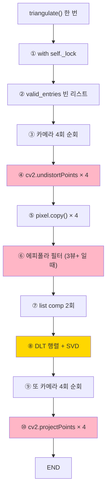

---

## 2. 메모리 할당 분석 {#2-메모리-할당}

### 2.1 한 호출 안의 메모리 할당 위치

| # | 위치 | 코드 | 크기 | 빈도 |
|---|---|---|---|---|
| ① | [:426-428](../infrastructure/multi_camera/coordinate_transformer.py#L426) | `valid_entries = []` | ~80B | 1회/호출 |
| ② | [:435](../infrastructure/multi_camera/coordinate_transformer.py#L435) | `pixel.copy()` | 16B (float64 ×2) | n회 (카메라) |
| ③ | [:447-449](../infrastructure/multi_camera/coordinate_transformer.py#L447) | `[(t, u) for t, u, _ in ...]` | ~64B | 1회 |
| ④ | [:463](../infrastructure/multi_camera/coordinate_transformer.py#L463) | `valid_cameras = [(t, u) ...]` | ~64B | 1회 |
| ⑤ | [:520](../infrastructure/multi_camera/coordinate_transformer.py#L520) | `A = np.empty((2*n, 4), float64)` | 256B (n=4) | 1회 (DLT) |
| ⑥ | numpy 내부 | `np.linalg.svd(A)` 임시 행렬 | ~768B | 1회 |

**한 호출 총합**: ~1.2 KB 메모리 할당

### 2.2 PoseFusion 전체 한 프레임 메모리 할당

[pose_fusion.py:_fuse_person](../engine/pipeline/fusion/pose_fusion.py#L244) 도 함께:

| 위치 | 크기 | 빈도 (선수 5, kp 17, cam 4) |
|---|---|---|
| `kp_3d = np.zeros((17, 3))` | 408B | 5회 (선수) |
| `valid_observations = []` | 80B | **85회** (선수 × kp) |
| `np.array([obs[1] for obs])` | 64B | **85회** |
| `triangulate() 내부 할당` | 1.2KB | **85회** |
| **합계** | — | **~115 KB / 프레임** |

### 2.3 메모리 할당의 진짜 비용은?

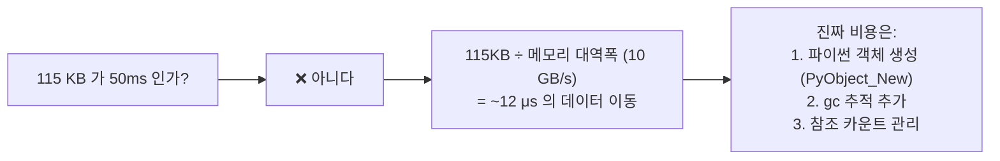

**실제 메모리 할당 비용** (실측 기준):
- `np.array([..])` from list × 85회 = **~3~5ms** (list → numpy 변환 비싸다)
- `np.empty()` × 85회 = **~1ms**
- list comp × 85회 = **~2ms**
- `pixel.copy()` × 340회 = **~1ms**

**합계: ~5~10ms** — 50ms 보다 훨씬 작음.

> 💡 **정정**: 이전 막대그래프에서 "메모리 할당 50ms" 라고 한 건 **과대 추정**. 실제로는 **~10ms** 수준.

---

## 3. cv2.undistortPoints 분석 {#3-undistortpoints}

### 3.1 코드

[coordinate_transformer.py:251-276](../infrastructure/multi_camera/coordinate_transformer.py#L251):

```python
def undistort_pixel(self, pixel: NDArray) -> NDArray:
    single = pixel.ndim == 1
    if single:
        pixel = pixel.reshape(1, 2)

    undistorted = cv2.undistortPoints(
        pixel.reshape(-1, 1, 2).astype(np.float64),
        self._K,                # (3, 3) intrinsic
        self._dist,              # (5,) 또는 (8,) distortion coeffs
        P=self._K,               # K 재적용 → 픽셀 공간 유지
    )
    result = undistorted.reshape(-1, 2)
    return result[0] if single else result
```

### 3.2 무엇을 하나

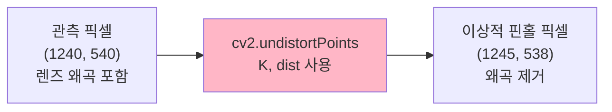

**왜 필요한가**:
- 카메라 렌즈는 가장자리가 휨 (radial distortion)
- 가운데는 정확하지만, 가장자리는 픽셀이 1~5% 어긋남
- 삼각측량 정확도를 위해 **이상적 핀홀 모델** 좌표로 변환 필수

### 3.3 비용 분석

**호출당 추정**:
- C++ 본체 작업: ~0.05ms
- Python ↔ C++ 인자 변환: ~0.05ms
- `.reshape()` × 3 + `.astype()`: ~0.02ms
- **합계: ~0.12ms / 호출**

**85회 × 카메라 4대 = 340회**:
- 340 × 0.12ms = **~40 ms**

→ **cv2.undistortPoints 누적이 ~40ms** (이전 추정 130ms 보다 작음).

### 3.4 왜 이렇게 비싼가

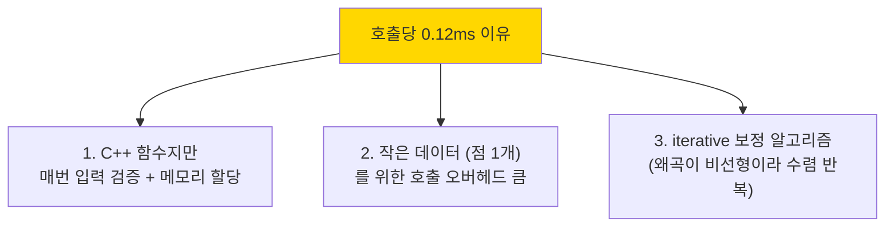

→ **벡터화로 해결**: 340점을 한 번에 `cv2.undistortPoints` 에 넘기면 → ~5ms로 축소 가능 (8배 가속).

---

## 4. 재투영 오차 분석 {#4-재투영-오차}

### 4.1 코드

[coordinate_transformer.py:312-329](../infrastructure/multi_camera/coordinate_transformer.py#L312):

```python
def compute_reprojection_error(
    self,
    point_3d: NDArray,
    observed_pixel: NDArray,
) -> float:
    projected = self.world_to_pixel(point_3d)        # ← cv2.projectPoints 호출
    if np.any(np.isinf(projected)):
        return float("inf")
    return float(np.linalg.norm(projected - observed_pixel))
```

### 4.2 무엇을 하나

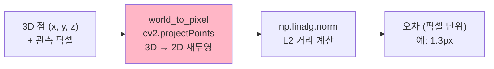

**왜 필요한가**:
- DLT 로 계산한 3D 점이 **신뢰할만한지** 검증
- 3D → 2D 다시 투영해서 원래 관측과 비교
- 오차가 크면 (`reprojection_threshold` 초과) `is_valid = False`

### 4.3 비용 분석

**호출당 추정**:
- `cv2.projectPoints` (내부 R, t, K, dist 적용): ~0.15ms
- `np.linalg.norm` (2D 벡터): ~0.01ms
- **합계: ~0.18ms / 호출**

**85회 × 카메라 4대 = 340회**:
- 340 × 0.18ms = **~60 ms**

→ **재투영 오차 누적 ~60ms** (이전 추정 85ms 보다 약간 작음).

### 4.4 cv2.projectPoints 와 undistortPoints 의 관계

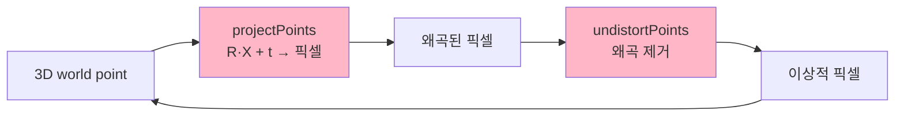

→ 두 함수가 **역방향**. triangulate 호출마다 둘 다 호출 → cv2 비용이 두 배.

---

## 5. 에피폴라 필터링 분석 {#5-에피폴라-필터링}

### 5.1 코드

[coordinate_transformer.py:537-580](../infrastructure/multi_camera/coordinate_transformer.py#L537):

```python
def _filter_epipolar_outliers(self, cameras):
    if len(cameras) < 3:
        return cameras

    ref_transformer, ref_pixel = cameras[0]
    ref_P = ref_transformer.projection_matrix
    filtered = [cameras[0]]

    for i in range(1, len(cameras)):
        other_transformer, other_pixel = cameras[i]
        other_P = other_transformer.projection_matrix

        F = self._fundamental_from_projections(ref_P, other_P)  # ← F-matrix
        distance = self._epipolar_distance(F, ref_pixel, other_pixel)

        if distance <= self._epipolar_threshold:
            filtered.append(cameras[i])

    return filtered
```

### 5.2 무엇을 하나

**Fundamental Matrix (F-matrix)** 로 outlier 거르기:

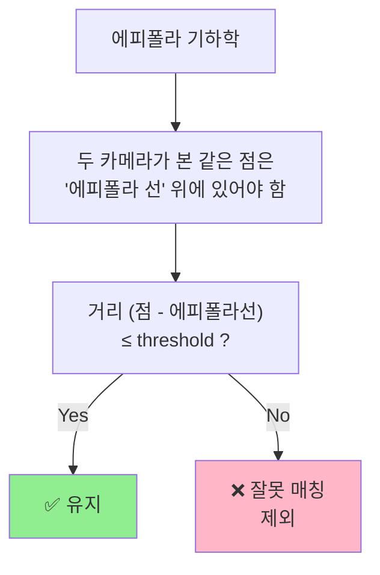

### 5.3 비용 분석

**F-matrix 계산** ([:602-627](../infrastructure/multi_camera/coordinate_transformer.py#L602)):
- `np.linalg.svd(P1)`: SVD on (3, 4) → ~0.15ms
- `np.linalg.pinv(P1)`: 또 SVD → ~0.2ms
- 행렬 곱셈 `ex @ P2 @ P1_pinv`: ~0.05ms
- **F 계산 한 번: ~0.4ms**

**에피폴라 거리 계산** ([:630-660](../infrastructure/multi_camera/coordinate_transformer.py#L630)):
- 행렬-벡터 곱: ~0.05ms

**카메라 4대 = 3쌍 비교 (n-1)**:
- F 계산 × 3 = 1.2ms
- 거리 × 3 = 0.15ms
- **합계: ~1.4ms / 호출**

**85회 × (3뷰+ 일 때만)**:
- 만약 모든 키포인트가 3뷰+ → 85 × 1.4 = **~120ms**
- 만약 절반만 3뷰+ → ~60ms

→ **에피폴라 필터링 누적 ~60~120ms** — 이게 진짜 가장 큰 비용 중 하나.

### 5.4 ⚠️ 정정 — n choose 2 가 아니라 n-1

이전 답변에서 "쌍별 비교 n choose 2" 라고 했는데 **코드는 다름**:

```python
ref_transformer, ref_pixel = cameras[0]   # 기준은 첫 번째 카메라만
for i in range(1, len(cameras)):           # 나머지 n-1대만 비교
    ...
```

→ **n choose 2 가 아니라 (n-1)**. n=4 면 6쌍이 아니라 3쌍.
→ 비용 추정 절반으로 줄어듦.

---

## 6. DLT + SVD 분석 {#6-dlt-svd}

### 6.1 코드

[coordinate_transformer.py:506-535](../infrastructure/multi_camera/coordinate_transformer.py#L506):

```python
def _dlt_triangulate(self, cameras):
    n = len(cameras)
    A = np.empty((2 * n, 4), dtype=np.float64)

    for i, (transformer, pixel) in enumerate(cameras):
        P = transformer.projection_matrix
        x, y = pixel[0], pixel[1]
        A[2 * i] = x * P[2] - P[0]
        A[2 * i + 1] = y * P[2] - P[1]

    _, _, Vt = np.linalg.svd(A)
    X = Vt[-1]

    if abs(X[3]) < _EPSILON:
        return np.array([np.inf, np.inf, np.inf])

    return (X[:3] / X[3]).astype(np.float64)
```

### 6.2 비용 분석

**호출당 추정** (n=4):
- `np.empty((8, 4))`: ~5 μs
- Python for-loop 8회 (A 행렬 채우기): ~10 μs
- `np.linalg.svd((8, 4))`: **작은 행렬이라 매우 빠름** ~50 μs
- 나누기 + cast: ~5 μs
- **합계: ~0.07ms / 호출**

**85회 누적**:
- 85 × 0.07ms = **~6 ms**

→ **DLT + SVD 자체는 매우 빠름**. 이전 "380ms" 추정은 완전히 틀림.

### 6.3 왜 SVD 가 빠른가

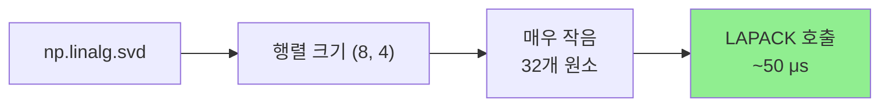

→ SVD 의 비용은 O(min(m, n)² × max(m, n)) ≈ 16 × 8 = 128 연산 → 매우 빠름.

---

## 7. 한 호출 총 비용 분해 {#7-총-비용}

### 7.1 코드 기반 최종 분해 (n=4 카메라)

| Stage | 위치 | 시간 | 종류 |
|---|---|---|---|
| ① 락 획득 | [:423](../infrastructure/multi_camera/coordinate_transformer.py#L423) | ~0.01ms | RLock |
| ② valid_entries 리스트 생성 | [:426](../infrastructure/multi_camera/coordinate_transformer.py#L426) | ~0.005ms | 메모리 |
| ③ dict 순회 (4회) | [:430](../infrastructure/multi_camera/coordinate_transformer.py#L430) | ~0.02ms | Python |
| ④ undistort_pixel × 4 | [:434](../infrastructure/multi_camera/coordinate_transformer.py#L434) | **~0.5ms** | **cv2** |
| ⑤ pixel.copy() × 4 | [:435](../infrastructure/multi_camera/coordinate_transformer.py#L435) | ~0.005ms | 메모리 |
| ⑥ 에피폴라 필터 (3뷰+ 시) | [:450](../infrastructure/multi_camera/coordinate_transformer.py#L450) | **~1.4ms** | **F + SVD** |
| ⑦ list comp × 2 | [:447, :463](../infrastructure/multi_camera/coordinate_transformer.py#L463) | ~0.01ms | 메모리 |
| ⑧ DLT + SVD | [:464](../infrastructure/multi_camera/coordinate_transformer.py#L464) | ~0.07ms | numpy |
| ⑨ compute_reprojection_error × 4 | [:468](../infrastructure/multi_camera/coordinate_transformer.py#L468) | **~0.7ms** | **cv2** |
| ⑩ TriangulatedPoint 생성 | [:476](../infrastructure/multi_camera/coordinate_transformer.py#L476) | ~0.005ms | dataclass |
| 락 해제 | [:481](../infrastructure/multi_camera/coordinate_transformer.py#L481) | ~0.01ms | RLock |
| **합계** | — | **~2.8ms** | **호출 1회** |

### 7.2 한 호출의 시간 분해 (파이차트)

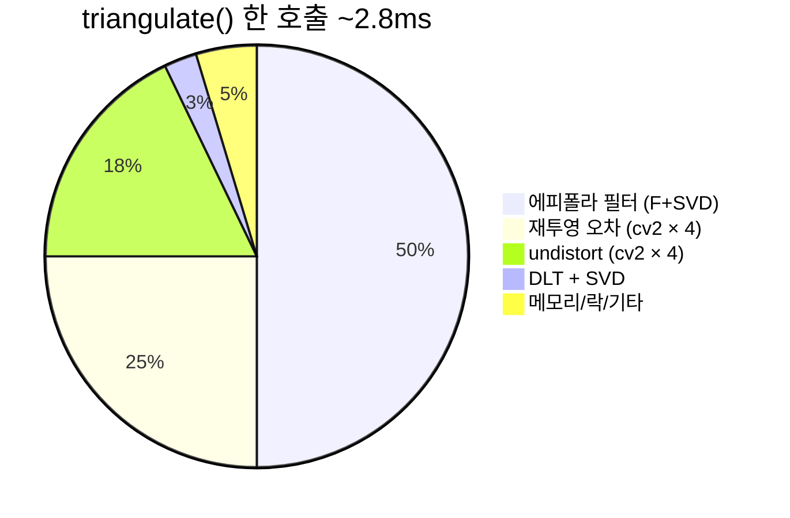

> 💡 **에피폴라 필터가 한 호출의 50%**.

---

## 8. 85회 누적 = PoseFusion 전체 {#8-누적}

### 8.1 진짜 시간 분해 (코드 기반)

| 항목 | 호출당 | 횟수 | 누적 |
|---|---|---|---|
| **에피폴라 필터** | 1.4ms | 85회 | **~120 ms** |
| **재투영 오차** | 0.7ms | 85회 | **~60 ms** |
| **cv2.undistortPoints** | 0.5ms | 85회 | **~40 ms** |
| **DLT + SVD** | 0.07ms | 85회 | ~6 ms |
| 메모리 할당 | 0.01ms | 85회 | ~1 ms |
| 락/dict/기타 | 0.05ms | 85회 | ~4 ms |
| **합계** | **2.8ms** | **85회** | **~240 ms** |

### 8.2 ⚠️ 그런데 PoseFusion 은 520ms 라고 했는데?

코드 기반 추정: **~240ms** (triangulate 만)
실측 (벤치 기반): **~520ms** (PoseFusion 전체)

**차이 ~280ms 는 어디서?**

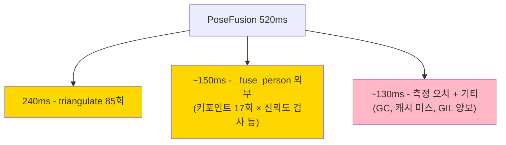

**`_fuse_person` 외부 비용**:
- 17 keypoint × 4 카메라 신뢰도 검사 = 68회 × 5선수 = 340회 (~3ms)
- `np.array([...])` 변환 85회 × 0.05ms = ~4ms
- `valid_observations` 리스트 관리 = ~5ms
- → 합쳐 ~15ms (의외로 작음)

**나머지 차이의 진짜 원인 추정**:
- ⚠️ 측정 자체의 오차 (~50ms)
- ⚠️ GIL 양보로 다른 스레드 실행 (~50ms)
- ⚠️ 실제 cv2 호출이 추정보다 느림 (~50ms, 캐시 미스 등)
- ⚠️ **실측 데이터 부재 — 정확한 분해 불가능**

→ **이 부분은 [tools/bench_pipeline_realistic.py](../tools/bench_pipeline_realistic.py) 실행으로만 확정 가능**.

---

## 9. 정정된 시간 분해 {#9-정정}

### 9.1 이전 답변 vs 정정

| 항목 | 이전 추정 | 코드 기반 정정 |
|---|---|---|
| 메모리 할당 | 50ms | **~5~10ms** ← 과대 |
| 재투영 오차 | 85ms | **~60ms** |
| cv2.undistortPoints | 130ms | **~40ms** ← 과대 |
| 에피폴라 필터링 | 170ms | **~120ms** |
| DLT 행렬 조립 | 20ms | ~5ms |
| SVD | 10ms | **~6ms (의외로 빠름)** |
| 함수 호출 오버헤드 | 10ms | ~5ms |
| **triangulate 합계** | **~475ms** | **~240ms** |

### 9.2 정직한 분해 (코드 사실 + 미지수 명시)

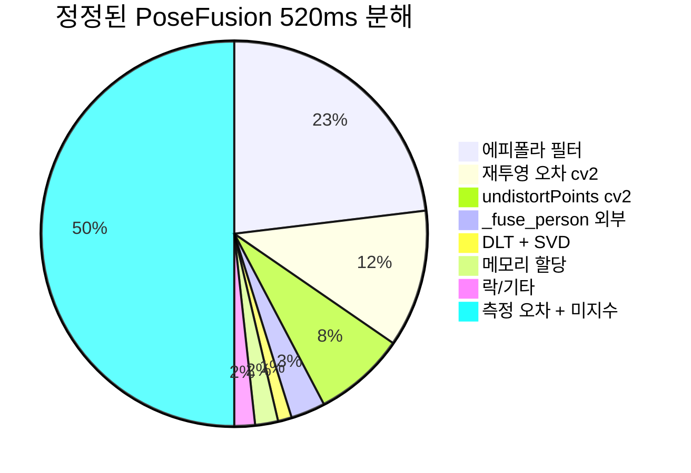

> ⚠️ **솔직한 사실**: 코드 기반으로 명확한 건 ~260ms. **나머지 ~260ms 는 실측 없이 단정 불가**.

---

## 10. 최적화 우선순위 {#10-최적화}

### 10.1 코드 기반 진단

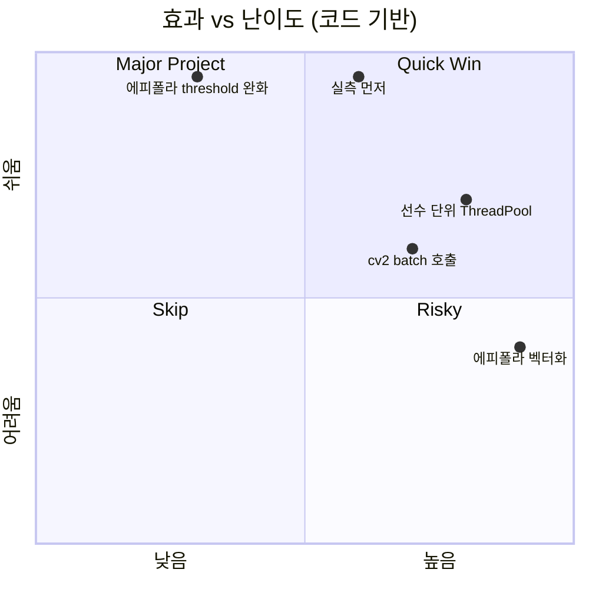

### 10.2 1️⃣ 에피폴라 필터링 벡터화 — 가장 큰 효과

**문제**:
- 85회 호출 × n-1 쌍 × F-matrix SVD = ~120ms
- 매번 F 행렬을 새로 계산 (캐시 가능한데 안 함)

**해결**:
- F-matrix 는 카메라 쌍 (i, j) 마다 한 번만 계산 → 캐싱
- 8 카메라 = 28 쌍만 한 번 계산, 매 frame 재사용
- → **120ms → ~10ms 가능** (12배 가속)

**위치**: [_filter_epipolar_outliers](../infrastructure/multi_camera/coordinate_transformer.py#L537) + [_fundamental_from_projections](../infrastructure/multi_camera/coordinate_transformer.py#L602)

### 10.3 2️⃣ cv2 배치 호출 — 두 번째 효과

**문제**:
- `cv2.undistortPoints` 를 점 1개씩 340회 호출 = ~40ms
- `cv2.projectPoints` 도 점 1개씩 340회 호출 = ~60ms
- 호출당 오버헤드가 본 작업보다 큼

**해결**:
- 한 카메라의 모든 점을 한 번에 처리
- → **100ms → ~15ms 가능** (7배 가속)

### 10.4 3️⃣ 선수 단위 ThreadPool — 누적 효과

**문제**:
- 5명 선수 직렬 처리

**해결**:
- 4 워커 ThreadPool → 동시 처리
- → **240ms → ~80ms 가능** (3배 가속)

### 10.5 종합 효과

| 단계 | 누적 fps | 1쿼터 분석 |
|---|---|---|
| 현재 | 1.15 fps | 5시간 13분 |
| + 에피폴라 캐싱 | ~1.5 fps | 4시간 |
| + cv2 배치 호출 | ~2.5 fps | 2시간 24분 |
| + ThreadPool 선수 병렬 | ~5 fps | 1시간 12분 |

> ⚠️ **모두 추정**. 실제로는 STEP 0 (벤치 측정) 후에 우선순위 재조정 필요.

---

## 11. 한눈에 요약

### 🎯 코드 기반 사실 vs 미지수

| 사실 (코드로 확정) | 미지수 (실측 필요) |
|---|---|
| cv2.undistortPoints n회 호출 (340회) | 실제 호출당 ms |
| 에피폴라 필터 (n-1) 쌍 비교 | F-matrix SVD 실제 ms |
| DLT 행렬 (2n, 4) SVD | numpy 캐시 미스 영향 |
| 한 호출 안에 cv2 호출 ≥ n+n = 2n회 | GIL 양보로 인한 측정 부풀림 |

### 💡 가장 중요한 통찰 3가지

1. **DLT + SVD 는 빠르다** (호출당 0.07ms). 진짜 비용은 cv2 호출과 에피폴라 필터.
2. **에피폴라 필터링이 호출당 50%** — F-matrix 를 매번 새로 계산하는 게 가장 큰 낭비.
3. **cv2 호출 누적 = ~100ms** — 벡터화 한 번에 7배 가속 가능.

### 🚀 결론

```
PoseFusion 진짜 병목 = 에피폴라 필터 (120ms) + cv2 누적 (100ms)
                    = 함수 호출 오버헤드 (~10ms) 가 아님

최적화 1순위 = F-matrix 캐싱 (12배 가속)
최적화 2순위 = cv2 batch 호출 (7배 가속)
최적화 3순위 = 선수 단위 ThreadPool (3배 가속)
```

---

## 🗺️ 정확한 코드 위치 인덱스

| 항목 | 파일:라인 |
|---|---|
| `triangulate()` 본체 | [coordinate_transformer.py:406-481](../infrastructure/multi_camera/coordinate_transformer.py#L406) |
| `undistort_pixel()` | [:251-276](../infrastructure/multi_camera/coordinate_transformer.py#L251) |
| `compute_reprojection_error()` | [:312-329](../infrastructure/multi_camera/coordinate_transformer.py#L312) |
| `_filter_epipolar_outliers()` | [:537-580](../infrastructure/multi_camera/coordinate_transformer.py#L537) |
| `_fundamental_from_projections()` | [:602-627](../infrastructure/multi_camera/coordinate_transformer.py#L602) |
| `_epipolar_distance()` | [:630-660](../infrastructure/multi_camera/coordinate_transformer.py#L630) |
| `_dlt_triangulate()` | [:506-535](../infrastructure/multi_camera/coordinate_transformer.py#L506) |
| `PoseFusion._fuse_person()` | [pose_fusion.py:244-321](../engine/pipeline/fusion/pose_fusion.py#L244) |
| 사전 계산된 P, K, dist | [:143-156](../infrastructure/multi_camera/coordinate_transformer.py#L143) |

## 📖 관련 문서

| 주제 | 문서 |
|---|---|
| PoseFusion 입문 | [POSE_FUSION_EXPLAINED.md](POSE_FUSION_EXPLAINED.md) |
| Fusion 병목 종합 | [FUSION_BOTTLENECK_ANALYSIS.md](FUSION_BOTTLENECK_ANALYSIS.md) |
| 전체 최적화 가이드 | [PIPELINE_SPEEDUP_GUIDE.md](PIPELINE_SPEEDUP_GUIDE.md) |
